## Linux Troubleshooting Runbook

- [Day 5 - Task ]()
  - [Target Service](#target-service)
  - [Environment Basics](#environment-basics)
  - [File System Sanity](#file-system-sanity)
  - [Snapshot CPU and Memory](#snapshot-cpu-and-memory)
  - [Snapshot Disk and IO](#snapshot-disk-and-io)
  - [Snapshot Network](#snapshot-network)
  - [Logs Reviewed](#logs-reviewed)

 Some useful shortcut for README file: 
 1. Alt + Shift + F → Format Document
 2. Ctrl + Shift + V → Preview Document

## Target Service ##

**Service Name: hello-devops.service** 
**Process Name/ PID: 111019** 
**Expected Behaviour: This service just print the logs in every 5 second** 

1. **Check Service status**
      1. It shows the status of service if running or not

            systemctl status hello-devops-service

            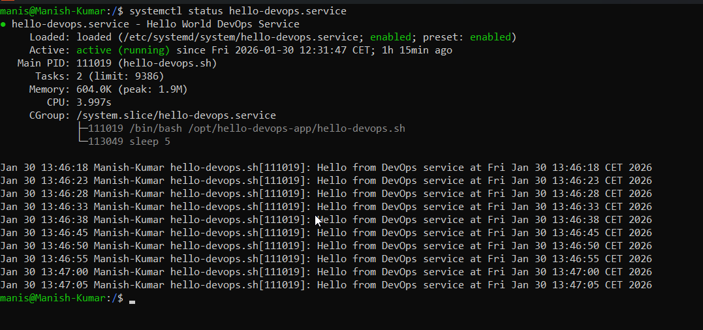

2. **Get the Process**
      1. Using given command you can get the details of specific process by using process id

            ps aux | grep <proceesId> 

            

## Environment Basics ##

1. **Get username**
      1. Using given command you can get the username

            uname -a

            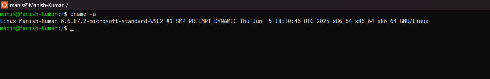

2. **Get Information of Linux distribution**
      1. It shows the information about Linux distribution (Linux Standard Base Release)

            lsb_release -a

            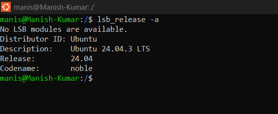

3. **Get OS Identification data**
      1. Using the given command you can get the OS identification data

            cat /etc/os-release

            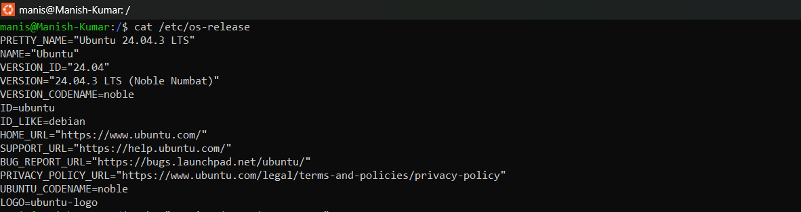

4. **Load the data into shell and then get the OS Name and Running version**
      1. Using given command you can load the the data into shell

            . /etc/os-release

            echo "Running $NAME $VERSION_ID"

            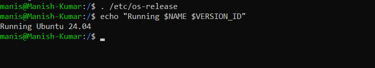

## File System Sanity ##

1. **Use of this command**
      1. App failing to start, Systemd service crashing, Container not writing logs, Disk or iNode issue.

            mkdir /tmp/runbook-demo && cp /etc/hosts /tmp/runbook-demo/hosts-copy && ls -l /tmp/runbook-demo

            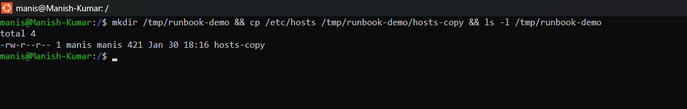

## Snapshot CPU and Memory ##

1. **Command = top**
      1. It shows the Real-time CPU usage, memory usage, load average

            top

            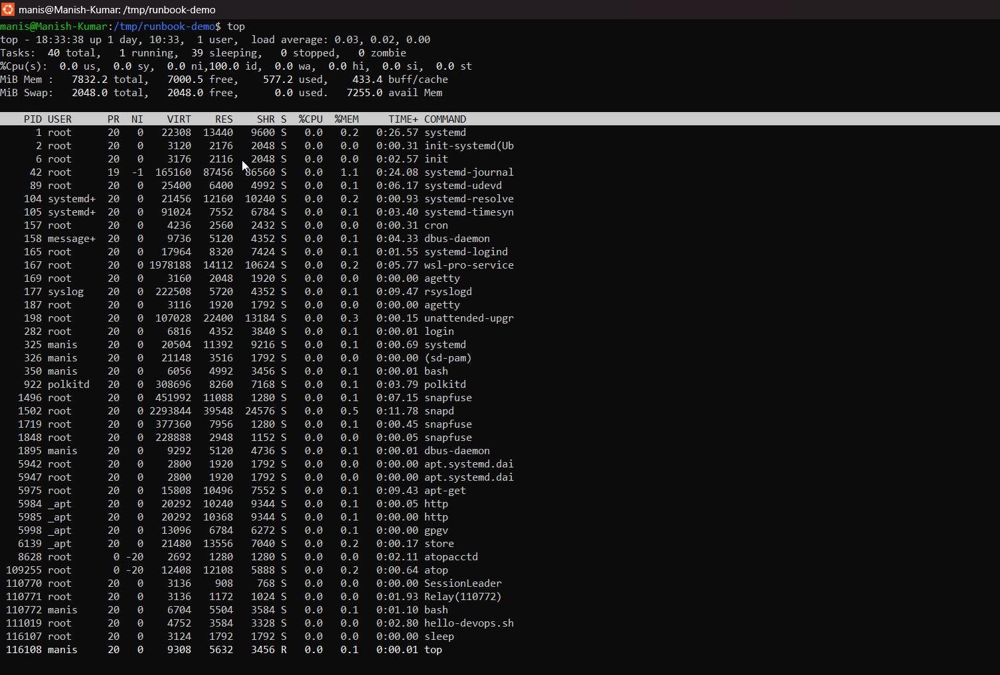

2. **Command = htop**
      1. It shows colourful readable UI, Scroll, Search, Kill Process and Pre-core CPU view

            htop

            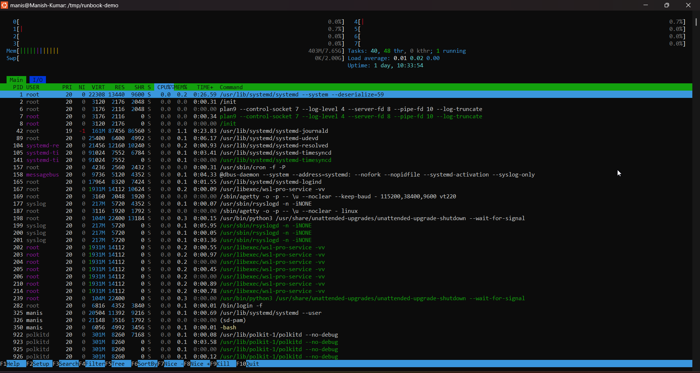

3. **Command = ps with options**
      1. using the options with ps command you get the required information of running service like PIS, Memory, CPU

            ps -o pid,pcpu,pmem,comm -p 111019

            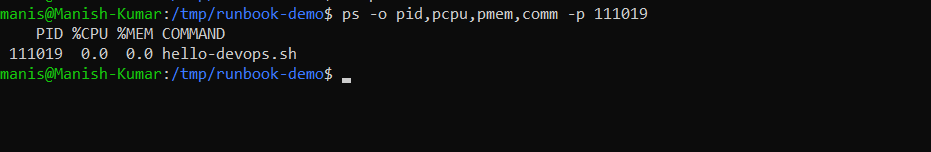

4. **Command = free -h**
      1. It shows Total Memory, Used Memory, Free Memory, Available Memory, Swap Usage

            free -h

            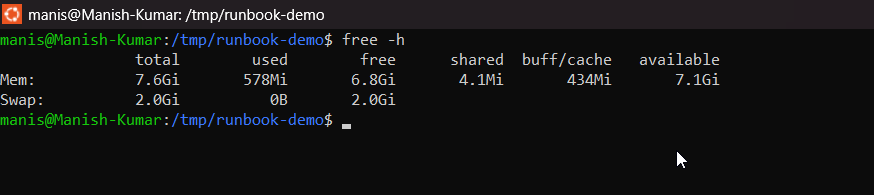

## Snapshot Disk and IO ##

1. **Command = df -h**
      1. It shows the disk usage per file system

            df -h

            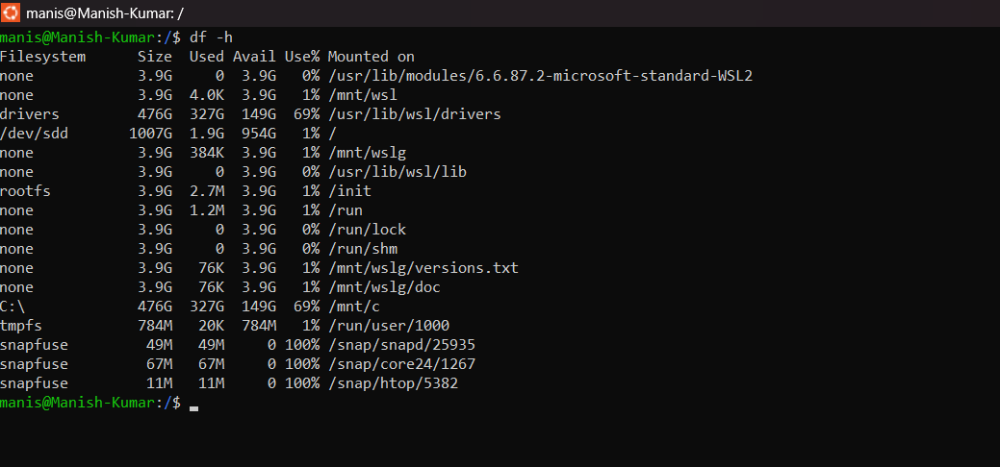

2. **Command = du -sh /var/log**
      1. It shows the disk usage and generated logs file size in humand readble 

            du -sh /var/log

            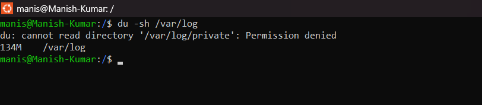

3. **Command = iostat**
      1. It shows disk read/write rates

            iostat

            

## Snapshot Network ##

1. **Command = ss -tulpn**
      1. It shows the TCP sockets, UDP sockets, Listening socket, process using socket, show numbers

            ss - tulpn

            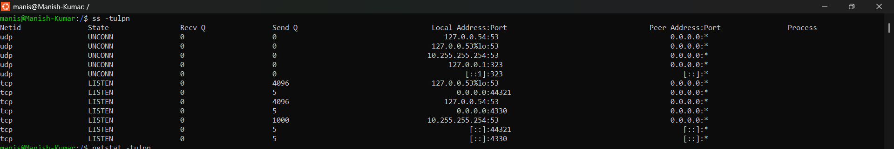

2. **Command = netstat -tupln**
      1. It shows listening port, protocols, owning process

            netstat -tulpn

            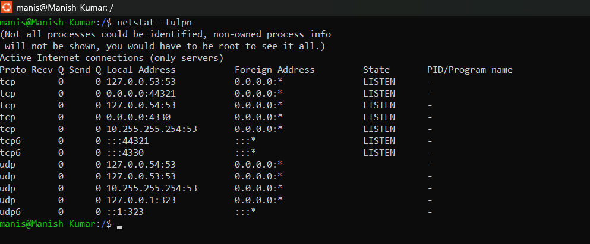

3. **Command = curl**
      1. curl is a tool for transferring data from or to a server using URLs

            curl -I <service-endpoint>/ping

            

## Logs Reviewed ##

1. **Command = journalctl**
      1. It's a viewer of systemd logs, read logs from journald

            journalctl -u hello-devops.service -n 15

            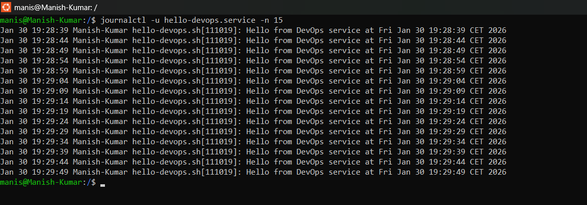

2. **Command = save logs in file**
      1. Using give command we are showing the logs on terminal as well as saving in file under /tmp directory

            journalctl -u hello-devops.service -n 100 | tee /tmp/hello-devops-100.log

            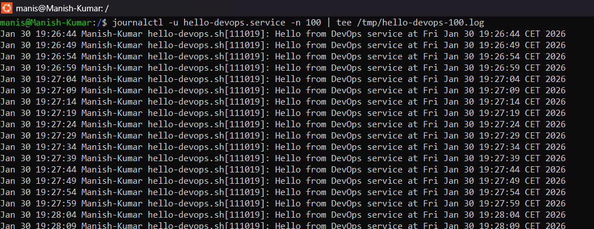
      
      2. Validate log file created or not

            cd /tmp

            ls -la

            

3. **Command = Fetch the logs from log file**
      1. Using given commnd you can fecth the logs from created log file

            tail -n 2 /tmp/hello-devops-100.log

            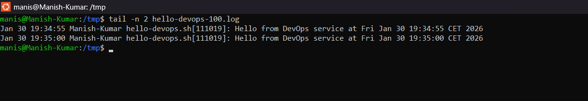

