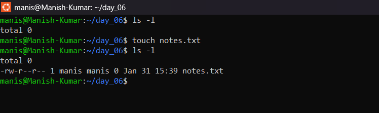
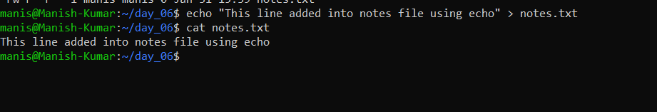
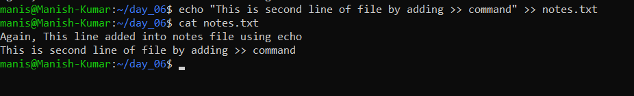
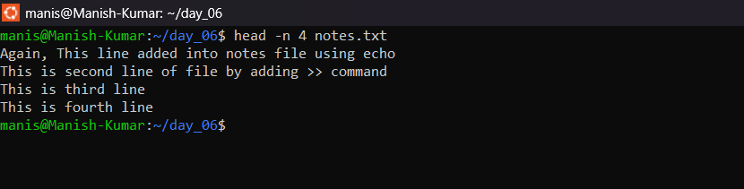
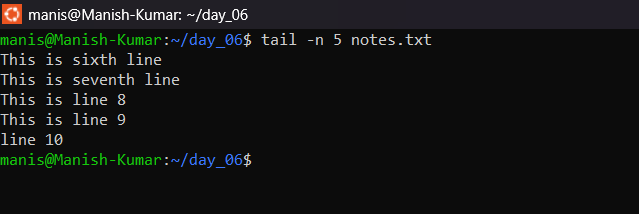
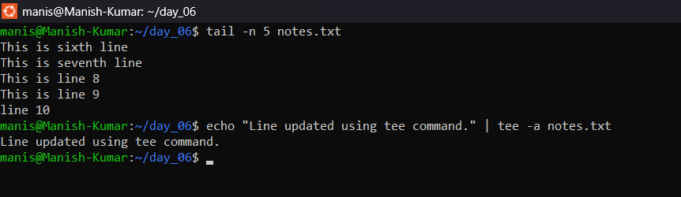

- [Day 5 - Task ]()
  - [Read and Write Text File](#read-and-write-text-file)

 Some useful shortcut for README file: 
 1. Alt + Shift + F → Format Document
 2. Ctrl + Shift + V → Preview Document

## Read and Write Text File ##

1. **Creating a file**
      1. Using the given command it will crete a text file.

            touch notes.txt

            

2. **Adding content to notes file**
      1. Using the given command it will add the text to file.

            echo "This line added into notes file using echo" > notes.txt

            

            <b> Note: If you will run this command again the existing text will get override.

3. **Append the text into notes file**
      1. Using the given command it will append the text into file.

            echo "This is second line of file by adding >> command" >> notes.txt

            

4. **Display the conent of file on terminal**
      1. Using the given command it will display the content of file on terminal.

            cat notes.txt

            

5. **Read the text of file from top**
      1. Using the given command it will read the text from top of file.

            head -n 4 notes.txt

            

6. **Read the text of file from bottom**
      1. Using the given command it will read the text from bottom of file.

            tail -n 4 notes.txt

            

7. **Writing text to file using tee**
      1. Using the given command it will write the text to file and at the same time display on terminal.

            echo "Line updated using tee command." | tee -a notes.txt

                        