 Some useful shortcut for README file:<br>
 1. Alt + Shift + F → Format Document
 2. Ctrl + Shift + V → Preview Document

### Part 1: Launch Cloud Instance & SSH Access (15 minutes)

**Step 1: Create a Cloud Instance**
   
   1.   Created a EC2 Instance with key pair security. (Downloaded key is Priviate key)
   2.   Launch the Instance

**Step 2: Connect via SSH**<br>
        1.   Move to the location of downloaded private key file <br>
        2.   Then run "<b>ssh -i "Name of private key file" server-name</b>" command to connect to the AWS cloud.<br>
             <b>Note: Server name you can get from AWS instance.
        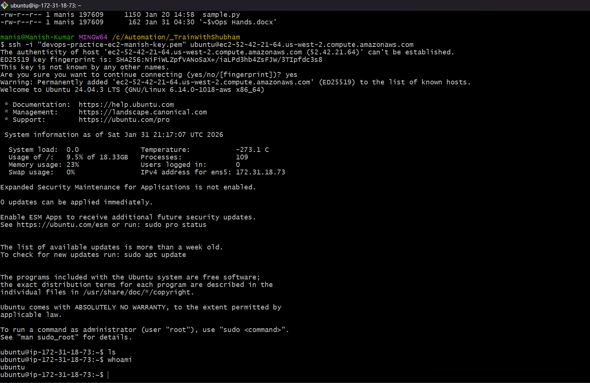

        **Note: For windows user, Install the Git Bash Application and run the the command SSH to validate if SSH is installed or not.**
---

### Part 2: Install Docker & Nginx (20 minutes)

**Pre-requisite**<br>
1. Start the EC2 Instance<br>
   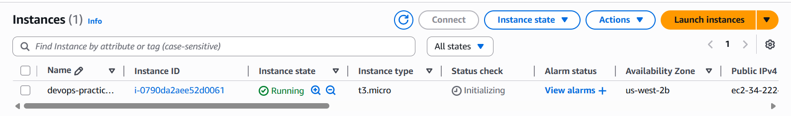<br><br>
2. Connect Instace to local via SSH client. (Note: Perform Step 2 of Part 1)<br>
   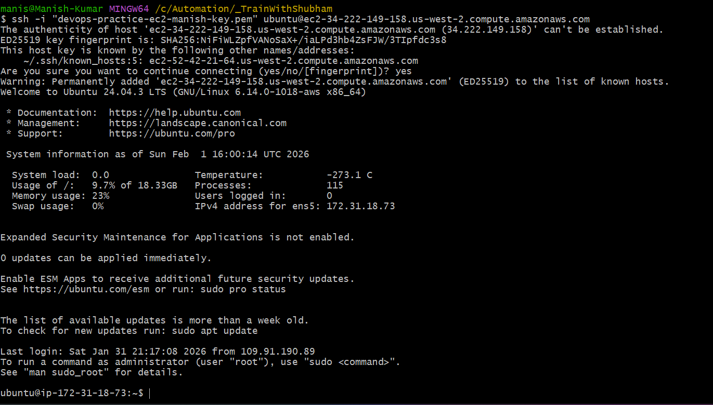<br><br>

**Step 1: Update System**<br>
1. Udate the system first with "<b>sudo apt update</b>" command <br>
   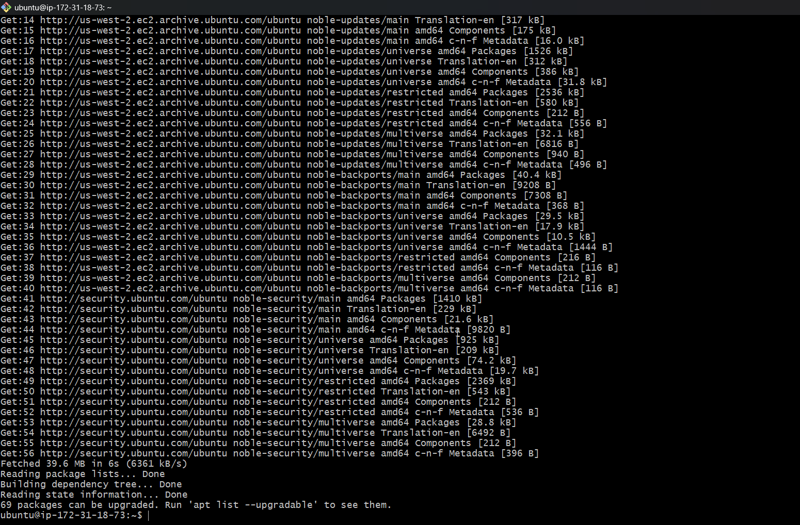<br><br>

**Step 3: Install Nginx**<br>
1. Install Nginx with "<b>sudo apt install nginx</b>" command <br>
   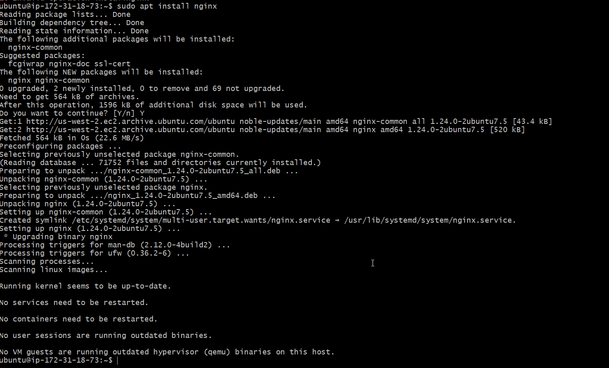<br><br>
**Verify Nginx is running:**
1. Install Nginx with "<b>systemctl status nginx</b>" command <br>
   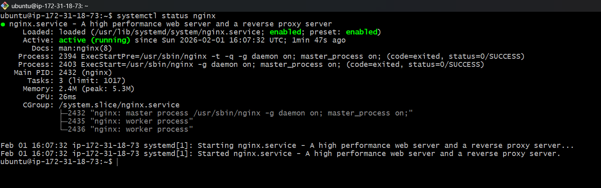<br><br>
   
---

### Part 3: Security Group Configuration 

**Test Web Access:**
   1. Start your EC2 instance 
   2. Click on Security Group under Security tab
   3. Under Inbound Rules, Click on Edit Inbound Rules
   4. Click on Add rule button
   5. Add port = 80, Source = Anywehere -IPv4, Description = nginx
   6. Then, Click on save rules.
   7. Now goto your instnace and copy the public ip then Open browser and visit: `http://52.88.211.95`. You should see the **Nginx welcome page**!<br><br>
     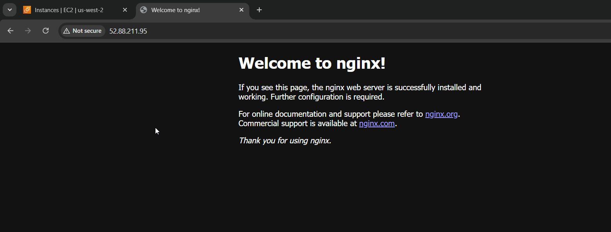<br><br>

---

### Part 4: Extract Nginx Log 

**Step 1: View Nginx Logs**<br>
    journalctl -u nginx   <br><br>
    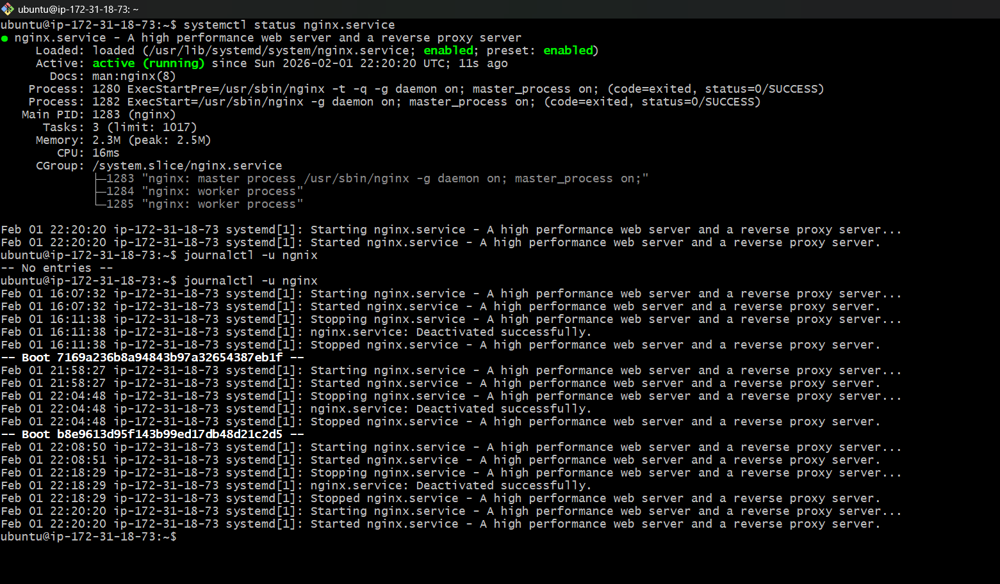<br><br>

**Step 2: Save Logs to File**<br>
    journalctl -u nginx > nginxlog.txt   <br><br>
    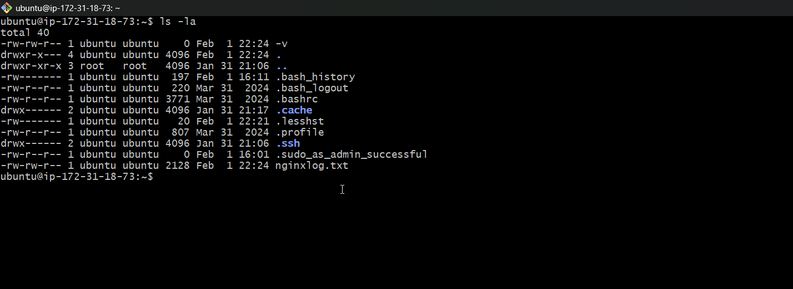<br><br><br>
    cat nginxlog.txt   <br><br>
    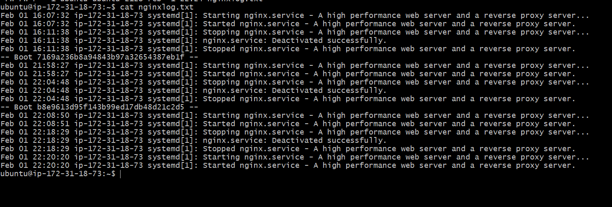<br><br>

**Step 3: Download Log File to Your Local Machine**
```bash
# On your local machine (new terminal window)
# For AWS:
scp -i your-key.pem ubuntu@<your-instance-ip>:~/nginx-logs.txt .

scp -i "devops-practice-ec2-manish-key.pem" ubuntu@ec2-34-214-206-219.us-west-2.compute.amazonaws.com:~/nginxlog.txt .
```
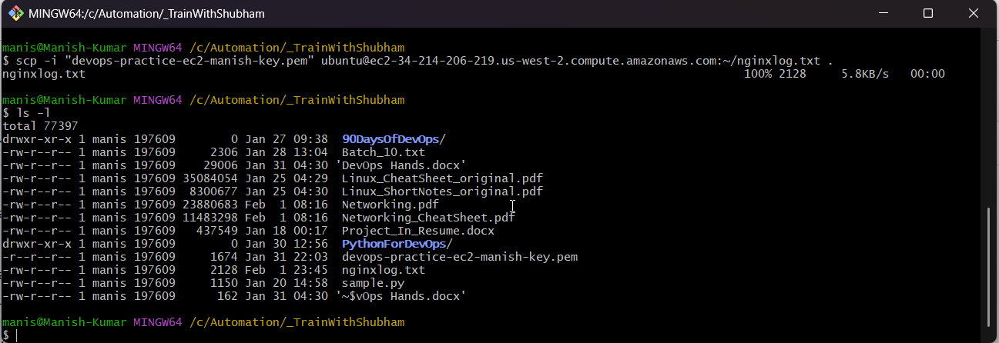<br><br>

---