 Some useful shortcut for README file: 
 1. Alt + Shift + F → Format Document
 2. Ctrl + Shift + V → Preview Document

### Task 1: Create Users (20 minutes)

Create three users with home directories and passwords:
- `tokyo`
- `berlin`
- `professor`

1. Create a user "berlin" including home directory of user.

        sudo useradd -m berlin

        ls -l
    

2. Create password for user "berlin"

        sudo passwd berlin
    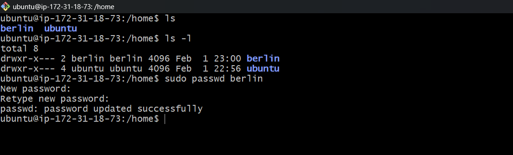

3. Note: In same way created "tokyo" and "professor" user with password "test@123"  
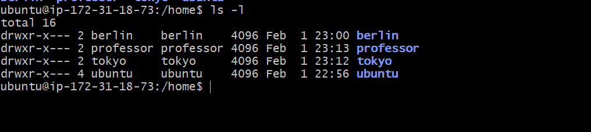

**Verify:** Check `/etc/passwd` and `/home/` directory 
1. /etc/passwd folder

        cat etc/passwd | grep -E "(berlin|tokyo|professor)"
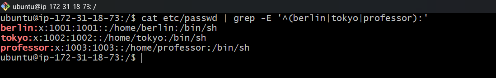

2. /home/ folder

        ls -l
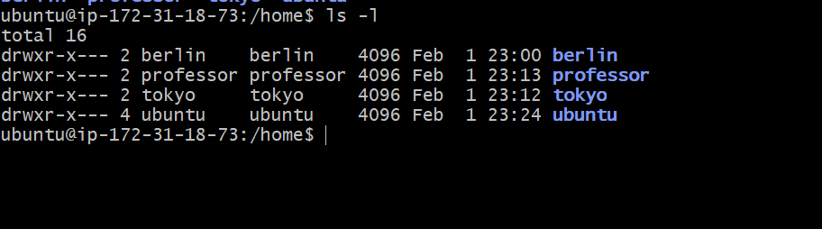

---

### Task 2: Create Groups (10 minutes)

Create two groups:
- `developers`
- `admins`

1. Create a usergroup "developers"

        sudo groupadd developers

        cat /etc/group | grep -E "developers"
    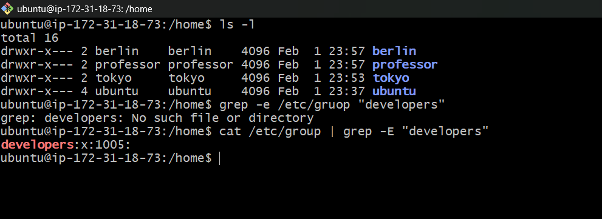

1. Create a usergroup "admins"

        sudo groupadd admins

        cat /etc/group | grep -E "admins"
    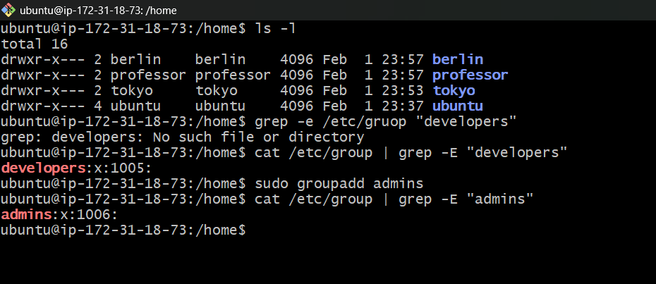

---

### Task 3: Assign to Groups (15 minutes)

Assign users:
- `tokyo` → `developers`
- `berlin` → `developers` + `admins` (both groups)
- `professor` → `admins`

1. Add "tokyo" user to "developers" group

        sudo gpasswd -a tokyo developers

        cat /etc/group | grep -E "developers"
    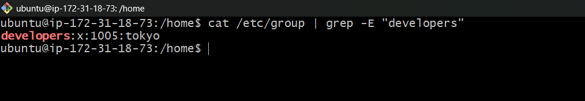

2. Add "berlin" user to "developers" and "admin" group

        sudo gpasswd -a berlin developers

        sudo gpasswd -a berlin admin

        cat /etc/group | grep -E "(developers|admins)"
    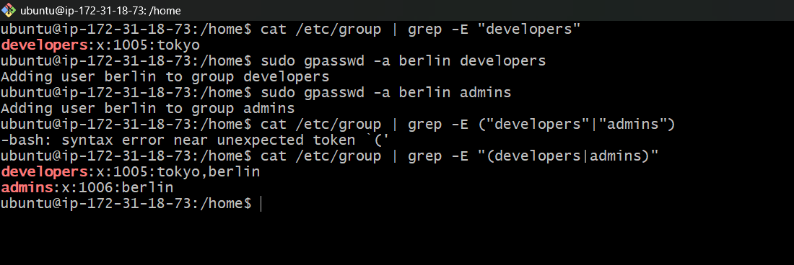

3. Add "professor" user to "admins" group

        sudo gpasswd -a professor admins

        cat /etc/group | grep -E "admins"
    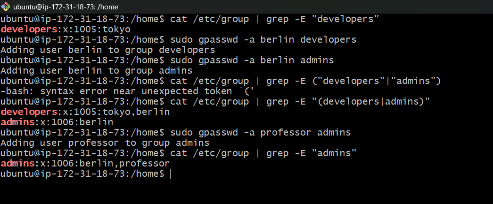

**Verify:** Use appropriate command to check group membership

---

### Task 4: Shared Directory (20 minutes)

1. Create directory: `/opt/dev-project`
    
        sudo mkdir /opt/dev-project

        ls -l /opt
    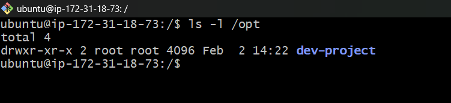

2. Set group owner to `developers`
   
        sudo chgrp -v develpers /opt/dev-project

        ls -l /opt
    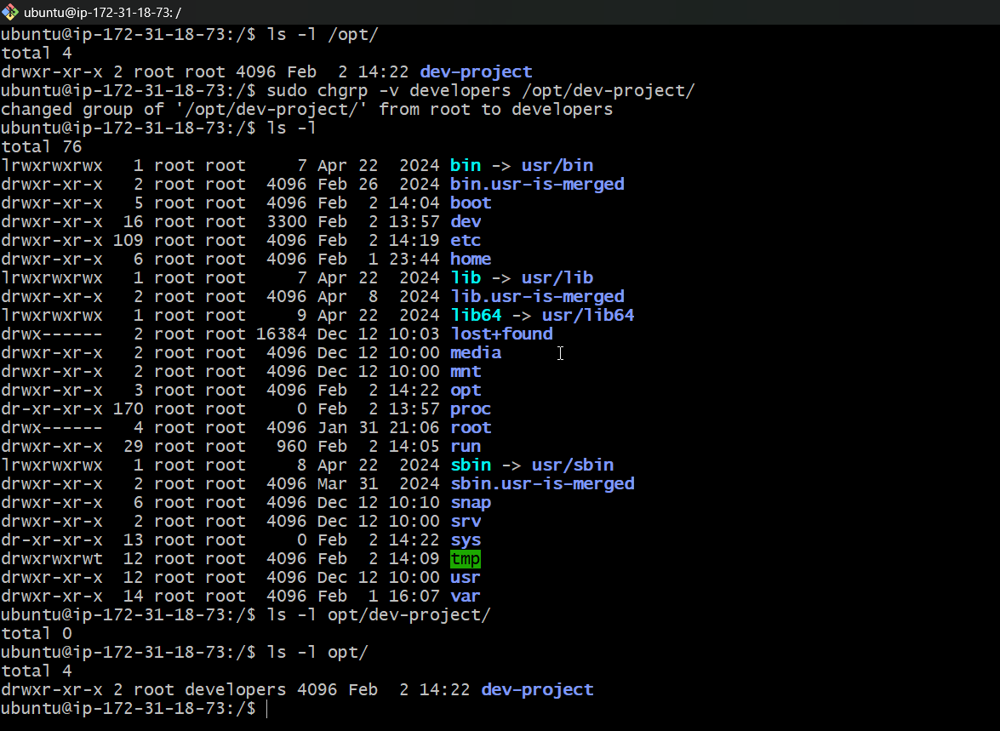

3. Set permissions to `775` (rwxrwxr-x)

        chmod 775 /opt/dev-project

        ls -l /opt
    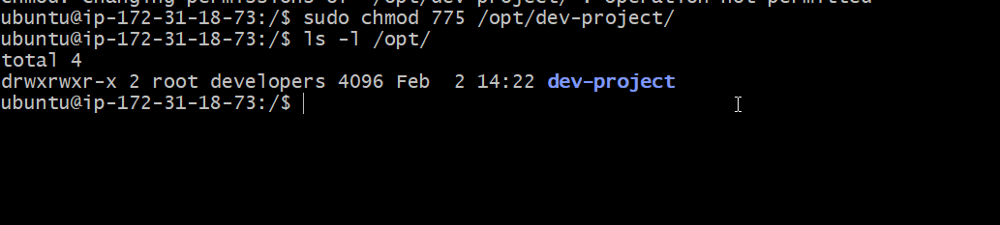

4. Test by creating files as `tokyo` and `berlin`
   
        su tokyo 

        cd /opt/dev-project

        touch file-by-tokyo.txt

        ls -l
    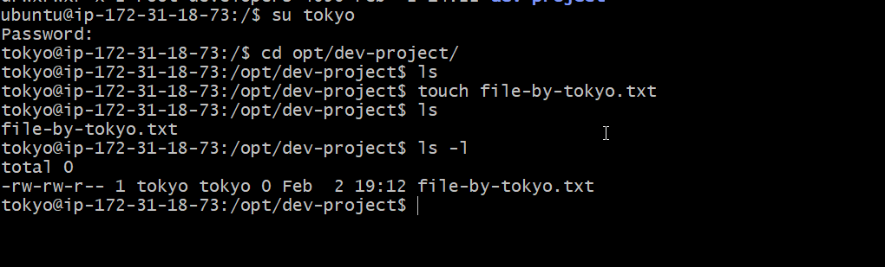

        su berlin 

        cd /opt/dev-project

        touch file-by-berlin.txt

        ls -l
    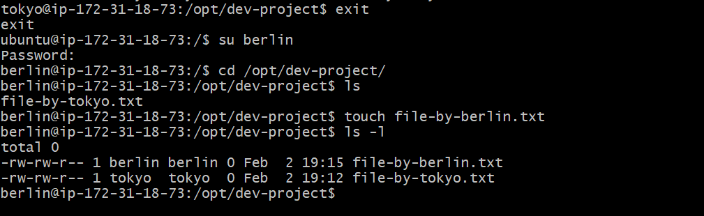 

**Verify:** Check permissions and test file creation

---

### Task 5: Team Workspace (20 minutes)

1. Create user `nairobi` with home directory
   
        sudo useradd -m nairobi -s /usr/bin/bash

        ls -l 
    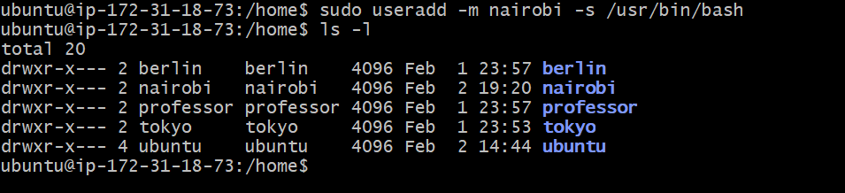

2. Create group `project-team`
    
        sudo groupaddproject-team

        cat etc/group | grep -E "project-team"
    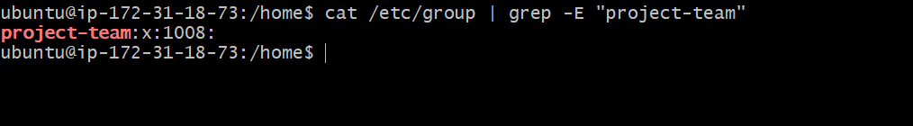

3. Add `nairobi` and `tokyo` to `project-team`

        sudo gpasswd -a nairobi project-team

        sudo gpasswd -a tokyo project-team

        cat /etc/group | grep -E "(nairobi|tokyo)"
    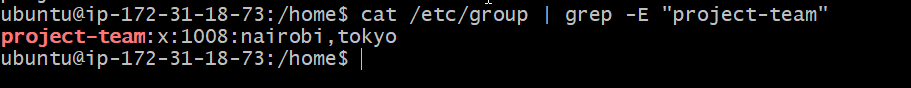

4. Create `/opt/team-workspace` directory
   
        sudo mkdir /opt/team-workspace

        ls -l /opt
    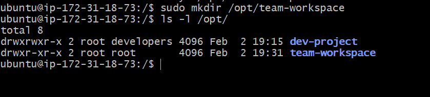

5. Set group to `project-team`, permissions to `775`

        sudo chgrp -v project-team /opt/team-workspace

        ls -l /opt
    

        chmod 775 /opt/team-workspace

        ls -l /opt
    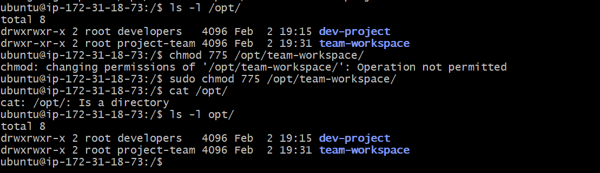

6. Test by creating file as `nairobi`

        cd /opt/team-workspace 

        touch file-created-by-nairobi.txt

    

---

## Commands

# 1. Check if there are any hidden/special characters in the berlin entry
grep berlin /etc/passwd | cat -A

# 2. Verify the home directory exists
ls -ld /home/berlin

# 3. Check if the shell is valid and executable
ls -l /usr/bin/bash

# 4. Verify the group exists
grep berlin /etc/group

# 5. Check the /etc/shadow file for the berlin entry
sudo grep berlin /etc/shadow

---
