# Day 10 – File Permissions & File Operations Challenge

## Task
Master file permissions and basic file operations in Linux.

- Create and read files using `touch`, `cat`, `vim`
- Understand and modify permissions using `chmod`

---

## Expected Output
- A markdown file: `day-10-file-permissions.md`
- Screenshots showing permission changes

---

## Challenge Tasks

### Task 1: Create Files (10 minutes)

1. Create empty file `devops.txt` using `touch`

        switch the user first with = su nairobi

        under team-workspace create a file

        touch devops.txt
     

2. Create `notes.txt` with some content using `cat` or `echo`

        cat > notes.txt 

        This is first line via cat command
        This is second line via cat command
        End of file here

        Press CTRL+D to save file
     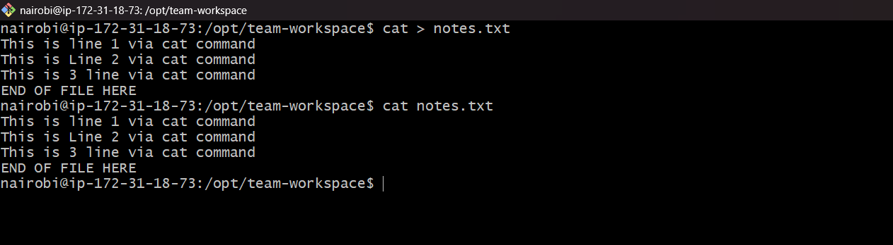
   
3. Create `script.sh` using `vim` with content: `echo "Hello DevOps"`

        vim script.sh

     
    
**Verify:** `ls -l` to see permissions

---

### Task 2: Read Files (10 minutes)

1. Read `notes.txt` using `cat`

        cat notes.txt

    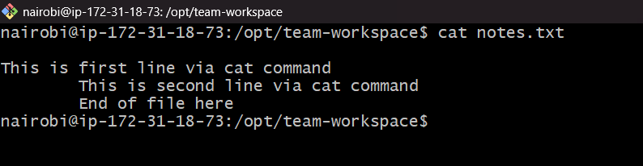

2. View `script.sh` in vim read-only mode
   
        vim script.sh

    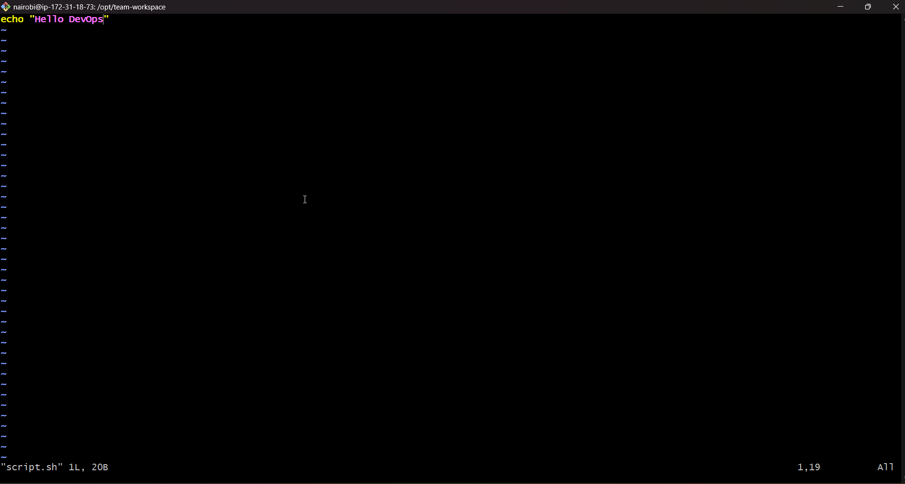

3. Display first 5 lines of `/etc/passwd` using `head`

        cat /etc/passwd | head -n 5

    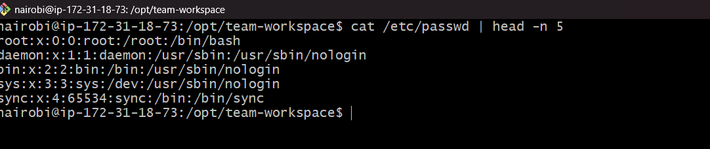

4. Display last 5 lines of `/etc/passwd` using `tail`

        cat /etc/passwd | tail -n 5

    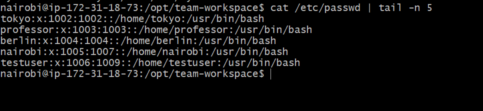

---

### Task 3: Understand Permissions (10 minutes)

Format: `rwxrwxrwx` (owner-group-others)
- `r` = read (4), `w` = write (2), `x` = execute (1)

Check your files: `ls -l devops.txt notes.txt script.sh`

Answer: What are current permissions? Who can read/write/execute?

        Owner - All three files can be Read and Write by owner
        Group - All three files can be Read and Write by group
        Other user - For all other user only read only permission are there.
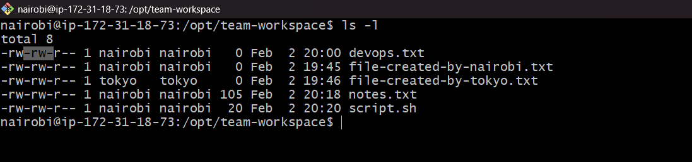

---

### Task 4: Modify Permissions (20 minutes)

1. Make `script.sh` executable → run it with `./script.sh`

        chmod 774 script.sh
    
    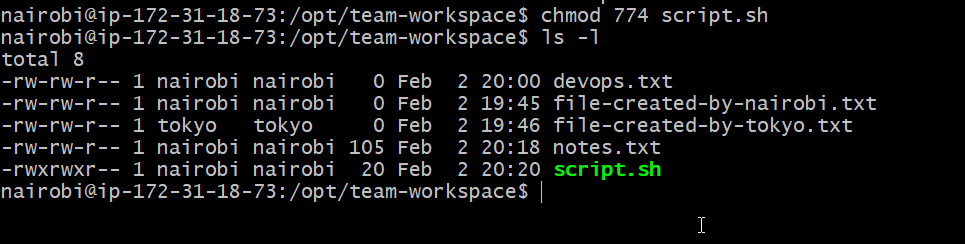

2. Set `devops.txt` to read-only (remove write for all)

    chmod 444 devops.txt
    
    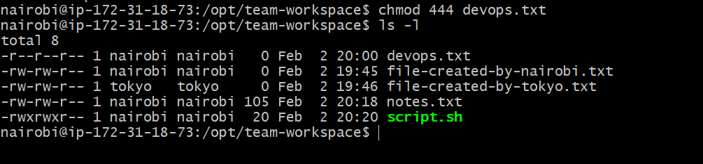

3. Set `notes.txt` to `640` (owner: rw, group: r, others: none)

        chmod 640 notes.txt
    
    

4. Create directory `project/` with permissions `755`

        mkdir -m 755 projects
    
    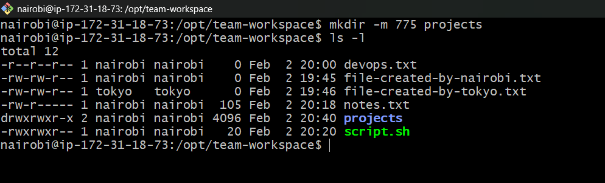

**Verify:** `ls -l` after each change

---

### Task 5: Test Permissions (10 minutes)

1. Try writing to a read-only file - what happens?
    
    Note: devops.txt is readonly file

            echo "Trying writing into read only file devops" >> devops.txt

    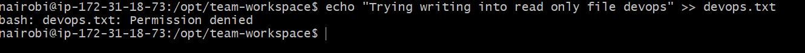

2. Try executing a file without execute permission

    Note: created a new file sample.sh without execute permission

            ./sample.sh

    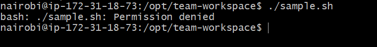

3. Document the error messages

---

## Hints

- Create: `touch`, `cat > file`, `vim file`
- Read: `cat`, `head -n`, `tail -n`
- Permissions: `chmod +x`, `chmod -w`, `chmod 755`

---