# Day 11 – File Ownership Challenge (chown & chgrp)

## Task
Master file and directory ownership in Linux.

- Understand file ownership (user and group)
- Change file owner using `chown`
- Change file group using `chgrp`
- Apply ownership changes recursively

---

## Expected Output
- A markdown file: `day-11-file-ownership.md`
- Screenshots showing ownership changes

---

## Challenge Tasks

### Task 1: Understanding Ownership (10 minutes)

1. Run `ls -l` in your home directory
   
    

2. Identify the **owner** and **group** columns
   
   

3. Check who owns your files

**Format:** `-rw-r--r-- 1 owner group size date filename`

Document: What's the difference between owner and group?

---

### Task 2: Basic chown Operations (20 minutes)

1. Create file `devops-file.txt`

        touch devope-file.txt

2. Check current owner: `ls -l devops-file.txt`

        ls -l devops-file.txt

    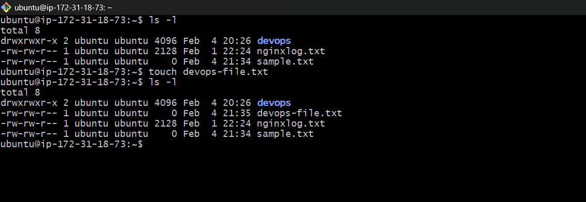

3. Change owner to `tokyo` (create user if needed)

        sudo chown tokyo devops-file.txt
    
    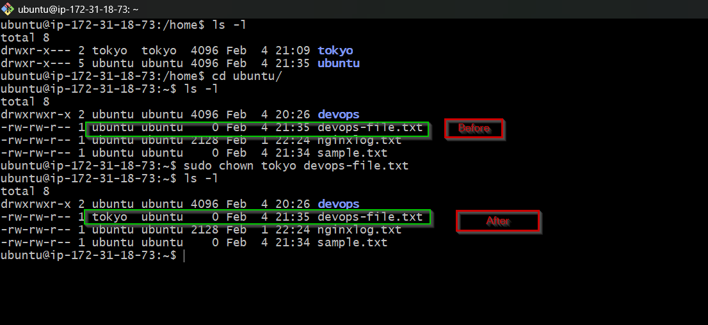

4. Change owner to `berlin`

        sudo chown berlin devops-file.txt
    
    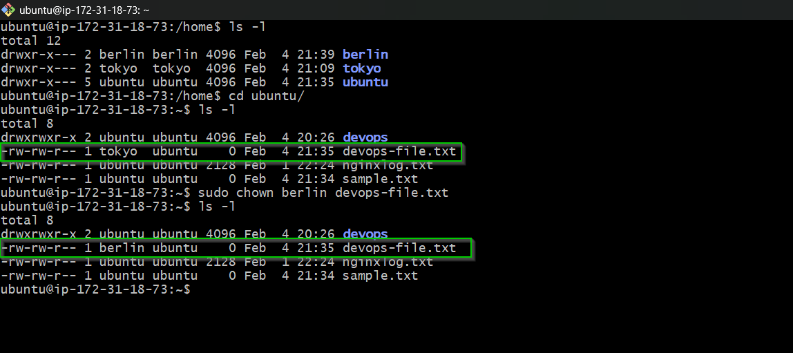

5. Verify the changes

        ls -l 

**Try:**
```bash
sudo chown tokyo devops-file.txt
```

---

### Task 3: Basic chgrp Operations (15 minutes)

1. Create file `team-notes.txt`

        touch team-notes.txt

    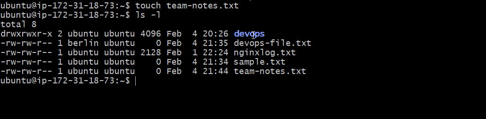
    
2. Check current group: `ls -l team-notes.txt`

        ls -l team-notes.txt
    
    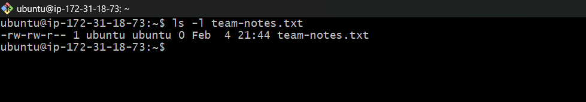

3. Create group: `sudo groupadd heist-team`

        sudo groupadd heist-team

        cat /etc/group | grep -e "heist"

    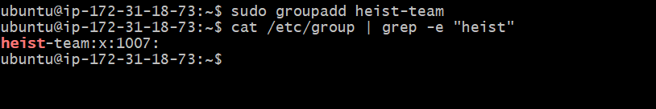

4. Change file group to `heist-team` and verify the changes.

        sudo chgrp -v heist-team devops-file.txt

        ls -l

    

---

### Task 4: Combined Owner & Group Change (15 minutes)

Using `chown` you can change both owner and group together:

1. Create file `project-config.yaml`

        touch prject-config.yaml

    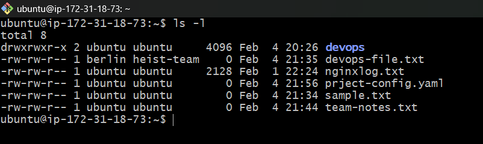

2. Change owner to `professor` AND group to `heist-team` (one command)

        sudo chown professor:heist-team prject-config.yaml
    
        ls -l
    
    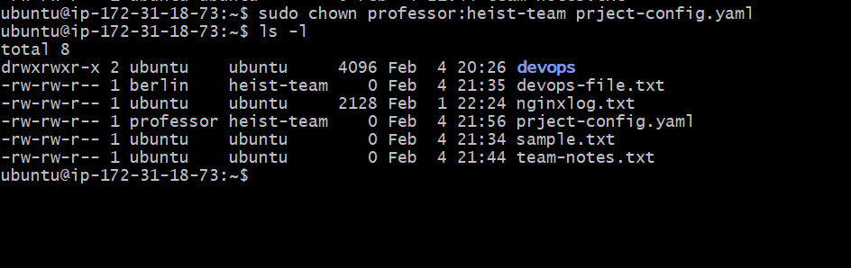

3. Create directory `app-logs/`

        mkdir app-logs

        ls -l

    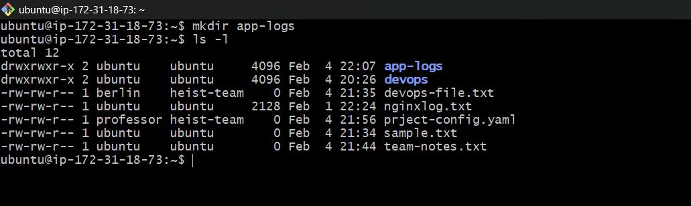

4. Change its owner to `berlin` and group to `heist-team`

        sudo chown berlin:heist-team app-logs

        ls -la

    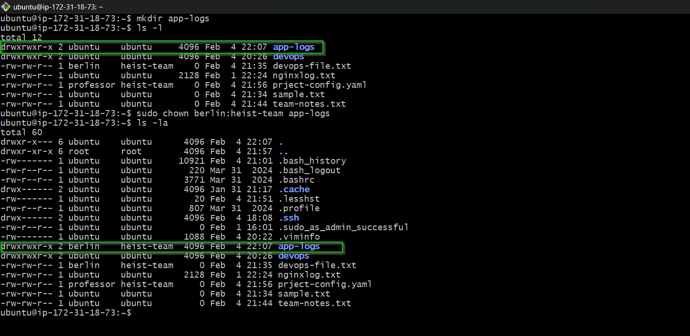

**Syntax:** `sudo chown owner:group filename`

---

### Task 5: Recursive Ownership (20 minutes)

1. Create directory structure:
   ```
   mkdir -p heist-project/vault
   mkdir -p heist-project/plans
   touch heist-project/vault/gold.txt
   touch heist-project/plans/strategy.conf
   ```
    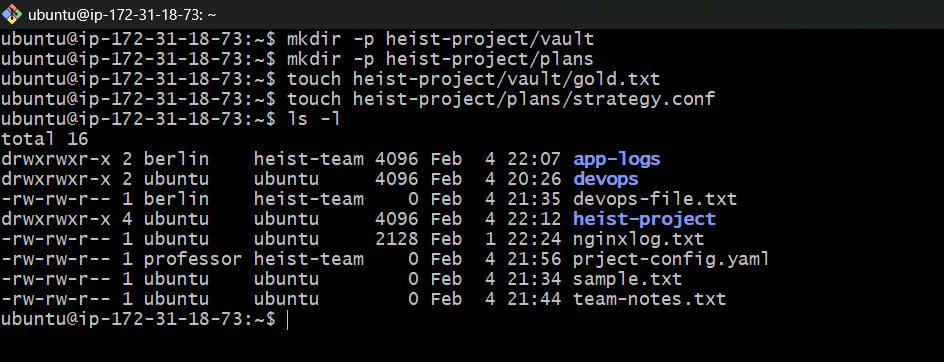

2. Create group `planners`: `sudo groupadd planners`

        sudo groupadd planners

        cat /etc/group | grep -e "planners"
    
    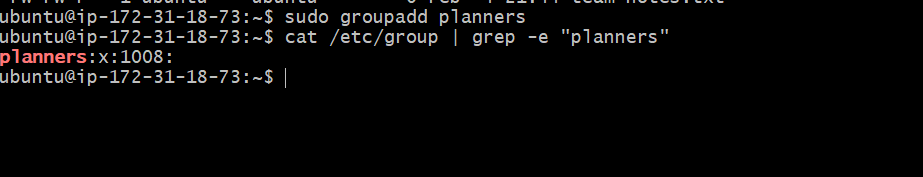

3. Change ownership of entire `heist-project/` directory:
   - Owner: `professor`
   - Group: `planners`
   - Use recursive flag (`-R`)

        sudo chown -R professor:planners heist-project/

        ls -l

    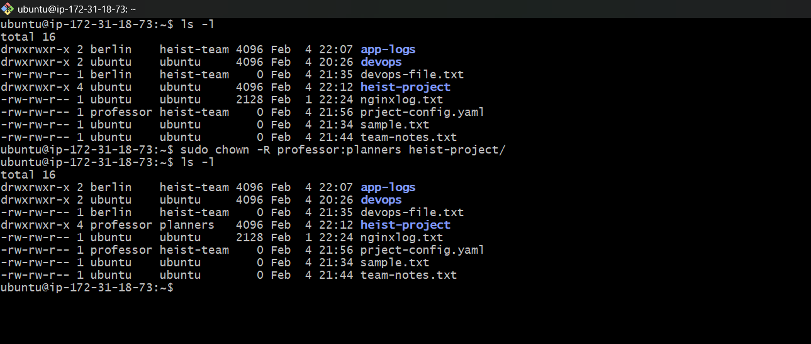

4. Verify all files and subdirectories changed: `ls -lR heist-project/`

        ls -lR heist-project/
    
    

---

### Task 6: Practice Challenge (20 minutes)

1. Create users: `tokyo`, `berlin`, `nairobi` (if not already created)

        ls -l

    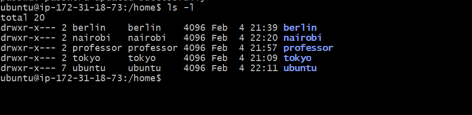

2. Create groups: `vault-team`, `tech-team`

        sudo groupadd vault-team

        sudo groupadd tech-team

        cat /etc/group | grep -E "(vault-team|tech-team)"

    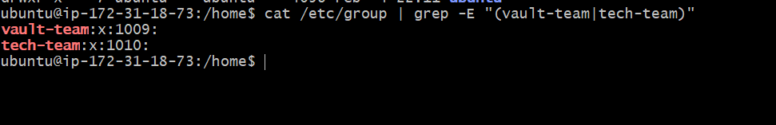

3. Create directory: `bank-heist/`

        mkdir bank-heist

        ls -l

    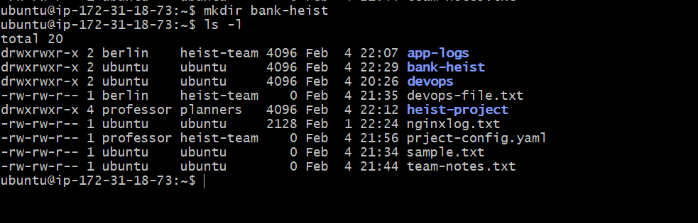

4. Create 3 files inside:
   ```
   touch bank-heist/access-codes.txt
   touch bank-heist/blueprints.pdf
   touch bank-heist/escape-plan.txt
   ```
   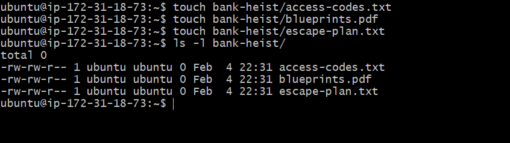

5. Set different ownership:
   - `access-codes.txt` → owner: `tokyo`, group: `vault-team`
   - `blueprints.pdf` → owner: `berlin`, group: `tech-team`
   - `escape-plan.txt` → owner: `nairobi`, group: `vault-team`

        sudo chown tokyo:vault-team bank-heist/access-codes.txt

        sudo chown berlin:tech-team bank-heist/blueprints.pdf

        sudo chown nairobi:vault-team bank-heist/escape-plan.txt
        
**Verify:** `ls -l bank-heist/`

        ls -l bank-heist/
    
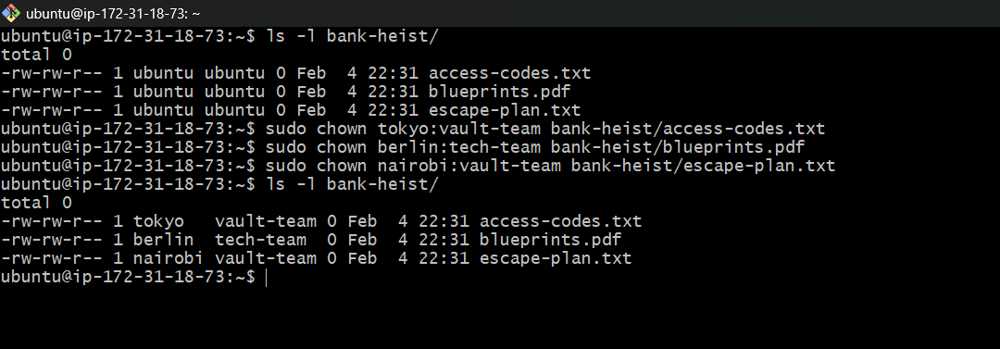

---

## Key Commands Reference

```bash
# View ownership
ls -l filename

# Change owner only
sudo chown newowner filename

# Change group only
sudo chgrp newgroup filename

# Change both owner and group
sudo chown owner:group filename

# Recursive change (directories)
sudo chown -R owner:group directory/

# Change only group with chown
sudo chown :groupname filename
```

---

## Hints

- Most `chown`/`chgrp` operations need `sudo`
- Use `-R` flag for recursive directory changes
- Always verify with `ls -l` after changes
- User must exist before using in `chown`
- Group must exist before using in `chgrp`/`chown`

---

## Documentation

Create `day-11-file-ownership.md`:

```markdown
# Day 11 Challenge

## Files & Directories Created
[list all files/directories]

## Ownership Changes
[before/after for each file]

Example:
- devops-file.txt: user:user → tokyo:heist-team

## Commands Used
[your commands here]

## What I Learned
[3 key points about file ownership]
```

---

## Troubleshooting

**Permission denied?**
- Use `sudo` for chown/chgrp operations

**Group doesn't exist?**
- Create it first: `sudo groupadd groupname`

**User doesn't exist?**
- Create it first: `sudo useradd username`

---

## Why This Matters for DevOps

In real DevOps scenarios, you need proper file ownership for:

- Application deployments
- Shared team directories
- Container file permissions
- CI/CD pipeline artifacts
- Log file management

---

