# Day 13 – Linux Volume Management (LVM)

## Task
Learn LVM to manage storage flexibly – create, extend, and mount volumes.

**Watch First:** [Linux LVM Tutorial](https://youtu.be/Evnf2AAt7FQ?si=ncnfQYySYtK_2K3c)

## AWS EC2 Setup and Volume Creation ##

Step 1: Created AWS EC2 Instance with Ubuntu 

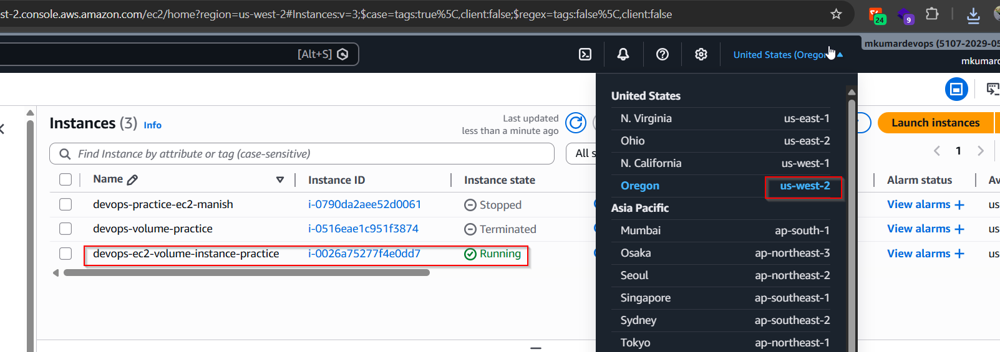

Step 2: Create three volume 10GB, 12GB, 14GB volume

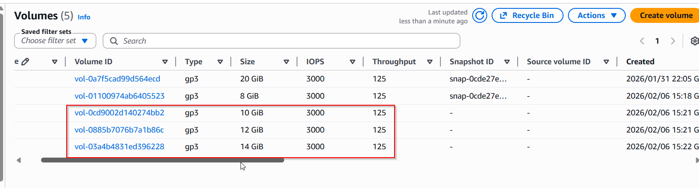

Step 3: Attached created volume to respective instance.

    Note: While selecting device name during volume attachment process. select rage from /dev/sd[f-p] for data volume.

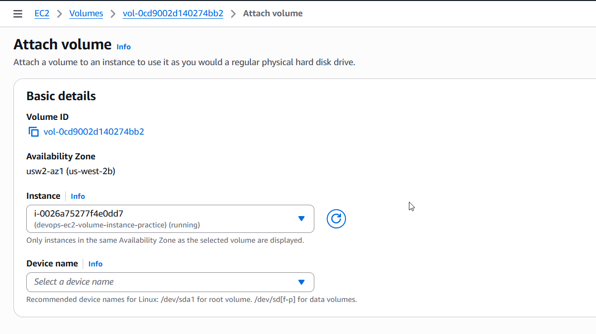

Step 4: Attach the volume to corresponding instance.

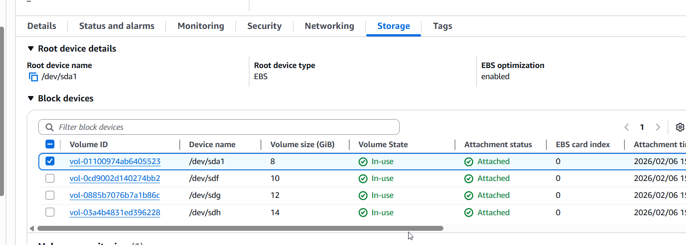

---

## Before You Start

Switch to root user:
```bash
sudo -i
```
or
```bash
sudo su
```
No spare disk? Create a virtual one (watch the tutorial):
```bash
dd if=/dev/zero of=/tmp/disk1.img bs=1M count=1024
losetup -fP /tmp/disk1.img
losetup -a   # Note the device name (e.g., /dev/loop0)
```

---

## Challenge Tasks

### Task 1: Check Current Storage
Run: `lsblk`, `pvs`, `vgs`, `lvs`, `df -h`

        lsbk : show the available list of block 

        pvs : Show the physical volume 

        vgs : Show the virtual group

        lvs : Show the logical volume

        df -h : Report file system space usage (dh = Disk Filesystem)
    
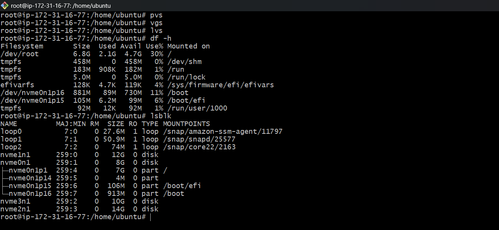

### Task 2: Create Physical Volume

```bash
pvcreate /dev/nvme1n1 /dev/nvme2n1 /dev/nvme3n1
```
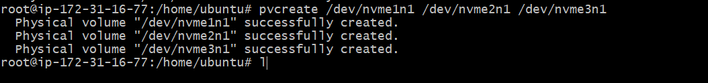

```bash
pvs
```


### Task 3: Create Volume Group
```bash
vgcreate devops-vg dev/nvme1n1 /dev/nvme2n1
```
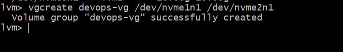

```bash
vgs
```
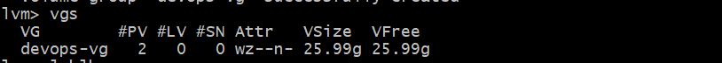

### Task 4: Create Logical Volume
```bash
lvcreate -L 500M -n app-data devops-vg
```
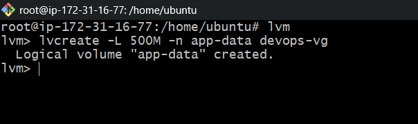

```bash
lvs
```

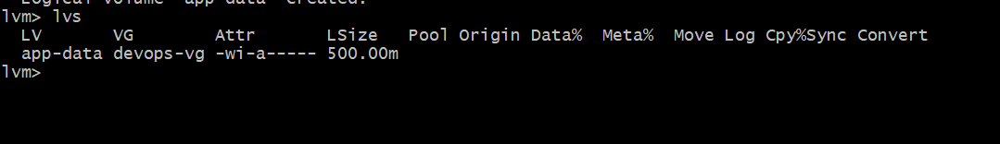


### Task 5: Format and Mount (Logical Volume)
```bash
mkfs.ext4 /dev/devops-vg/app-data
mkdir -p /mnt/app-data
```
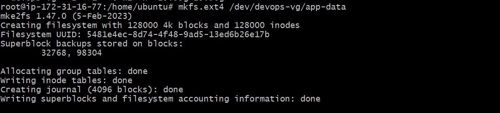

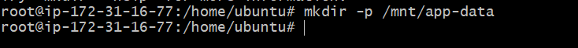

```bash
mount /dev/devops-vg/app-data /mnt/app-data
df -h /mnt/app-data
```
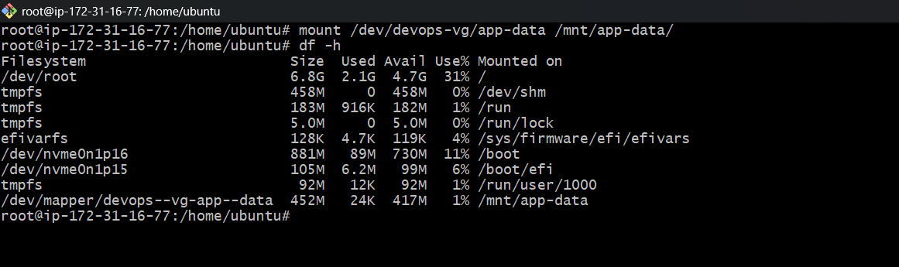

### Task 6: Format and Mount (Physical Volume)
```bash
mkfs -t ext4 /dev/nvme3n1
mkdir -p /mnt/physical-volume-mnt
```
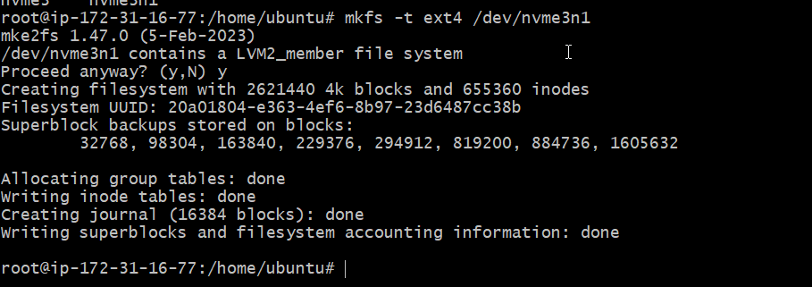

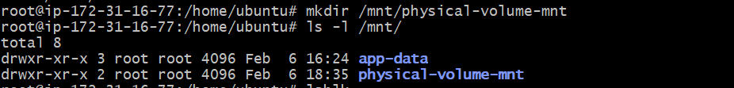

```bash
mount /dev/nvme3n1 /mnt/physical-volume-mnt
df -h /mnt/physical-volume-mnt
```
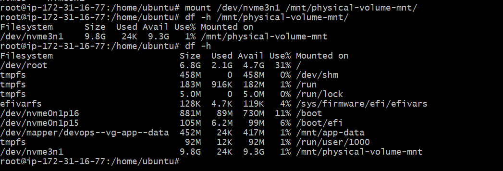


### Task 7: Extend the Volume
```bash
lvextend -L +200M /dev/devops-vg/app-data

df -h /mnt/app-data
```
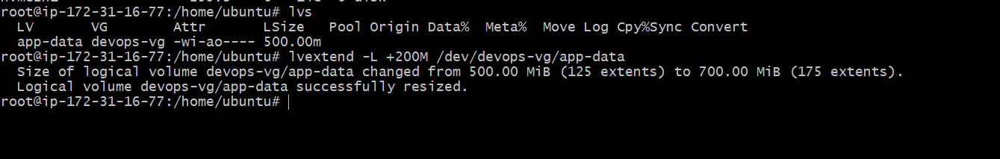
---