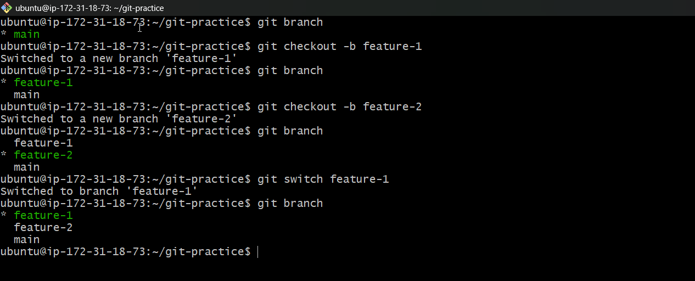
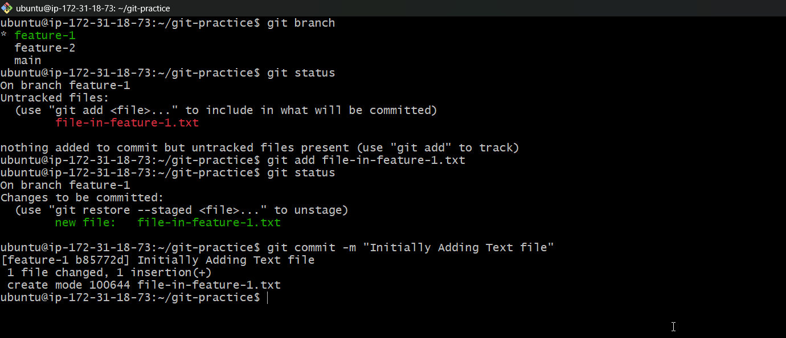
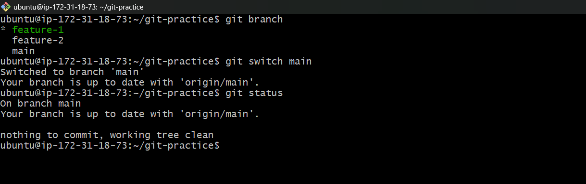
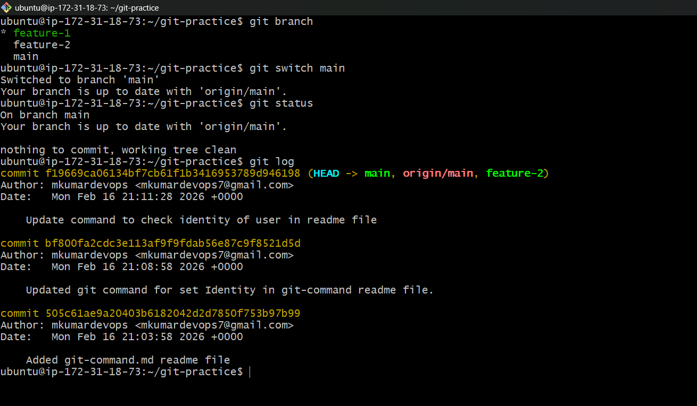
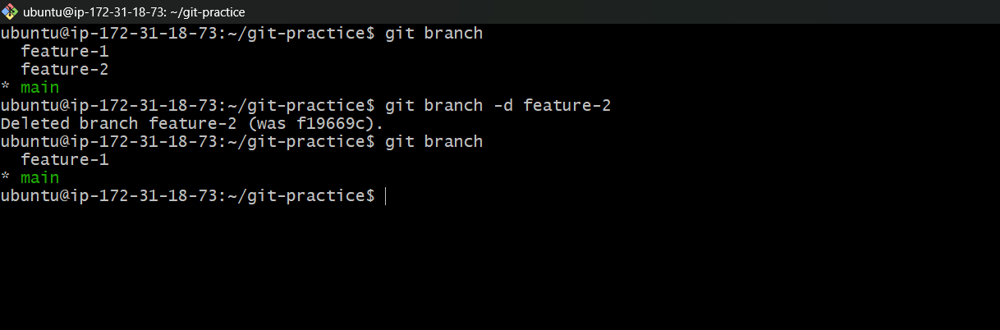
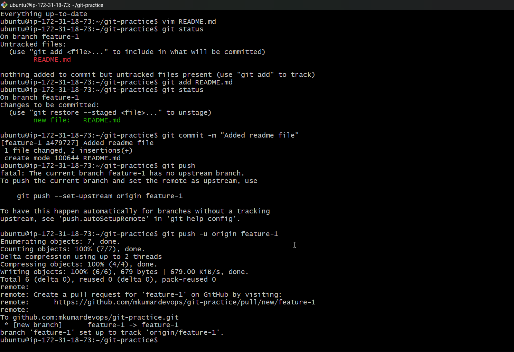
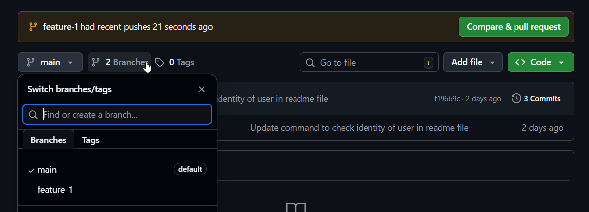
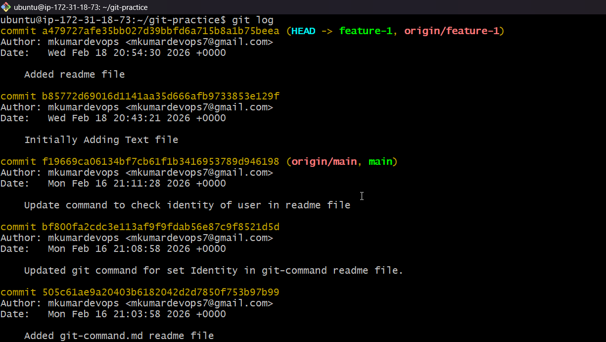
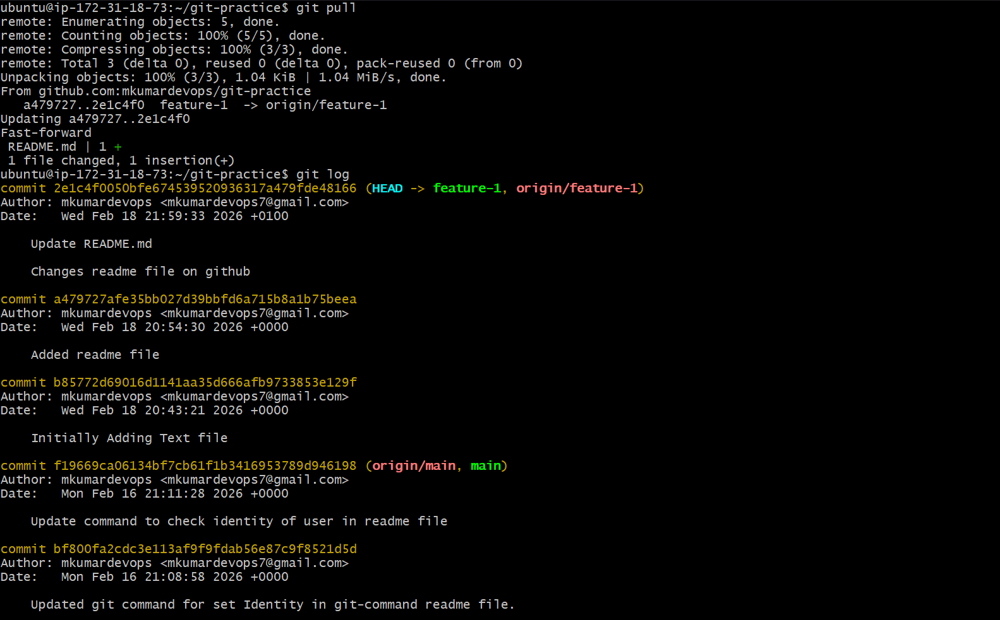

# Day 23 – Git Branching & Working with GitHub

## Task

Now that you know how to create repos, stage, and commit — it's time to learn the most powerful concept in Git: **branching**. Branches let you work on features, fixes, and experiments in isolation without breaking your main code. You'll also push your work to GitHub for the first time.

---

## Expected Output
- A markdown file: `day-23-notes.md` with your answers
- Continue updating `git-commands.md` in your `devops-git-practice` repo
- Your practice repo pushed to GitHub

---

## Challenge Tasks

### Task 1: Understanding Branches
Answer these in your `day-23-notes.md`:
1. What is a branch in Git?
Answer: A branch is like a copy of your project where you can freely make changes without messing up the original.

2. Why do we use branches instead of committing everything to `main`?
Answer: Committing everything to main is like everyone doing surgery on the same patient at the same time. Branches let each surgeon work separately and only bring in their work when it's ready.

3. What is `HEAD` in Git?
Answer: HEAD is simply a pointer that says "This is where you are right now".

4. What happens to your files when you switch branches?
Answer: Automatically update your project file to match whatever state they were in on that branch.

---

### Task 2: Branching Commands — Hands-On
In your `devops-git-practice` repo, perform the following:
1. List all branches in your repo
2. Create a new branch called `feature-1`
3. Switch to `feature-1`
4. Create a new branch and switch to it in a single command — call it `feature-2`
5. Try using `git switch` to move between branches — how is it different from `git checkout`?

6. Make a commit on `feature-1` that does **not** exist on `main`

7. Switch back to `main` — verify that the commit from `feature-1` is not there

8. Delete a branch you no longer need
   

9.  Add all branching commands to your `git-commands.md`

---

### Task 3: Push to GitHub
1. Create a **new repository** on GitHub (do NOT initialize it with a README)
2. Connect your local `devops-git-practice` repo to the GitHub remote
3. Push your `main` branch to GitHub
4. Push `feature-1` branch to GitHub
5. Verify both branches are visible on GitHub
6. Answer in your notes: What is the difference between `origin` and `upstream`?

---

### Task 4: Pull from GitHub
1. Make a change to a file **directly on GitHub** (use the GitHub editor)
2. Pull that change to your local repo
3. Answer in your notes: What is the difference between `git fetch` and `git pull`?

**git fetch = "Just check what's new, but don't touch my files yet"**
**git pull = "Check what's new AND immediately merge it into my work"**

---

### Task 5: Clone vs Fork
1. **Clone** any public repository from GitHub to your local machine
2. **Fork** the same repository on GitHub, then clone your fork
3. Answer in your notes:
   - What is the difference between clone and fork?
   - Clone: Copy the repo from github to your lcoal
   - fork: Directly copy the repo to your git hub 
    - When would you clone vs fork?
   - After forking, how do you keep your fork in sync with the original repo?
    - Whenever you want to update the form branch, You have to sync the branch

---

## Hints
- When you create a branch, it starts from the commit you're currently on
- `git switch` is the modern alternative to `git checkout` for switching branches
- To push a new branch: `git push -u origin <branch-name>`
- A fork is a GitHub concept, not a Git concept

---
