# Day 24 – Advanced Git: Merge, Rebase, Stash & Cherry Pick

## Task

You know how to branch and push to GitHub. Now it's time to learn how branches come back together — and what to do when you're in the middle of something and need to context-switch. These are the Git skills that separate beginners from confident practitioners.

---

## Expected Output
- A markdown file: `day-24-notes.md` with your observations and answers
- Continue updating `git-commands.md` in your `devops-git-practice` repo

---

## Challenge Tasks

### Task 1: Git Merge — Hands-On
1. Create a new branch `feature-login` from `main`, add a couple of commits to it

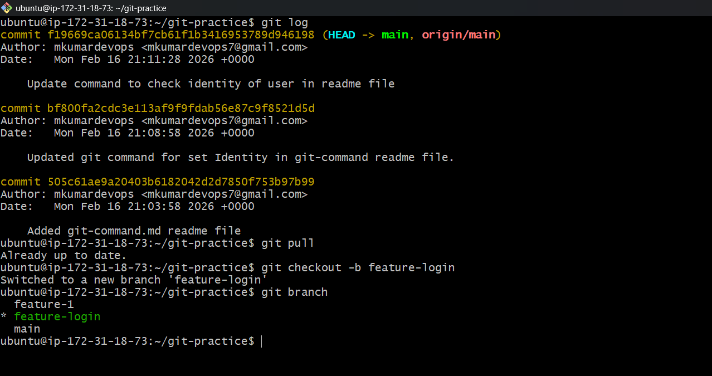
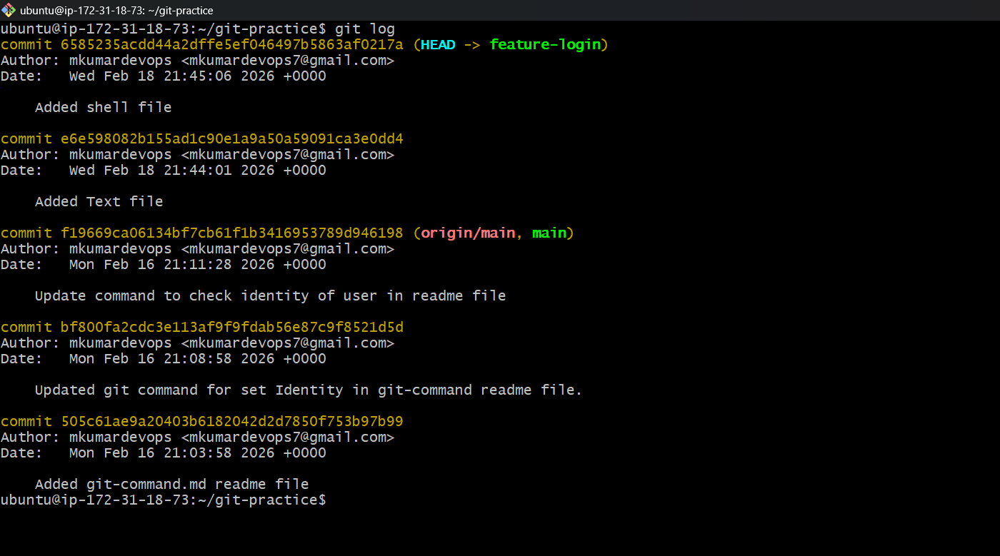

2. Switch back to `main` and merge `feature-login` into `main`

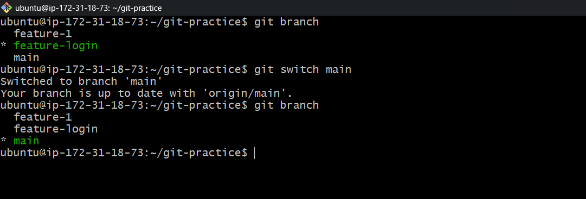
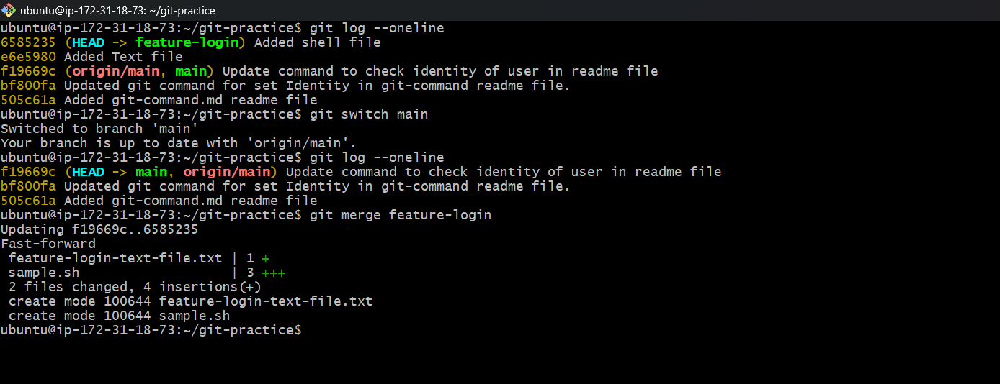

3. Observe the merge — did Git do a **fast-forward** merge or a **merge commit**?

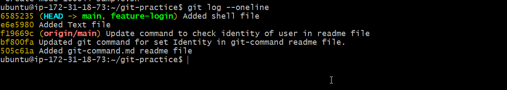

4. Now create another branch `feature-signup`, add commits to it — but also add a commit to `main` before merging

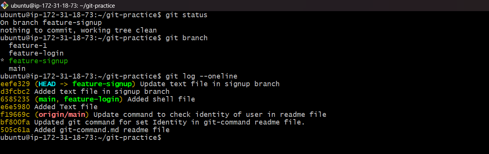
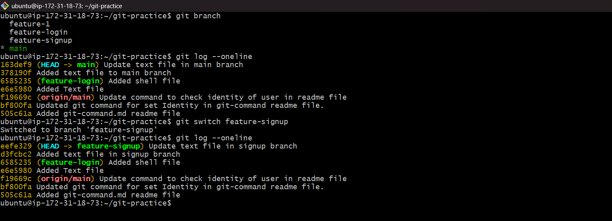

5. Merge `feature-signup` into `main` — what happens this time?

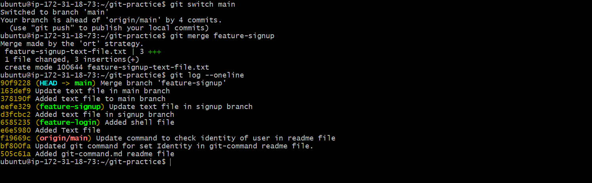

1. Answer in your notes:
   - What is a fast-forward merge?
     Answer: fast-forward merge is Git saying "no conflicts, no drama, let me just move the pointer forward."
  
   - When does Git create a merge commit instead?
     Anser: Git creates a merge commit when it has to reconcile two different histories — it can't just move a pointer, it has to do actual combining work.

   - What is a merge conflict? (try creating one intentionally by editing the same line in both branches)
     Answer: A merge conflict happens when two people edit the same line of the same file differently.

---

### Task 2: Git Rebase — Hands-On
1. Create a branch `feature-dashboard` from `main`, add 2-3 commits

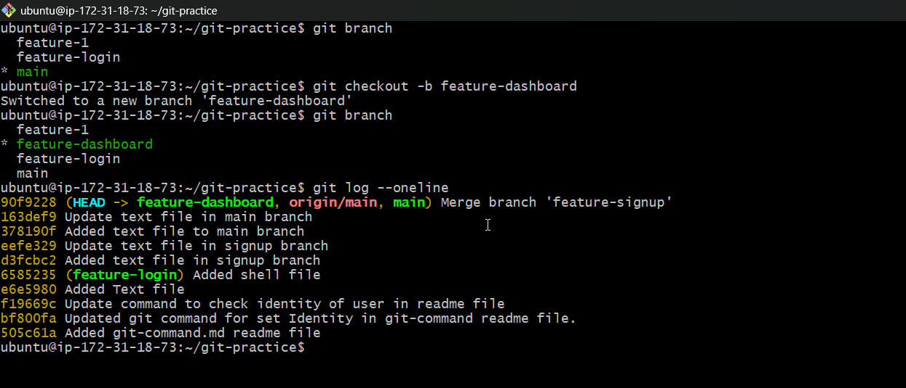
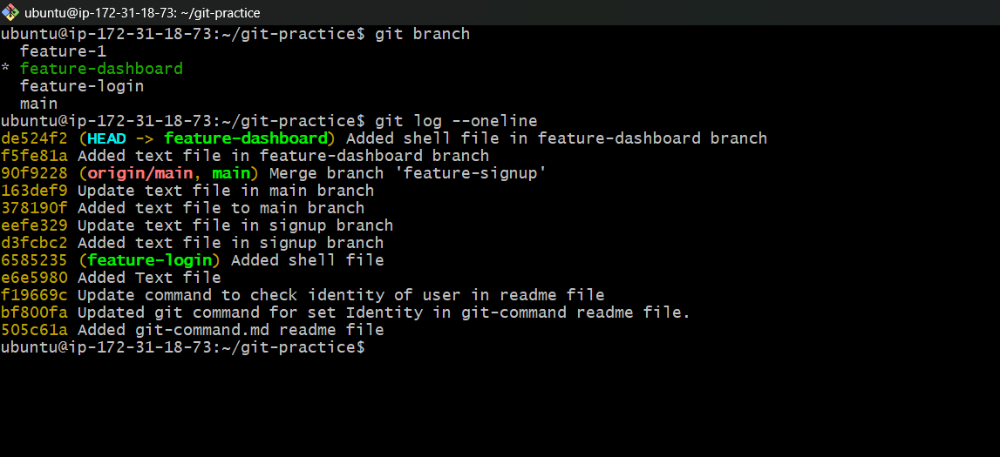  

2. While on `main`, add a new commit (so `main` moves ahead)

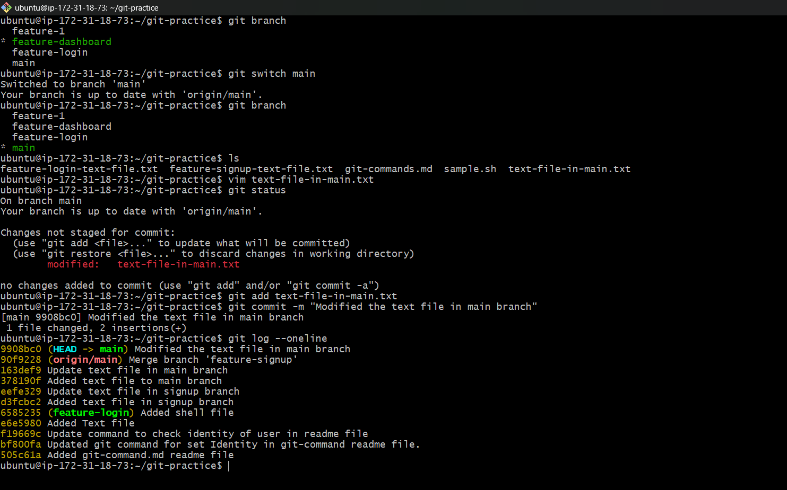

3. Switch to `feature-dashboard` and rebase it onto `main`

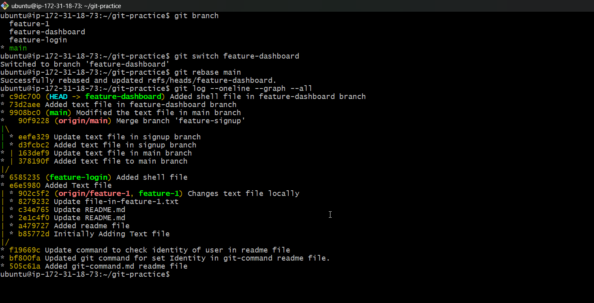

4. Observe your `git log --oneline --graph --all` — how does the history look compared to a merge?
5. Answer in your notes:
   - What does rebase actually do to your commits?  
   - How is the history different from a merge?
   - Why should you **never rebase commits that have been pushed and shared** with others?
   - When would you use rebase vs merge?

---

### Task 3: Squash Commit vs Merge Commit
1. Create a branch `feature-profile`, add 4-5 small commits (typo fix, formatting, etc.)
2. Merge it into `main` using `--squash` — what happens?
3. Check `git log` — how many commits were added to `main`?

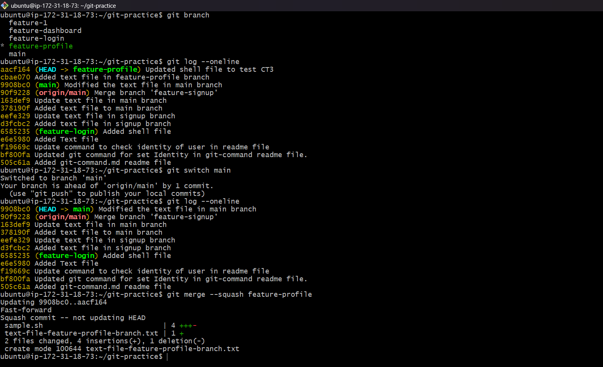

4. Now create another branch `feature-settings`, add a few commits
5. Merge it into `main` **without** `--squash` (regular merge) — compare the history
   
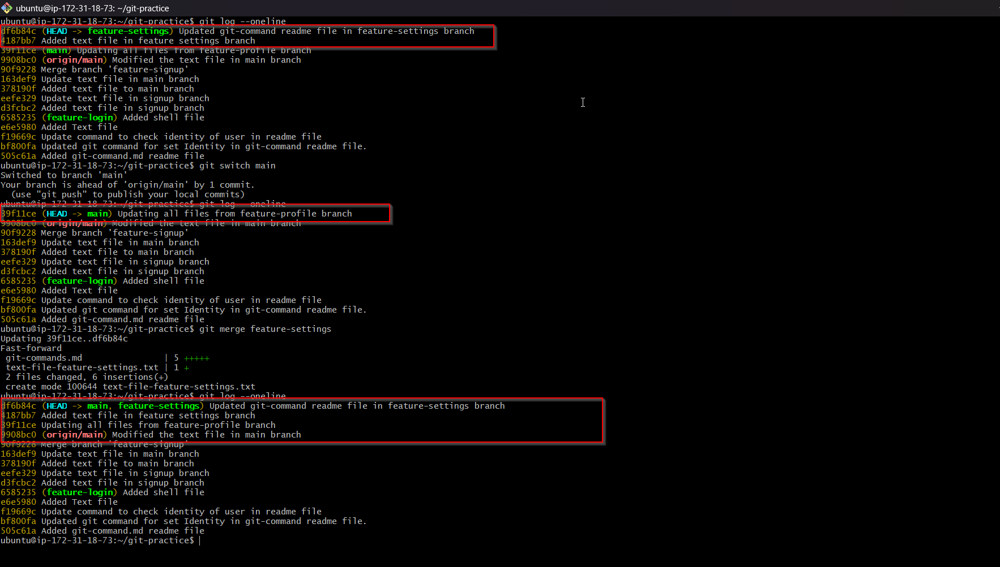

1. Answer in your notes:
   - What does squash merging do?
    Answer: It merge all the commit without adding the commit of merged branch.

   - When would you use squash merge vs regular merge?
    Answer: Squash merge we use when there are many commit in another branch and you don't want to put all those commit in main branch.
    Regular Merge: When you wanted to keep the merge history from all the branch.
   - What is the trade-off of squashing?

---

### Task 4: Git Stash — Hands-On
1. Start making changes to a file but **do not commit**
2. Now imagine you need to urgently switch to another branch — try switching. What happens?
3. Use `git stash` to save your work-in-progress
4. Switch to another branch, do some work, switch back
5. Apply your stashed changes using `git stash pop`
6. Try stashing multiple times and list all stashes
7. Try applying a specific stash from the list
8. Answer in your notes:
   - What is the difference between `git stash pop` and `git stash apply`?
   - When would you use stash in a real-world workflow?

---

### Task 5: Cherry Picking
1. Create a branch `feature-hotfix`, make 3 commits with different changes
2. Switch to `main`
3. Cherry-pick **only the second commit** from `feature-hotfix` onto `main`
4. Verify with `git log` that only that one commit was applied
   
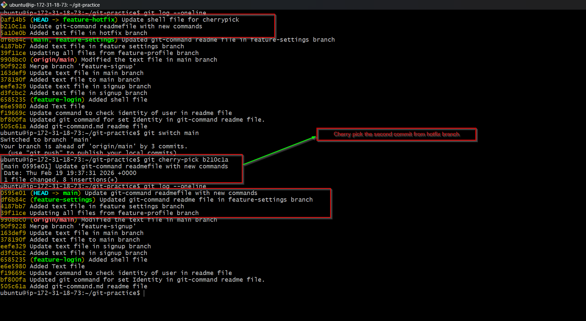

5. Answer in your notes:
   - What does cherry-pick do?
   - When would you use cherry-pick in a real project?
   - What can go wrong with cherry-picking?

---

## Hints
- Visualize history: `git log --oneline --graph --all`
- To intentionally create a merge conflict: edit the **same line** of the **same file** on two branches
- Stash with a message: `git stash push -m "description"`
- Cherry-pick needs a commit hash — find it with `git log --oneline`

---