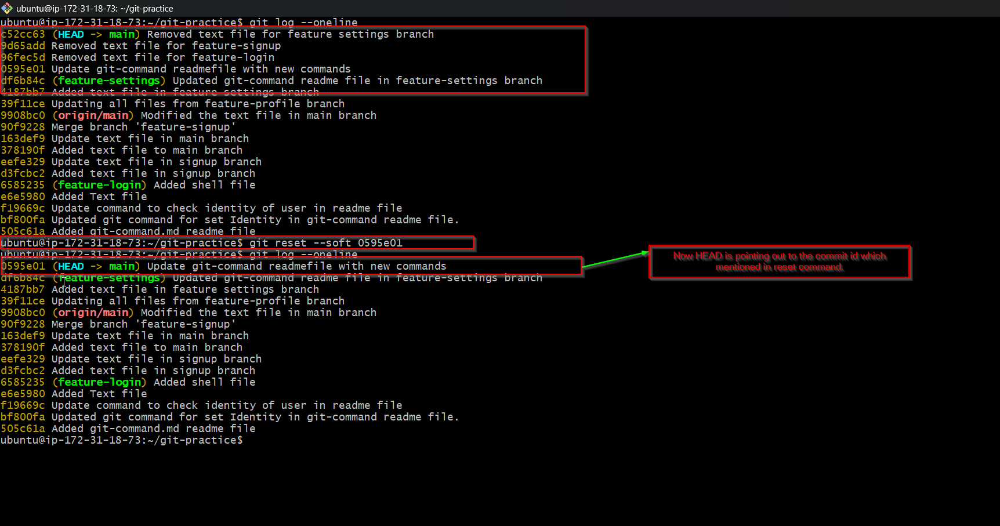
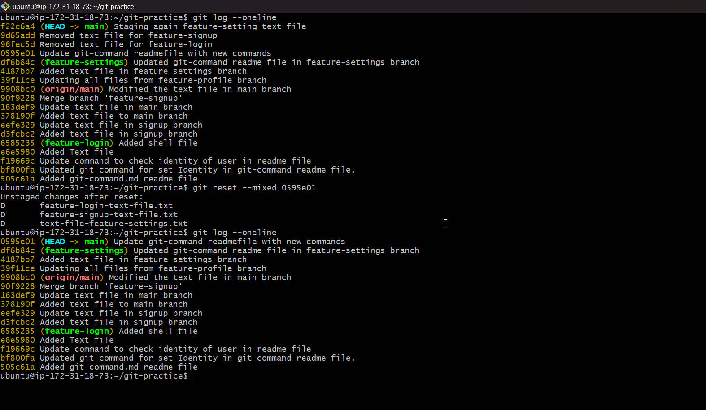
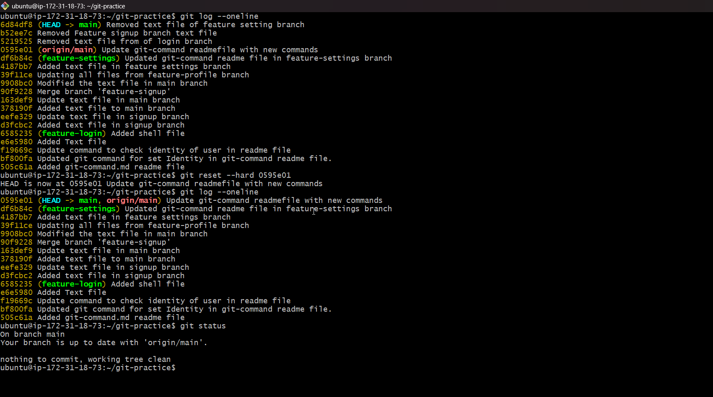
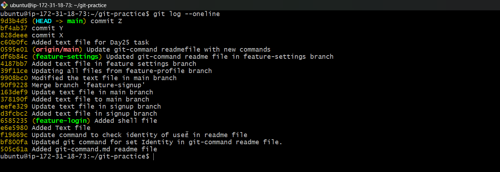
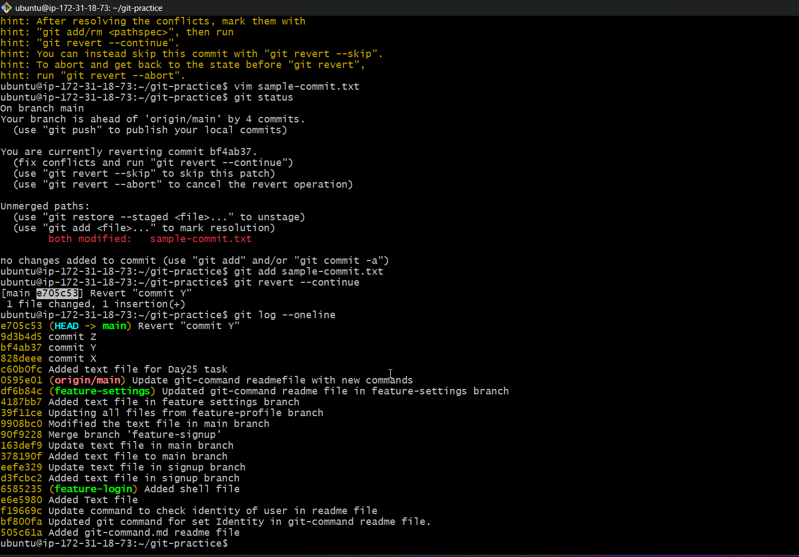

# Day 25 – Git Reset vs Revert & Branching Strategies

## Task

You'll learn how to **undo mistakes** safely — one of the most important skills in Git. You'll also explore **branching strategies** used by real engineering teams to manage code at scale.

---

## Expected Output
- A markdown file: `day-25-notes.md` with your observations and answers
- Continue updating `git-commands.md` in your `devops-git-practice` repo

---

## Challenge Tasks

### Task 1: Git Reset — Hands-On
1. Make 3 commits in your practice repo (commit A, B, C)
2. Use `git reset --soft` to go back one commit — what happens to the changes?



 1. Commit is undone
 2. Staged changes are staged.

3. Re-commit, then use `git reset --mixed` to go back one commit — what happens now?
   


 1. Commit is undone
 2. Staged changes go back to unstaged

4. Re-commit, then use `git reset --hard` to go back one commit — what happens this time?



   1. Commit is undone
   2. Staged changes gone

5. Answer in your notes:
   - What is the difference between `--soft`, `--mixed`, and `--hard`?
  
    | Topic   | Commit | Staged Changes | File Changes |
    | ------- | ------ | -------------- | ------------ |
    | --soft  | undone | Kept           | Kept         |
    | --mixed | undone | Unstaged       | Kept         |
    | --hard  | undone | Gone           | Gone         |

   - Which one is destructive and why?
      - Answer: --hard is destructive because it delete the your uncommited work permanentally.
   - When would you use each one?
      - Answer:<br>
        --soft: When you committed too early and wanted to recommit differently.<br>
        --mixed: When you staged the wrong file and want to start over.<br>
        --hard: When you want completly throw away all your changes.<br>

   - Should you ever use `git reset` on commits that are already pushed?
      - Answer: Ideally not because whatever you pushed to github other team mates might have pulled the changes.

---

### Task 2: Git Revert — Hands-On
1. Make 3 commits (commit X, Y, Z)



2. Revert commit Y (the middle one) — what happens?
   **What happned:** It says conflict in sample-commit.txt file because one more commit also made after commit Y.
    ubuntu@ip-172-31-18-73:~/git-practice$ git revert bf4ab37
    Auto-merging sample-commit.txt
    CONFLICT (content): Merge conflict in sample-commit.txt
    error: could not revert bf4ab37... commit Y
    hint: After resolving the conflicts, mark them with
    hint: "git add/rm <pathspec>", then run
    hint: "git revert --continue".
    hint: You can instead skip this commit with "git revert --skip".
    hint: To abort and get back to the state before "git revert",
    hint: run "git revert --abort".

    **What I have Done:** Resolve conflict and run **git add sample-commit.txt** and the **git revert --continue**

3. Check `git log` — is commit Y still in the history?
   
   Answer: Yes commit Y is still there in history

   

4. Answer in your notes:
   - How is `git revert` different from `git reset`?<br>
     - Answer:<br> 
       git revert- adds a new commit that undo the changes, it prevent the history.<br>
       git reset- it erase the commit from history.

   - Why is revert considered **safer** than reset for shared branches?
     - Answer: Because git revert never rewrite history, it add a commit on top of it.
  
   - When would you use revert vs reset?
     - Answer:<br>
       git revert - when your changes already pushed then you always use **git revert** <br>
       git reset -  when your changes are on local only then you use **git reset**<br>

---

### Task 3: Reset vs Revert — Summary
Create a comparison in your notes:

|                                  | `git reset`                       | `git revert`                      |
| -------------------------------- | --------------------------------- | --------------------------------- |
| What it does                     | Deletes/moves back commit history | Adds a new commit to undo changes |
| Removes commit from history?     | Yes                               | No                                |
| Safe for shared/pushed branches? | No                                | Yes                               |
| When to use                      | When commits are on local         | when commit already pushed        |

---

### Task 4: Branching Strategies
Research the following branching strategies and document each in your notes with:
- How it works (short description)
- A simple diagram or flow (text-based is fine)
- When/where it's used
- Pros and cons

1. **GitFlow** — develop, feature, release, hotfix branches
2. **GitHub Flow** — simple, single main branch + feature branches
3. **Trunk-Based Development** — everyone commits to main, short-lived branches
4. Answer:
   - Which strategy would you use for a startup shipping fast?
   - Which strategy would you use for a large team with scheduled releases?
   - Which one does your favorite open-source project use? (check any repo on GitHub)
    

    ## 1. GitFlow
    **How it works:** Uses two permanent branches (main and develop) plus
    short-lived feature, release, and hotfix branches.

    **Flow:**
    ```
    main:     ──●──────────────●──
                 \             /
    develop:  ────●──●──●──●──●──
                   \          /
    feature:        ●──●──●──●
    ```
    **When to use:** Large teams with scheduled releases.

    **Pros:** Clear structure, supports parallel development.  
    **Cons:** Complex, slow feedback loop.

    ---

    ## 2. GitHub Flow
    **How it works:** Just main + short-lived feature branches.
    Open a PR, get reviewed, merge to main.

    **Flow:**
    ```
    main:       ──●────────────●──
                   \          /
    feature-x:      ●──●──●──●
    ```
    **When to use:** Startups, web apps, continuous deployment.

    **Pros:** Simple and fast.  
    **Cons:** Needs solid CI/CD, risky without tests.

    ---

    ## 3. Trunk-Based Development
    **How it works:** Everyone commits directly to main.
    Branches live for hours or 1-2 days max.

    **Flow:**
    ```
    main: ──●──●──●──●──●──●──
    ```

    **When to use:** High-performing teams with strong automation.

    **Pros:** Fastest feedback loop, no merge conflicts.  
    **Cons:** Requires discipline and test coverage.

---

### Task 5: Git Commands Reference Update
Update your `git-commands.md` to cover everything from Days 22–25:
- Setup & Config
- Basic Workflow (add, commit, status, log, diff)
- Branching (branch, checkout, switch)
- Remote (push, pull, fetch, clone, fork)
- Merging & Rebasing
- Stash & Cherry Pick
- Reset & Revert

---

## Hints
- `git reflog` is your safety net — it shows everything Git has done, even after a hard reset
- For branching strategies, look at how projects like Kubernetes, React, or Linux kernel manage branches

---
