# Day 26 – GitHub CLI: Manage GitHub from Your Terminal

## Task

Every time you switch to the browser to create a PR, check an issue, or manage a repo — you lose context. The **GitHub CLI (`gh`)** lets you do all of that without leaving your terminal. For DevOps engineers, this is essential — especially when you start automating workflows, scripting PR reviews, and managing repos at scale.

---

## Expected Output
- A markdown file: `day-26-notes.md` with your observations and answers
- Add `gh` commands to your `git-commands.md`

---

## Challenge Tasks

### Task 1: Install and Authenticate
1. Install the GitHub CLI on your machine
    
    ```
    sudo apt update

    sudo apt install gh -y

    gh --version 

    ```

2. Authenticate with your GitHub account

    **Steps:**
      1. **Copy the code** it shows you
      2. Press **Enter** — it will open `github.com/login/device` in your browser
      3. **Paste the code** in the browser
      4. Click **Authorize GitHub CLI**
      5. Done!
   
    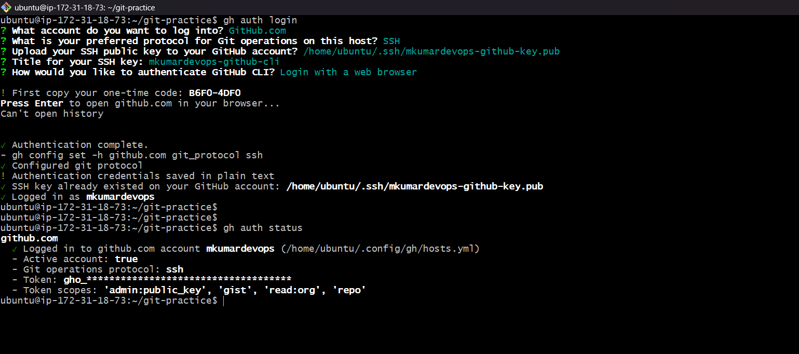

3. Verify you're logged in and check which account is active
4. Answer in your notes: What authentication methods does `gh` support?
    Web browser or personal access token

---

### Task 2: Working with Repositories
1. Create a **new GitHub repo** directly from the terminal — make it public with a README
    
        gh repo create test-cli --public --clone --add-README

    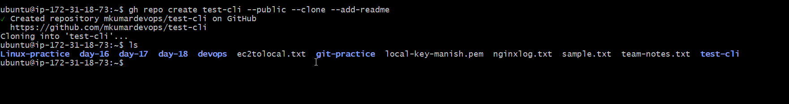

2. Clone a repo using `gh` instead of `git clone`

        gh repo clone <username>/<reponame>


3. View details of one of your repos from the terminal

        gh repo view <username>/<reponame>

   

4. List all your repositories

        gh repo list

   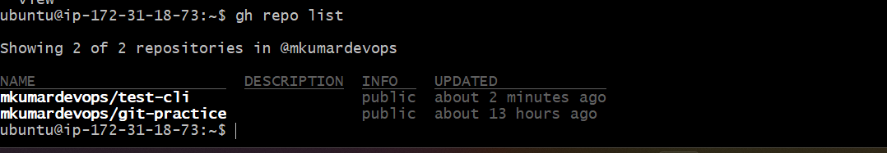

5. Open a repo in your browser directly from the terminal
   
6. Delete the test repo you created (be careful!)
   
        gh repo delete <username>/<reponame>

   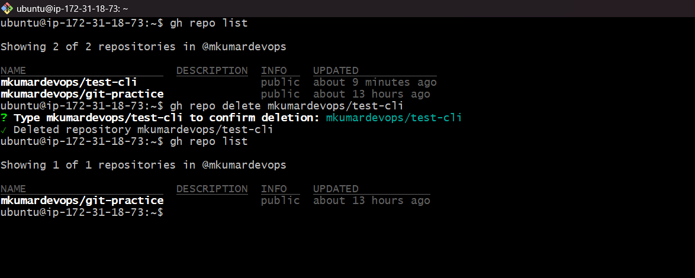

---

### Task 3: Issues
1. Create an issue on one of your repos from the terminal — give it a title, body, and a label
   
        gh issue create \
        --label "bug"\
        --title "Issue created via CLI"\
        --body "This issue created via CLI for Learning purpose"
    
    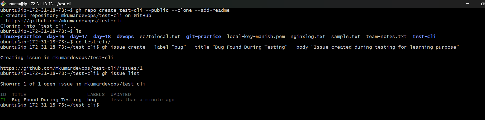

2. List all open issues on that repo
   
        gh issue list --state "open"

    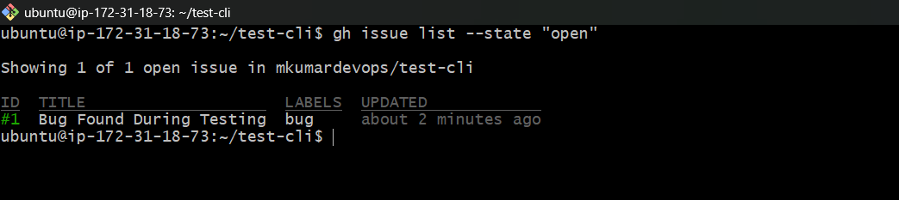

3. View a specific issue by its numbers
4. Close an issue from the terminal
   
        gh issue close 1

        gh issue list --state "closed"

    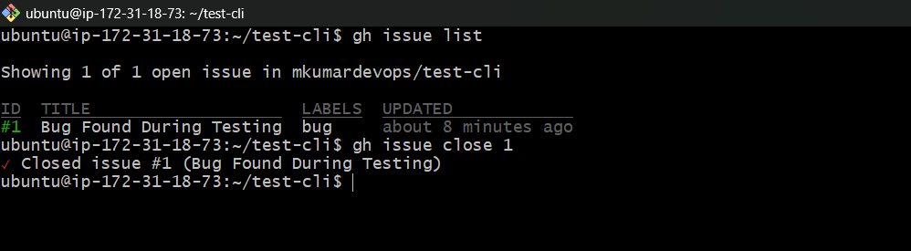

    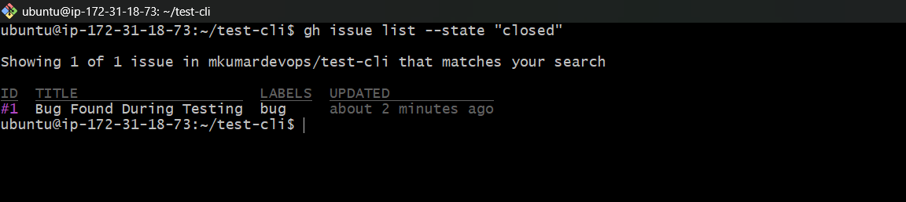

5. Answer in your notes: How could you use `gh issue` in a script or automation?
   
---

### Task 4: Pull Requests
1. Create a branch, make a change, push it, and create a **pull request** entirely from the terminal
   
        git checkout -b feature-cli

        echo "File created in feature-cli branch" >> feature-branch.txt

        git add feature-branch.txt

        git commit -m "Added text file"

        git push origin feature-cli

    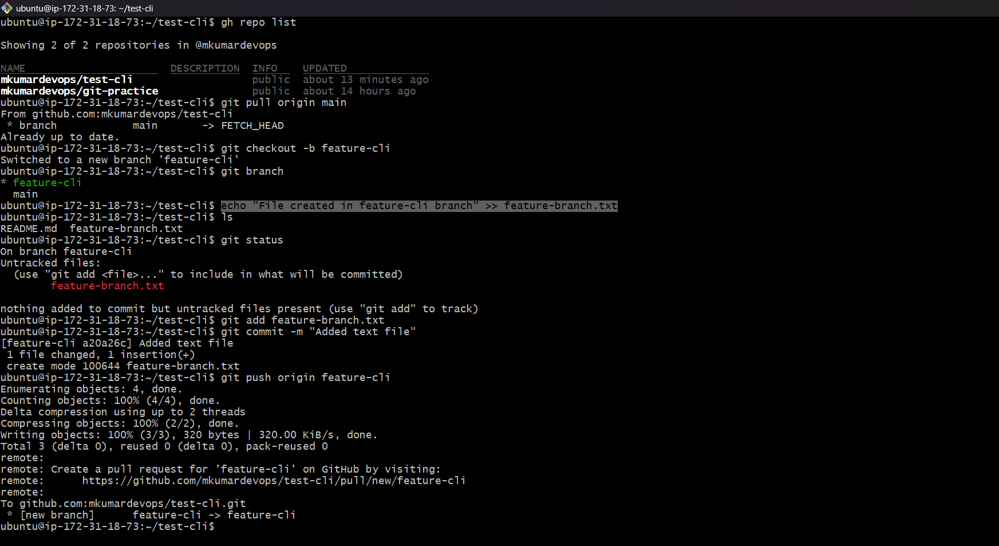

    Creating Pull request via CLI

        gh pr create --title "Added text file in feature branch" --body "This PR add the text file"
    
    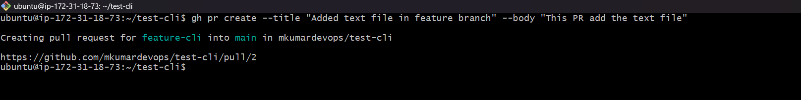

2. List all open PRs on a repo

        gh pr list

    

3. View the details of your PR — check its status, reviewers, and checks

        gh pr status
    
    
    
4. Merge your PR from the terminal
   
        gh pr merge <PR_number>
    
    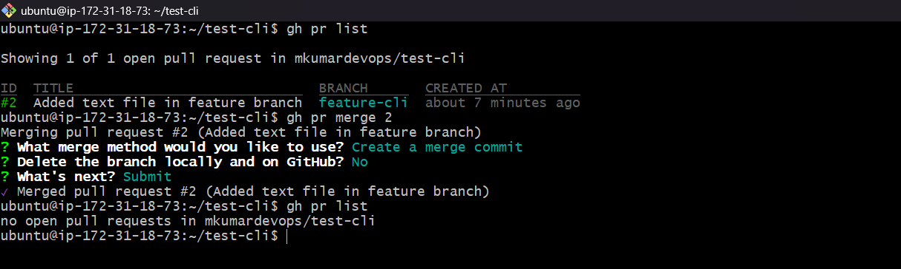

5. Answer in your notes:
   - What merge methods does `gh pr merge` support?
     - Create a merge commit 
     - Rebase and merge
     - Squash and merge
  
    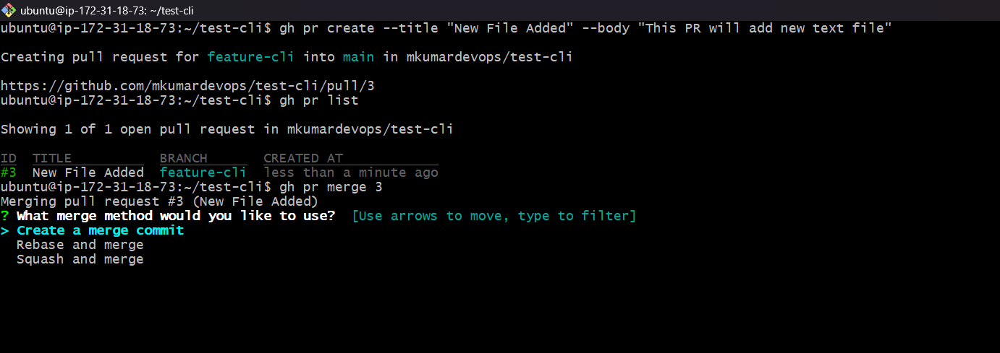

   - How would you review someone else's PR using `gh`?
     - gh pr review "pr_number"

---

### Task 5: GitHub Actions & Workflows (Preview)
1. List the workflow runs on any public repo that uses GitHub Actions
2. View the status of a specific workflow run
3. Answer in your notes: How could `gh run` and `gh workflow` be useful in a CI/CD pipeline?

(Don't worry if you haven't learned GitHub Actions yet — this is a preview for upcoming days)

---

### Task 6: Useful `gh` Tricks
Explore and try these — add the ones you find useful to your `git-commands.md`:
1. `gh api` — make raw GitHub API calls from the terminal
2. `gh gist` — create and manage GitHub Gists
3. `gh release` — create and manage releases
4. `gh alias` — create shortcuts for commands you use often
5. `gh search repos` — search GitHub repos from the terminal

---

## Hints
- `gh help` and `gh <command> --help` are your best friends
- Most `gh` commands work with `--repo owner/repo` to target a specific repo
- Use `--json` flag with most commands to get machine-readable output (useful for scripting)
- `gh pr create --fill` auto-fills the PR title and body from your commits

---