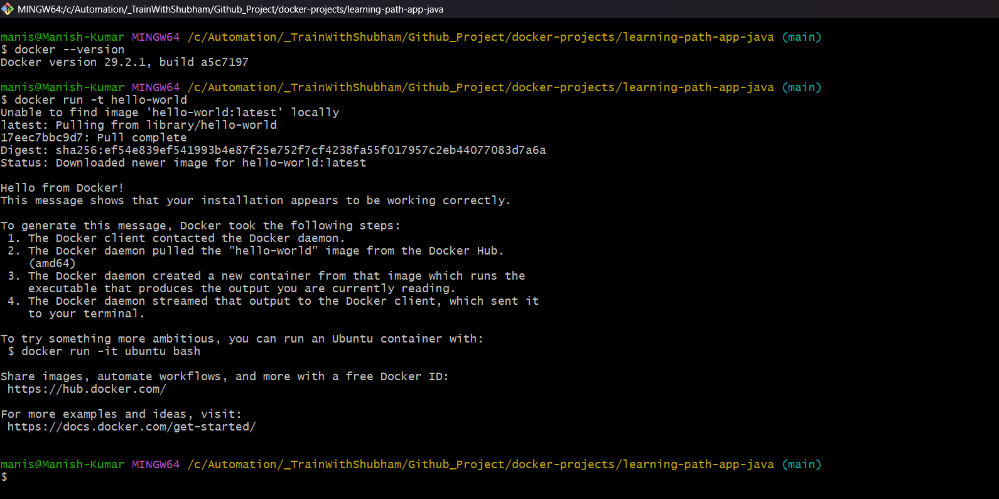
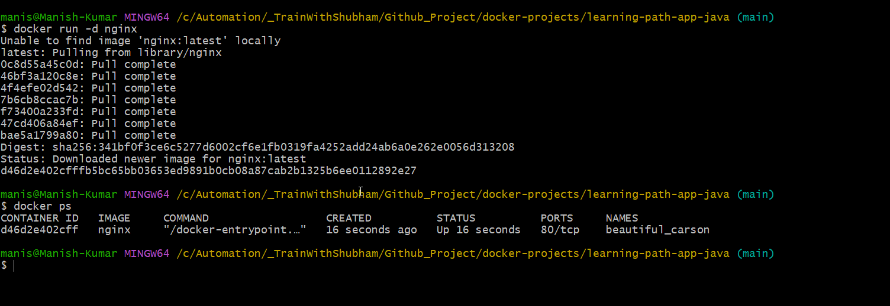
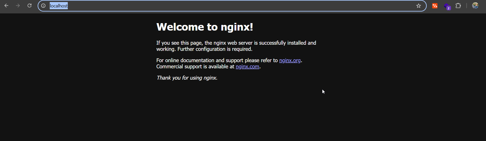
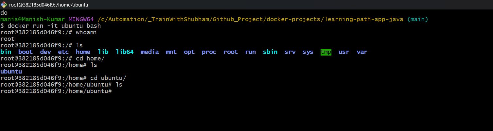
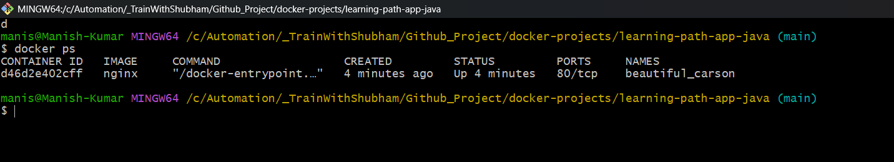
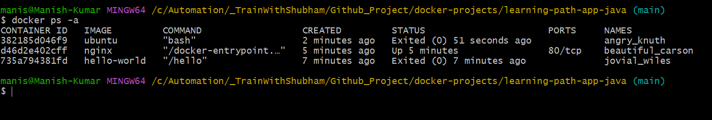
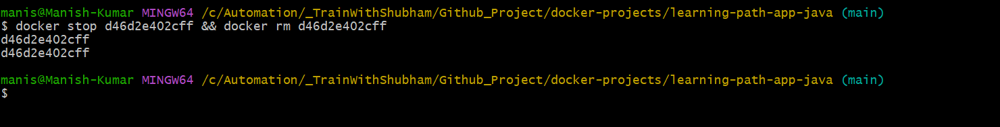
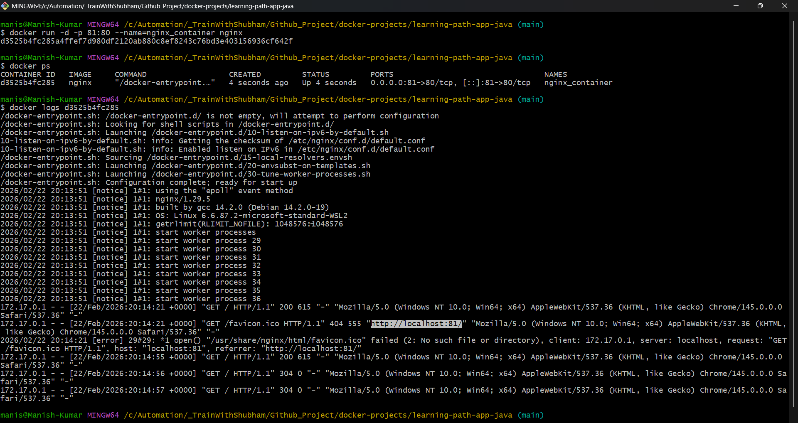
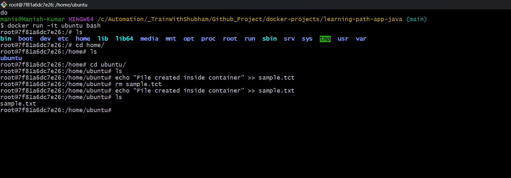

# Day 29 – Introduction to Docker

## Task
Today's goal is to **understand what Docker is and run your first container**.

You will:
- Learn why containers exist and how they differ from VMs
- Install Docker on your machine
- Run and explore containers from Docker Hub

---

## Challenge Tasks

### Task 1: What is Docker?
Research and write short notes on:
- What is a container and why do we need them?
  - A Docker container is a lightweight, standalone, executable package that bundles application code with all its dependencies (libraries, runtime, system tools) to ensure consistent, isolated, and fast execution across any environment, from a developer’s laptop to production servers.
  - We need docker container:
    - Consistency Across Environments (Portability).
    - Efficiency & Lightweight 
    - Isolation & Security 
    - Rapid Deployment and Scalling 
- Containers vs Virtual Machines — what's the real difference?
- What is the Docker architecture? (daemon, client, images, containers, registry)

Draw or describe the Docker architecture in your own words.

---

### Task 2: Install Docker
1. Install Docker on your machine (or use a cloud instance)
2. Verify the installation
3. Run the `hello-world` container
4. Read the output carefully — it explains what just happened

    
---

### Task 3: Run Real Containers
1. Run an **Nginx** container and access it in your browser

        docker run -d nginx

        http://localhost:80

    
    

2. Run an **Ubuntu** container in interactive mode — explore it like a mini Linux machine
   
        docker  run -it ubuntu bash
    
    

3. List all running containers
   
        docker ps
    
    

4. List all containers (including stopped ones)

        docker ps -a

    

5. Stop and remove a container

        docker stop <container_id> && docker rm <cotainer_id>

    

---

### Task 4: Explore
1. Run a container in **detached mode** — what's different?
2. Give a container a custom **name**
3. Map a **port** from the container to your host

        docker run -d -p 81:80 --name=nginx_container nginx

4. Check **logs** of a running container

        docker logs <container_id>

   

5. Run a command **inside** a running container
    
        docker run -it ubuntu bash
    
    

---

## Hints
- `docker run`, `docker ps`, `docker stop`, `docker rm`
- Interactive mode: `-it` flag
- Detached mode: `-d` flag
- Port mapping: `-p host:container`
- Naming: `--name`
- Logs: `docker logs`
- Exec into container: `docker exec`

---

## Why This Matters for DevOps
Docker is the foundation of modern deployment. Every CI/CD pipeline, Kubernetes cluster, and microservice architecture starts with containers. Today you took the first step.

---

## Submission
1. Add your `day-29-docker-basics.md` to `2026/day-29/`
2. Commit and push to your fork

---

## Learn in Public
Share your first Docker container screenshot on LinkedIn.

`#90DaysOfDevOps` `#DevOpsKaJosh` `#TrainWithShubham`

Happy Learning!
**TrainWithShubham**
