# Day 30 – Docker Images & Container Lifecycle

## Task
Today's goal is to **understand how images and containers actually work**.

You will:
- Learn the relationship between images and containers
- Understand image layers and caching
- Master the full container lifecycle

---

## Expected Output
- A markdown file: `day-30-images.md`
- Screenshots of key commands

---

## Challenge Tasks

### Task 1: Docker Images
1. Pull the `nginx`, `ubuntu`, and `alpine` images from Docker Hub
   
        docker pull nginx

        docker pull ubuntu

        docker pull alpine

2. List all images on your machine — note the sizes
   
    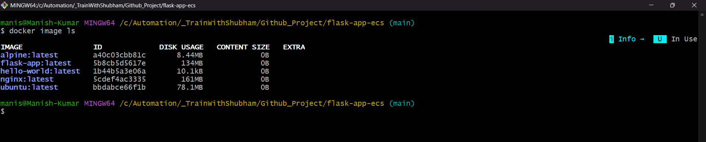

3. Compare `ubuntu` vs `alpine` — why is one much smaller?
4. Inspect an image — what information can you see?
    
        docker inspect image <Image_id>

    Note: Using the inspect command for image you can see the labels and envionment varibale configured for docker image.

5. Remove an image you no longer need
   
        docker rmi <Image_ID>

    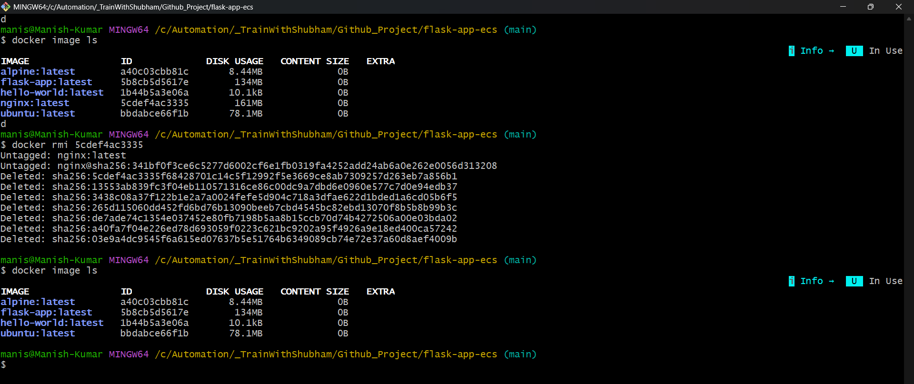
---

### Task 2: Image Layers
1. Run `docker image history nginx` — what do you see?
   
    You will see the history of image layer by layer.
    1. What command created each layer
    2. when it was created 
    3. how big each layer is
    4. Whether it added actual data or is metadata only

2. Each line is a **layer**. Note how some layers show sizes and some show 0B
3. Write in your notes: What are layers and why does Docker use them?

  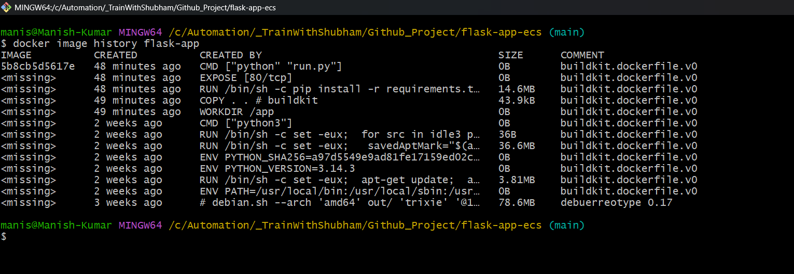
---

### Task 3: Container Lifecycle
Practice the full lifecycle on one container:
1. **Create** a container (without starting it)
    
        docker create <Image_id>
    
    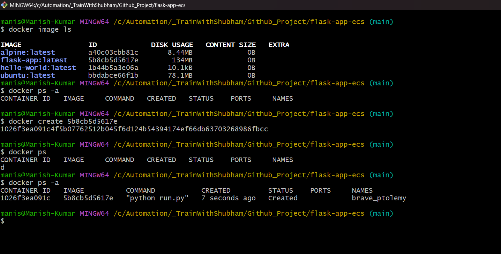

2. **Start** the container
   
        docker start <container_id>
    
    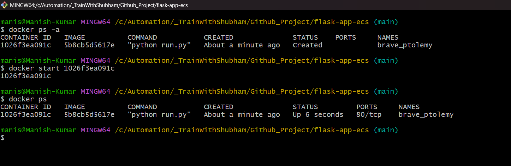

3. **Pause** it and check status
    
        docke pause <container_id>
    
    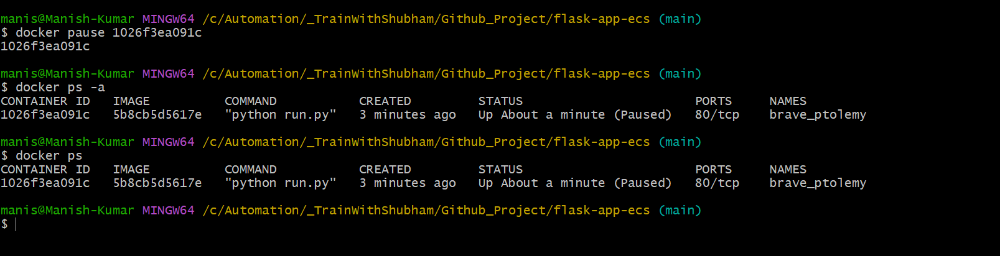

4. **Unpause** it
    
        docker unpause <container_id>
    
    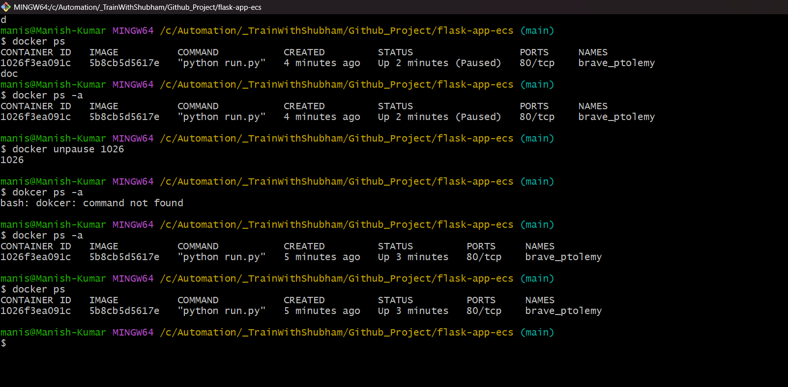

5. **Stop** it
    
        docker stop <container_id>
    
    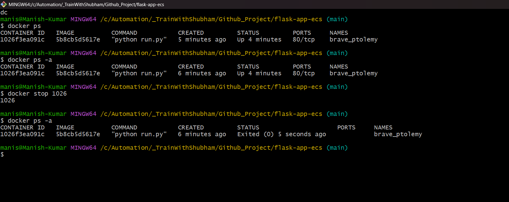

6. **Restart** it
    
        docker restart <container_id>
    
    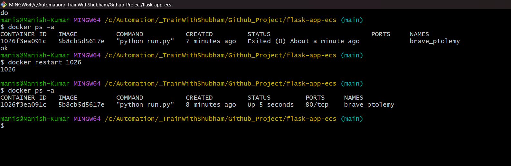

7. **Kill** it
   
        docker kill <container_id>
    
    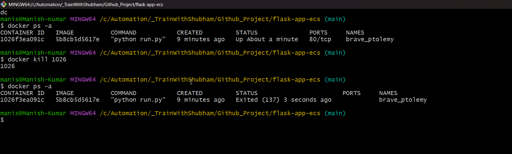

8. **Remove** it

        docker rm <container_id>
    
    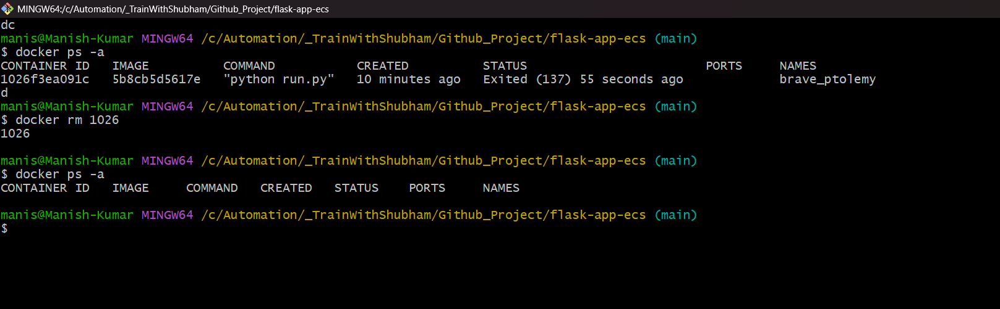

Check `docker ps -a` after each step — observe the state changes.

---

### Task 4: Working with Running Containers
1. Run an Nginx container in detached mode
   
        docker run -d nginx

    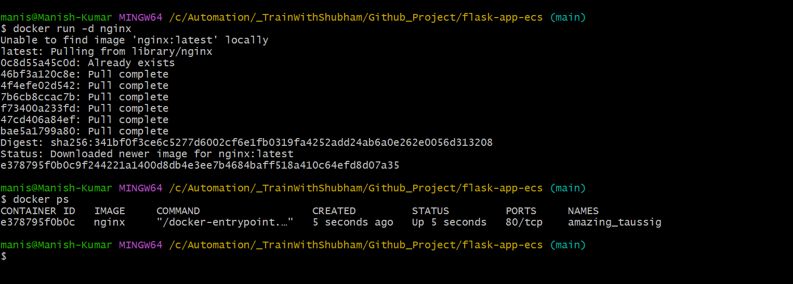

2. View its **logs**

        docker logs <container_id>
    
    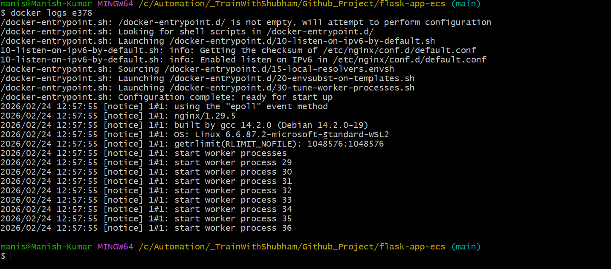

3. View **real-time logs** (follow mode)
   
        docker logs -f <container_id>
    
4. **Exec** into the container and look around the filesystem

        docker exec -it <container_id> bash

        ls

    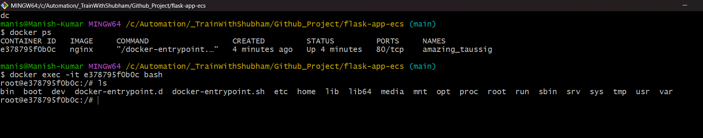

5. Run a single command inside the container without entering it
6. **Inspect** the container — find its IP address, port mappings, and mounts
   
        docker inspect --format='{{json .NetworkSettings.Ports}} && {{json .NetworkSettings.Networks.bridge.IPAddress}} && {{json .Mounts}}' <Container_id>

    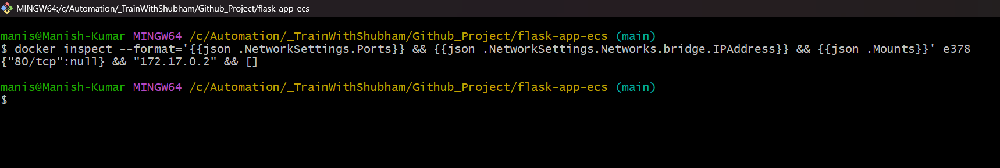

---

### Task 5: Cleanup
1. Stop all running containers in one command
   
        docker stop $(docker ps -q)
    
    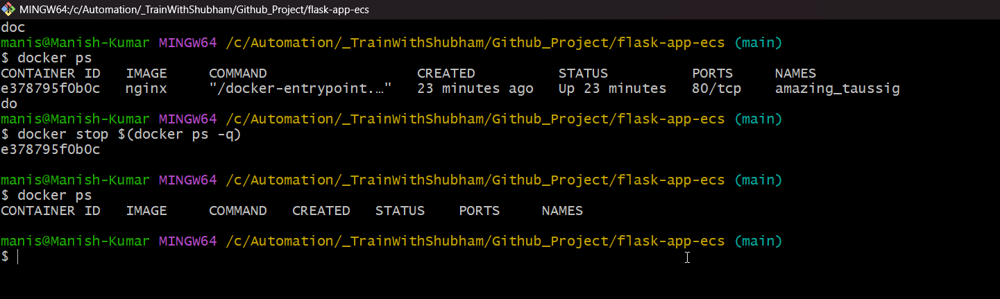

2. Remove all stopped containers in one command

        docker container prune 

    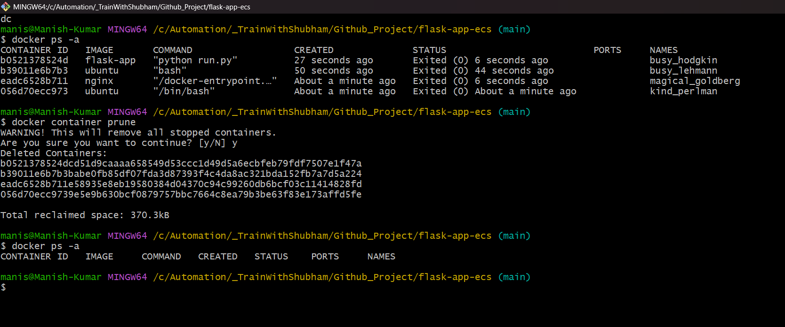

3. Remove unused images
   
        docker rmi <Image_id>
    
    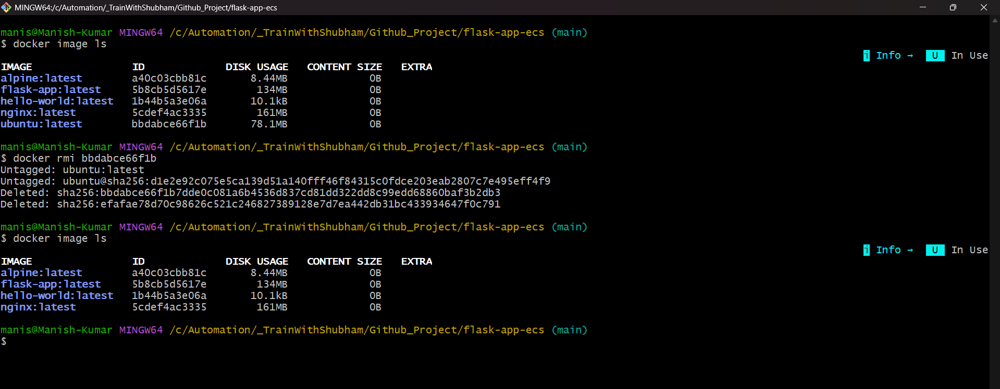

4. Check how much disk space Docker is using
   
        docker system df
    
    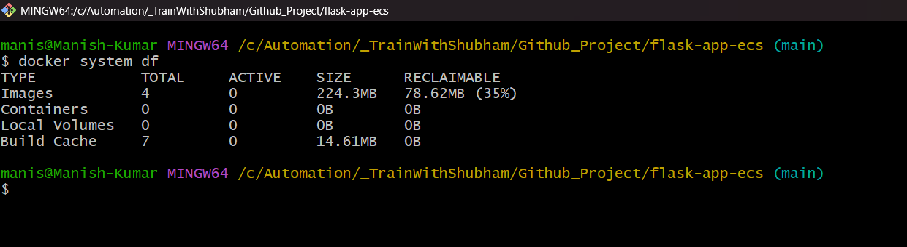

---

## Hints
- Image history: `docker image history`
- Create without starting: `docker create`
- Follow logs: `docker logs -f`
- Inspect: `docker inspect`
- Cleanup: `docker system df`, `docker system prune`

---
