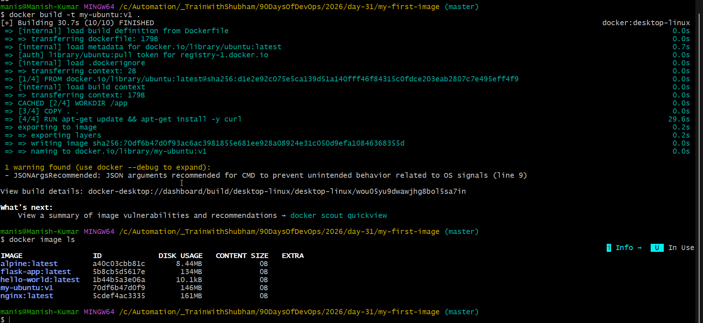
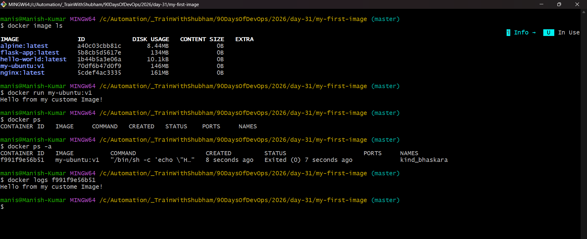
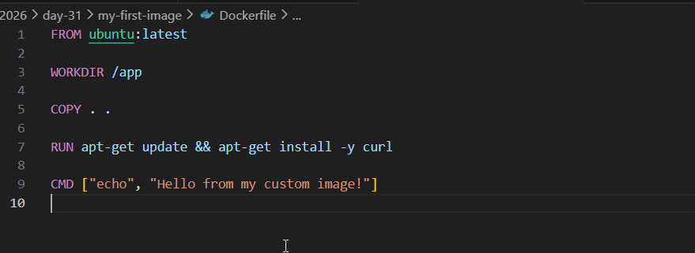
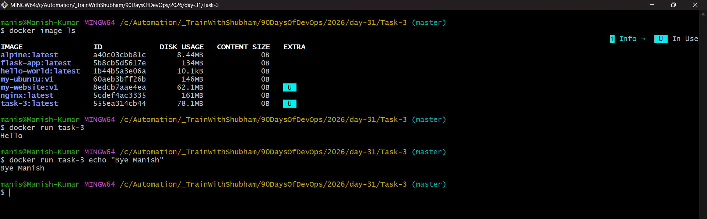
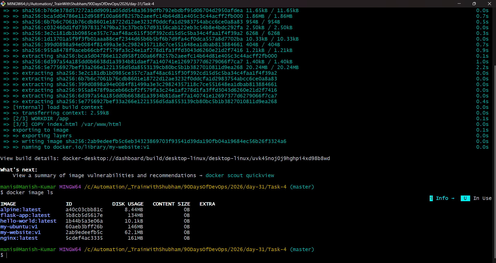
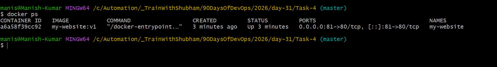

# Day 31 – Dockerfile: Build Your Own Images

## Task
Today's goal is to **write Dockerfiles and build custom images**.

This is the skill that separates someone who uses Docker from someone who actually ships with Docker.

---

## Expected Output
- A markdown file: `day-31-dockerfile.md`
- All Dockerfiles you create

---

## Challenge Tasks

### Task 1: Your First Dockerfile
1. Create a folder called `my-first-image`
2. Inside it, create a `Dockerfile` that:
   - Uses `ubuntu` as the base image
   - Installs `curl`
   - Sets a default command to print `"Hello from my custom image!"`
3. Build the image and tag it `my-ubuntu:v1`
   
   

4. Run a container from your image
   
   

**Verify:** The message prints on `docker run`

---

### Task 2: Dockerfile Instructions
Create a new Dockerfile that uses **all** of these instructions:
- `FROM` — base image
- `RUN` — execute commands during build
- `COPY` — copy files from host to image
- `WORKDIR` — set working directory
- `EXPOSE` — document the port
- `CMD` — default command

Build and run it. Understand what each line does.

   

---

### Task 3: CMD vs ENTRYPOINT
1. Create an image with `CMD ["echo", "hello"]` — run it, then run it with a custom command. What happens?

    
    
2. Create an image with `ENTRYPOINT ["echo"]` — run it, then run it with additional arguments. What happens?
3. Write in your notes: When would you use CMD vs ENTRYPOINT?
   1. CMD : CMD command can easily be overridden, You can easily replce when you run the container

        FROM ubuntu
        CMD ["echo", "Hello"]

        docker run myimage -> output= Hello
        docker run myimage echo "bye" -> output = Bye

   2. ENTRYPOINT: It's a fixed command that will always run, You can only add argumen to it, not replace it.
   
        FROM ubuntu
        ENTRYPOINT ["echo"]

        docker run myimage "Hello"-> output= Hello
        docker run myimage "bye" -> output = Bye

---

### Task 4: Build a Simple Web App Image
1. Create a small static HTML file (`index.html`) with any content
2. Write a Dockerfile that:
   - Uses `nginx:alpine` as base
   - Copies your `index.html` to the Nginx web directory
3. Build and tag it `my-website:v1`

        docker build -t my-website:v1 .
   
   

4. Run it with port mapping and access it in your browser

        docker run -d --name=my-website -p 81:80 my-website:v1

        http://localhost:81/

    
    

---

### Task 5: .dockerignore
1. Create a `.dockerignore` file in one of your project folders
2. Add entries for: `node_modules`, `.git`, `*.md`, `.env`
3. Build the image — verify that ignored files are not included

---

### Task 6: Build Optimization
1. Build an image, then change one line and rebuild — notice how Docker uses **cache**
2. Reorder your Dockerfile so that frequently changing lines come **last**
3. Write in your notes: Why does layer order matter for build speed?

---

## Hints
- Build: `docker build -t name:tag .`
- The `.` at the end is the build context
- `COPY . .` copies everything from host to container
- Nginx serves files from `/usr/share/nginx/html/`

---