# Day 32 – Docker Volumes & Networking

## Task
Today's goal is to **solve two real problems: data persistence and container communication**.

Containers are ephemeral — they lose data when removed. And by default, containers can't easily talk to each other. Today you fix both.

---

## Expected Output
- A markdown file: `day-32-volumes-networking.md`
- Screenshots of your experiments

---

## Challenge Tasks

### Task 1: The Problem
1. Run a Postgres or MySQL container
    
        docker run -d --name mysql-demo -e MYSQL_ROOT_PASSWORD=Test@123 mysql

    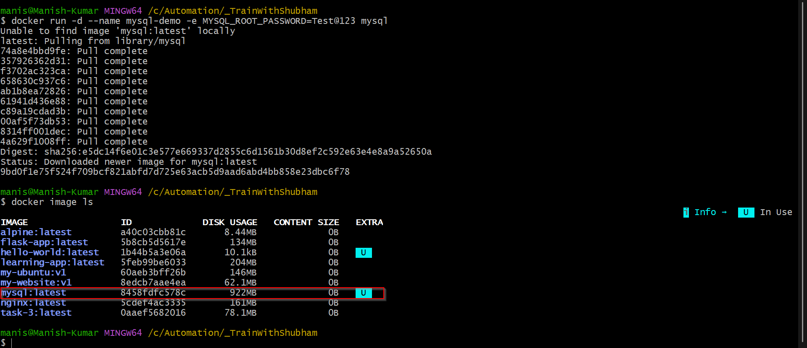

        docker ps 
    
    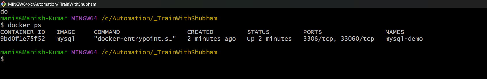

2. Create some data inside it (a table, a few rows — anything)

        docker exec -it <container-id> bash

        mysql -u root -p 
    
    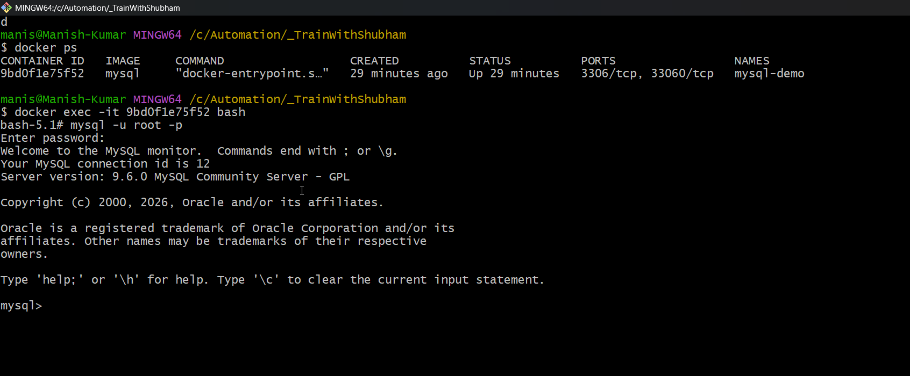

        show databases;

    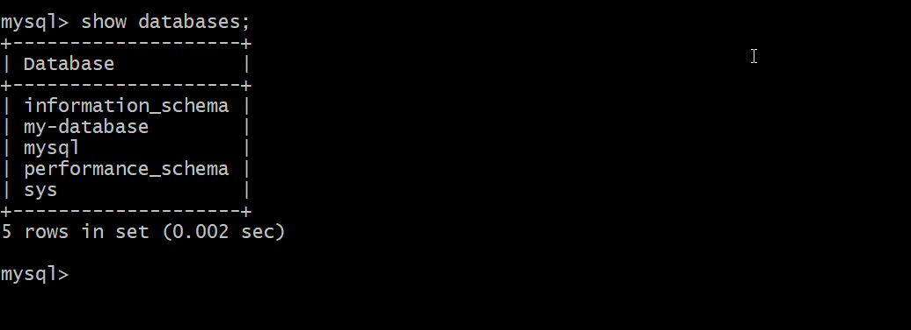

        create database `my-first-database`

        use my-first-database 

        CREATE TABLE Names (LastName varchar(255),FirstName varchar(255));

        INSERT INTO Names (LastName, FirstName) VALUES ('Kumar','Manish');

    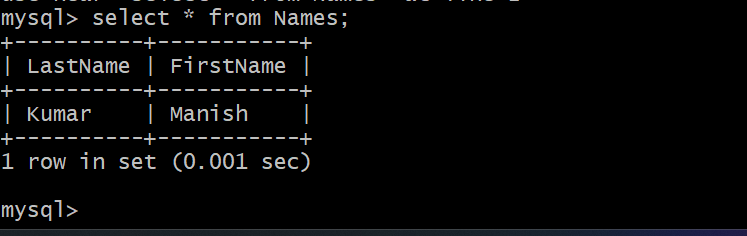

3. Stop and remove the container
   
        docker stop <container-id> && docker rm <container-id>

    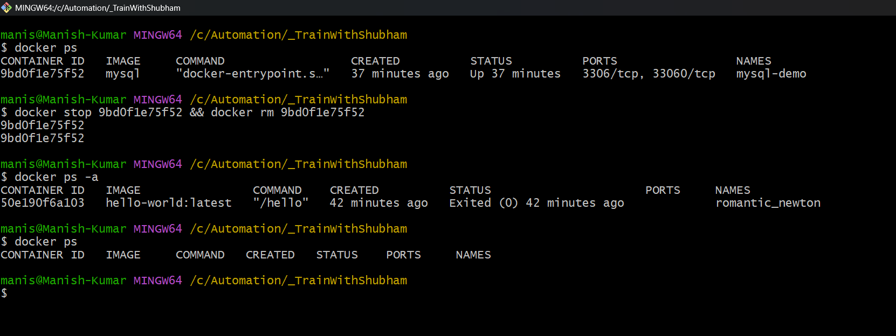

4. Run a new one — is your data still there?
    
    No after deleting the container I have lost all my data which created in step 2.

    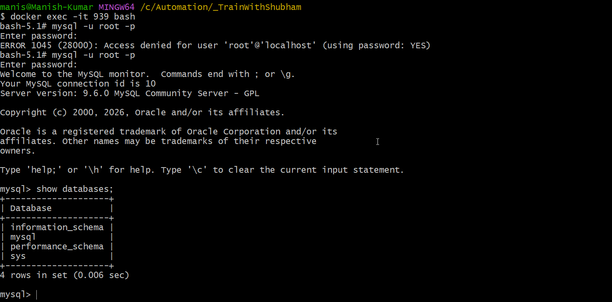

Write what happened and why.

---

### Task 2: Named Volumes
1. Create a named volume

        docker volume create my-sql-data

        docker volume ls
    
    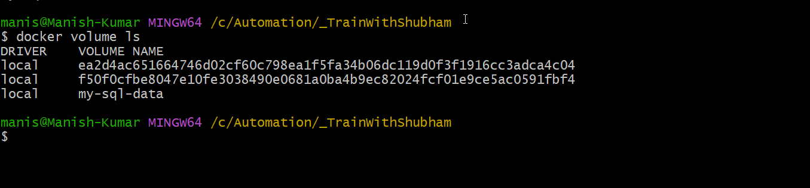

2. Run the same database container, but this time **attach the volume** to it
   
        docker run -d --name mysql-container -v my-sql-data:/var/lib/mysql -e MYSQL_ROOT_PASSWORD=Test@123 mysql

        docker ps

    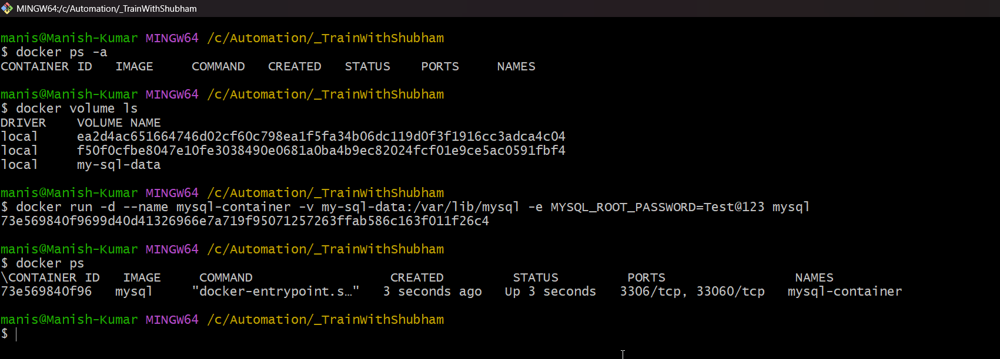

3. Add some data, stop and remove the container
   
    Create a database and inside that create one table and inserted one record.

    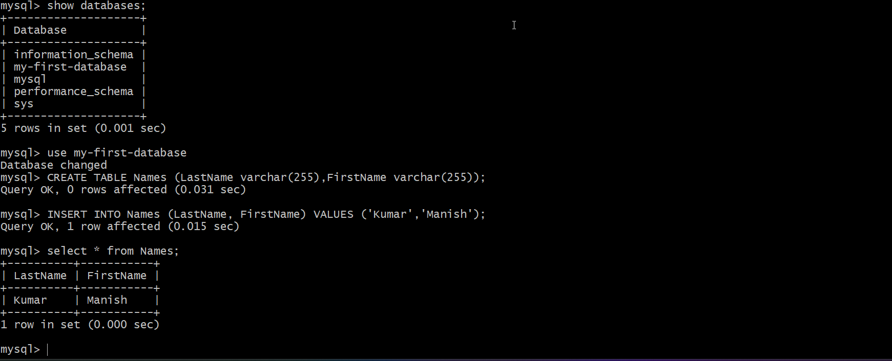

    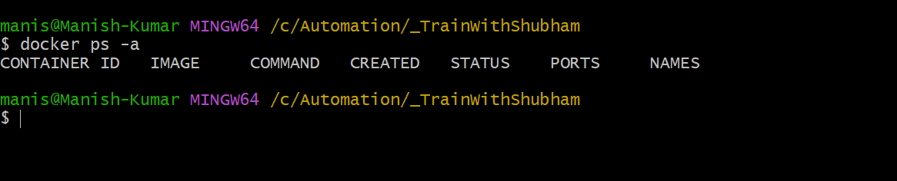

4. Run a brand new container with the **same volume**
   
        docker run -d --name mysql-container -v my-sql-data:/var/lib/mysql -e MYSQL_ROOT_PASSWORD=Test@123 mysql
    
    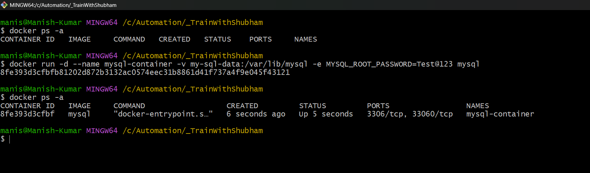

5. Is the data still there? 

        docker exec -it <container-id> bash
    
    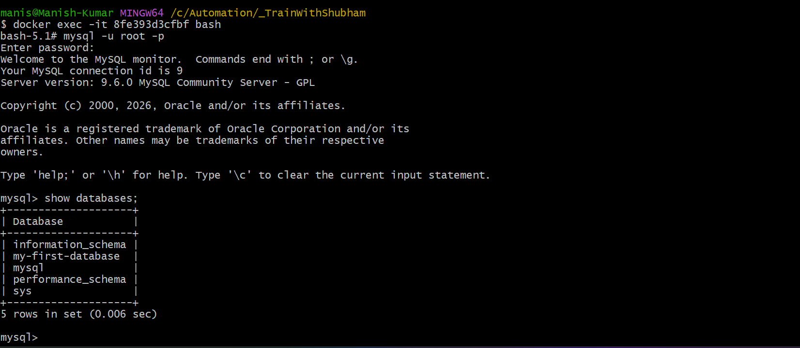

**Verify:** `docker volume ls`, `docker volume inspect`

---

### Task 3: Bind Mounts
1. Create a folder on your host machine with an `index.html` file

        mkdir bind-mounts

        create index.html file inside the folder

2. Run an Nginx container and **bind mount** your folder to the Nginx web directory
   
        docker run -d --name nginx-bindmount -p 8080:80 -v C:/Automation/_TrainWithShubham/90DaysOfDevOps/2026/day-32/bind-mounts:/usr/share/nginx/html nginx
    
    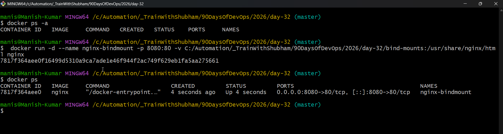

3. Access the page in your browser

        http://localhost:8080/
    
    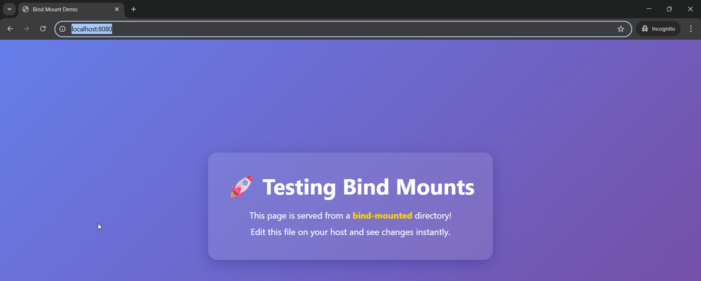

4. Edit the `index.html` on your host — refresh the browser

        Note: Added one h2 in index.html

    

Write in your notes: What is the difference between a named volume and a bind mount?
Answer: Both are used to persist data outside containers.<br>
<p>Bind Mount: A bind mount link a specific  folder from you local computer to container.</p>
<p>Named Volume: Named volume manage by docker .</p>
---

### Task 4: Docker Networking Basics
1. List all Docker networks on your machine

        docker network ls
    
    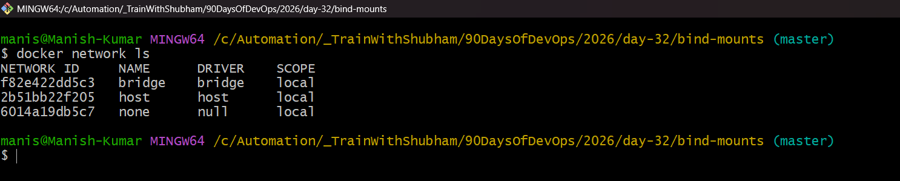

2. Inspect the default `bridge` network

        docker inpect <network-id>
        
    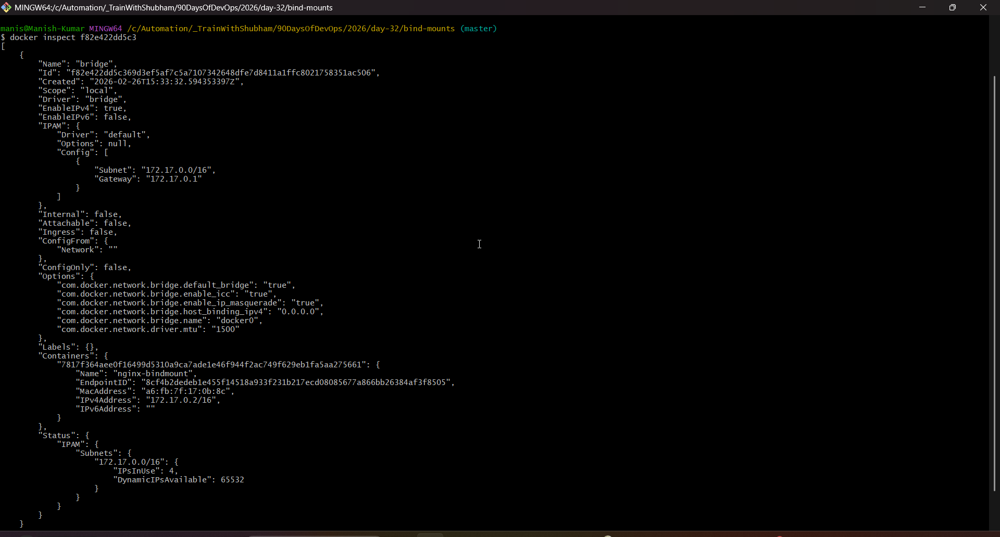

3. Run two containers on the default bridge — can they ping each other by **name**?
   
    Note: I will create two nginx container with different name
            1. nginx-one
            2. nginx-two

        docker run -d --name nginx-one -p 8080:80 nginx

        docker run -d --name nginx-two -p 8080:80 nginx

    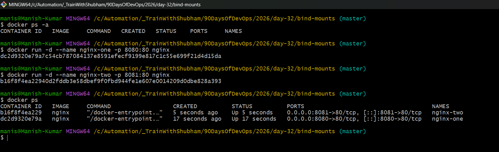

        docker network ls

        docker network inspect <bridge-network-id>
    
        nginx-one: 172.17.0.2
        nginx-two: 172.17.0.3

    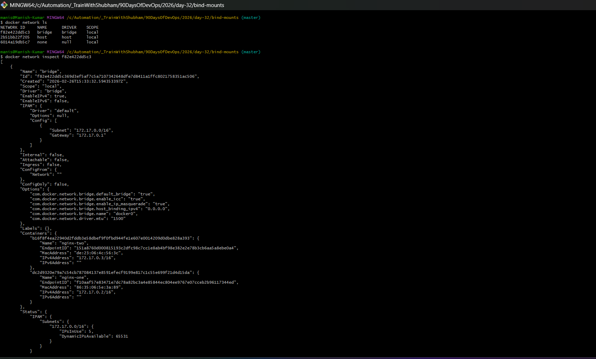
    
        docker exec nginx-one ping nginx-two

    Error: OCI runtime exec failed: exec failed: unable to start container process: exec: "ping": executable file not found in $PATH

    If you see this error execute below command to install ping on container
    For nginx-one:

        docker exec nginx-one apt-get update
        docker exec nginx-one apt-get install -y iputils-ping

        docker exec nginx-one ping nginx-two
    
    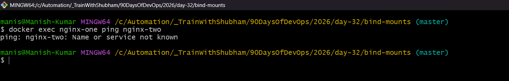

    For nginx-two:
    
        docker exec nginx-two apt-get update
        docker exec nginx-two apt-get install -y iputils-ping

        docker exec nginx-two ping nginx-onw
    
4. Run two containers on the default bridge — can they ping each other by **IP**?

        docker exec <name-of-firs-container> ping <Ip-of-second-container>

    From nginx-one:

        docker exec nginx-one ping 172.17.0.3
    
    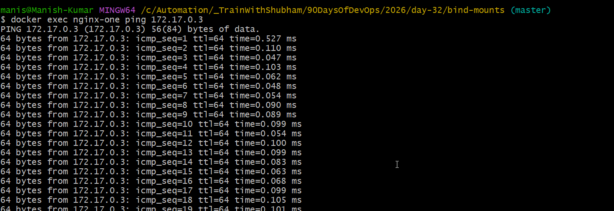

    From nginx-two:
        
        docker exec nginx-two ping 172.17.0.2
    
    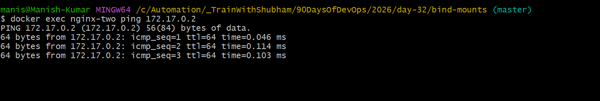


<h2> Note: If you want to monitor network traffic, Follow below steps </h2>

```
docker exec nginx-one apt-get update

docker exec nginx-one apt-get install -y tcpdump

# Monitor ICMP (ping) packets in one terminal
docker exec nginx-one tcpdump -i eth0 icmp

# In another terminal, ping from mysql
docker exec nginx-two ping -c 3 172.17.0.2
```
---

### Task 5: Custom Networks
1. Create a custom bridge network called `my-app-net`
   
        docker network create -d bridge my-app-net
    
    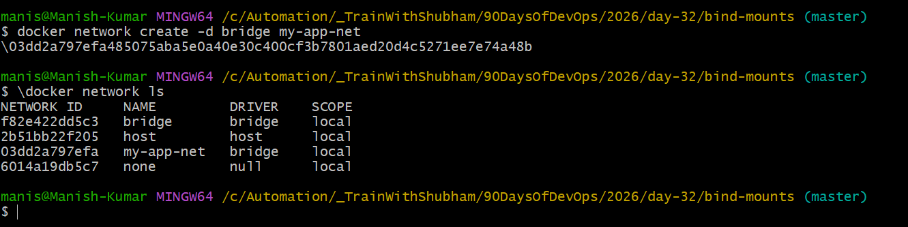

2. Run two containers on `my-app-net`
   
        docker network connect my-app-net nginx-one

        docker network connect my-app-net nginx-two

        docker network inspect my-app-net
    
    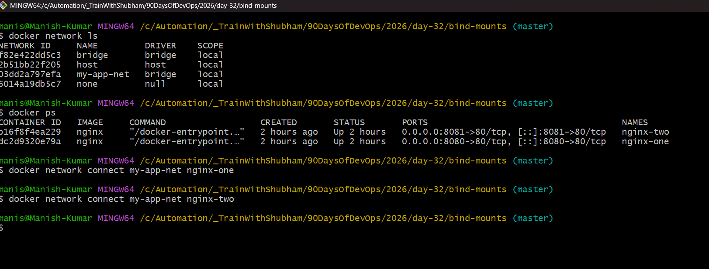

    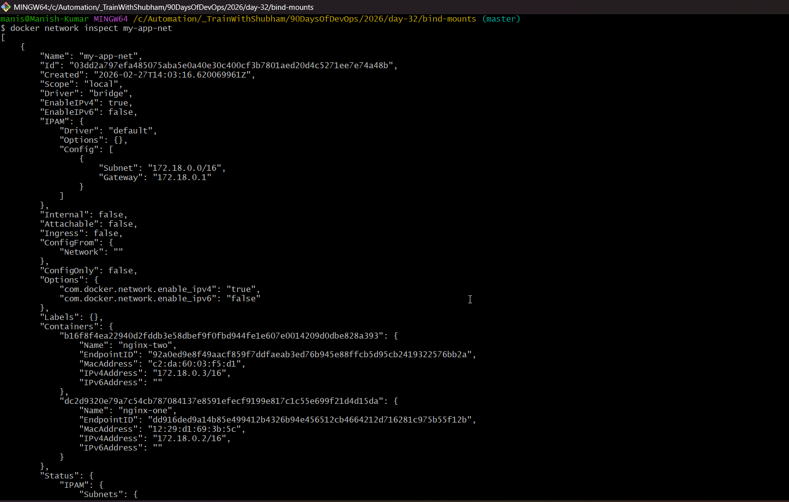

3. Can they ping each other by **name** now?
   
        docker exec nginx-one ping nginx-two

    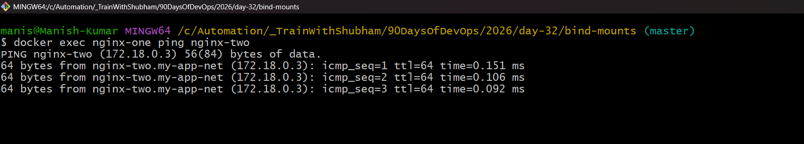
    
        docker exec nginx-two ping nginx-one
    
    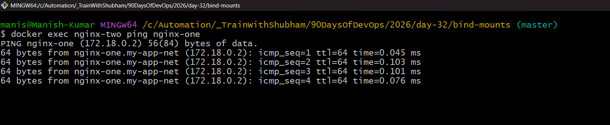
    
4. Write in your notes: Why does custom networking allow name-based communication but the default bridge doesn't?

    <p>Custom bridge network have a built in embedded DNS server that automatically resolves container names to IP address.</p>
    <p>Default bridge network does not have this DNS server-it's a legacy design decision for backwards compatibility.</p>

    ***Custom networks have a "phonebook" that remembers names and automatically looks up addresses, while default bridge makes you memorize and use actual IP addresses.***
---

### Task 6: Put It Together
1. Create a custom network
   
        docker network create -d bridge put-it-together
    
    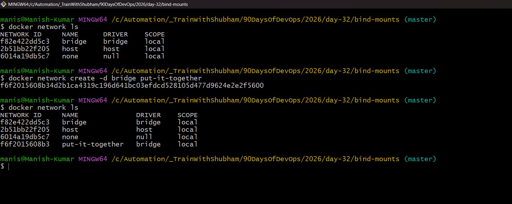

2. Run a **database container** (MySQL/Postgres) on that network with a volume for data

        docker volume ls 

        Result: we have created volume for sql.
    
        docker run -d --name mysql-cotainer -v my-sql-data:/var/lib/mysql --network put-it-together -e MYSQL_ROOT_PASSWORD=Test@123 mysql

    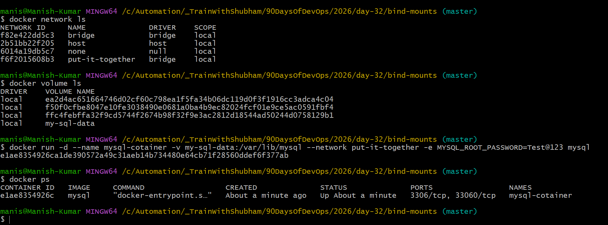

3. Run an **app container** (use any image) on the same network

        docker image ls

        docker run -d --name learning-app --network put-it-together learning-app
    
    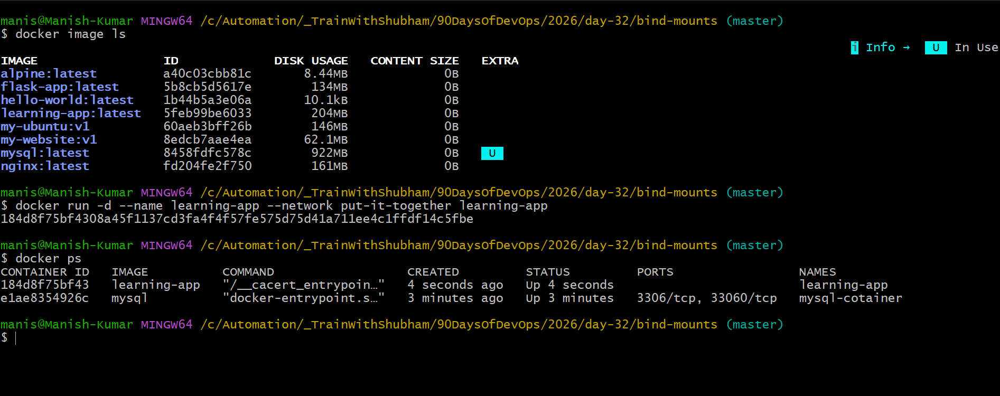

        docker network inspect put-it-together

    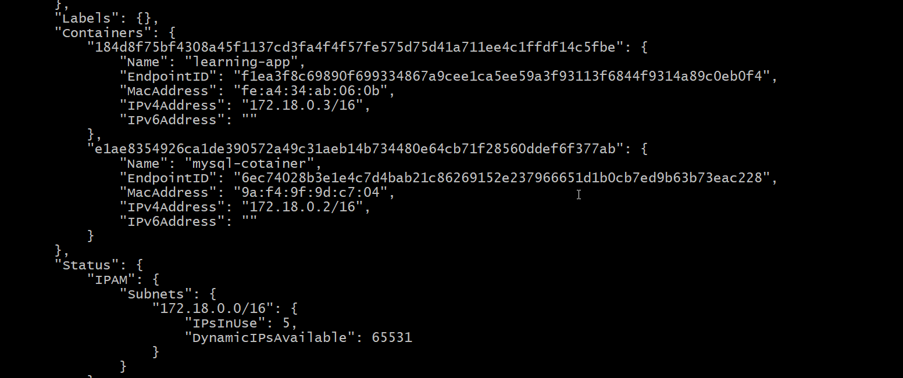

4. Verify the app container can reach the database by container name

        docker exec learning-app ping mysql-cotainer
    
    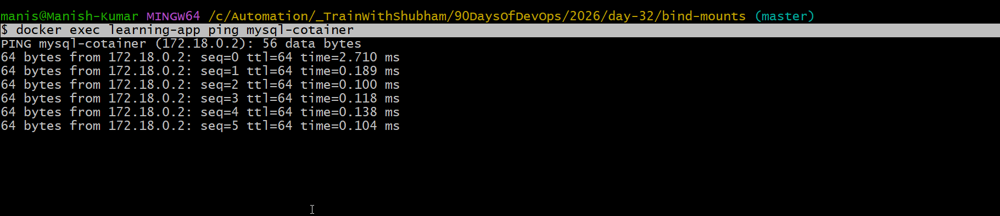
---

## Hints
- Volumes: `docker volume create`, `-v volume_name:/path`
- Bind mount: `-v /host/path:/container/path`
- Networking: `docker network create`, `--network`
- Ping: `docker exec container1 ping container2`

---
