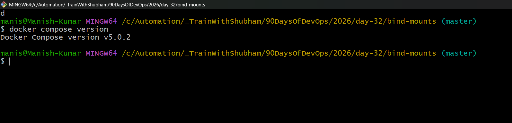
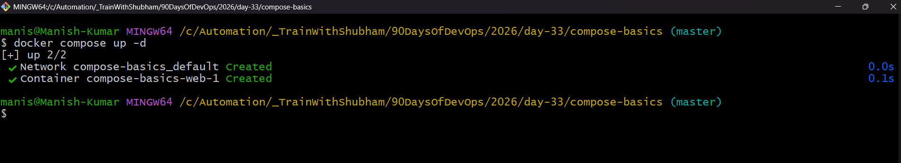
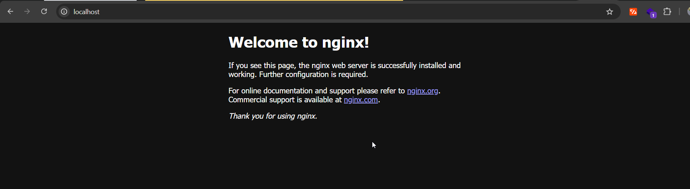
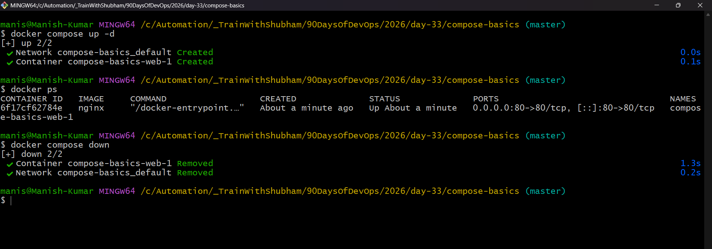
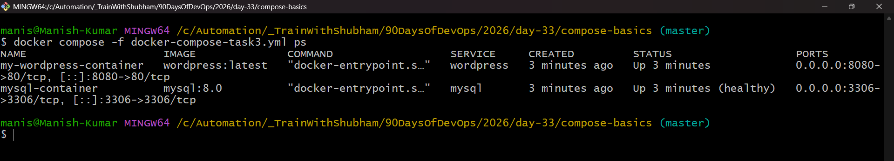
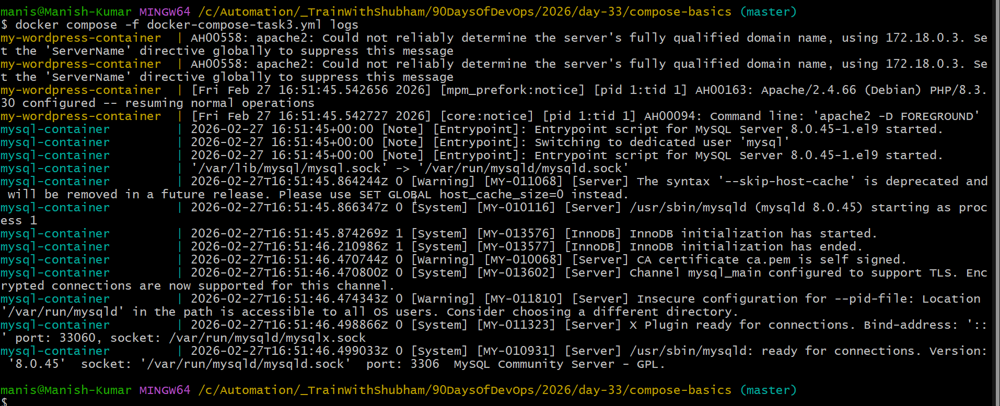
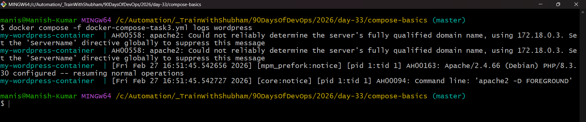
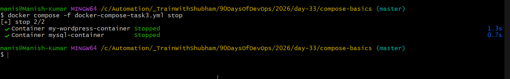
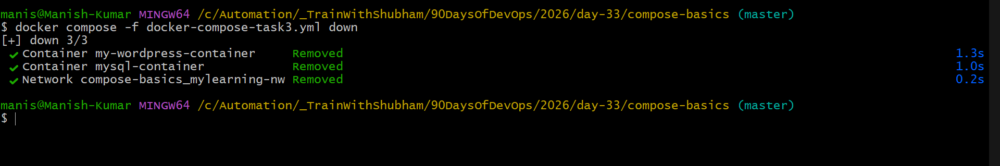

# Day 33 – Docker Compose: Multi-Container Basics

## Task
Today's goal is to **run multi-container applications with a single command**.

Yesterday you manually created networks and volumes and ran containers one by one. Docker Compose does all of that in one YAML file.

---

## Expected Output
- A markdown file: `day-33-compose.md`
- All `docker-compose.yml` files you create

---

## Challenge Tasks

### Task 1: Install & Verify
1. Check if Docker Compose is available on your machine
2. Verify the version

        docker compose version
    
    
---

### Task 2: Your First Compose File
1. Create a folder `compose-basics`
   
        mkdir compose-basics

2. Write a `docker-compose.yml` that runs a single **Nginx** container with port mapping

        Create a file under compose-basics folder

3. Start it with `docker compose up`

        docker compose up
    
    

4. Access it in your browser
   
        http://localhost:80
    
    

5. Stop it with `docker compose down`

        docker compose down
    
    

---

### Task 3: Two-Container Setup
Write a `docker-compose.yml` that runs:
- A **WordPress** container
- A **MySQL** container

        docker compose -f docker-compose-task3.yml up -d
    
        docker compose -f docker-compose-task3.yml down

They should:
- Be on the same network (Compose does this automatically)
- MySQL should have a named volume for data persistence
- WordPress should connect to MySQL using the service name

Start it, access WordPress in your browser, and set it up.

**Verify:** Stop and restart with `docker compose down` and `docker compose up` — is your WordPress data still there?

---

### Task 4: Compose Commands
Practice and document these:
1. Start services in **detached mode**

        docker compose up -d

2. View running services

        docker compose -f docker-compose-task3.yml ps
    
    

3. View **logs** of all services

        docker compose -f docker-compose-task3.yml logs

    

4. View logs of a **specific** service
   
        docker compose -f docker-compose-task3.yml logs wordpress
    
    

5. **Stop** services without removing

        docker compose -f docker-compose-task3.yml stop
    
    

6. **Remove** everything (containers, networks) 

        docker compose -f docker-compose-task3.yml down
    
    

7. **Rebuild** images if you make a change

---

### Task 5: Environment Variables
1. Add environment variables directly in your `docker-compose.yml`
2. Create a `.env` file and reference variables from it in your compose file
3. Verify the variables are being picked up

---

## Hints
- Start: `docker compose up -d`
- Stop: `docker compose down`
- Logs: `docker compose logs -f`
- Compose creates a default network for all services automatically
- Service names in compose are the DNS names containers use to talk to each other

---
