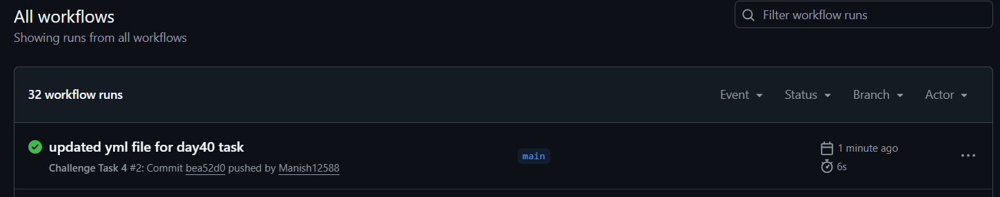
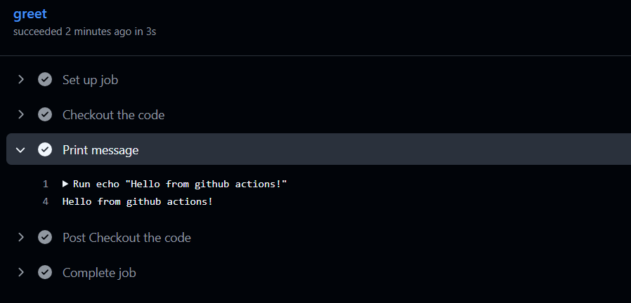
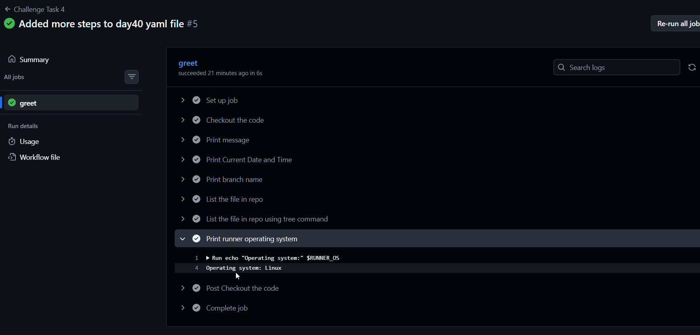
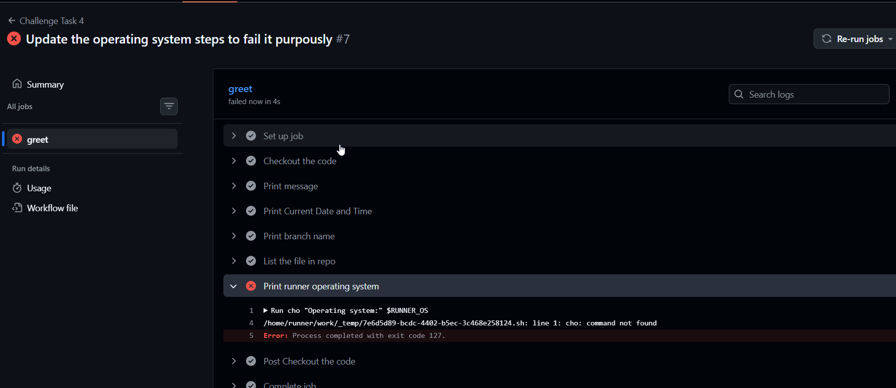

# Day 40 – Your First GitHub Actions Workflow
---

### Task 1: Set Up
1. Create a new **public** GitHub repository called `github-actions-practice`
2. Clone it locally
3. Create the folder structure: `.github/workflows/`

   Note: Repo created with "[github-actions](https://github.com/Manish12588/github-actions)" name
---

### Task 2: Hello Workflow
Create `.github/workflows/hello.yml` with a workflow that:
1. Triggers on every `push`
2. Has one job called `greet`
3. Runs on `ubuntu-latest`
4. Has two steps:
   - Step 1: Check out the code using `actions/checkout`
   - Step 2: Print `Hello from GitHub Actions!`

Push it. Go to the **Actions** tab on GitHub and watch it run.

```yaml

name: Challenge Task 4

on:
  push:
    branches:
      - main

jobs:
  greet:
    runs-on: ubuntu-latest
    steps:
      - name: Checkout the code
        uses: actions/checkout@v4

      - name: Print message
        run: echo "Hello from github actions!"

```

**Verify:** Is it green? Click into the job and read every step.

   

   
---

### Task 3: Understand the Anatomy
Look at your workflow file and write in your notes what each key does:
- `on:` : It tells on which actions action should get trigger. Either manual or automatically.
- `jobs:` : It can contains single job or multiple jobs, (Jobs is a set of steps to perform any task)
- `runs-on:`: it tells on which environment your jobs will get execute.
- `steps:`: steps are sequence of actions which helps to execte the job
- `uses:` tells github to use prebuilt actions
- `run:` execute commands directly on runner
- `name:` (on a step): Provide the name for a step

---

### Task 4: Add More Steps
Update `hello.yml` to also:
1. Print the current date and time
2. Print the name of the branch that triggered the run (hint: GitHub provides this as a variable)
3. List the files in the repo
4. Print the runner's operating system

Push again — watch the new run.

```yaml
name: Challenge Task 4

on:
  push:
    branches:
      - main

jobs:
  greet:
    runs-on: ubuntu-latest
    steps:
      - name: Checkout the code
        uses: actions/checkout@v4

      - name: Print message
        run: echo "Hello from github actions!"

      - name: Print Current Date and Time
        run: date

      - name: Print branch name
        run: echo "Branch Name:" ${{ github.ref_name }}

      - name: List the file in repo
        run: ls -la

      - name: Print runner operating system
        run: echo "Operating system:" $RUNNER_OS
```
   

---

### Task 5: Break It On Purpose
1. Add a step that runs a command that will **fail** (e.g., `exit 1` or a misspelled command)
2. Push and observe what happens in the Actions tab
3. Fix it and push again

   
   
Write in your notes: What does a failed pipeline look like? How do you read the error?

---

## Hints
- Workflow files live in `.github/workflows/` and must end in `.yml`
- `uses: actions/checkout@v4` checks out your code onto the runner
- `run:` executes shell commands
- GitHub provides built-in variables like `${{ github.ref_name }}` for branch name
- Every push triggers a new run — check the Actions tab

---

