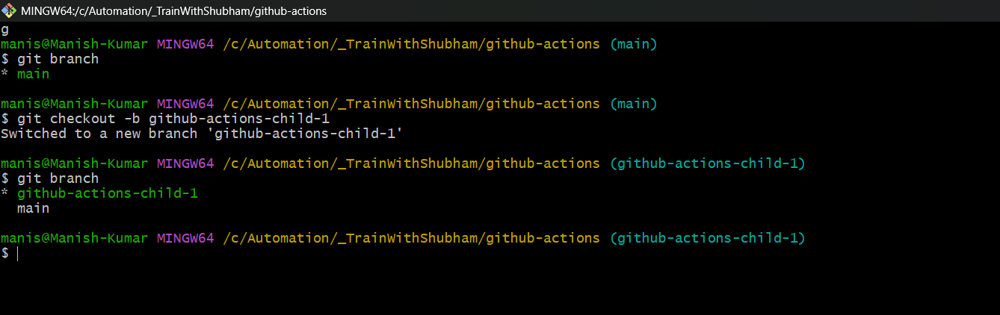
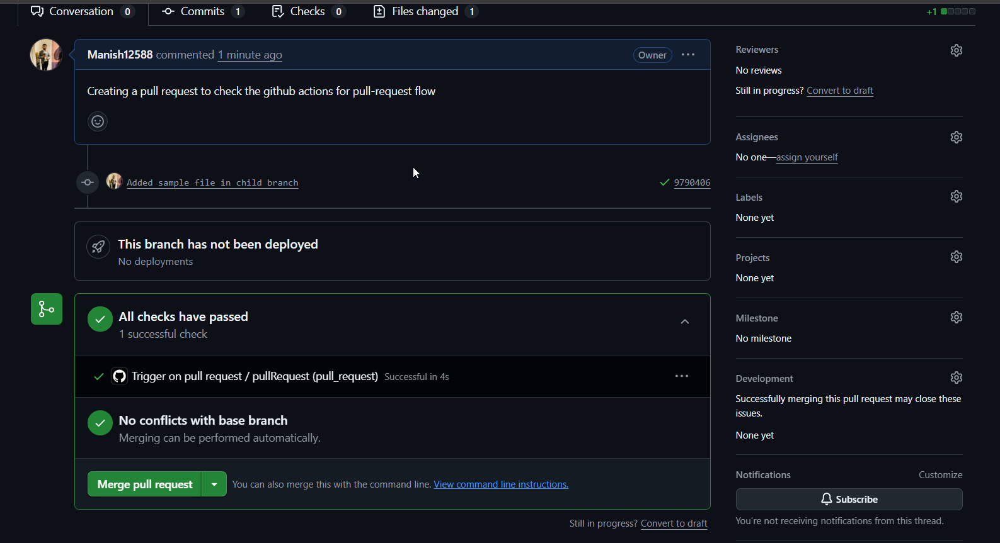
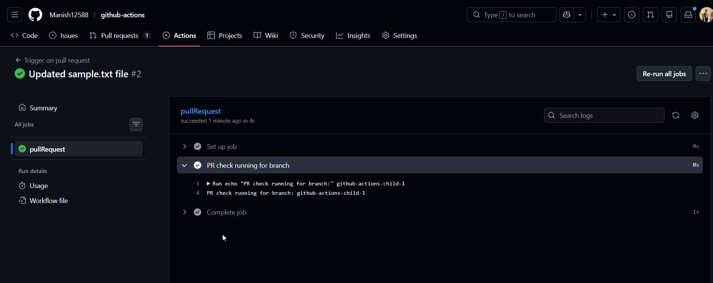
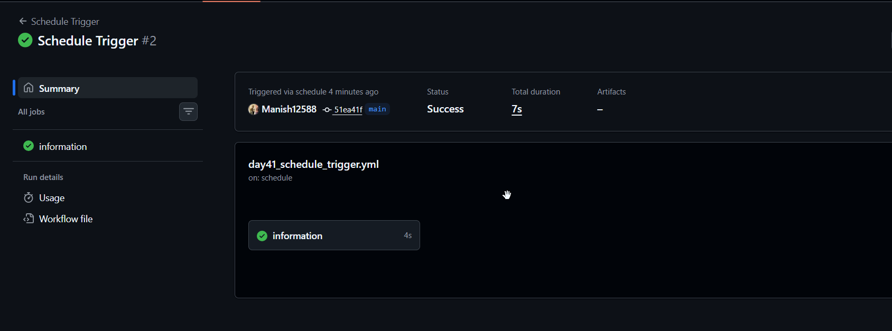
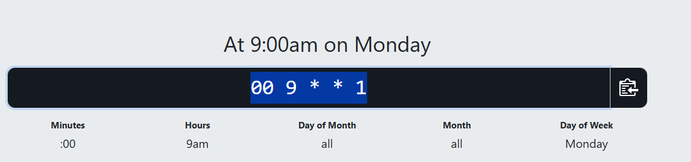
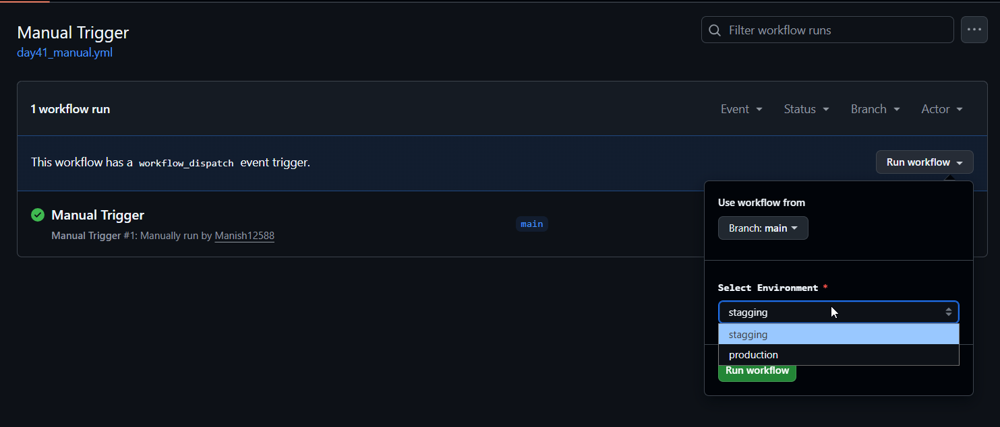
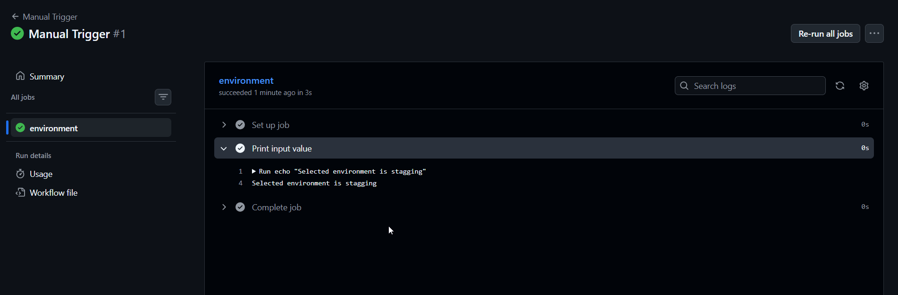
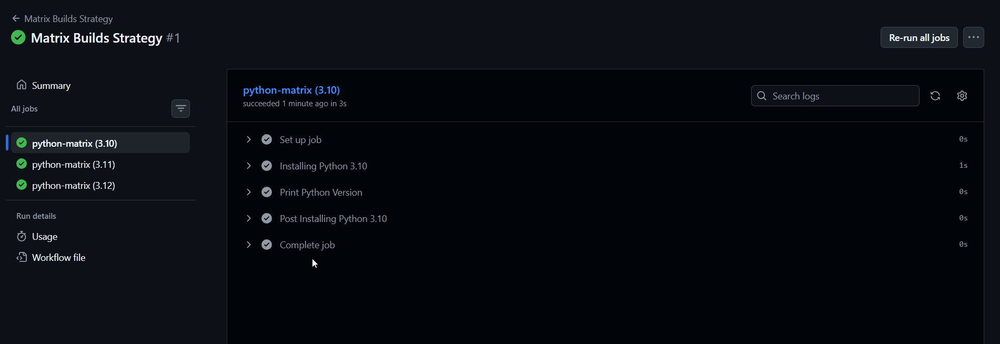
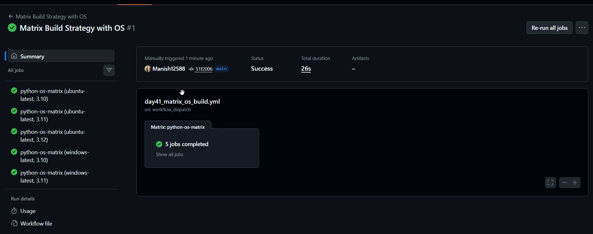
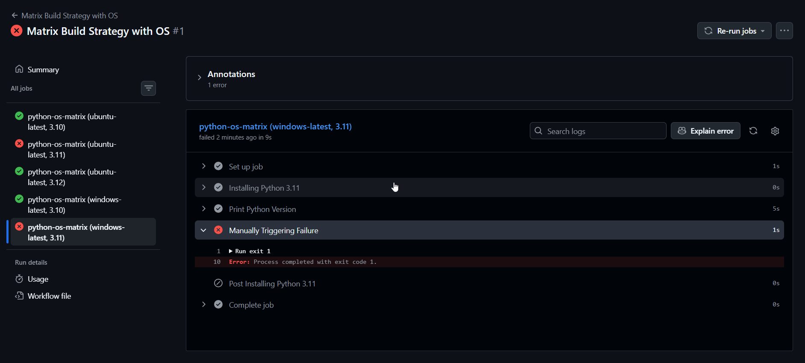

# Day 41 – Triggers & Matrix Builds
---

## Challenge Tasks

### Task 1: Trigger on Pull Request
1. Create `.github/workflows/pr-check.yml`
2. Trigger it only when a pull request is **opened or updated** against `main`
3. Add a step that prints: `PR check running for branch: <branch name>`
4. Create a new branch, push a commit, and open a PR

        git checkout -b github-actions-child-1
    
    

5. Watch the workflow run automatically
    
    

    

**Verify:** Does it show up on the PR page?

 [Workflow-actions](./YAML/day41_PullRequest.yml)

    Yes It shows on PR page and as soon as pull request got created actions got executed.

---

### Task 2: Scheduled Trigger
1. Add a `schedule:` trigger to any workflow using cron syntax
2. Set it to run every day at midnight UTC

        Note: I added the scheduler to run in every 5 min 

        - cron: '*/5 * * * *'
  
    [Scheduleer-workflow](./YAML/day41_schedule_trigger.yml)

    

3. Write in your notes: What is the cron expression for every Monday at 9 AM?
   
        00 9 * * 1
    
    

---

### Task 3: Manual Trigger
1. Create `.github/workflows/manual.yml` with a `workflow_dispatch:` trigger
2. Add an **input** that asks for an `environment` name (staging/production)
3. Print the input value in a step
4. Go to the **Actions** tab → find the workflow → click **Run workflow**

   [Workflow-actions](./YAML/day41_manual.yml) 

   

   

**Verify:** Can you trigger it manually and see your input printed?

---

### Task 4: Matrix Builds
Create `.github/workflows/matrix.yml` that:
1. Uses a matrix strategy to run the same job across:
   - Python versions: `3.10`, `3.11`, `3.12`
2. Each job installs Python and prints the version
3. Watch all 3 run in parallel

    [Workflow-actions](./YAML/day41_matrix_build.yml)

    

Then extend the matrix to also include 2 operating systems — how many total jobs run now?

 [Workflow-actions](./YAML/day41_matrix_os_build.yml)

    After including 2 operating system, and also added exclude tag for one version on windows. So there are total 5 jobs running.

 

---

### Task 5: Exclude & Fail-Fast
1. In your matrix, **exclude** one specific combination (e.g., Python 3.10 on Windows)
2. Set `fail-fast: false` — trigger a failure in one job and observe what happens to the rest
3. Write in your notes: What does `fail-fast: true` (the default) do vs `false`?

    [Workflow-actions](./YAML/day41_Task-5.yml)

    

    - fail-fast: true (default): If one job fails, the remaining matrix jobs are cancelled.

    - fail-fast: false: If one job fails, the other jobs continue running until completion.
---

## Hints
- PR trigger: `on: pull_request: branches: [main]`
- Cron trigger: `on: schedule: - cron: '0 0 * * *'`
- Manual trigger: `on: workflow_dispatch: inputs:`
- Matrix: `strategy: matrix: python-version: [...]`
- Exclude: `exclude: - os: windows-latest python-version: "3.10"`

---
