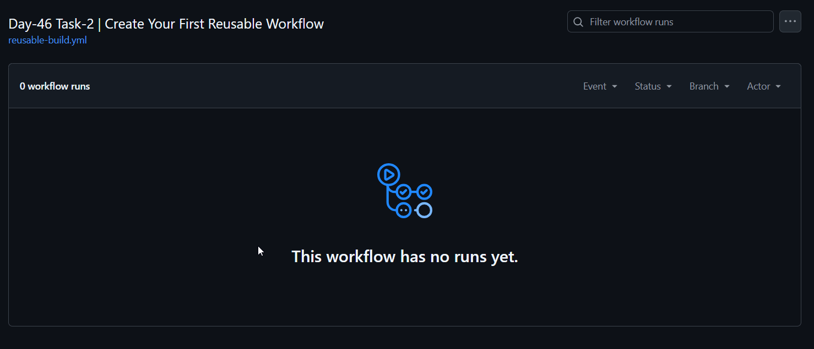
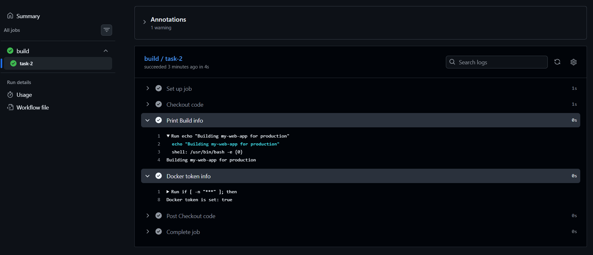
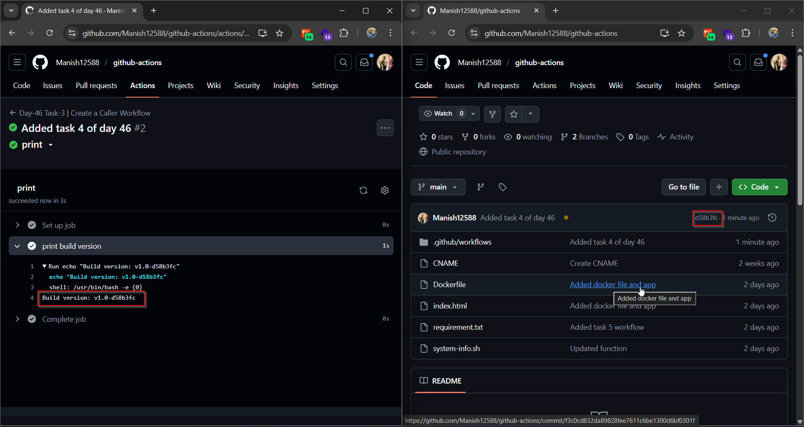
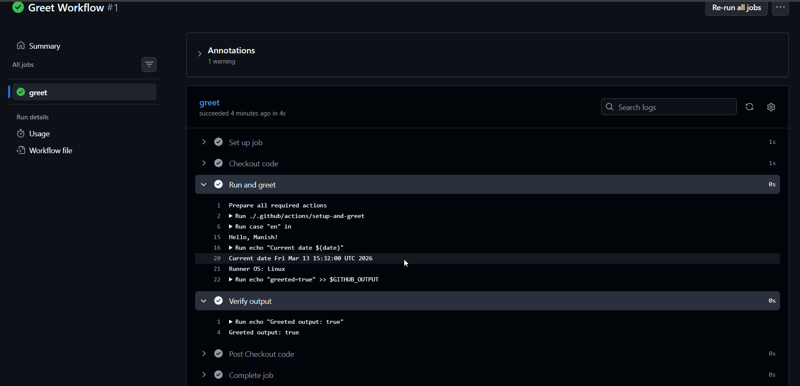

# Day 46 – Reusable Workflows & Composite Actions

### Task 1: Understand `workflow_call`
Before writing any code, research and answer in your notes:
1. What is a **reusable workflow**?
   
   - Resuable workflows are those workflows which are called by another workflow, instead of running directlty on repository event.
  
2. What is the `workflow_call` trigger?
   
   - it allows to be called by another workflow, making it reusable.
  
3. How is calling a reusable workflow different from using a regular action (`uses:`)?
   
   - calling resuable workflow with `uses: <name_of_workflow>`
  
4. Where must a reusable workflow file live?
   
   - All workflows should present under `.github/workflows`

---

### Task 2: Create Your First Reusable Workflow
Create `.github/workflows/reusable-build.yml`:
1. Set the trigger to `workflow_call`
2. Add an `inputs:` section with:
   - `app_name` (string, required)
   - `environment` (string, required, default: `staging`)
3. Add a `secrets:` section with:
   - `docker_token` (required)
4. Create a job that:
   - Checks out the code
   - Prints `Building <app_name> for <environment>`
   - Prints `Docker token is set: true` (never print the actual secret)

**Verify:** This file alone won't run — it needs a caller. That's next.

[Workflow](./workflows/reusable-build.yml)



---

### Task 3: Create a Caller Workflow
Create `.github/workflows/call-build.yml`:
1. Trigger on push to `main`
2. Add a job that uses your reusable workflow:
   ```yaml
   jobs:
     build:
       uses: ./.github/workflows/reusable-build.yml
       with:
         app_name: "my-web-app"
         environment: "production"
       secrets:
         docker_token: ${{ secrets.DOCKER_TOKEN }}
   ```
3. Push to `main` and watch it run

**Verify:** In the Actions tab, do you see the caller triggering the reusable workflow? Click into the job — can you see the inputs printed?

[workflow](./workflows/call-build.yml)



---

### Task 4: Add Outputs to the Reusable Workflow
Extend `reusable-build.yml`:
1. Add an `outputs:` section that exposes a `build_version` value
2. Inside the job, generate a version string (e.g., `v1.0-<short-sha>`) and set it as output

[workflow](./workflows/reusable-build%20copy.yml)

3. In your caller workflow, add a second job that:
   - Depends on the build job (`needs:`)
   - Reads and prints the `build_version` output

[workflow](./workflows/call-build%20copy.yml)



**Verify:** Does the second job print the version from the reusable workflow?

---

### Task 5: Create a Composite Action
Create a **custom composite action** in your repo at `.github/actions/setup-and-greet/action.yml`:
1. Define inputs: `name` and `language` (default: `en`)
2. Add steps that:
   - Print a greeting in the specified language
   - Print the current date and runner OS
   - Set an output called `greeted` with value `true`
3. Use the composite action in a new workflow with `uses: ./.github/actions/setup-and-greet`

[action-workflow](./workflows/action.yml)

[greet-workflow](./workflows/greet.yml)

**Verify:** Does your custom action run and print the greeting?



---

### Task 6: Reusable Workflow vs Composite Action
Fill this in your notes:

|                              | Reusable Workflow  | Composite Action  |
| ---------------------------- | ------------------ | ----------------- |
| Triggered by                 | `workflow_call`    | `uses:` in a step |
| Can contain jobs?            | Yes                | only one          |
| Can contain multiple steps?  | Yes                | No                |
| Lives where?                 | .github/workflows/ | .github/actions/  |
| Can accept secrets directly? | ?                  | ?                 |
| Best for                     | repeated pipeline  | repeated steps    |

---

## Hints
- Reusable workflows must be in `.github/workflows/` directory
- Caller syntax: `uses: ./.github/workflows/file.yml` (same repo) or `uses: org/repo/.github/workflows/file.yml@main` (cross-repo)
- Composite action: `action.yml` with `runs: using: "composite"`
- Reusable workflow outputs: `on: workflow_call: outputs: name: value: ${{ jobs.job-id.outputs.name }}`
- A reusable workflow can be called by at most 20 unique caller workflows in a single run

---
