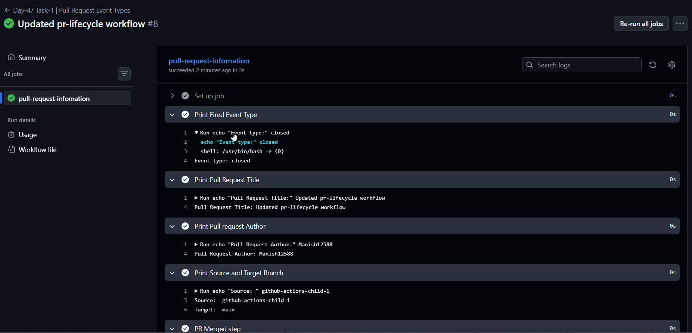
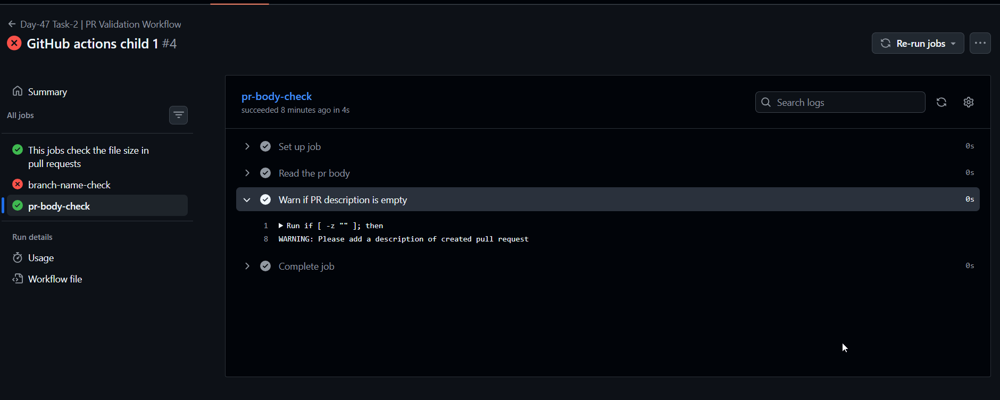
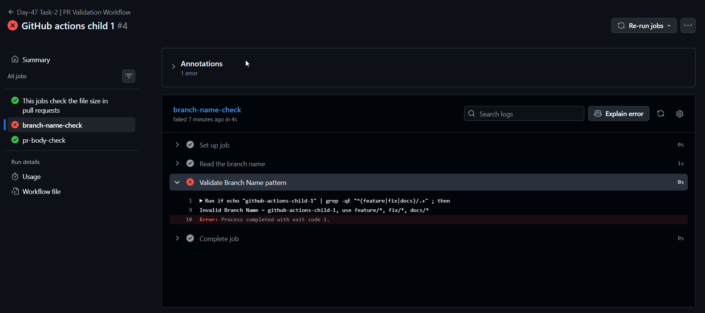
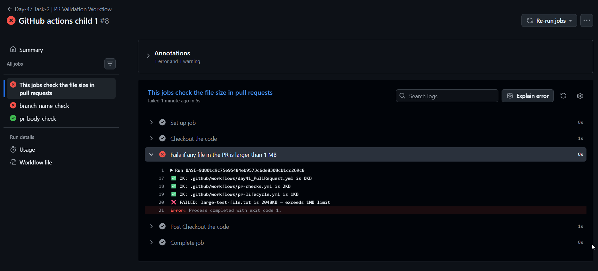
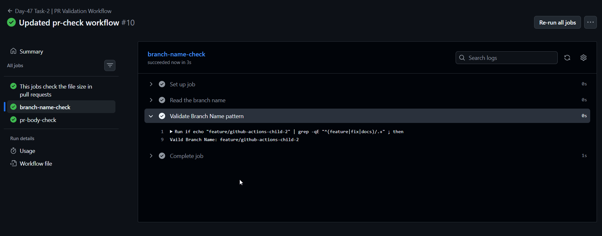
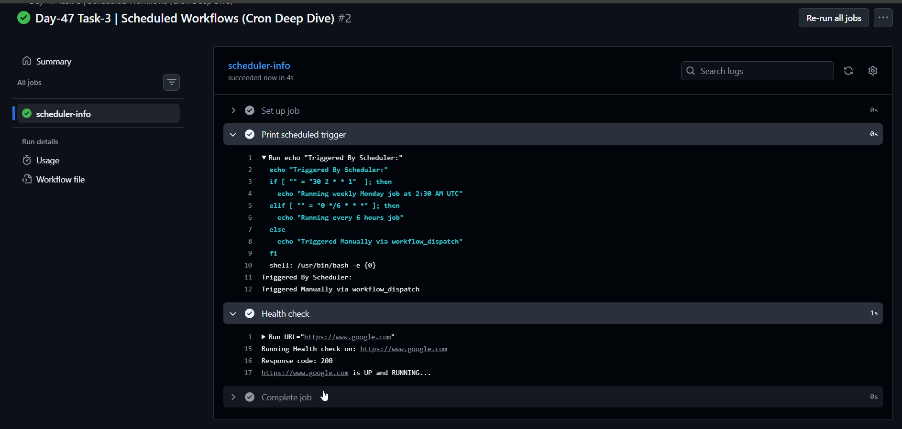
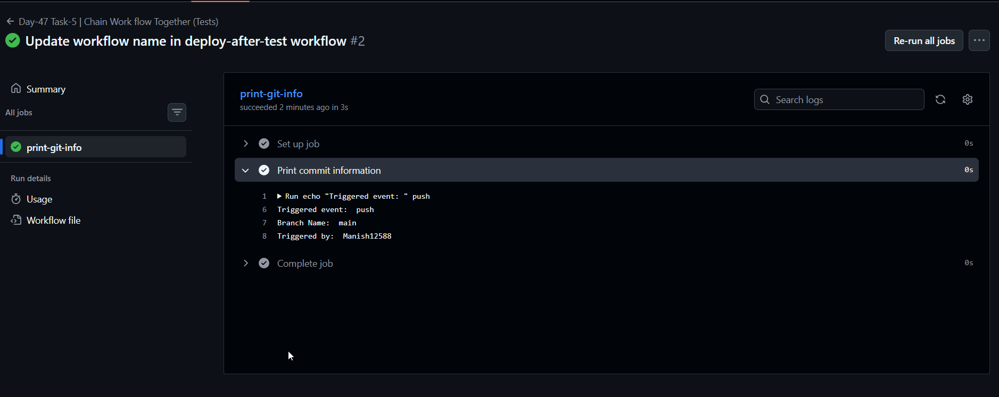
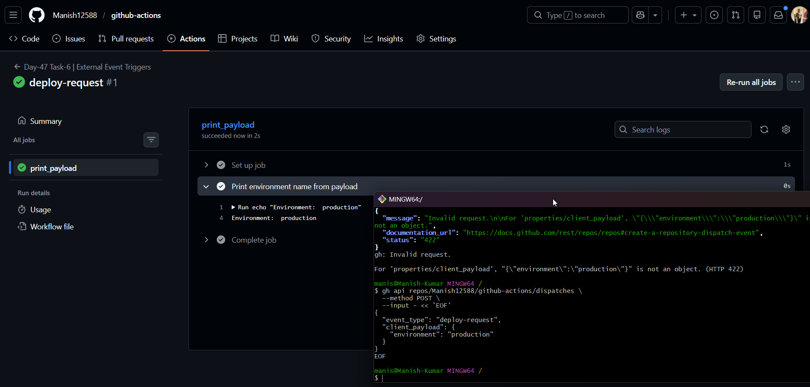

# Day 47 – Advanced Triggers: PR Events, Cron Schedules & Event-Driven Pipelines

### Task 1: Pull Request Event Types
Create `.github/workflows/pr-lifecycle.yml` that triggers on `pull_request` with **specific activity types**:
1. Trigger on: `opened`, `synchronize`, `reopened`, `closed`
2. Add steps that:
   - Print which event type fired: `${{ github.event.action }}`
   - Print the PR title: `${{ github.event.pull_request.title }}`
   - Print the PR author: `${{ github.event.pull_request.user.login }}`
   - Print the source branch and target branch
3. Add a conditional step that only runs when the PR is **merged** (closed + merged = true)

[pr-lifecycle-workflow](./workflows/pr-lifecycle.yml)

Test it: create a PR, push an update to it, then merge it. Watch the workflow fire each time with a different event type.



---

### Task 2: PR Validation Workflow
Create `.github/workflows/pr-checks.yml` — a real-world PR gate:
1. Trigger on `pull_request` to `main`
2. Add a job `file-size-check` that:
   - Checks out the code
   - Fails if any file in the PR is larger than 1 MB
3. Add a job `branch-name-check` that:
   - Reads the branch name from `${{ github.head_ref }}`
   - Fails if it doesn't follow the pattern `feature/*`, `fix/*`, or `docs/*`
4. Add a job `pr-body-check` that:
   - Reads the PR body: `${{ github.event.pull_request.body }}`
   - Warns (but doesn't fail) if the PR description is empty

[pr-checks-workflow](./workflows/pr-checks.yml)

**Verify:** Open a PR from a badly named branch — does the check fail?

**Steps to Test**
1. Switch to the feature branch `git switch <branch_name>`
2. Update workflow and push it to feature branch.
3. now create a pull reqest to main branch and
   1. Leave pr description empty (point 4)
   
     

   2. Branch feature branch name is not upto checklist (point 3)
     
     

4. Test File size check
   
     

5. Validate the branch name
   
     
---

### Task 3: Scheduled Workflows (Cron Deep Dive)
Create `.github/workflows/scheduled-tasks.yml`:
1. Add a `schedule` trigger with cron: `'30 2 * * 1'` (every Monday at 2:30 AM UTC)
2. Add **another** cron entry: `'0 */6 * * *'` (every 6 hours)
3. In the job, print which schedule triggered using `${{ github.event.schedule }}`
4. Add a step that acts as a **health check** — curl a URL and check the response code

Write in your notes:
- The cron expression for: every weekday at 9 AM IST
- The cron expression for: first day of every month at midnight
- Why GitHub says scheduled workflows may be delayed or skipped on inactive repos

**Important:** Also add `workflow_dispatch` so you can test it manually without waiting for the schedule.

[scheduled-task-workflow](./workflows/scheduled-tasks.yml)



---

### Task 4: Path & Branch Filters
Create `.github/workflows/smart-triggers.yml`:
1. Trigger on push but **only** when files in `src/` or `app/` change:
   ```yaml
   on:
     push:
       paths:
         - 'src/**'
         - 'app/**'
   ```
2. Add `paths-ignore` in a second workflow that skips runs when only docs change:
   ```yaml
   paths-ignore:
     - '*.md'
     - 'docs/**'
   ```
3. Add branch filters to only trigger on `main` and `release/*` branches
4. Test it: push a change to a `.md` file — does the workflow skip?

Write in your notes: When would you use `paths` vs `paths-ignore`?

---

### Task 5: `workflow_run` — Chain Workflows Together
Create two workflows:
1. `.github/workflows/tests.yml` — runs tests on every push
2. `.github/workflows/deploy-after-tests.yml` — triggers **only after** `tests.yml` completes successfully:
   ```yaml
   on:
     workflow_run:
       workflows: ["Run Tests"]
       types: [completed]
   ```
3. In the deploy workflow, add a conditional:
   - Only proceed if the triggering workflow **succeeded** (`${{ github.event.workflow_run.conclusion == 'success' }}`)
   - Print a warning and exit if it failed

[tests-workflow](./workflows/tests.yml)

[deploy-after-test-workflow](./workflows/deploy-after-tests.yml)

**Verify:** Push a commit — does the test workflow run first, then trigger the deploy workflow?




---

### Task 6: `repository_dispatch` — External Event Triggers
1. Create `.github/workflows/external-trigger.yml` with trigger `repository_dispatch`
2. Set it to respond to event type: `deploy-request`
3. Print the client payload: `${{ github.event.client_payload.environment }}`
4. Trigger it using `curl` or `gh`:
   ```bash
   gh api repos/Manish12588/github-actions/dispatches \
   --method POST \
   --input - << 'EOF'
   {
   "event_type": "deploy-request",
   "client_payload": {
      "environment": "production"
   }
   }
   EOF
   ```
[external-trigger-workflow](./workflows/external-trigger.yml)



note: You have to authenticate login first using, `gh auth login`

Write in your notes: When would an external system (like a Slack bot or monitoring tool) trigger a pipeline?

---

## Hints
- PR merge check: `if: github.event.pull_request.merged == true`
- Cron syntax: `minute hour day-of-month month day-of-week`
- Scheduled workflows only run on the **default branch**
- `workflow_run` gives you access to the triggering workflow's conclusion and artifacts
- `repository_dispatch` requires a personal access token with `repo` scope
- Path filters use glob patterns — `**` matches nested directories

---
