# Day 51 – Kubernetes Manifests and Your First Pods
---

## The Anatomy of a Kubernetes Manifest

Every Kubernetes resource is defined using a YAML manifest with four required top-level fields:

```yaml
apiVersion: v1          # Which API version to use
kind: Pod               # What type of resource
metadata:               # Name, labels, namespace
  name: my-pod
  labels:
    app: my-app
spec:                   # The actual specification (what you want)
  containers:
  - name: my-container
    image: nginx:latest
    ports:
    - containerPort: 80
```

- `apiVersion` — tells Kubernetes which API group to use. For Pods, it is `v1`.
- `kind` — the resource type. Today it is `Pod`. Later you will use `Deployment`, `Service`, etc.
- `metadata` — the identity of your resource. `name` is required. `labels` are key-value pairs used for organization and selection.
- `spec` — the desired state. For a Pod, this means which containers to run, which images, which ports, etc.

---

### Task 1: Create Your First Pod (Nginx)
Create a file called `nginx-pod.yaml`:

```yaml
apiVersion: v1
kind: Pod
metadata:
  name: nginx-pod
  labels:
    app: nginx
spec:
  containers:
  - name: nginx
    image: nginx:latest
    ports:
    - containerPort: 80
```

Pre-requisite: Create a kind cluster with 1 control plane and 1 worker node

[Kind-config.yml](./yaml/kind-config.yml)

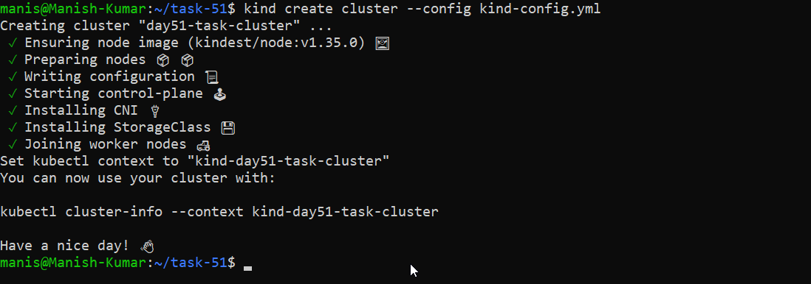

[nginx-pod.yml](./yaml/nginx-pod.yml)

Apply it:
```bash
kubectl apply -f nginx-pod.yaml
```
Verify:
```bash
kubectl get pods
kubectl get pods -o wide
```
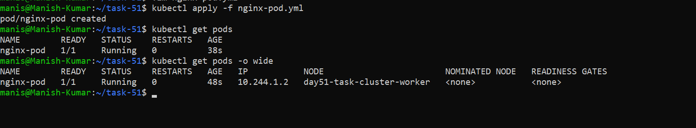

Wait until the STATUS shows `Running`. Then explore:
```bash
# Detailed info about the pod
kubectl describe pod nginx-pod

# Read the logs
kubectl logs nginx-pod

# Get a shell inside the container
kubectl exec -it nginx-pod -- /bin/bash

# Inside the container, run:
curl localhost:80
exit
```
**Verify:** Can you see the Nginx welcome page when you curl from inside the pod?

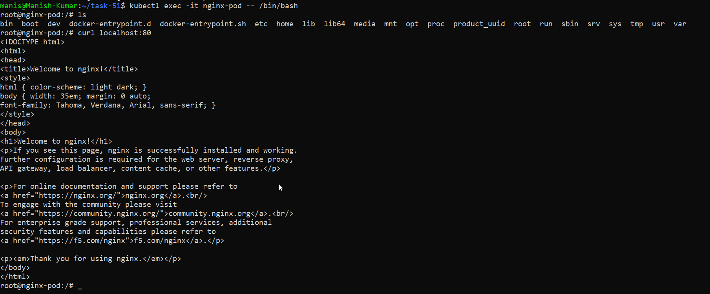

---

### Task 2: Create a Custom Pod (BusyBox)
Write a new manifest `busybox-pod.yaml` from scratch (do not copy-paste the nginx one):

```yaml
apiVersion: v1
kind: Pod
metadata:
  name: busybox-pod
  labels:
    app: busybox
    environment: dev
spec:
  containers:
  - name: busybox
    image: busybox:latest
    command: ["sh", "-c", "echo Hello from BusyBox && sleep 3600"]
```
[busybox-pod.yml](./yaml/busybox-pod.yml)

Apply and verify:
```bash
kubectl apply -f busybox-pod.yaml
kubectl get pods
kubectl logs busybox-pod
```
Notice the `command` field — BusyBox does not run a long-lived server like Nginx. Without a command that keeps it running, the container would exit immediately and the pod would go into `CrashLoopBackOff`.

**Verify:** Can you see "Hello from BusyBox" in the logs?

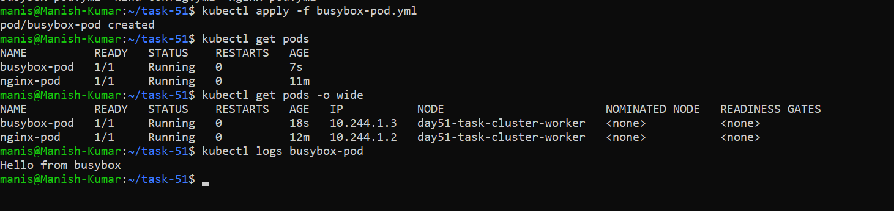

---

### Task 3: Imperative vs Declarative
You have been using the declarative approach (writing YAML, then `kubectl apply`). Kubernetes also supports imperative commands:

```bash
# Create a pod without a YAML file
kubectl run redis-pod --image=redis:latest

# Check it
kubectl get pods
```
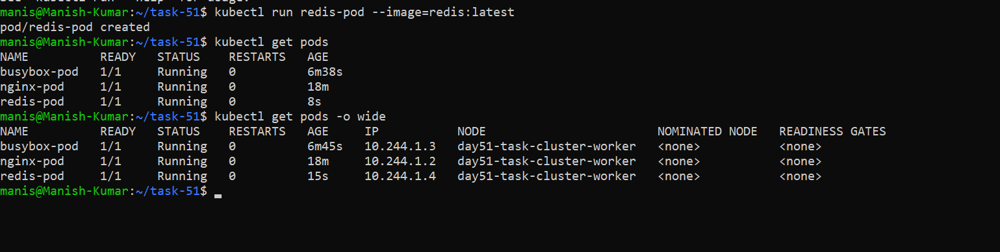

Now extract the YAML that Kubernetes generated:
```bash
kubectl get pod redis-pod -o yaml
```
[generated-redis-pod.yml](./yaml/redis-pod.yml)

Compare this output with your hand-written manifests. Notice how much extra metadata Kubernetes adds automatically (status, timestamps, uid, resource version).

You can also use dry-run to generate YAML without creating anything:
```bash
kubectl run test-pod --image=nginx --dry-run=client -o yaml
```
[test-pod.yml](./yaml/test-pod.yml)

This is a powerful trick — use it to quickly scaffold a manifest, then customize it.

**Verify:** Save the dry-run output to a file and compare its structure with your nginx-pod.yaml. What fields are the same? What is different?

---

### Task 4: Validate Before Applying
Before applying a manifest, you can validate it:

```bash
# Check if the YAML is valid without actually creating the resource
kubectl apply -f nginx-pod.yaml --dry-run=client

# Validate against the cluster's API (server-side validation)
kubectl apply -f nginx-pod.yaml --dry-run=server
```

Now intentionally break your YAML (remove the `image` field or add an invalid field) and run dry-run again. See what error you get.

**Verify:** What error does Kubernetes give when the image field is missing?

While running it on server it gives an error for pod invalid due to image required value

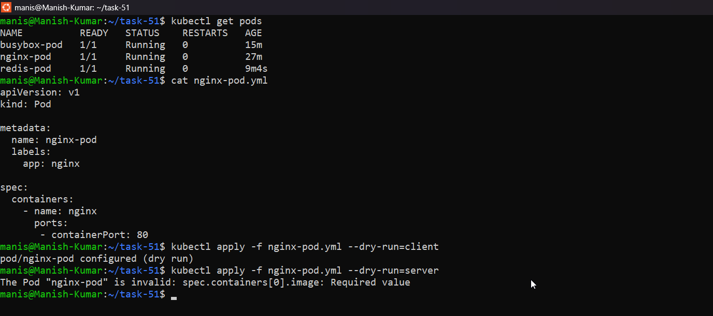

---

### Task 5: Pod Labels and Filtering
Labels are how Kubernetes organizes and selects resources. You added labels in your manifests — now use them:

```bash
# List all pods with their labels
kubectl get pods --show-labels

# Filter pods by label
kubectl get pods -l app=nginx
kubectl get pods -l environment=dev

# Add a label to an existing pod
kubectl label pod nginx-pod environment=production

# Verify
kubectl get pods --show-labels

# Remove a label
kubectl label pod nginx-pod environment-
```
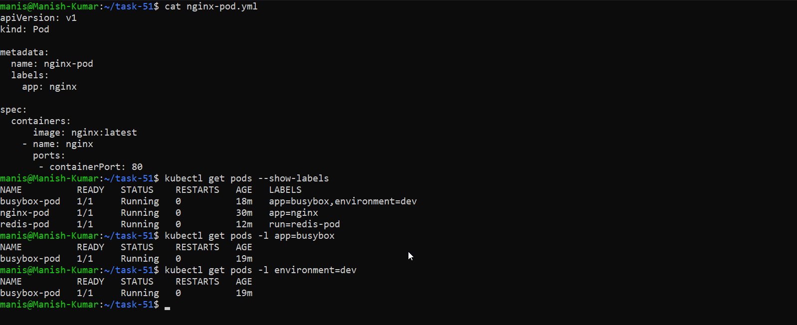

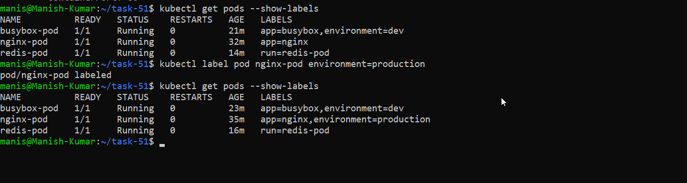

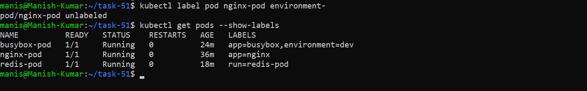

Write a manifest for a third pod with at least 3 labels (app, environment, team). Apply it and practice filtering.

**[redis-pod-with-labels](./yaml/redis-pod-with-labels.yml)**

```bash
kubectl apply -f redis-pod-with-labels.yml

kubectl get pods -l app=redis
kubectl get pods -l environment=dev
kubectl get pods -l team= DevOps
```
---

### Task 6: Clean Up
Delete all the pods you created:

```bash
# Delete by name
kubectl delete pod nginx-pod
kubectl delete pod busybox-pod
kubectl delete pod redis-pod

# Or delete using the manifest file
kubectl delete -f nginx-pod.yaml

# Verify everything is gone
kubectl get pods
```

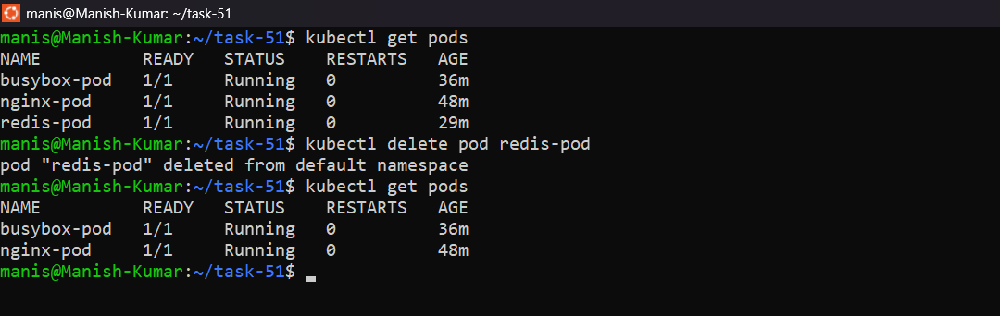

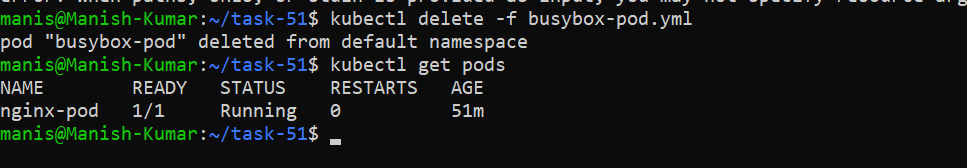

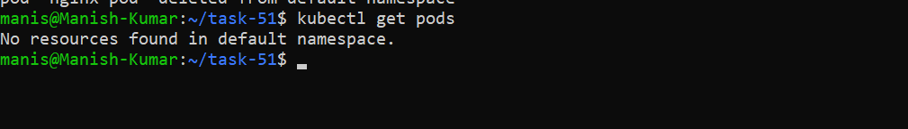

Notice that when you delete a standalone Pod, it is gone forever. There is no controller to recreate it. This is why in production you use Deployments (coming on Day 52) instead of bare Pods.

---

## Hints
- `kubectl apply -f` creates or updates a resource from a file
- `kubectl get pods -o wide` shows the node and IP address
- `kubectl describe pod <name>` shows events — very useful for debugging
- `kubectl logs <name>` shows container stdout/stderr
- `kubectl exec -it <name> -- /bin/sh` gives you a shell (use `/bin/sh` if `/bin/bash` is not available)
- Labels are just key-value pairs — they have no meaning to Kubernetes itself, only to selectors
- `--dry-run=client -o yaml` is your best friend for generating manifest templates

---