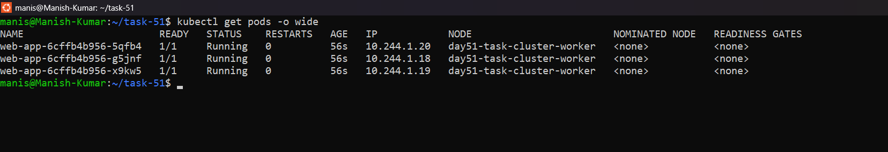
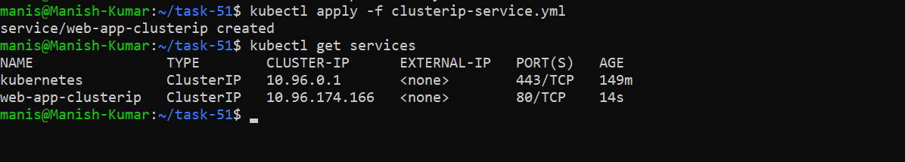
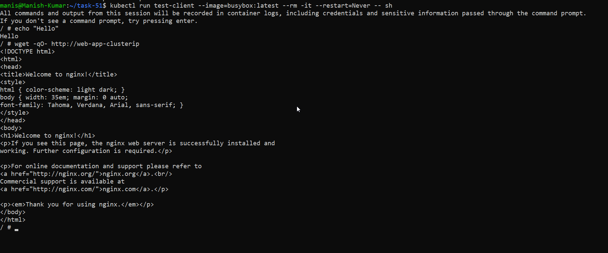
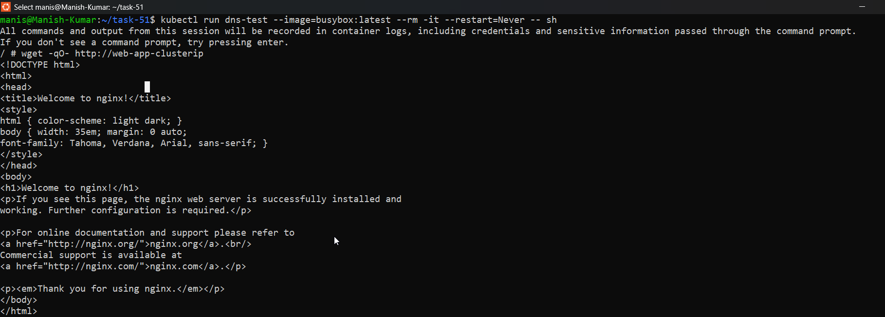
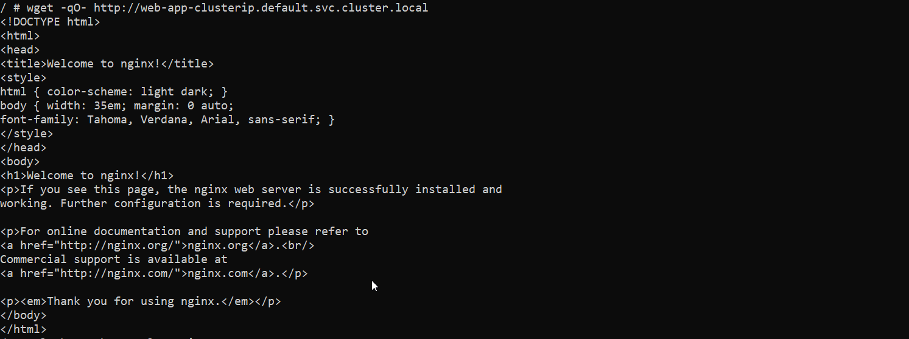
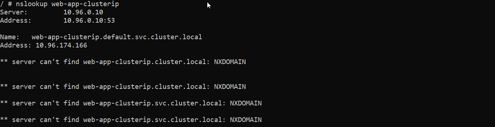
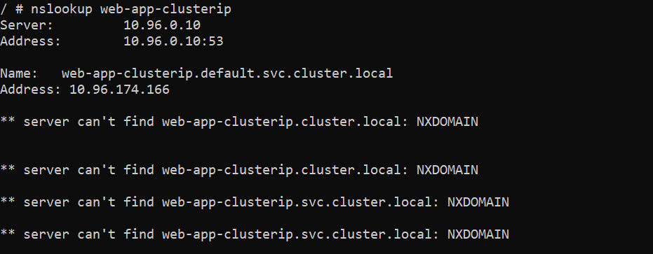
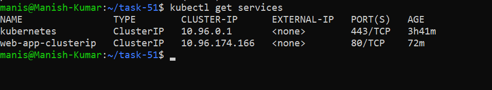
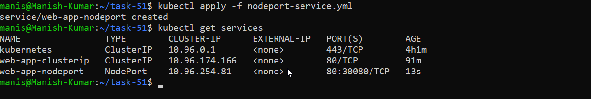

# Day 53 – Kubernetes Services
---

## Why Services?

Every Pod gets its own IP address. But there are two problems:
1. Pod IPs are **not stable** — when a Pod restarts or gets replaced, it gets a new IP
2. A Deployment runs **multiple Pods** — which IP do you connect to?

A Service solves both problems. It provides:
- A **stable IP and DNS name** that never changes
- **Load balancing** across all Pods that match its selector

```
[Client] --> [Service (stable IP)] --> [Pod 1]
                                   --> [Pod 2]
                                   --> [Pod 3]
```

---

## Challenge Tasks

### Task 1: Deploy the Application
First, create a Deployment that you will expose with Services. Create `app-deployment.yaml`:

```yaml
apiVersion: apps/v1
kind: Deployment
metadata:
  name: web-app
  labels:
    app: web-app
spec:
  replicas: 3
  selector:
    matchLabels:
      app: web-app
  template:
    metadata:
      labels:
        app: web-app
    spec:
      containers:
      - name: nginx
        image: nginx:1.25
        ports:
        - containerPort: 80
```

[app-deployment.yml](./yaml/app-deployment.yml)

```bash
kubectl apply -f app-deployment.yaml
kubectl get pods -o wide
```


Note the individual Pod IPs. These will change if pods restart — that is the problem Services fix.

**Verify:** Are all 3 pods running? Note down their IP addresses.

        NAME                       READY   STATUS    RESTARTS   AGE   IP            NODE                        
        web-app-6cffb4b956-5qfb4   1/1     Running   0          56s   10.244.1.20   day51-task-cluster-worker  
        web-app-6cffb4b956-g5jnf   1/1     Running   0          56s   10.244.1.18   day51-task-cluster-worker 
        web-app-6cffb4b956-x9kw5   1/1     Running   0          56s   10.244.1.19   day51-task-cluster-worker 

---

### Task 2: ClusterIP Service (Internal Access)
ClusterIP is the default Service type. It gives your Pods a stable internal IP that is only reachable from within the cluster.

Create `clusterip-service.yaml`:

```yaml
apiVersion: v1
kind: Service
metadata:
  name: web-app-clusterip
spec:
  type: ClusterIP
  selector:
    app: web-app
  ports:
  - port: 80
    targetPort: 80
```

[clusterip-services.yml](./yaml/clusterip-service.yml)

Key fields:
- `selector.app: web-app` — this Service routes traffic to all Pods with the label `app: web-app`
- `port: 80` — the port the Service listens on
- `targetPort: 80` — the port on the Pod to forward traffic to

```bash
kubectl apply -f clusterip-service.yaml
kubectl get services
```



You should see `web-app-clusterip` with a CLUSTER-IP address. This IP is stable — it will not change even if Pods restart.

        NAME                TYPE        CLUSTER-IP      EXTERNAL-IP   PORT(S)   AGE
        kubernetes          ClusterIP   10.96.0.1       <none>        443/TCP   149m
        web-app-clusterip   ClusterIP   10.96.174.166   <none>        80/TCP    14s

Now test it from inside the cluster:
```bash
# Run a temporary pod to test connectivity
kubectl run test-client --image=busybox:latest --rm -it --restart=Never -- sh

# Inside the test pod, run:
wget -qO- http://web-app-clusterip
exit
```



You should see the Nginx welcome page. The Service load-balanced your request to one of the 3 Pods.

**Verify:** Does the Service respond? Try running the wget command multiple times — the Service distributes traffic across all healthy Pods.

---

### Task 3: Discover Services with DNS
Kubernetes has a built-in DNS server. Every Service gets a DNS entry automatically:

```
<service-name>.<namespace>.svc.cluster.local
```

Test this:
```bash
kubectl run dns-test --image=busybox:latest --rm -it --restart=Never -- sh
```

```bash
# Inside the pod:
# Short name (works within the same namespace)
wget -qO- http://web-app-clusterip

```


```bash
# Full DNS name
wget -qO- http://web-app-clusterip.default.svc.cluster.local

```



```bash
# Look up the DNS entry
nslookup web-app-clusterip
exit
```


Both the short name and the full DNS name resolve to the same ClusterIP. In practice, you use the short name when communicating within the same namespace and the full name when reaching across namespaces.

**Verify:** What IP does `nslookup` return? Does it match the CLUSTER-IP from `kubectl get services`
`nslookup`



`kubectl get services`



---

### Task 4: NodePort Service (External Access via Node)
A NodePort Service exposes your application on a port on every node in the cluster. This lets you access the Service from outside the cluster.

Create `nodeport-service.yaml`:

```yaml
apiVersion: v1
kind: Service
metadata:
  name: web-app-nodeport
spec:
  type: NodePort
  selector:
    app: web-app
  ports:
  - port: 80
    targetPort: 80
    nodePort: 30080
```

- `nodePort: 30080` — the port opened on every node (must be in range 30000-32767)
- Traffic flow: `<NodeIP>:30080` -> Service -> Pod:80

```bash
kubectl apply -f nodeport-service.yaml
kubectl get services
```


Access the service:
```bash
# If using Minikube
minikube service web-app-nodeport --url

# If using Kind, get the node IP first
kubectl get nodes -o wide
# Then curl <node-internal-ip>:30080

# If using Docker Desktop
curl http://localhost:30080
```

**Verify:** Can you see the Nginx welcome page from your browser or terminal using the NodePort?

---

### Task 5: LoadBalancer Service (Cloud External Access)
In a cloud environment (AWS, GCP, Azure), a LoadBalancer Service provisions a real external load balancer that routes traffic to your nodes.

Create `loadbalancer-service.yaml`:

```yaml
apiVersion: v1
kind: Service
metadata:
  name: web-app-loadbalancer
spec:
  type: LoadBalancer
  selector:
    app: web-app
  ports:
  - port: 80
    targetPort: 80
```

```bash
kubectl apply -f loadbalancer-service.yaml
kubectl get services
```

On a local cluster (Minikube, Kind, Docker Desktop), the EXTERNAL-IP will show `<pending>` because there is no cloud provider to create a real load balancer. This is expected.

If you are using Minikube:
```bash
# Minikube can simulate a LoadBalancer
minikube tunnel
# In another terminal, check again:
kubectl get services
```

In a real cloud cluster, the EXTERNAL-IP would be a public IP address or hostname provisioned by the cloud provider.

**Verify:** What does the EXTERNAL-IP column show? Why is it `<pending>` on a local cluster?

---

### Task 6: Understand the Service Types Side by Side
Check all three services:

```bash
kubectl get services -o wide
```

Compare them:

| Type | Accessible From | Use Case |
|------|----------------|----------|
| ClusterIP | Inside the cluster only | Internal communication between services |
| NodePort | Outside via `<NodeIP>:<NodePort>` | Development, testing, direct node access |
| LoadBalancer | Outside via cloud load balancer | Production traffic in cloud environments |

Each type builds on the previous one:
- LoadBalancer creates a NodePort, which creates a ClusterIP
- So a LoadBalancer service also has a ClusterIP and a NodePort

Verify this:
```bash
kubectl describe service web-app-loadbalancer
```

You should see all three: a ClusterIP, a NodePort, and the LoadBalancer configuration.

**Verify:** Does the LoadBalancer service also have a ClusterIP and NodePort assigned?

---

### Task 7: Clean Up
```bash
kubectl delete -f app-deployment.yaml
kubectl delete -f clusterip-service.yaml
kubectl delete -f nodeport-service.yaml
kubectl delete -f loadbalancer-service.yaml

kubectl get pods
kubectl get services
```

Only the built-in `kubernetes` service in the default namespace should remain.

**Verify:** Is everything cleaned up?

---

## Hints
- `selector` in a Service must match `labels` on the Pods — if they do not match, the Service routes traffic to nothing
- `kubectl get endpoints <service-name>` shows which Pod IPs a Service is currently routing to
- `port` is what the Service listens on; `targetPort` is what the Pod listens on — they do not have to be the same number
- NodePort range is 30000-32767; if you do not specify `nodePort`, Kubernetes picks one automatically
- Use `kubectl describe service <name>` to see the full configuration including Endpoints
- `kubectl get services -o wide` shows the selector each service uses
- To test ClusterIP services, you must test from inside the cluster (use a temporary pod)

---