# Day 54 – Kubernetes ConfigMaps and Secrets

### Task 1: Create a ConfigMap from Literals
1. Use `kubectl create configmap` with `--from-literal` to create a ConfigMap called `app-config` with keys `APP_ENV=production`, `APP_DEBUG=false`, and `APP_PORT=8080`

    ```bash

    kubectl create configmap app-config --from-literal=APP_ENV=production --from-literal=APP_DEBUG=false --from-literal=APP_PORT=8080

    ```
    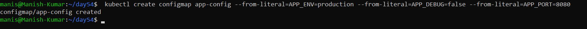

2. Inspect it with `kubectl describe configmap app-config` and `kubectl get configmap app-config -o yaml`

    ```bash
    kubectl describe configmap app-config
    ```
    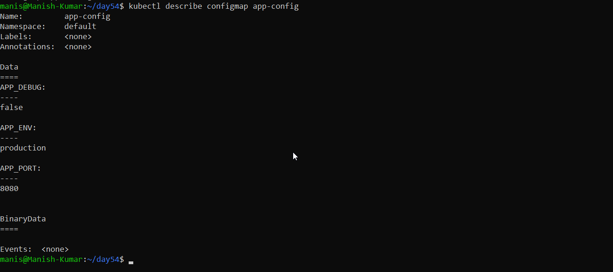

    ```bash
    kubectl get configmap app-config -o yaml
    ```
    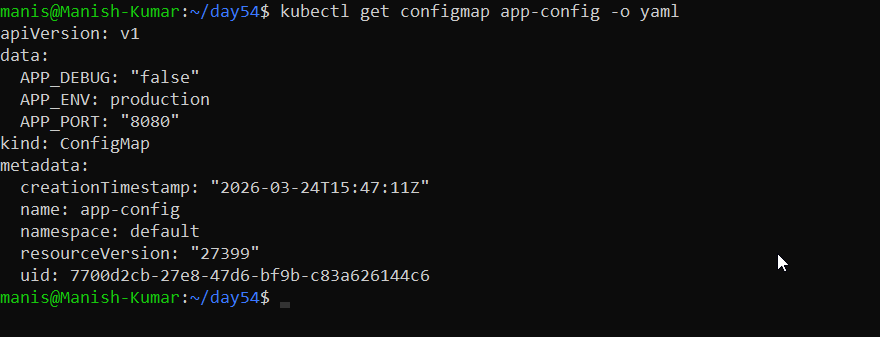

3. Notice the data is stored as plain text — no encoding, no encryption

**Verify:** Can you see all three key-value pairs? : YES

---

### Task 2: Create a ConfigMap from a File
1. Write a custom Nginx config file that adds a `/health` endpoint returning "healthy"

    [nginx-config.conf](./Manifest-files/nginx-config.conf)

2. Create a ConfigMap from this file using `kubectl create configmap nginx-config --from-file=default.conf=<your-file>`

    ```bash
    kubectl create configmap nginx-config --from-file=default.conf=nginx-config.conf
    ```
    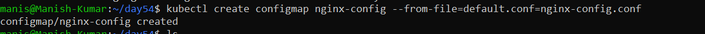

3. The key name (`default.conf`) becomes the filename when mounted into a Pod

**Verify:** Does `kubectl get configmap nginx-config -o yaml` show the file contents?   

    kubectl get configmap nginx-config -o yaml

   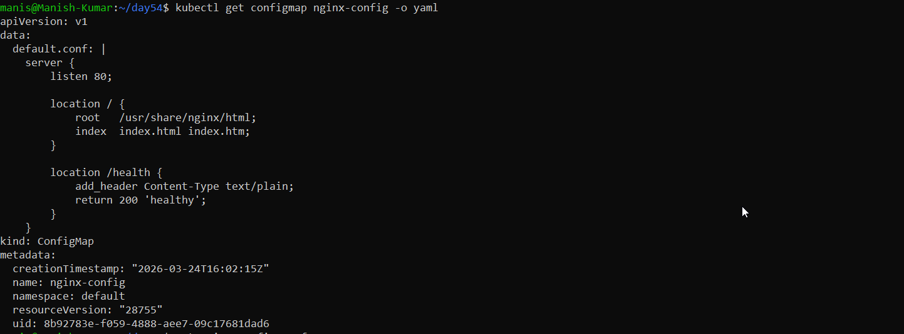

---


### Task 3: Use ConfigMaps in a Pod
1. Write a Pod manifest that uses `envFrom` with `configMapRef` to inject all keys from `app-config` as environment variables. Use a busybox container that prints the values.

    [app-config.yml](./Manifest-files/app-config.yml)

    [busybox-pod](./Manifest-files/busybox-pod.yml)

    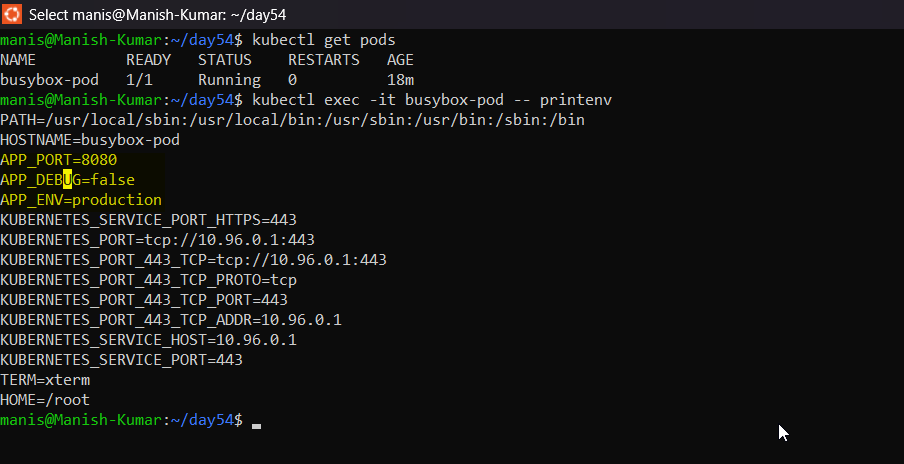

2. Write a second Pod manifest that mounts `nginx-config` as a volume at `/etc/nginx/conf.d`. Use the nginx image.

    1. Create a config map
    ```bash
    kubectl create configmap nginx-config --from-file=default.conf=nginx-config.conf
    ```
    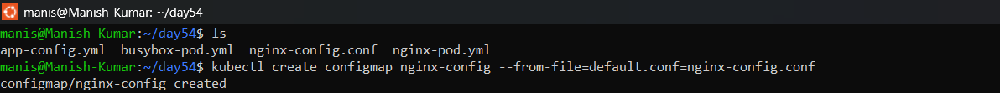

    [nginx-pod.yml](./Manifest-files/nginx-pod.yml)

    ```bash
    kubectl apply -f nginx-pod.yml
    kubectl get pods -o wide
    ```
    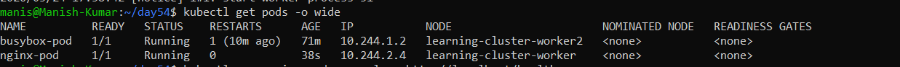

3. Test that the mounted config works: `kubectl exec <pod> -- curl -s http://localhost/health`
   
    ```bash
    kubectl exec nginx-pod -- curl -s http://localhost/health
    ```
    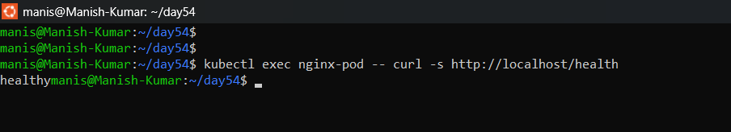
    
Use environment variables for simple key-value settings. Use volume mounts for full config files.

**Verify:** Does the `/health` endpoint respond?: YES

---

### Task 4: Create a Secret
1. Use `kubectl create secret generic db-credentials` with `--from-literal` to store `DB_USER=admin` and `DB_PASSWORD=s3cureP@ssw0rd`

    ```bash
    kubectl create secret generic db-credentials --from-literal=DB_USER=admin --from-literal=DB_PASSWORD=s3cureP@ssw0rd
    ```
    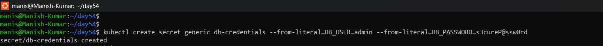

2. Inspect with `kubectl get secret db-credentials -o yaml` — the values are base64-encoded

    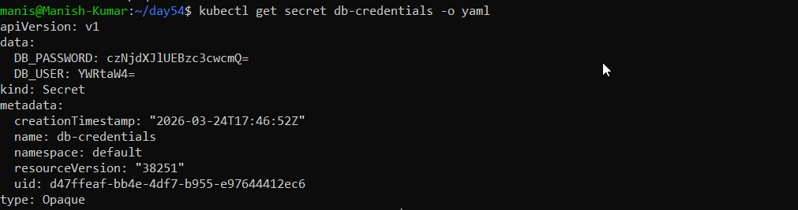

3. Decode a value: `echo '<base64-value>' | base64 --decode`
   
   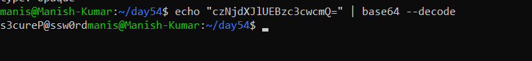

**base64 is encoding, not encryption.** Anyone with cluster access can decode Secrets. The real advantages are RBAC separation, tmpfs storage on nodes, and optional encryption at rest.

**Verify:** Can you decode the password back to plaintext? **YES**

---

### Task 5: Use Secrets in a Pod
1. Write a Pod manifest that injects `DB_USER` as an environment variable using `secretKeyRef`
2. In the same Pod, mount the entire `db-credentials` Secret as a volume at `/etc/db-credentials` with `readOnly: true`
3. Verify: each Secret key becomes a file, and the content is the decoded plaintext value

    [secret-pod.yml](./Manifest-files/secret-pod.yml)

    ```bash
    kubectl apply -f secret-pod.yml
    
    # To get the details of exection of pod
    kubectl describe pod secret-pod

    #verify Mounted files
    kubectl exec -it secret-pod -- ls /etc/db-credentials

    #Verify output as plaintext
    kubectl exec -it secret-pod -- cat /etc/db-credentials/DB_USER
    kubectl exec -it secret-pod -- cat /etc/db-credentials/DB_PASSWORD

    ```
    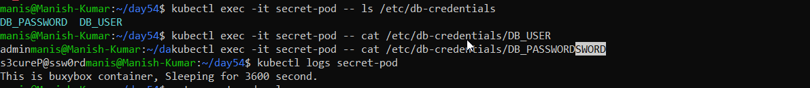

**Verify:** Are the mounted file values plaintext or base64? **YES**

---

### Task 6: Update a ConfigMap and Observe Propagation
1. Create a ConfigMap `live-config` with a key `message=hello`
   
   [live-configmap.yml](./Manifest-files/live-configmap.yml)

2. Write a Pod that mounts this ConfigMap as a volume and reads the file in a loop every 5 seconds

    [live-config-pod.yml](./Manifest-files/live-config-pod.yml)

    ```bash
    kubectl apply -f live-config-pod.yml

    kubectl get pods -o wide

    kubectl logs live-config-pod -f
    ```

    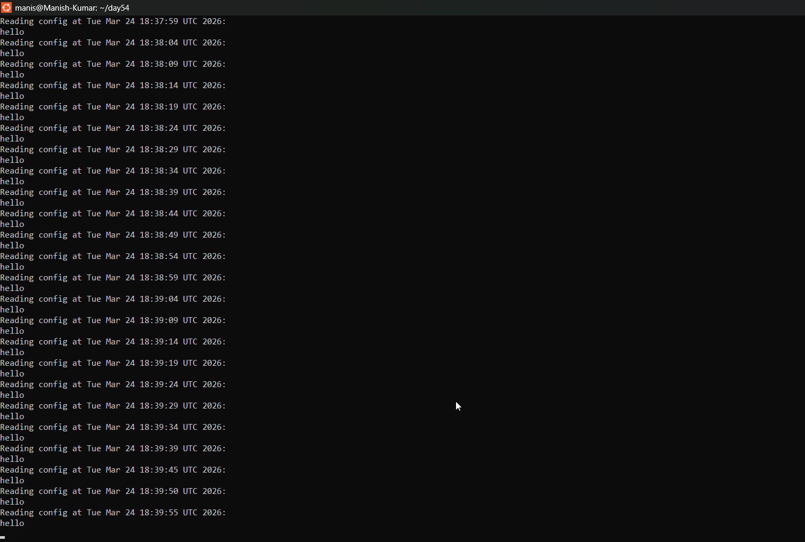

3. Update the ConfigMap: `kubectl patch configmap live-config --type merge -p '{"data":{"message":"world"}}'`

    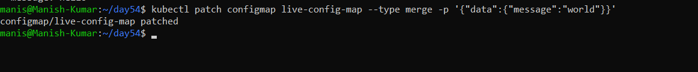

    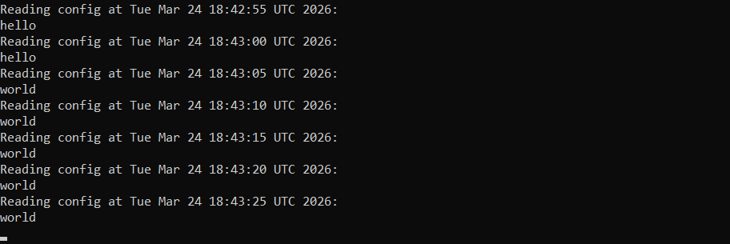

4. Wait 30-60 seconds — the volume-mounted value updates automatically
5. Environment variables from earlier tasks do NOT update — they are set at pod startup only

    ```bash
    kubectl exec -it live-config-pod -- cat /etc/config/messgae
    ```
   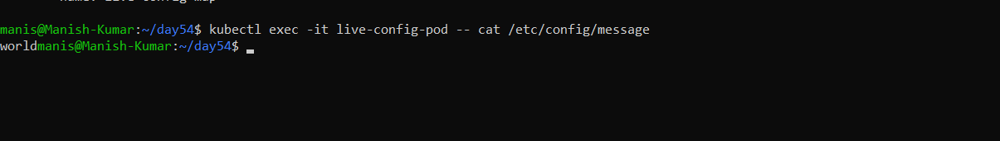
 
**Verify:** Did the volume-mounted value change without a pod restart? **YES**

---

### Task 7: Clean Up
Delete all pods, ConfigMaps, and Secrets you created.

 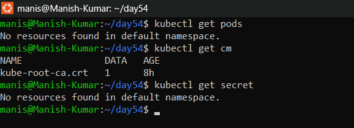
---

## Hints
- `--from-literal=KEY=VALUE` for command-line values, `--from-file=key=filename` for file contents
- `envFrom` injects all keys; `env` with `valueFrom` injects individual keys
- `echo -n 'value' | base64` — always use `-n` to avoid encoding a trailing newline
- Volume-mounted ConfigMaps/Secrets auto-update; environment variables do not
- `kubectl get secret <name> -o jsonpath='{.data.KEY}' | base64 --decode` extracts and decodes a value

---
