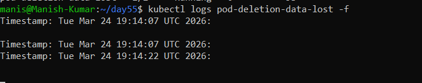
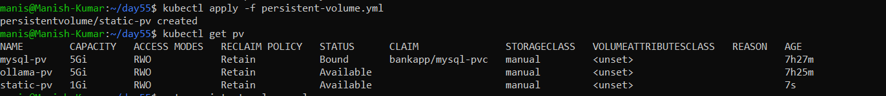
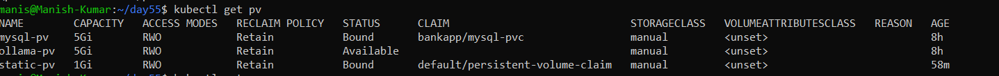
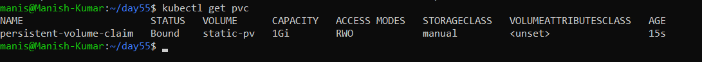
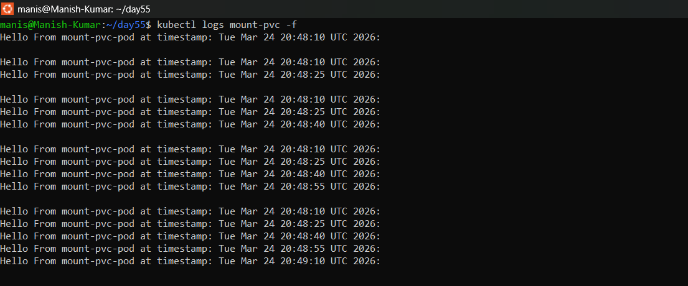
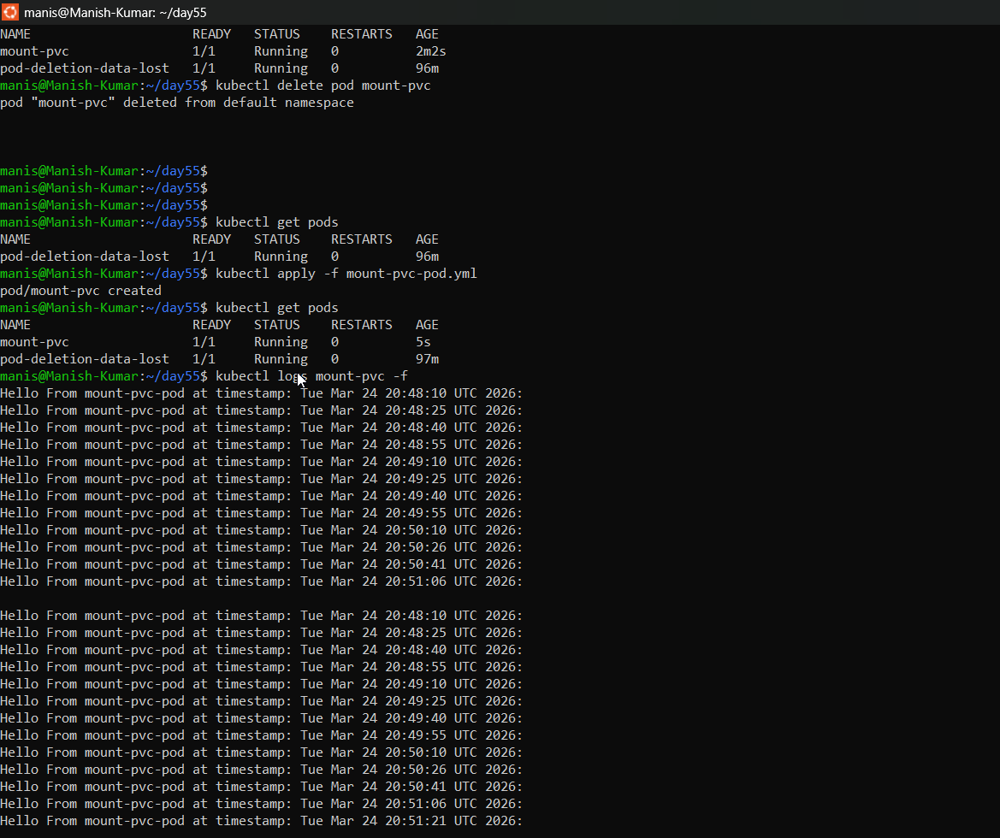
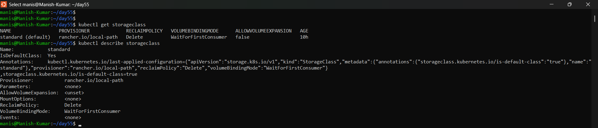
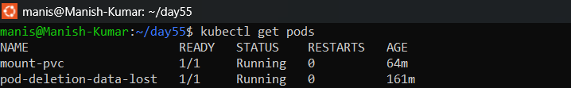
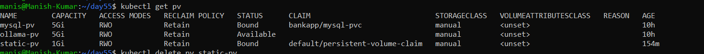

# Day 55 – Persistent Volumes (PV) and Persistent Volume Claims (PVC)

### Task 1: See the Problem — Data Lost on Pod Deletion
1. Write a Pod manifest that uses an ` ` volume and writes a timestamped message to `/data/message.txt`
   
   [pod-deletion.yml](./Manifest-files/pod-deletion.yml)

2. Apply it, verify the data exists with `kubectl exec`
3. Delete the Pod, recreate it, check the file again — the old message is gone

   

   

**Verify:** Is the timestamp the same or different after recreation?: **Timestamp is different**

---

### Task 2: Create a PersistentVolume (Static Provisioning)
1. Write a PV manifest with `capacity: 1Gi`, `accessModes: ReadWriteOnce`, `persistentVolumeReclaimPolicy: Retain`, and `hostPath` pointing to `/tmp/k8s-pv-data`
2. Apply it and check `kubectl get pv` — status should be `Available`

  [persistent-volume.yml](./Manifest-files/persistent-volume.yml)

  

Access modes to know:
- `ReadWriteOnce (RWO)` — read-write by a single node
- `ReadOnlyMany (ROX)` — read-only by many nodes
- `ReadWriteMany (RWX)` — read-write by many nodes

`hostPath` is fine for learning, not for production.

**Verify:** What is the STATUS of the PV? : **AVAILABLE**

---

### Task 3: Create a PersistentVolumeClaim
1. Write a PVC manifest requesting `500Mi` of storage with `ReadWriteOnce` access

   [persistent-volume-claim.yml](./Manifest-files/persistent-volume-claim.yml)

2. Apply it and check both `kubectl get pvc` and `kubectl get pv`
3. Both should show `Bound` — Kubernetes matched them by capacity and access mode

    ```bash
    kubectl get pv
    ```
   

    ```bash
    kubectl get pvc
    ```
   

**Verify:** What does the VOLUME column in `kubectl get pvc` show? : Shows name of persistent volume.

---

### Task 4: Use the PVC in a Pod — Data That Survives
1. Write a Pod manifest that mounts the PVC at `/data` using `persistentVolumeClaim.claimName`
   
   [mount-pvc-pod.yml](./Manifest-files/mount-pvc-pod.yml)

2. Write data to `/data/message.txt`, then delete and recreate the Pod
3. Check the file — it should contain data from both Pods

   

   

**Verify:** Does the file contain data from both the first and second Pod?: **Yes file contains the log from first and second pod.**

---

### Task 5: StorageClasses and Dynamic Provisioning
1. Run `kubectl get storageclass` and `kubectl describe storageclass`
2. Note the provisioner, reclaim policy, and volume binding mode

    ```bash
    PROVISIONER : rancher.io/local-path
    RECLAIMPOLICY: Delete
    VOLUMEBINDINGMODE: WaitForFirstConsumer
    ```
3. With dynamic provisioning, developers only create PVCs — the StorageClass handles PV creation automatically

   

**Verify:** What is the default StorageClass in your cluster? : **MANUAL**

---

### Task 6: Dynamic Provisioning
1. Write a PVC manifest that includes `storageClassName: standard` (or your cluster's default)
   
   [dynamic-pvc.yml](./Manifest-files/dynamic-pvc.yml)

2. Apply it — a PV should appear automatically in `kubectl get pv`
3. Use this PVC in a Pod, write data, verify it works

   [dynamic-pod.yml](./Manifest-files/dynamic-pod.yml)

**Verify:** How many PVs exist now? Which was manual, which was dynamic?

---

### Task 7: Clean Up
1. Delete all pods first

    

    

2. Delete PVCs — check `kubectl get pv` to see what happened

    

    

3. The dynamic PV is gone (Delete reclaim policy). The manual PV shows `Released` (Retain policy).
4. Delete the remaining PV manually

**Verify:** Which PV was auto-deleted and which was retained? Why?

---

## Hints
- PVs are cluster-wide (not namespaced), PVCs are namespaced
- PV status: `Available` -> `Bound` -> `Released`
- If a PVC stays `Pending`, check for matching capacity and access modes
- `hostPath` data is lost if the Pod moves to a different node
- `storageClassName: ""` disables dynamic provisioning
- Reclaim policies: `Retain` (keep data) vs `Delete` (remove data)

---
