# Day 56 – Kubernetes StatefulSets

### Task 1: Understand the Problem
1. Create a Deployment with 3 replicas using nginx
   
   [nginx-deployment.yml](./Manifest-files/nginx-deployment.yml)

2. Check the pod names — they are random (`app-xyz-abc`)
   
   ```bash
   kubectl apply -f nginx-deployment.yml

   kubectl get pods -o wide
   ```

   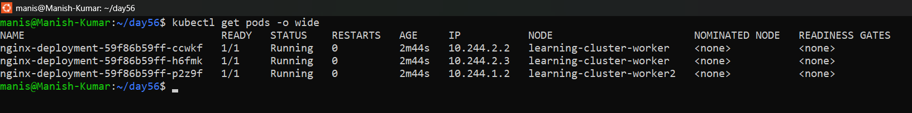

3. Delete a pod and notice the replacement gets a different random name

    ```bash
    kubectl delete pod <name-of-pod>
    ```
    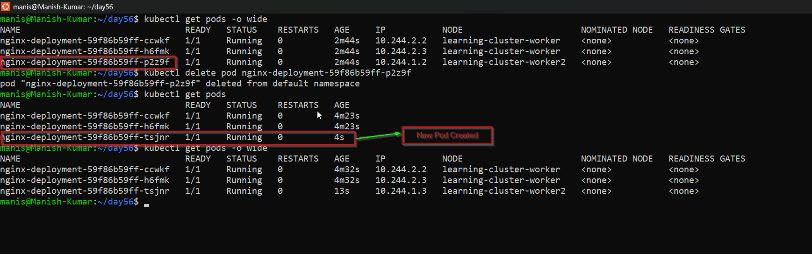

This is fine for web servers but not for databases where you need stable identity.

| Feature          | Deployment         | StatefulSet                            |
| ---------------- | ------------------ | -------------------------------------- |
| Pod names        | Random             | Stable, ordered (`app-0`, `app-1`)     |
| Startup order    | All at once        | Ordered: pod-0, then pod-1, then pod-2 |
| Storage          | Shared PVC         | Each pod gets its own PVC              |
| Network identity | No stable hostname | Stable DNS per pod                     |

Delete the Deployment before moving on.

   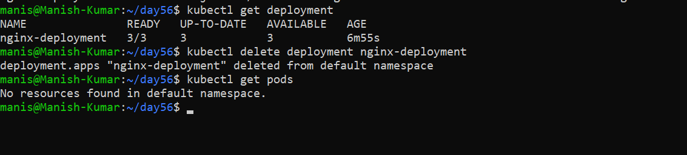

**Verify:** Why would random pod names be a problem for a database cluster?
 - Random pod names are a problem for database clusters because databases are stateful — they care deeply about identity, not    just existence.

---

### Task 2: Create a Headless Service
1. Write a Service manifest with `clusterIP: None` — this is a Headless Service
   
   [mysql-headless-service.yml](./Manifest-files/mysql-headless-service.yml)

2. Set the selector to match the labels you will use on your StatefulSet pods
3. Apply it and confirm CLUSTER-IP shows `None`
   
   ```bash
    kubectl apply -f mysql-headless-service.yml

    kubectl get svc
   ```
  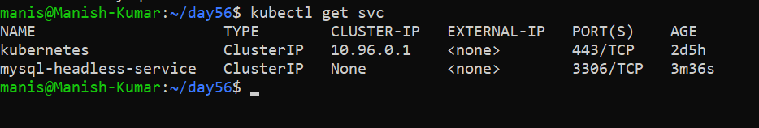

A Headless Service creates individual DNS entries for each pod instead of load-balancing to one IP. StatefulSets require this.

**Verify:** What does the CLUSTER-IP column show?
 
  - That's the literal value Kubernetes displays in the CLUSTER-IP column for a headless service — not an IP address, not empty, but the string None. That's your confirmation that no virtual IP was allocated and the service is behaving as headless.

**What you just created and why it matters:**

 - A normal Service gets a virtual IP that kube-proxy load-balances across all matching pods. With `clusterIP: None`, Kubernetes skips that entirely. Instead, a DNS lookup for the Service returns the individual pod IPs directly.
---

### Task 3: Create a StatefulSet
1. Write a StatefulSet manifest with `serviceName` pointing to your Headless Service

    [nginx-headless-service](./Manifest-files/nginx-headless-service.yml)

    [statefulset](./Manifest-files/stateful.yml)

2. Set replicas to 3, use the nginx image
3. Add a `volumeClaimTemplates` section requesting 100Mi of ReadWriteOnce storage
4. Apply and watch: `kubectl get pods -l <your-label> -w`
   
    ```bash
    kubectl apply -f statefulset.yml
    ```
    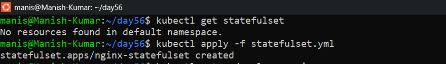

    ```bash
    kubectl get pods -l app=nginx -w
    ```
    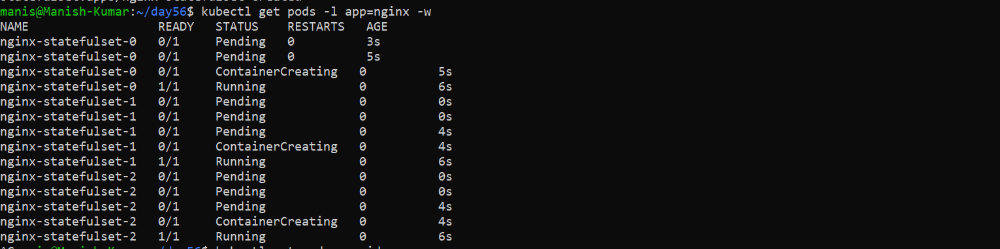

Observe ordered creation — `web-0` first, then `web-1` after `web-0` is Ready, then `web-2`. **Yes Pods were created one by one in sequence**

Check the PVCs: `kubectl get pvc` — you should see `web-data-web-0`, `web-data-web-1`, `web-data-web-2` (names follow the pattern `<template-name>-<pod-name>`).

   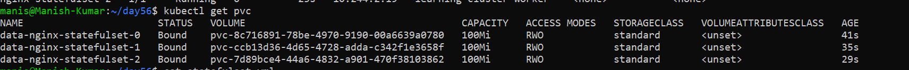

**Verify:** What are the exact pod names and PVC names?

**POD Name: =** 'nginx-statefulset-0', 'nginx-statefulset-1', 'nginx-statefulset-2'
**PVC Name: =** 'data-nginx-statefulset-0', 'data-nginx-statefulset-1', 'data-nginx-statefulset-2'

---

### Task 4: Stable Network Identity
Each StatefulSet pod gets a DNS name: `<pod-name>.<service-name>.<namespace>.svc.cluster.local`

1. Run a temporary busybox pod and use `nslookup` to resolve `web-0.<your-headless-service>.default.svc.cluster.local`

    ```bash
    kubectl run busybox --image=busybox:1.28 --rm -it --restart=Never -- sh

    nginx-statefulset-0.nginx-headless-service.default.svc.cluster.local
    nginx-statefulset-1.nginx-headless-service.default.svc.cluster.local
    nginx-statefulset-2.nginx-headless-service.default.svc.cluster.local
    ```
    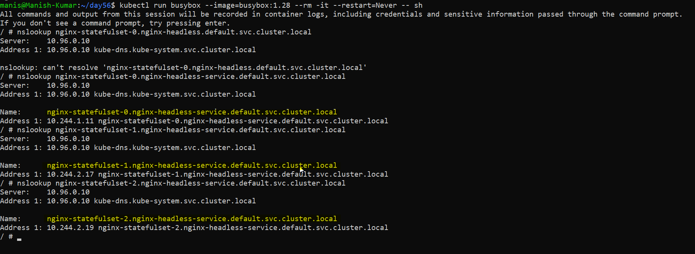

2. Do the same for `web-1` and `web-2`
3. Confirm the IPs match `kubectl get pods -o wide`

    ```bash
    kubectl get pods -o wide
    ```
   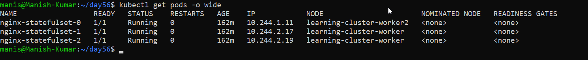

**Verify:** Does the nslookup IP match the pod IP?: **YES**

---

### Task 5: Stable Storage — Data Survives Pod Deletion
1. Write unique data to each pod: `kubectl exec web-0 -- sh -c "echo 'Data from web-0' > /usr/share/nginx/html/index.html"`

    ```bash
    kubectl exec nginx-statefulset-0 -- sh -c "echo 'Data from nginx-statefulset-0' > /usr/share/nginx/html/index.html"

    kubectl exec -it nginx-statefulset-0 -- sh

    cat /usr/share/nginx/html/index.html
    ```
    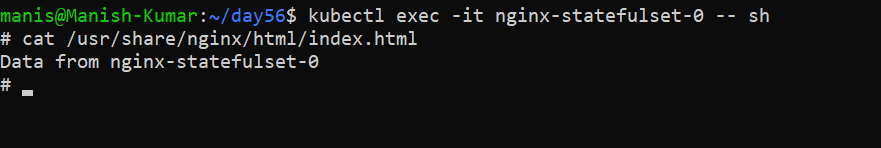

2. Delete `web-0`: `kubectl delete pod web-0`

    ```bash
    kubectl delete pod nginx-statefulset-o
    ```
    

3. Wait for it to come back, then check the data — it should still be "Data from web-0"

    ```bash
    kubectl get pods -o wide

    kubectl exec -it nginx-statefulset-0 -- sh

    cat /usr/share/nginx/html/index.html
    ```
    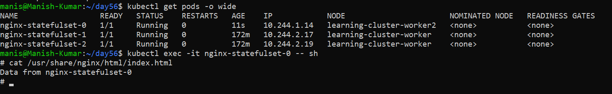

The new pod reconnected to the same PVC.

**Verify:** Is the data identical after pod recreation? : **YES**

---

### Task 6: Ordered Scaling
1. Scale up to 5: `kubectl scale statefulset web --replicas=5` — pods create in order (web-3, then web-4)
   
    ```bash
    kubectl scale statefulset nginx-statefulset --replicas=5
    ```
    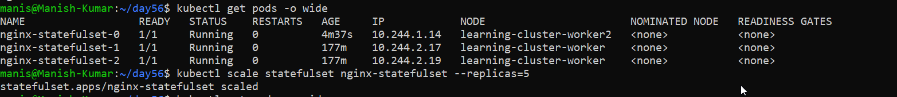

    ```bash
    kubectl get pods -o wide
    ```
    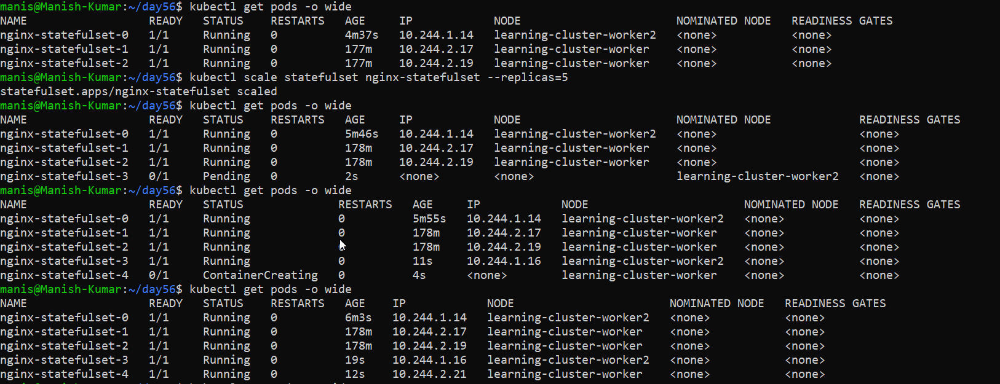

2. Scale down to 3 — pods terminate in reverse order (web-4, then web-3)

     ```bash
    kubectl scale statefulset nginx-statefulset --replicas=3

    kubectl get pods -o wide
    ```
    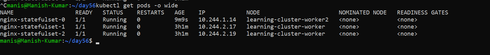


3. Check `kubectl get pvc` — all five PVCs still exist. Kubernetes keeps them on scale-down so data is preserved if you scale back up.

     ```bash
    kubectl get pvc
    ```
    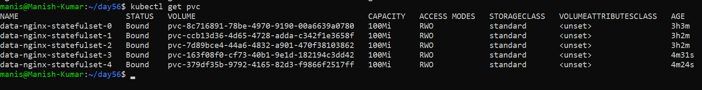

**Verify:** After scaling down, how many PVCs exist? : **Total 5 PVCs exist.**
---

### Task 7: Clean Up
1. Delete the StatefulSet and the Headless Service

     ```bash
    kubectl get statefulset

    kubectl delete statefulset nginx-statefulset

    kubectl get svc

    kubectl delete svc nginx-headless-service

    kubectl delete svc mysql-headless-service
    ```
    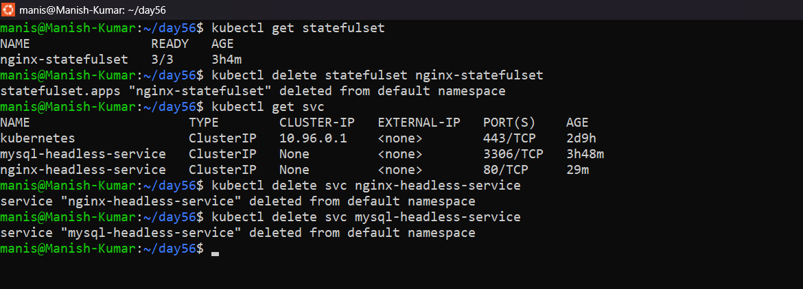

2. Check `kubectl get pvc` — PVCs are still there (safety feature)

    ```bash
    kubectl get pvc
    ```
    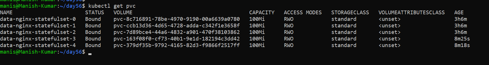

3. Delete PVCs manually

    ```bash
    kubectl delete pvc data-nginx-statefulset-0
    kubectl delete pvc data-nginx-statefulset-1
    kubectl delete pvc data-nginx-statefulset-2
    kubectl delete pvc data-nginx-statefulset-3
    kubectl delete pvc data-nginx-statefulset-4
    ```
    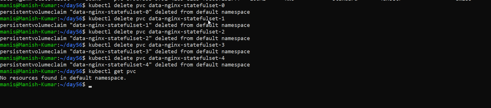

**Verify:** Were PVCs auto-deleted with the StatefulSet?: **NO**

  - This behavior is actually very useful in production. If you accidentally delete a StatefulSet, you can recreate it and it will reattach to the existing PVCs and recover all your data.

---

## Hints
- `kubectl get sts` is the short name for StatefulSets
- `serviceName` must match an existing Headless Service
- Pod DNS: `<pod-name>.<service-name>.<namespace>.svc.cluster.local`
- PVC naming: `<template-name>-<statefulset-name>-<ordinal>`
- Pods create in order (0, 1, 2) and terminate in reverse (2, 1, 0)
- Scaling down does not delete PVCs — data is preserved
- Deleting a StatefulSet does not delete PVCs — clean up separately

---
