# Day 57 – Resource Requests, Limits, and Probes

### Task 1: Resource Requests and Limits
1. Write a Pod manifest with `resources.requests` (cpu: 100m, memory: 128Mi) and `resources.limits` (cpu: 250m, memory: 256Mi)

    [pod-level-resource-burstable.yml](./Manifest-files/pod-level-resource-burstable.yml)

    ```bash
    kubectl apply -f pod-level-resource.yml
    ```
    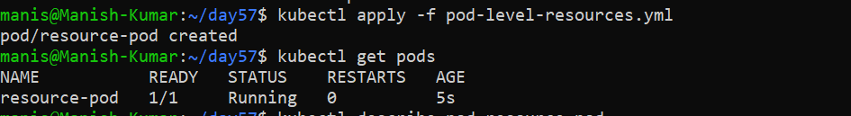

2. Apply and inspect with `kubectl describe pod` — look for the Requests, Limits, and QoS Class sections

    ```bash
    kubectl describe pod resource-pod
    ```
    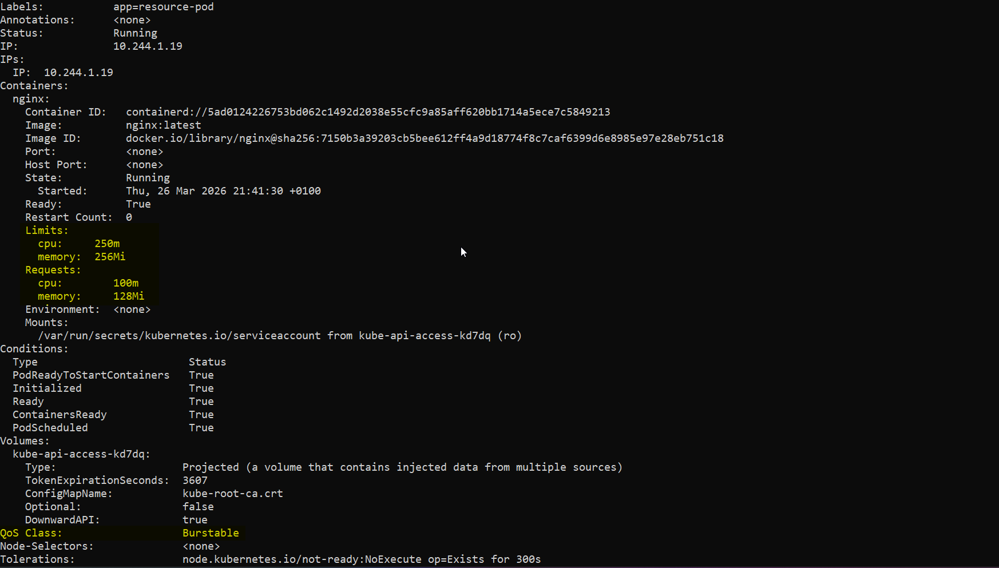

3. Since requests and limits differ, the QoS class is `Burstable`. If equal, it would be `Guaranteed`. If missing, `BestEffort`.

    **Qos: GUARANTEED**
    [pod-level-resource-guaranteed.yml](./Manifest-files/pod-level-resource-guaranteed.yml)

    ```bash
    kubectl apply -f pod-level-resource-guaranteed.yml

    kubectl get pods
    ```
    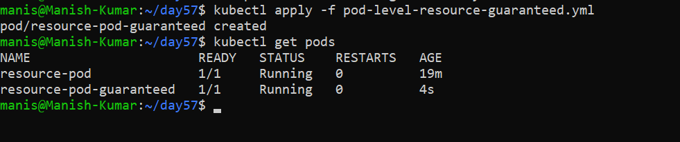

     ```bash
    kubectl describe pod resource-pod-guaranteed
    ```
    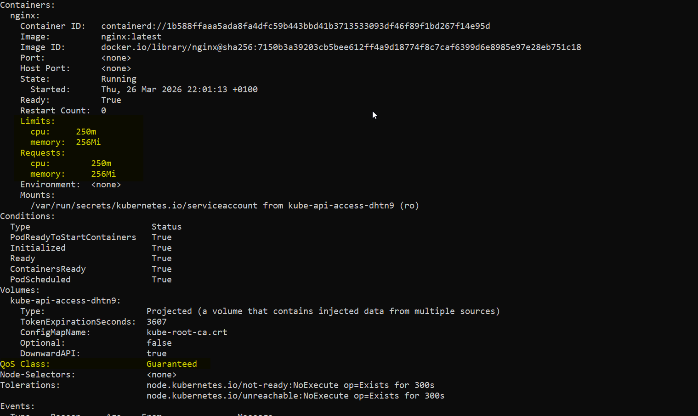

    **Qos: BESTEFFORT**
    [pod-level-resource-besteffort.yml](./Manifest-files/pod-level-resource-besteffort.yml)

    ```bash
    kubectl apply -f pod-level-resource-besteffort.yml

    kubectl get pods
    ```
    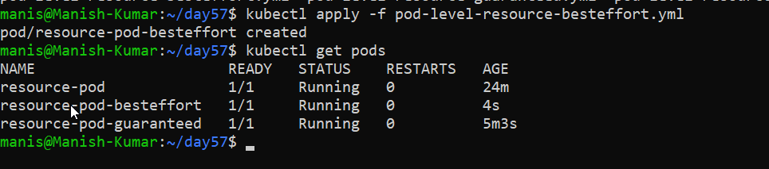

     ```bash
    kubectl describe pod resource-pod-besteffort
    ```
    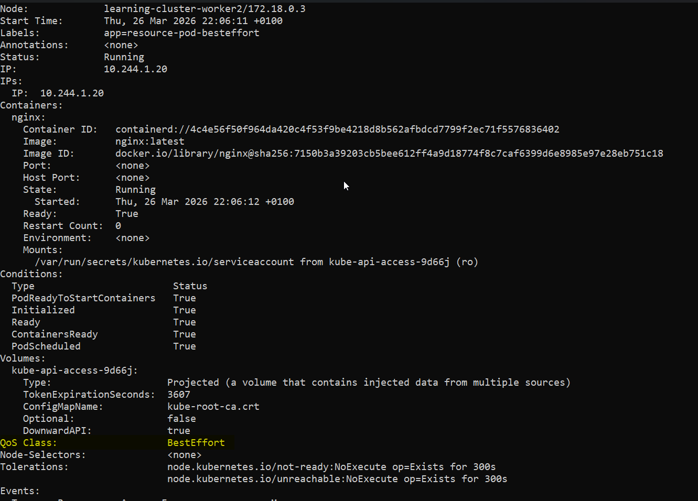

CPU is in millicores: `100m` = 0.1 CPU. Memory is in mebibytes: `128Mi`.

**Requests** = guaranteed minimum (scheduler uses this for placement). **Limits** = maximum allowed (kubelet enforces at runtime).

**Verify:** What QoS class does your Pod have?

---

### Task 2: OOMKilled — Exceeding Memory Limits
1. Write a Pod manifest using the `polinux/stress` image with a memory limit of `100Mi`
2. Set the stress command to allocate 200M of memory: `command: ["stress"] args: ["--vm", "1", "--vm-bytes", "200M", "--vm-hang", "1"]`

    [oomkilled-pod.yml](./Manifest-files/oomkilled-pod.yml)

3. Apply and watch — the container gets killed immediately

    ```bash
    kubectl apply -f oomkilled-pod.yml

    kubectl get pods
    ```
    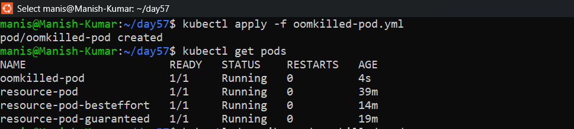
    
CPU is throttled when over limit. Memory is killed — no mercy.

Check `kubectl describe pod` for `Reason: OOMKilled` and `Exit Code: 137` (128 + SIGKILL).
    
   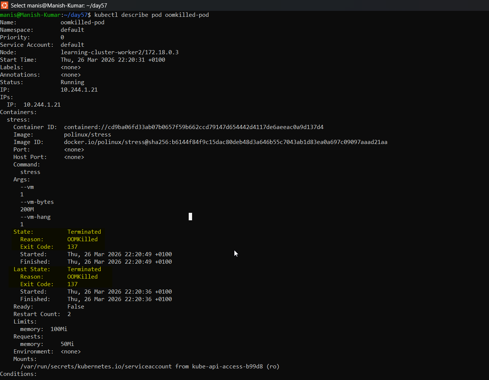

**Verify:** What exit code does an OOMKilled container have?: **137**

---

### Task 3: Pending Pod — Requesting Too Much
1. Write a Pod manifest requesting `cpu: 100` and `memory: 128Gi`
   
   [pending-pod.yml](./Manifest-files/pending-pod.yml)

2. Apply and check — STATUS stays `Pending` forever
   
   ```bash
   kubectl apply -f pending-pod.yml

   kubectl get pods
   ```
   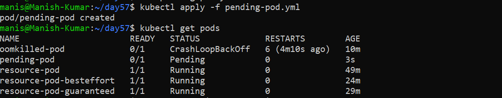

3. Run `kubectl describe pod` and read the Events — the scheduler says exactly why: insufficient resources

   ```bash
   kubectl describe pod pending-pod
   ```
   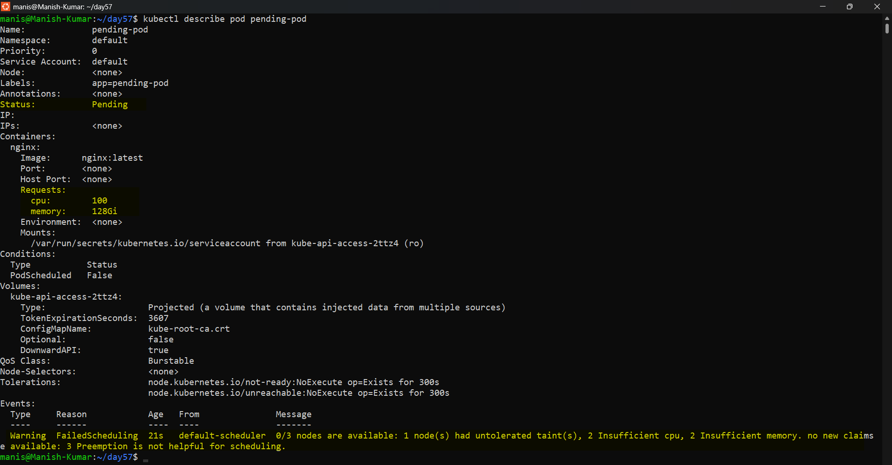

**Verify:** What event message does the scheduler produce?
 
  - 0/3 nodes are available: 1 node(s) had untolerated taint(s), 2 Insufficient cpu, 2 Insufficient memory. no new claims to deallocate, preemption: 0/3 nodes are available: 3 Preemption is not helpful for scheduling.

**The key distinction from OOMKilled:**

|                 | Pending                           | OOMKilled                         |
| --------------- | --------------------------------- | --------------------------------- |
| When it happens | Before pod starts                 | After pod starts                  |
| Reason          | No node has enough resources      | Pod exceeded its limit at runtime |
| Who enforces    | Scheduler                         | Kubelet / Linux kernel            |
| Fix             | Lower requests or add bigger node | Raise limits or fix memory leak   |
---

### Task 4: Liveness Probe
A liveness probe detects stuck containers. If it fails, Kubernetes restarts the container.

1. Write a Pod manifest with a busybox container that creates `/tmp/healthy` on startup, then deletes it after 30 seconds
2. Add a liveness probe using `exec` that runs `cat /tmp/healthy`, with `periodSeconds: 5` and `failureThreshold: 3`

    [livenessprobe-pod.yml](./Manifest-files/livenessprobe-pod.yml)

    ```bash
    kubectl apply -f livenessprobe-pod.yml
    ```
    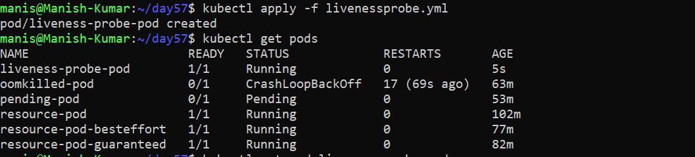

3. After the file is deleted, 3 consecutive failures trigger a restart. Watch with `kubectl get pod -w`

    ```bash
    kubectl get pod liveness-probe-pod -w
    ```
    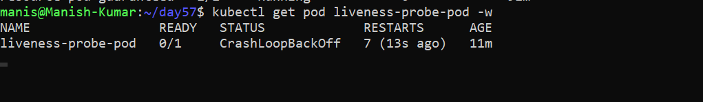

**Verify:** How many times has the container restarted?: It will run infinite time every after 5 seconds.

---

### Task 5: Readiness Probe
A readiness probe controls traffic. Failure removes the Pod from Service endpoints but does NOT restart it.

1. Write a Pod manifest with nginx and a `readinessProbe` using `httpGet` on path `/` port `80`

   [readinessprobe-pod.yml](./Manifest-files/readinessprobe-pod.yml)

   ```bash
   kubectl apply -f readinessprobe-pod.yml
   ```
   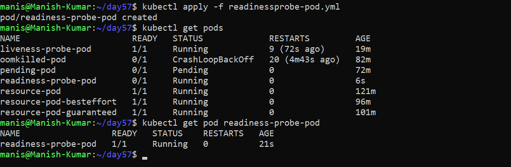

2. Expose it as a Service: `kubectl expose pod <name> --port=80 --name=readiness-svc`
   
   ```bash
   kubectl expose pod readiness-probe-pod --port=80 --name=readiness-svc
   ```
   

3. Check `kubectl get endpoints readiness-svc` — the Pod IP is listed
   
   ```bash
   kubectl get endpoints readieness-svc
   ```
   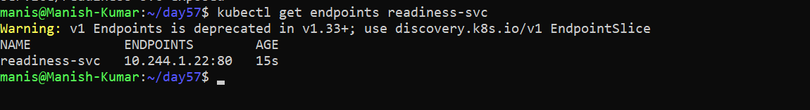

4. Break the probe: `kubectl exec <pod> -- rm /usr/share/nginx/html/index.html`
   
   ```bash
   kubectl exec readiness-probe-pod -- rm /usr/share/nginx/html/index.html
   ```
5. Wait 15 seconds — Pod shows `0/1` READY, endpoints are empty, but the container is NOT restarted

   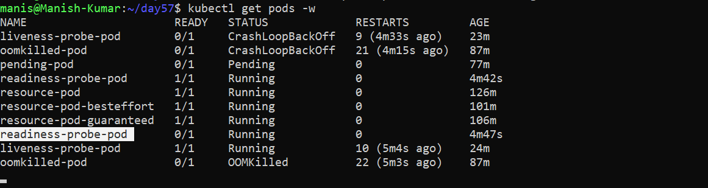

   ```bash
   kubectl get endpoints readiness-svc
   ```
   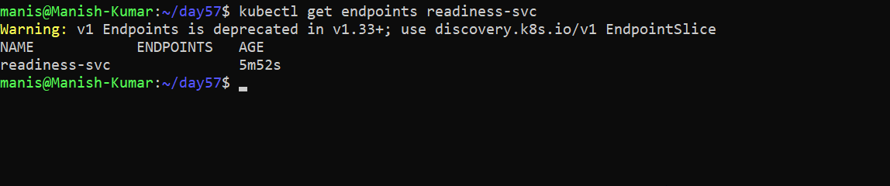

   ```bash
   kubectl describe pod readiness-probe-pod
   ```
   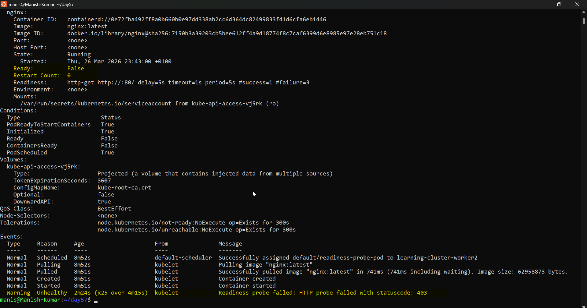

**Verify:** When readiness failed, was the container restarted?: **No, the container was not restarted.**

---

### Task 6: Startup Probe
A startup probe gives slow-starting containers extra time. While it runs, liveness and readiness probes are disabled.

1. Write a Pod manifest where the container takes 20 seconds to start (e.g., `sleep 20 && touch /tmp/started`)
2. Add a `startupProbe` checking for `/tmp/started` with `periodSeconds: 5` and `failureThreshold: 12` (60 second budget)
3. Add a `livenessProbe` that checks the same file — it only kicks in after startup succeeds

   [startupprobe-pod.yml](./Manifest-files/startupprobe-pod.yml)
   
**Verify:** What would happen if `failureThreshold` were 2 instead of 12?
 
   - If we add `failureThreshold:2` then, Pod gets killed at 10 seconds but app needs 20 seconds — so it never gets enough time to reach touch /tmp/started. Hence infinite restart loop.

    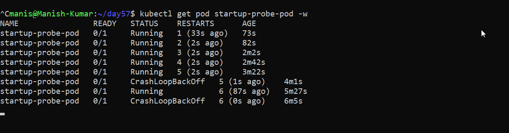

---

### Task 7: Clean Up
Delete all pods and services you created.

## NOTES ##

| Probe     | When it runs                          | What it checks                             | On Failure                     | Restarts Container? |
| --------- | ------------------------------------- | ------------------------------------------ | ------------------------------ | ------------------- |
| Startup   | First — before liveness and readiness | Is the app done starting?                  | Restarts container             | Yes                 |
| Liveness  | After startup probe passes            | Is the container alive and healthy?        | Restarts container             | Yes                 |
| Readiness | After startup probe passes            | Is the container ready to receive traffic? | Removes from Service endpoints | No                  |
---

## Hints
- CPU is compressible (throttled); memory is incompressible (OOMKilled)
- CPU: `1` = 1 core = `1000m`. Memory: `Mi` (mebibytes), `Gi` (gibibytes)
- QoS: Guaranteed (requests == limits), Burstable (requests < limits), BestEffort (none set)
- Probe types: `httpGet`, `exec`, `tcpSocket`
- Liveness failure = restart. Readiness failure = remove from endpoints. Startup failure = kill.
- `initialDelaySeconds`, `periodSeconds`, `failureThreshold` control probe timing
- Exit code 137 = OOMKilled (128 + SIGKILL)

---
