# Day 58 – Metrics Server and Horizontal Pod Autoscaler (HPA)

## Challenge Tasks

### Task 1: Install the Metrics Server
1. Check if it is already running: `kubectl get pods -n kube-system | grep metrics-server`
2. If not, install it:
   - Minikube: `minikube addons enable metrics-server`
   - Kind/kubeadm: apply the official manifest from the metrics-server GitHub releases

    ```bash
    kubectl apply -f https://github.com/kubernetes-sigs/metrics-server/releases/latest/download/components.yaml
    ```
    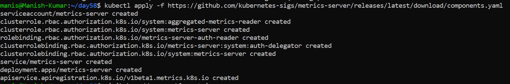

3. On local clusters, you may need the `--kubelet-insecure-tls` flag (never in production)
   
    ```bash
    kubectl patch deployment metrics-server -n kube-system \
    --type='json' \
    -p='[{"op":"add","path":"/spec/template/spec/containers/0/args/-","value":"--kubelet-insecure-tls"}]'
    ```
    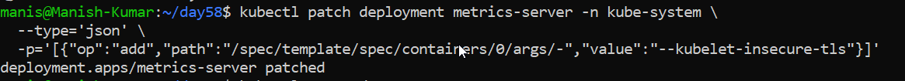

    ```bash
    kubectl get pods -n kube-system -w | grep metrics-server
    ```
    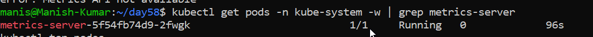

4. Wait 60 seconds, then verify: `kubectl top nodes` and `kubectl top pods -A`

    ```bash
    kubectl top nodes
    ```
    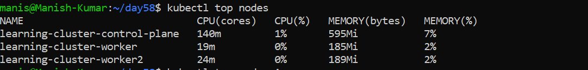

**Verify:** What is the current CPU and memory usage of your node?

**Metrics Server:** Metrics Server is the foundation for autoscaling in Kubernetes. Without it, HPA and VPA are blind, and you can't inspect live resource usage with kubectl top.

---

### Task 2: Explore kubectl top
1. Run `kubectl top nodes`, `kubectl top pods -A`, `kubectl top pods -A --sort-by=cpu`
2. `kubectl top` shows real-time usage, not requests or limits — these are different things
3. Data comes from the Metrics Server, which polls kubelets every 15 seconds

**Verify:** Which pod is using the most CPU right now?

---

### Task 3: Create a Deployment with CPU Requests
1. Write a Deployment manifest using the `registry.k8s.io/hpa-example` image (a CPU-intensive PHP-Apache server)
2. Set `resources.requests.cpu: 200m` — HPA needs this to calculate utilization percentages
   
   [php-apache.yml](./Manifest-files/php-apache.yml)

   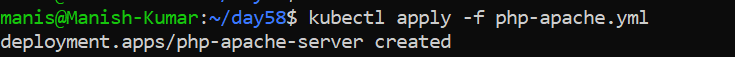

3. Expose it as a Service: `kubectl expose deployment php-apache --port=80`
   
   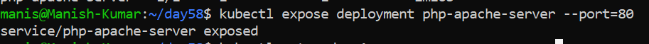

   ```bash
   kubectl get svc php-apache-server
   ```
   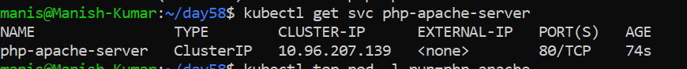

Without CPU requests, HPA cannot work — this is the most common HPA setup mistake.

**Verify:** What is the current CPU usage of the Pod?

    ```bash
    kubectl top pod -l run=php-apache
    ```
   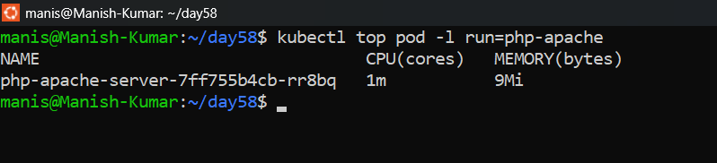

---

### Task 4: Create an HPA (Imperative)
1. Run: `kubectl autoscale deployment php-apache --cpu-percent=50 --min=1 --max=10`

    ```bash
    kubectl autoscale deployment php-apache-server --cpu-percent=50 --min=1 --max=10
    ```
    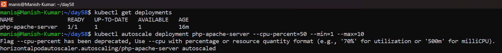

2. Check: `kubectl get hpa` and `kubectl describe hpa php-apache`
   
   ```bash
   kubectl get hpa
   ```
   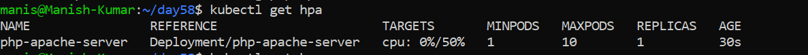

   ```bash
   kubectl describe hpa php-apache-server
   ```
   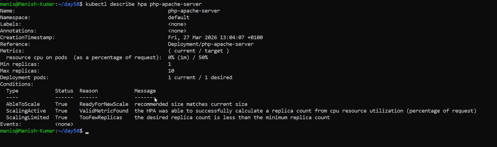

3. TARGETS may show `<unknown>` initially — wait 30 seconds for metrics to arrive

This scales up when average CPU exceeds 50% of requests, and down when it drops below.

**Verify:** What does the TARGETS column show? : **cpu: 0%/50%**

---

### Task 5: Generate Load and Watch Autoscaling
1. Start a load generator: `kubectl run load-generator --image=busybox:1.36 --restart=Never -- /bin/sh -c "while true; do wget -q -O- http://php-apache; done"`
   
    ```bash
    kubectl run load-generator --image=busybox:1.36 --restart=Never -- /bin/sh -c "while true; do wget -q -O- http://php-apache-server; done
    ```
    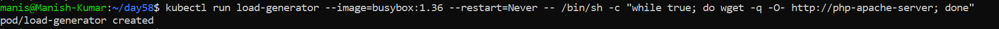

2. Watch HPA: `kubectl get hpa php-apache --watch`
   
    ```bash
    kubectl get hpa php-apache-server --watch
    ```
3. Over 1-3 minutes, CPU climbs above 50%, replicas increase, CPU stabilizes
   
    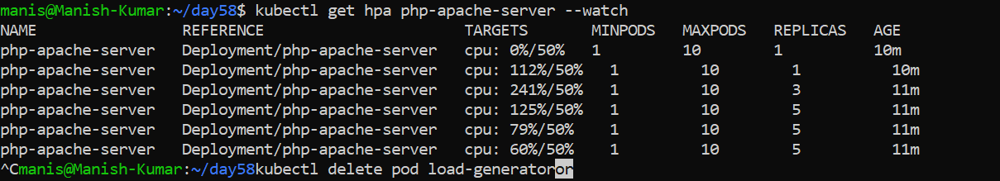

4. Stop the load: `kubectl delete pod load-generator`
   
    ```bash
    kubectl delete pod load-generator
    ```
    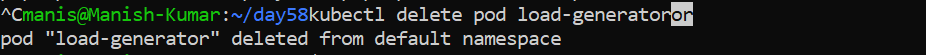

5. Scale-down is slow (5-minute stabilization window) — you do not need to wait

    ```bash
    kubectl get hpa php-apache-server --watch
    ```
    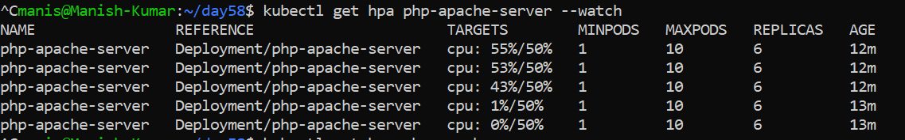

    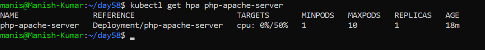

**Verify:** How many replicas did HPA scale to under load? : **Created 6 replicas.**

---

### Task 6: Create an HPA from YAML (Declarative)
1. Delete the imperative HPA: `kubectl delete hpa php-apache`
   
   ```bash
   kubectl get hpa

   kubectl delete hpa php-apache-server

   kubectl get hpa
   ```
   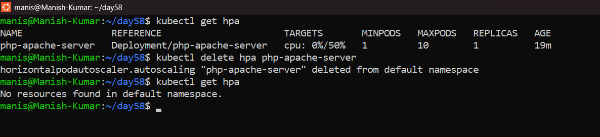

2. Write an HPA manifest using `autoscaling/v2` API with CPU target at 50% utilization
3. Add a `behavior` section to control scale-up speed (no stabilization) and scale-down speed (300 second window)
   
   [hpa.yml](./Manifest-files/hpa.yml)

4. Apply and verify with `kubectl describe hpa`

    ```bash
    kubectl apply -f hpa.yml
    ```
    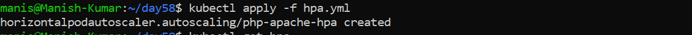

    ```bash
    kubectl get hpa
    ```
    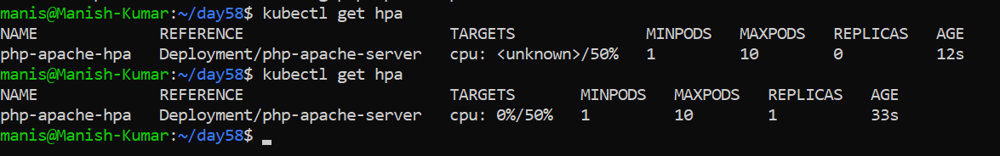

      ```bash
    kubectl describe hpa
    ```
    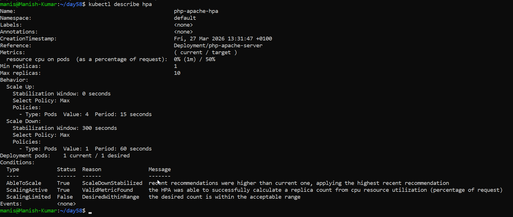

`autoscaling/v2` supports multiple metrics and fine-grained scaling behavior that the imperative command cannot configure.

**Verify:** What does the `behavior` section control?: **Control the scale up and scale down when needed.**

---

### Task 7: Clean Up
Delete the HPA, Service, Deployment, and load-generator pod. Leave the Metrics Server installed.

    ```bash
    kubectl get hpa

    kubectl delete hpa php-apache-hpa

    kubectl get svc

    kubectl delete svc php-apache-server

    kubectl get deployment

    kubectl delete deployment php-apache-server

    kubectl get pods

    kubectl delete pod load-generator
    ```

   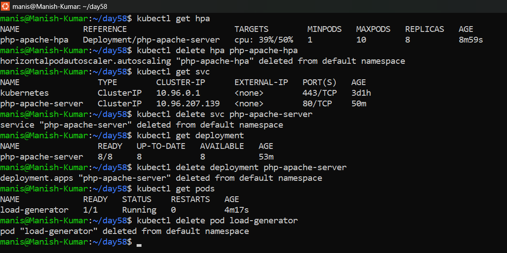
---

### Notes ###

 - Horizontal scaling means that the response to increased load is to deploy more Pods.
   
   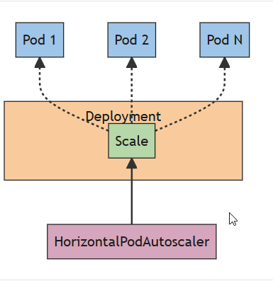

## Hints
- HPA requires `resources.requests` — without them TARGETS shows `<unknown>`
- `kubectl top` = actual usage. `kubectl describe pod` = configured requests/limits
- HPA checks every 15 seconds. Scale-up is fast, scale-down has a 5-minute stabilization window
- `autoscaling/v1` = CPU only. `autoscaling/v2` = CPU + memory + custom metrics
- Formula: `desiredReplicas = ceil(currentReplicas * (currentUsage / targetUsage))`
- HPA works with Deployments, StatefulSets, and ReplicaSets

---
