# Day 59 – Helm — Kubernetes Package Manager

## Challenge Tasks

### Task 1: Install Helm
1. Install Helm (brew, curl script, or chocolatey depending on your OS)
2. Verify with `helm version` and `helm env`

   ```bash
   sudo snap install helm --classic
   ```
   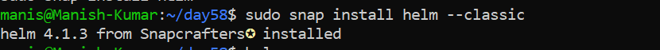

Three core concepts:
- **Chart** — a package of Kubernetes manifest templates
- **Release** — a specific installation of a chart in your cluster
- **Repository** — a collection of charts (like a package repo)

**Verify:** What version of Helm is installed?

   ```bash
   helm version

   helm env
   ```
   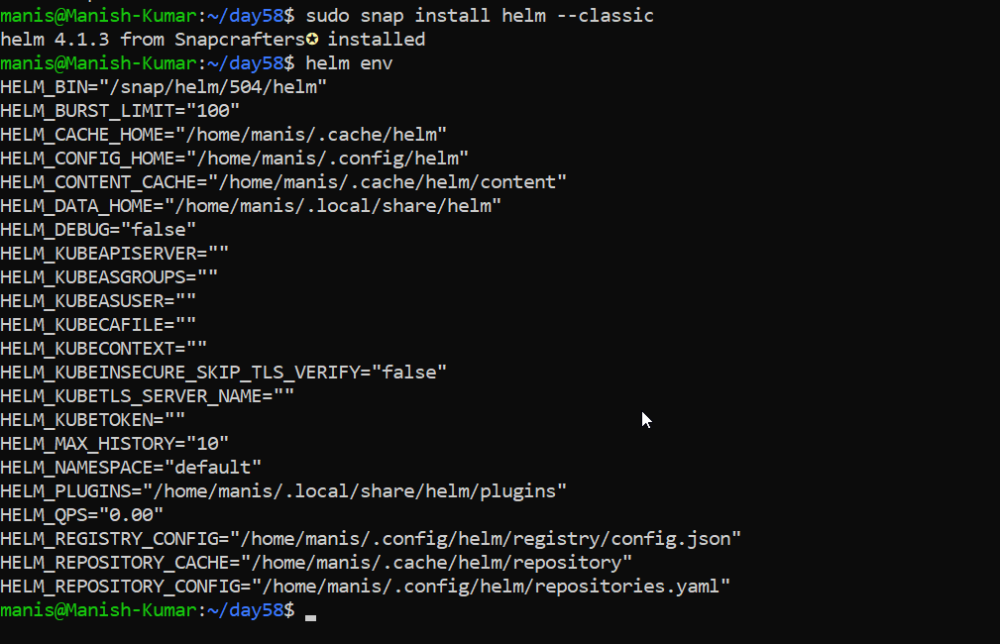
---

### Task 2: Add a Repository and Search
1. Add the Bitnami repository: `helm repo add bitnami https://charts.bitnami.com/bitnami`
2. Update: `helm repo update`
   
   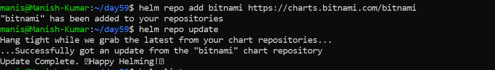

3. Search: `helm search repo nginx` and `helm search repo bitnami`
   
   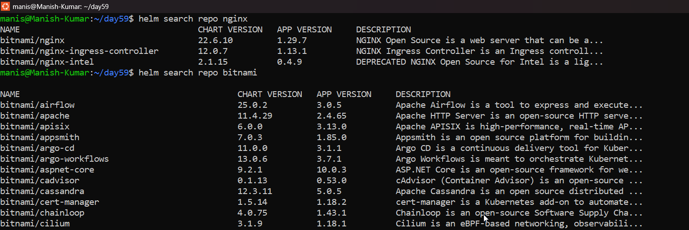

**Verify:** How many charts does Bitnami have?: **145**

  ```bash
  helm search repo bitnami | wc -l
  ```
  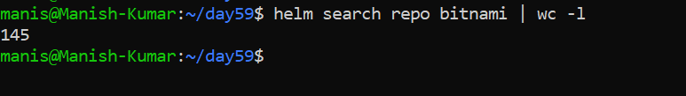

---

### Task 3: Install a Chart
1. Deploy nginx: `helm install my-nginx bitnami/nginx`
   
   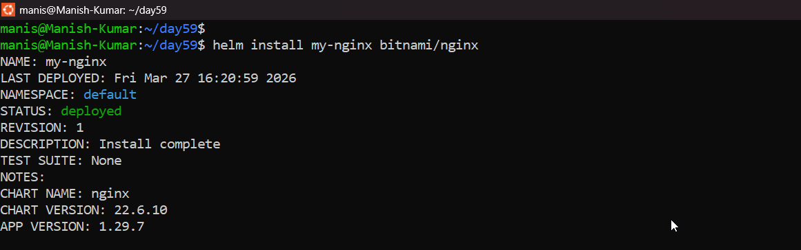

2. Check what was created: `kubectl get all`
   
   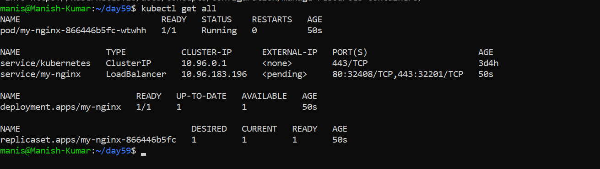

3. Inspect the release: `helm list`, `helm status my-nginx`, `helm get manifest my-nginx`
   
   ```bash
   helm list
   ```
   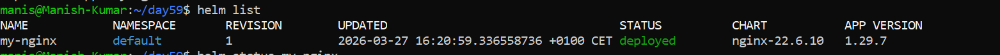

   ```bash
   helm status my-nginx
   ```
   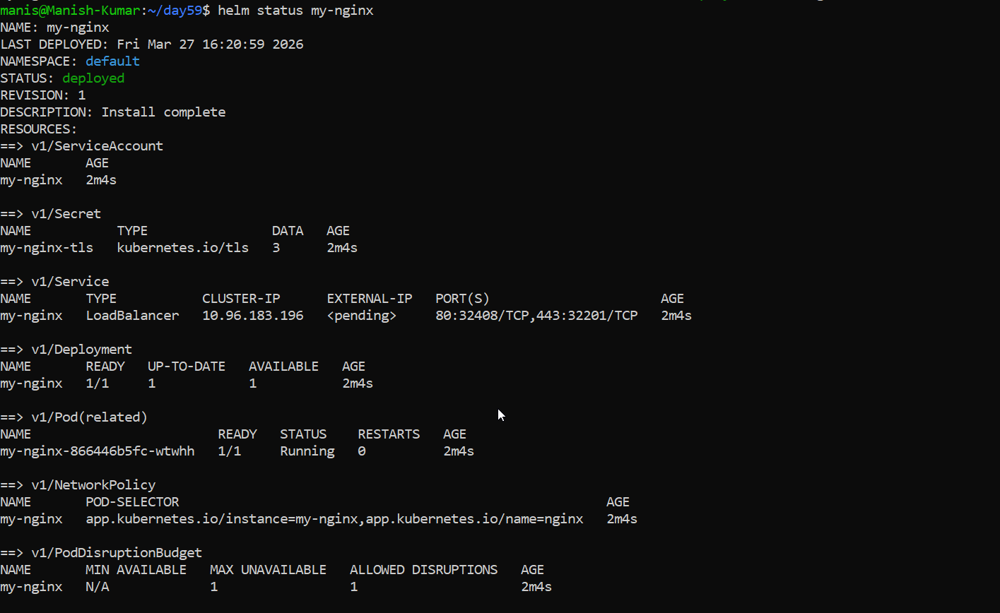

   ```bash
   helm get manifest my-nginx
   ```
   [my-nginx.yml](./Helms/my-nginx.yml)

One command replaced writing a Deployment, Service, and ConfigMap by hand.

**Verify:** How many Pods are running? What Service type was created?
  
   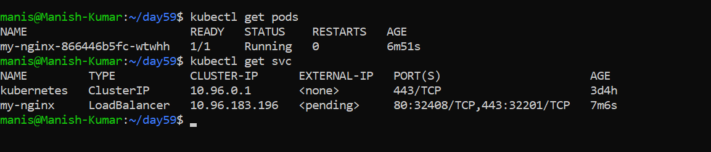
---

### Task 4: Customize with Values
1. View defaults: `helm show values bitnami/nginx`
2. Install a custom release with `--set replicaCount=3 --set service.type=NodePort`

   ```bash
   helm install nginx-custom bitnami/nginx --set replicaCount=3 --set service.type=NodePort
   ```
   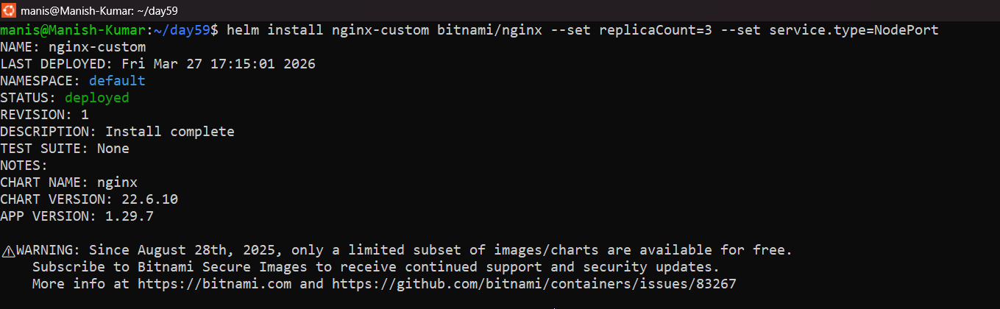

   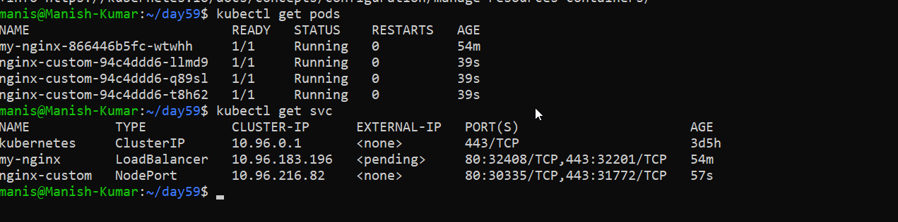

3. Create a `custom-values.yaml` file with replicaCount, service type, and resource limits
   
   [custom-values.yml](./Helms/custom-values.yml)
   
4. Install another release using `-f custom-values.yaml`
   
   ```bash
   helm install nginx-values bitnami/nginx -f custom-values.yml
   ```
   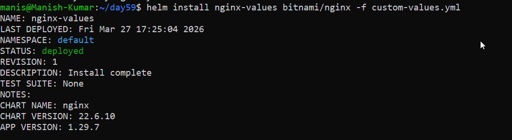

5. Check overrides: `helm get values <release-name>`
   
   ```bash
   helm get values nginx-values
   ```
   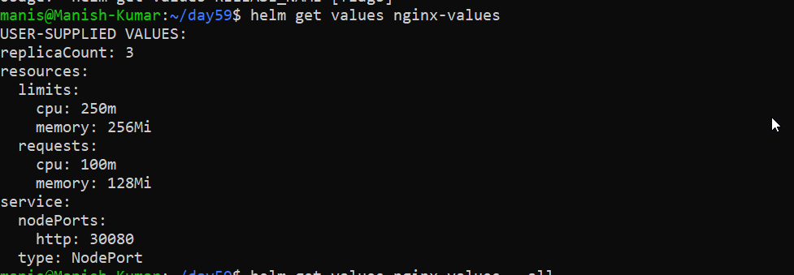

**Verify:** Does the values file release have the correct replicas and service type?

---

### Task 5: Upgrade and Rollback
1. Upgrade: `helm upgrade my-nginx bitnami/nginx --set replicaCount=5`
   
   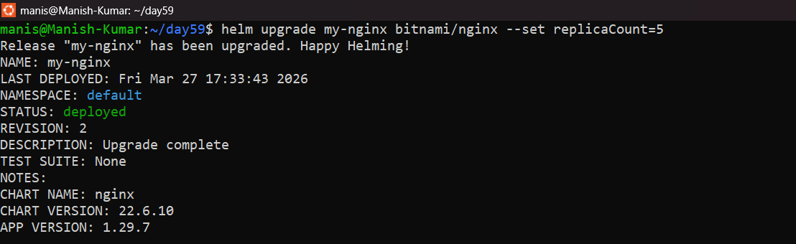

2. Check history: `helm history my-nginx`
   
   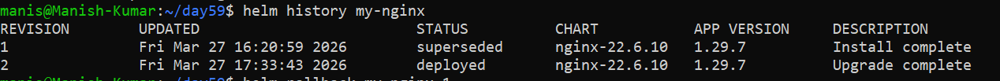

3. Rollback: `helm rollback my-nginx 1`
   
   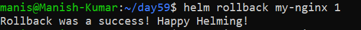

4. Check history again — rollback creates a new revision (3), not overwriting revision 2
   
   ```bash
   helm history my-nginx
   ```
   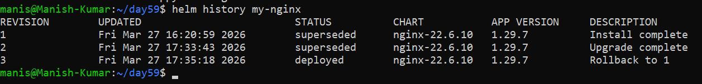

Same concept as Deployment rollouts from Day 52, but at the full stack level.

**Verify:** How many revisions after the rollback?: **3 Revision**

---

### Task 6: Create Your Own Chart
1. Scaffold: `helm create my-app`
   
   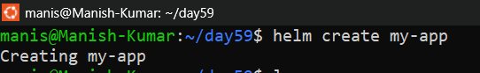

2. Explore the directory: `Chart.yaml`, `values.yaml`, `templates/deployment.yaml`
3. Look at the Go template syntax in templates: `{{ .Values.replicaCount }}`, `{{ .Chart.Name }}`
4. Edit `values.yaml` — set replicaCount to 3 and image to nginx:1.25
5. Validate: `helm lint my-app`

   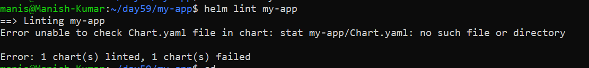

6. Preview: `helm template my-release ./my-app`
   
   ```bash
   helm template my-release ./my-app > serviceaccount.yaml
   ```
   [serviceaccount.yml](./Helms/serviceaccount.yml)

7. Install: `helm install my-release ./my-app`
   
   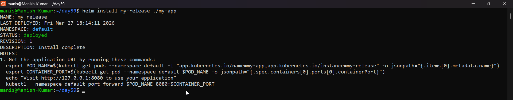

8. Upgrade: `helm upgrade my-release ./my-app --set replicaCount=5`

   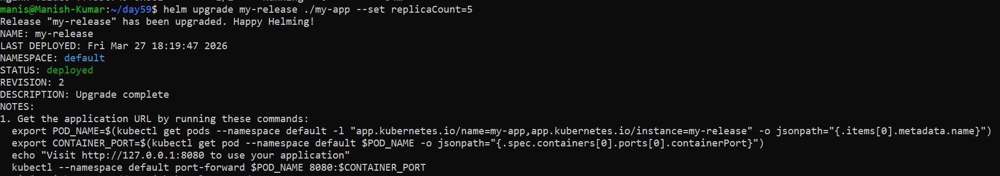

**Verify:** After installing, 3 replicas? After upgrading, 5?
  
   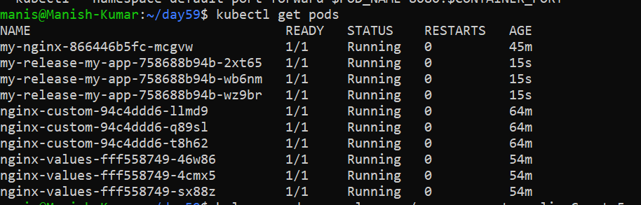

   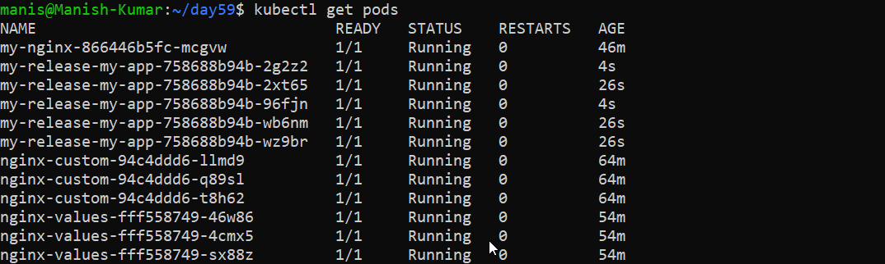
---

### Task 7: Clean Up
1. Uninstall all releases: `helm uninstall <name>` for each
2. Remove chart directory and values file
3. Use `--keep-history` if you want to retain release history for auditing

**Verify:** Does `helm list` show zero releases?

  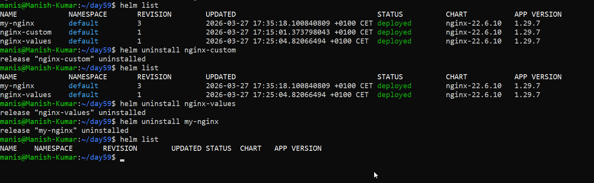
  
---

## Hints
- `helm show values <chart>` — see what you can customize
- `--set key=value` for single overrides, `-f values.yaml` for files
- Nested values use dots: `--set service.type=NodePort`
- `helm get values <release>` shows overrides, `--all` for everything
- `helm template` renders without installing — great for debugging
- `helm lint` validates chart structure before installing
- Templates: `{{ .Values.key }}`, `{{ .Chart.Name }}`, `{{ .Release.Name }}`