# Day 61 -- Introduction to Terraform and Your First AWS Infrastructure

## Challenge Tasks

### Task 1: Understand Infrastructure as Code
Before touching the terminal, research and write short notes on:

1. What is Infrastructure as Code (IaC)? Why does it matter in DevOps?
   
   - Thinking about creating EC2 instance on AWS by clicking button on console. Instead of this you create a file and write down all the steps like a recipe, That file called as infrastructure.

    Why does it matter in devops:
     - Recreate your entire setup in minutes if something breaks
     - No more "who clicked what in the console last Tuesday?"
   
2. What problems does IaC solve compared to manually creating resources in the AWS console?
   
   - It rededuce the manual effort to creating server.
  
3. How is Terraform different from AWS CloudFormation, Ansible, and Pulumi?
   
   - 
4. What does it mean that Terraform is "declarative" and "cloud-agnostic"?

Write this in your own words -- not copy-pasted definitions.

---

### Task 2: Install Terraform and Configure AWS
1. Install Terraform:
```bash
# macOS
brew tap hashicorp/tap
brew install hashicorp/tap/terraform

# Linux (amd64)
wget -O - https://apt.releases.hashicorp.com/gpg | sudo gpg --dearmor -o /usr/share/keyrings/hashicorp-archive-keyring.gpg
echo "deb [signed-by=/usr/share/keyrings/hashicorp-archive-keyring.gpg] https://apt.releases.hashicorp.com $(lsb_release -cs) main" | sudo tee /etc/apt/sources.list.d/hashicorp.list
sudo apt update && sudo apt install terraform

# Windows
choco install terraform
```

2. Verify:
```bash
terraform -version
```
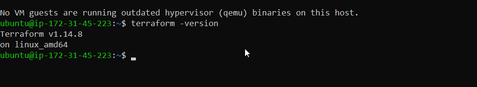

3. Install and configure the AWS CLI:
```bash
aws configure
# Enter your Access Key ID, Secret Access Key, default region (e.g., ap-south-1), output format (json)
```
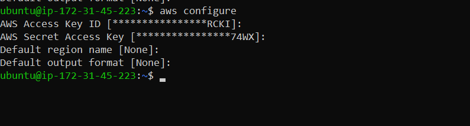

**Install AWS CLI**
```bash
curl "https://awscli.amazonaws.com/awscli-exe-linux-x86_64.zip" -o "awscliv2.zip"
unzip awscliv2.zip
sudo ./aws/install

aws --version
```
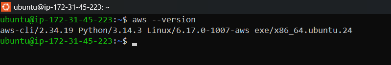

4. Verify AWS access:
```bash
aws sts get-caller-identity
```
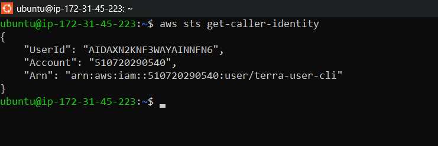

You should see your AWS account ID and ARN.

---

### Task 3: Your First Terraform Config -- Create an S3 Bucket
Create a project directory and write your first Terraform config:

```bash
mkdir terraform-basics && cd terraform-basics
```

Create a file called `main.tf` with:
1. A `terraform` block with `required_providers` specifying the `aws` provider
2. A `provider "aws"` block with your region
3. A `resource "aws_s3_bucket"` that creates a bucket with a globally unique name

[main.tf](./configuration-files/main.tf)

Run the Terraform lifecycle:
```bash
terraform init      # Download the AWS provider
terraform plan      # Preview what will be created
terraform apply     # Create the bucket (type 'yes' to confirm)
```

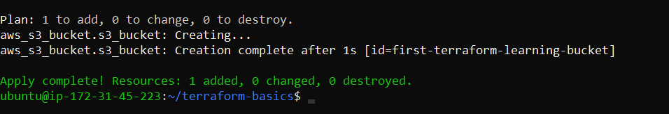

```bash
aws s3 ls
```
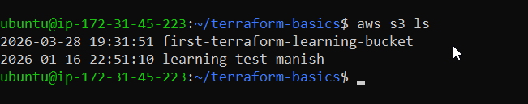

Go to the AWS S3 console and verify your bucket exists.

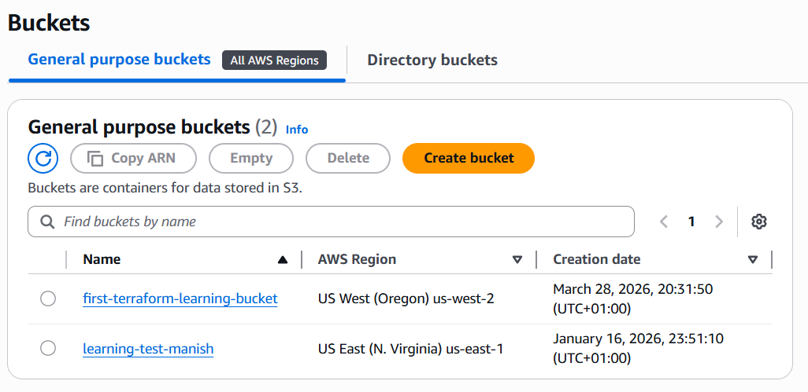

**Document:** What did `terraform init` download? What does the `.terraform/` directory contain?
- The `.terraform/` directory contains downloaded provider plugins
---

### Task 4: Add an EC2 Instance
In the same `main.tf`, add:
1. A `resource "aws_instance"` using AMI `ami-0f5ee92e2d63afc18` (Amazon Linux 2 in ap-south-1 -- use the correct AMI for your region)
2. Set instance type to `t2.micro`
3. Add a tag: `Name = "TerraWeek-Day1"`

Run:
```bash
terraform plan      # You should see 1 resource to add (bucket already exists)
terraform apply
```
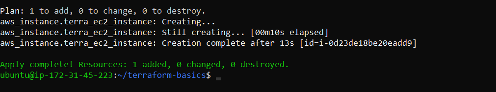

Go to the AWS EC2 console and verify your instance is running with the correct name tag.

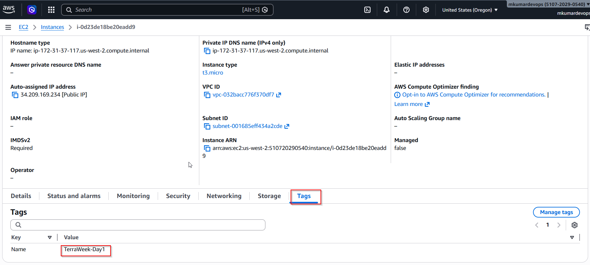

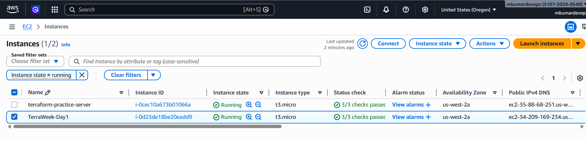

**Document:** How does Terraform know the S3 bucket already exists and only the EC2 instance needs to be created?


---

### Task 5: Understand the State File
Terraform tracks everything it creates in a state file. Time to inspect it.

1. Open `terraform.tfstate` in your editor -- read the JSON structure
2. Run these commands and document what each returns:
```bash
terraform show                          # Human-readable view of current state
terraform state list                    # List all resources Terraform manages
terraform state show aws_s3_bucket.<name>   # Detailed view of a specific resource
terraform state show aws_instance.<name>
```
[terraform show](./configuration-files/terra-show.tf)

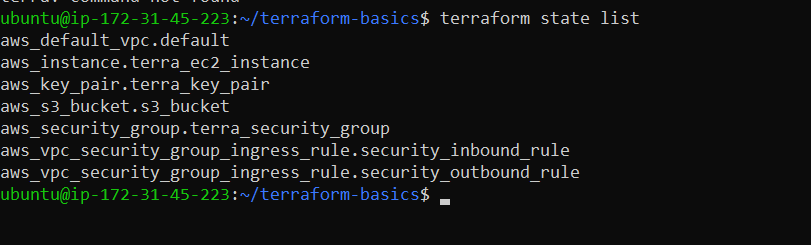

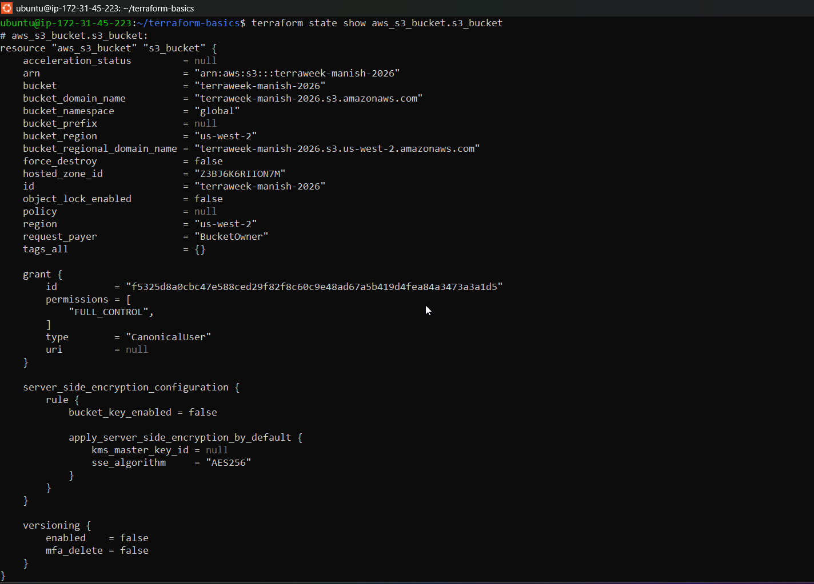

[terraform state show aws_instance.<name>](./configuration-files/aws-instance-show.tf)

3. Answer these questions in your notes:
   - What information does the state file store about each resource?
   - Why should you never manually edit the state file?
   - Why should the state file not be committed to Git?

---

### Task 6: Modify, Plan, and Destroy
1. Change the EC2 instance tag from `"TerraWeek-Day1"` to `"TerraWeek-Modified"` in your `main.tf`
2. Run `terraform plan` and read the output carefully:
   - What do the `~`, `+`, and `-` symbols mean?
   - Is this an in-place update or a destroy-and-recreate?
  
  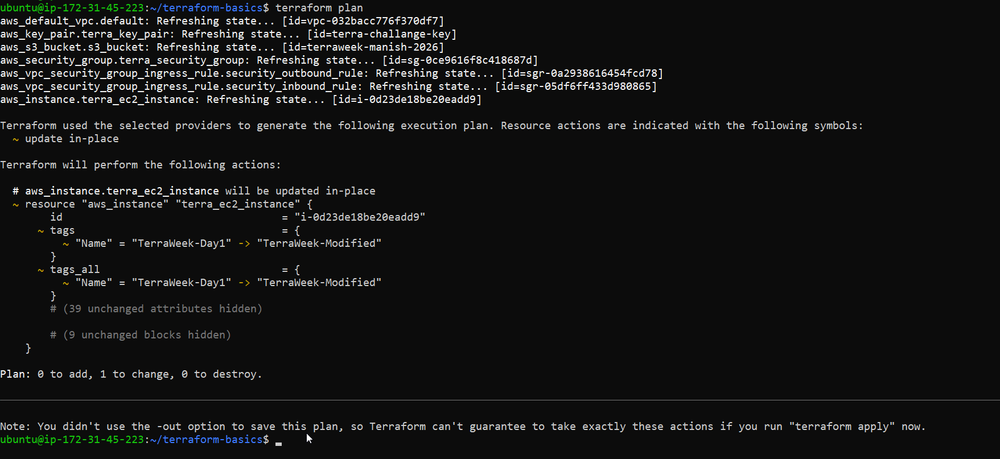

3. Apply the change
   
```bash
terraform apply -auto-approve
```
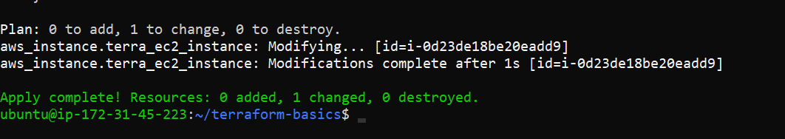

4. Verify the tag changed in the AWS console

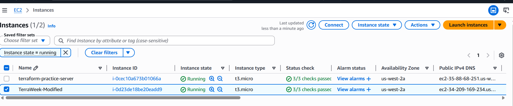

5. Finally, destroy everything:
```bash
terraform destroy
```
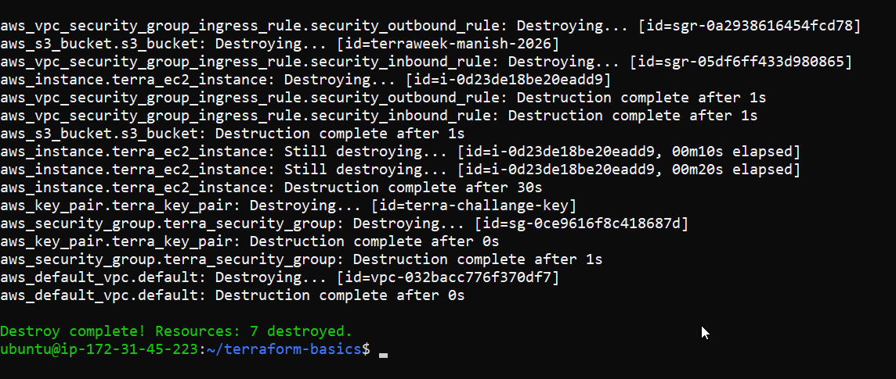

1. Verify in the AWS console -- both the S3 bucket and EC2 instance should be gone

```bash
aws s3 ls
```
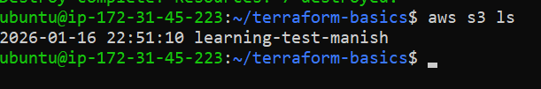

```bash
terraform state show aws_instance.terra_ec2_instance
```
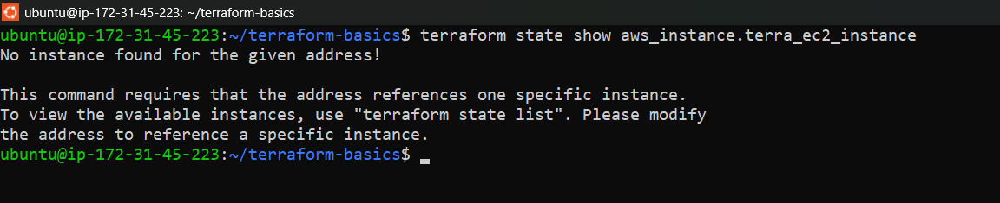
---

## Hints
- S3 bucket names must be globally unique -- use something like `terraweek-<yourname>-2026`
- AMI IDs are region-specific -- search "Amazon Linux 2 AMI" in your region's EC2 launch wizard
- `terraform fmt` auto-formats your `.tf` files -- run it before committing
- `terraform validate` checks for syntax errors without connecting to AWS
- The `.terraform/` directory contains downloaded provider plugins
- Add `*.tfstate`, `*.tfstate.backup`, and `.terraform/` to your `.gitignore`

---

## Documentation
Create `day-61-terraform-intro.md` with:
- IaC explanation in your own words (3-4 sentences)
- Screenshot of `terraform apply` creating your S3 bucket and EC2 instance
- Screenshot of the resources in the AWS console
- What each Terraform command does (init, plan, apply, destroy, show, state list)
- What the state file contains and why it matters

---
