# Day 62 -- Providers, Resources and Dependencies

### Task 1: Explore the AWS Provider
1. Create a new project directory: `terraform-aws-infra`
2. Write a `providers.tf` file:
   - Define the `terraform` block with `required_providers` pinning the AWS provider to version `~> 5.0`
   - Define the `provider "aws"` block with your region
  
   [providers.tf](./terraform-files/providers.tf)

   [terraform.tf](./terraform-files/terraform.tf)

3. Run `terraform init` and check the output -- what version was installed?
   
   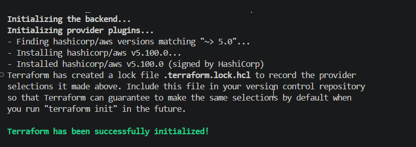

4. Read the provider lock file `.terraform.lock.hcl` -- what does it do?
   
   - it locks your project to specific versions of providers so everyone on the team uses the exact same version.

**Document:** What does `~> 5.0` mean? How is it different from `>= 5.0` and `= 5.0.0`?

   - `~> 5.0` : It means allow any version after 5, example 5.1, 5.2, 5.x
   - `>= 5.0` : it means version which is equal to 5 or higher
   - `=5.0.0` : it means spefied version only 5.0.0

### Task 2: Build a VPC from Scratch
Create a `main.tf` and define these resources one by one:

1. `aws_vpc` -- CIDR block `10.0.0.0/16`, tag it `"TerraWeek-VPC"`
2. `aws_subnet` -- CIDR block `10.0.1.0/24`, reference the VPC ID from step 1, enable public IP on launch, tag it `"TerraWeek-Public-Subnet"`
3. `aws_internet_gateway` -- attach it to the VPC
4. `aws_route_table` -- create it in the VPC, add a route for `0.0.0.0/0` pointing to the internet gateway
5. `aws_route_table_association` -- associate the route table with the subnet

Run `terraform plan` -- you should see 5 resources to create.
 
  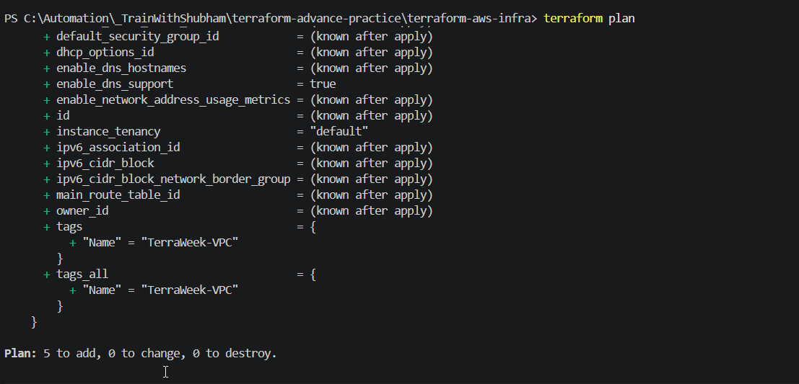

**Verify:** Apply and check the AWS VPC console. Can you see all five resources connected?

  [main.tf](./terraform-files/main.tf)
  
  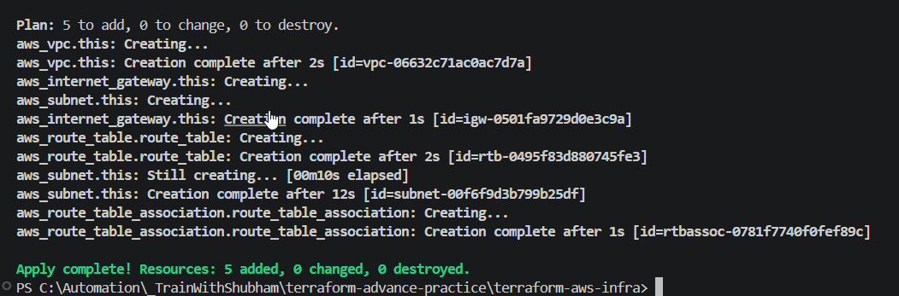

  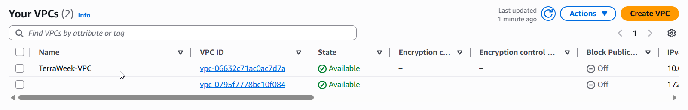

  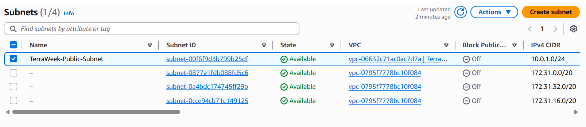

  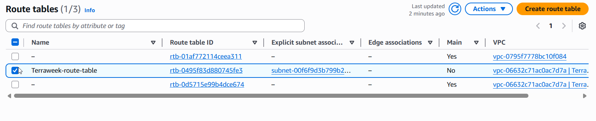

**Notes**

  - What is a VPC?
    - VPC stands for Virtual Private Cloud. Think of it as your own private section of AWS — like renting a floor in a huge office building. The building is AWS, but your floor is completely yours, isolated from everyone else.
  
  - Simple Analogy:
    - Without VPC → your apartment has no walls, no locks — everyone can walk in
    - With VPC → you have your own gated community with walls, security guards, and controlled entry/exit points
---

### Task 3: Understand Implicit Dependencies
Look at your `main.tf` carefully:

1. The subnet references `aws_vpc.main.id` -- this is an implicit dependency
2. The internet gateway references the VPC ID -- another implicit dependency
3. The route table association references both the route table and the subnet

Answer these questions:
- How does Terraform know to create the VPC before the subnet?
  - by reading the reference, It reads `aws_vpc.main.id` and thinks:
      - "This subnet **needs** the VPC's ID"
      - "VPC ID only exists **after** VPC is created"
      - "Therefore I must create VPC **first**, subnet **second**"

- What would happen if you tried to create the subnet before the VPC existed?
  - It will fail because it will look the vpc id which does not exist yet.
  
- Find all implicit dependencies in your config and list them
  
  - Dependency List (All 6 implicit dependencies)

    | Resource                      | Depends On                    | Via              |
    | ----------------------------- | ----------------------------- | ---------------- |
    | `aws_subnet.this`             | `aws_vpc.main`                | `vpc_id`         |
    | `aws_internet_gateway.this`   | `aws_vpc.main`                | `vpc_id`         |
    | `aws_route_table.route_table` | `aws_vpc.main`                | `vpc_id`         |
    | `aws_route_table.route_table` | `aws_internet_gateway.this`   | `gateway_id`     |
    | `aws_route_table_association` | `aws_subnet.this`             | `subnet_id`      |
    | `aws_route_table_association` | `aws_route_table.route_table` | `route_table_id` |

---

### Task 4: Add a Security Group and EC2 Instance
Add to your config:

1. `aws_security_group` in the VPC:
   - Ingress rule: allow SSH (port 22) from `0.0.0.0/0`
   - Ingress rule: allow HTTP (port 80) from `0.0.0.0/0`
   - Egress rule: allow all outbound traffic
   - Tag: `"TerraWeek-SG"`

2. `aws_instance` in the subnet:
   - Use Amazon Linux 2 AMI for your region
   - Instance type: `t2.micro`
   - Associate the security group
   - Set `associate_public_ip_address = true`
   - Tag: `"TerraWeek-Server"`

   [task-4_main.tf](./terraform-files/task-4_main.tf)

   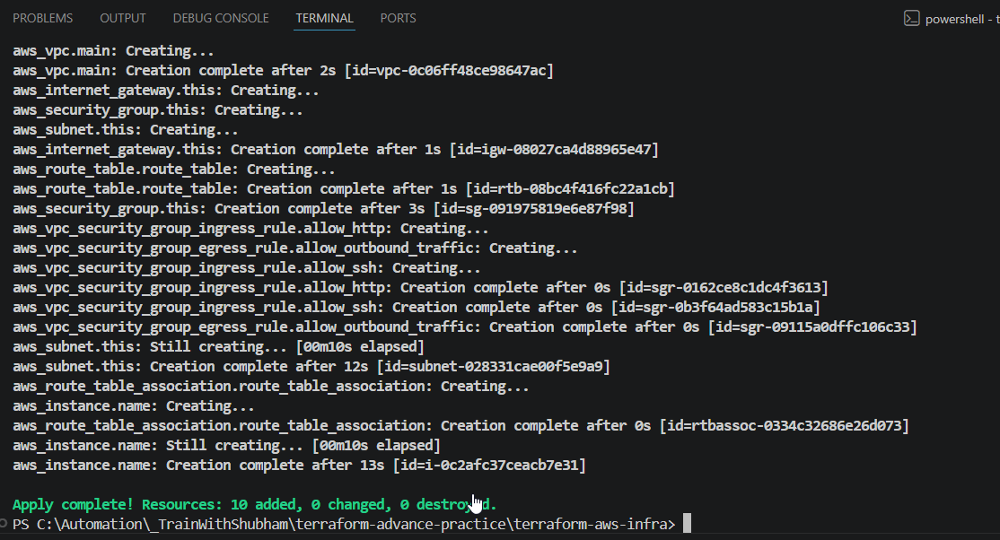

   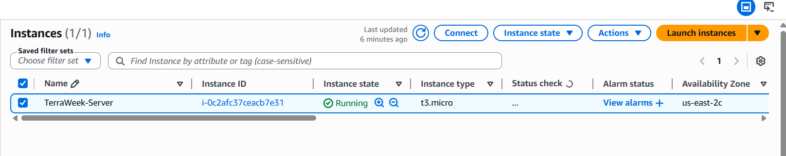
   
Apply and verify -- your EC2 instance should have a public IP and be reachable.


---

### Task 5: Explicit Dependencies with depends_on
Sometimes Terraform cannot detect a dependency automatically.

1. Add a second `aws_s3_bucket` resource for application logs
2. Add `depends_on = [aws_instance.main]` to the S3 bucket -- even though there is no direct reference, you want the bucket created only after the instance
3. Run `terraform plan` and observe the order

Now visualize the entire dependency tree:
```bash
# Save with correct UTF-8 encoding
terraform graph | Out-File -Encoding ascii graph.dot

# Then convert
dot -Tpng graph.dot -o graph.png

# Open
start graph.png
```
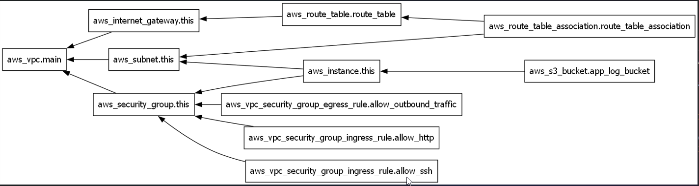

If you don't have `dot` (Graphviz) installed, use:
```bash
terraform graph
```

and paste the output into an online Graphviz viewer.

**Document:** When would you use `depends_on` in real projects? Give two examples.

  - IAM Policy Attachment + EC2 Instance
    - Scenario: Your EC2 instance runs an app that reads from S3 on startup. The app needs the IAM permission to be fully attached before it boots — not just the role created.
   
  - S3 Bucket Policy + Lambda Function
    - A Lambda function is triggered by S3 events. The bucket policy granting Lambda permission must exist before Lambda is configured — otherwise the event trigger fails silently. 
---

### Task 6: Lifecycle Rules and Destroy
1. Add a `lifecycle` block to your EC2 instance:
```hcl
lifecycle {
  create_before_destroy = true
}
```
2. Change the AMI ID to a different one and run `terraform plan` -- observe that Terraform plans to create the new instance before destroying the old one

  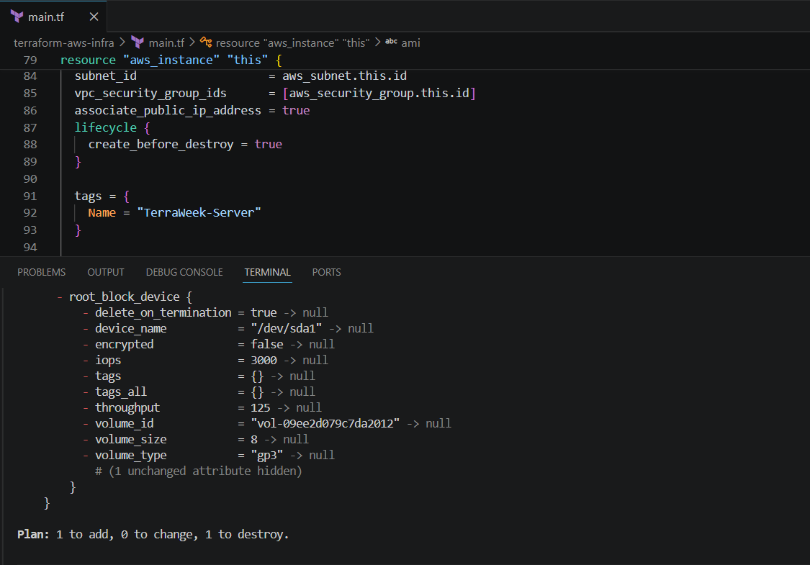

  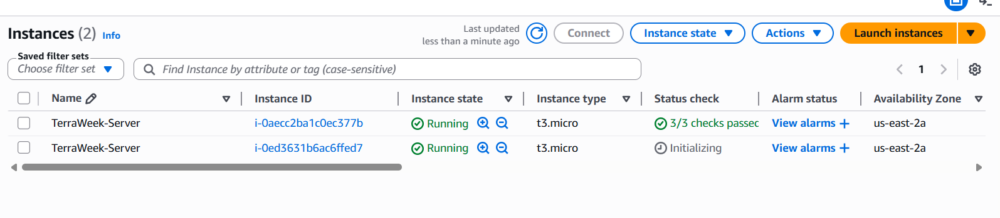

  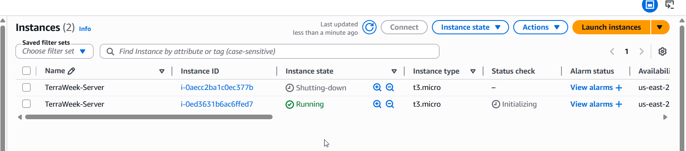

3. Destroy everything:
```bash
terraform destroy
```
4. Watch the destroy order -- Terraform destroys in reverse dependency order. Verify in the AWS console that everything is cleaned up.

  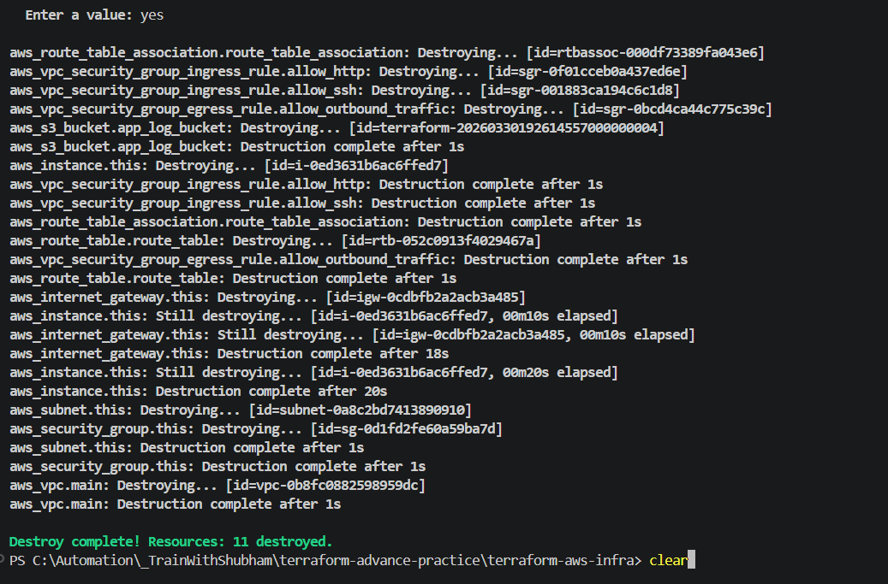

**Document:** What are the three lifecycle arguments (`create_before_destroy`, `prevent_destroy`, `ignore_changes`) and when would you use each?

- `create_before_destroy`: Creates the replacement resource first, then destroys the old one.
  - **lifecycle { create_before_destroy = true }**
    - Create new → Destroy old = ZERO DOWNTIME ✅

- `prevent_destroy`: Adds a safety lock — Terraform will **refuse** to destroy this resource and throw an error if you try.
  - **lifecycle { prevent_destroy = true }**
    - Error: Instance cannot be destroyed on main.tf line 12, in resource "aws_instance" "production": lifecycle prevent_destroy is set to true

- `ignore_changes`: Tells Terraform to ignore changes to specific attributes — even if they drift from what's in the config, Terraform will not try to fix them. 
  - **lifecycle { ignore_changes = [ami, tags] }**
  
 **You can combine all together**
 ```bash
    resource "aws_db_instance" "production" {
    identifier     = "prod-db"
    engine         = "postgres"
    instance_class = "db.t3.medium"
    password       = var.db_password

    lifecycle {
        create_before_destroy = true          # zero downtime
        prevent_destroy       = true          # safety lock
        ignore_changes        = [password]    # Secrets Manager handles password rotation
    }
    }
 ```
---

## Hints
- `aws_vpc.main.id` syntax: `<resource_type>.<resource_name>.<attribute>`
- Use `terraform fmt` to keep your HCL clean
- CIDR `10.0.0.0/16` gives you 65,536 IPs, `10.0.1.0/24` gives you 256
- If you cannot SSH into the instance, check: security group rules, public IP, route table, internet gateway
- `terraform graph` outputs DOT format -- paste it into webgraphviz.com if you don't have Graphviz
- Always destroy resources when done to avoid AWS charges

---

## Documentation
Create `day-62-providers-resources.md` with:
- Your full `main.tf` with comments explaining each resource
- Screenshot of `terraform apply` output
- Screenshot of the VPC and its resources in the AWS console
- The dependency graph (image or text)
- Explanation of implicit vs explicit dependencies in your own words

---
