# Day 66 -- Provision an EKS Cluster with Terraform Modules

### Task 1: Project Setup
Create a new project directory with proper file structure:

```
terraform-eks/
  providers.tf        # Provider and backend config
  vpc.tf              # VPC module call
  eks.tf              # EKS module call
  variables.tf        # All input variables
  outputs.tf          # Cluster outputs
  terraform.tfvars    # Variable values
```

In `providers.tf`:
1. Pin the AWS provider to `~> 5.0`
2. Pin the Kubernetes provider (you will need it later)
3. Set your region

[task-1_providers.tf](./terraform-files/task-1/providers.tf)

In `variables.tf`, define:
- `region` (string)
- `cluster_name` (string, default: `"terraweek-eks"`)
- `cluster_version` (string, default: `"1.31"`)
- `node_instance_type` (string, default: `"t3.medium"`)
- `node_desired_count` (number, default: `2`)
- `vpc_cidr` (string, default: `"10.0.0.0/16"`)

[task-1_variables.tf](./terraform-files/task-1/variables.tf)

---

### Task 2: Create the VPC with Registry Module
EKS requires a VPC with both public and private subnets across multiple availability zones.

In `vpc.tf`, use the `terraform-aws-modules/vpc/aws` module:
1. CIDR: `var.vpc_cidr`
2. At least 2 availability zones
3. 2 public subnets and 2 private subnets
4. Enable NAT gateway (single NAT to save cost): `enable_nat_gateway = true`, `single_nat_gateway = true`
5. Enable DNS hostnames: `enable_dns_hostnames = true`
6. Add the required EKS tags on subnets:
```hcl
public_subnet_tags = {
  "kubernetes.io/role/elb" = 1
}

private_subnet_tags = {
  "kubernetes.io/role/internal-elb" = 1
}
```
[task-2_vpc.tf](./terraform-files/task-2/vpc.tf)

Run `terraform init` and `terraform plan` to verify the VPC config before moving on.

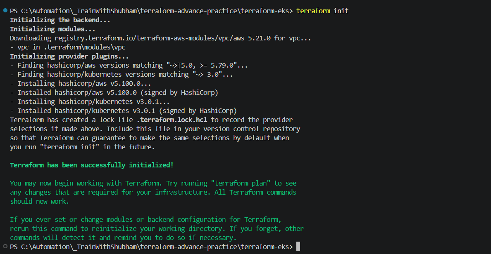

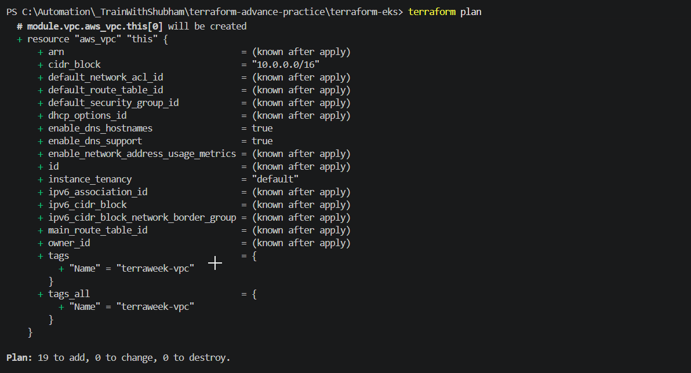

**Document:** Why does EKS need both public and private subnets? What do the subnet tags do?

EKS separates workloads across two subnet types for security and networking reasons:
 
|                   | Public Subnets          | Private Subnets    |
| ----------------- | ----------------------- | ------------------ |
| **Route**         | Direct internet gateway | NAT gateway only   |
| **Hosts**         | Load balancers          | Worker nodes, pods |
| **Has public IP** | Yes                     | No                 |
 
**What the Subnet Tags Do**
 - The tags are read by the **AWS Load Balancer Controller**, a Kubernetes controller running inside your cluster that provisions AWS load balancers on behalf of `Service` and `Ingress` resources.
  
---

### Task 3: Create the EKS Cluster with Registry Module
In `eks.tf`, use the `terraform-aws-modules/eks/aws` module:

```hcl
module "eks" {
  source  = "terraform-aws-modules/eks/aws"
  version = "~> 20.0"

  cluster_name    = var.cluster_name
  cluster_version = var.cluster_version

  vpc_id     = module.vpc.vpc_id
  subnet_ids = module.vpc.private_subnets

  cluster_endpoint_public_access = true

  eks_managed_node_groups = {
    terraweek_nodes = {
      ami_type       = "AL2_x86_64"
      instance_types = [var.node_instance_type]

      min_size     = 1
      max_size     = 3
      desired_size = var.node_desired_count
    }
  }

  tags = {
    Environment = "dev"
    Project     = "TerraWeek"
    ManagedBy   = "Terraform"
  }
}
```
[task-3_vpc.tf](./terraform-files/task-3/eks.tf)

Run:
```bash
terraform init      # Download EKS module and its dependencies
terraform plan      # Review -- this will create 30+ resources
```
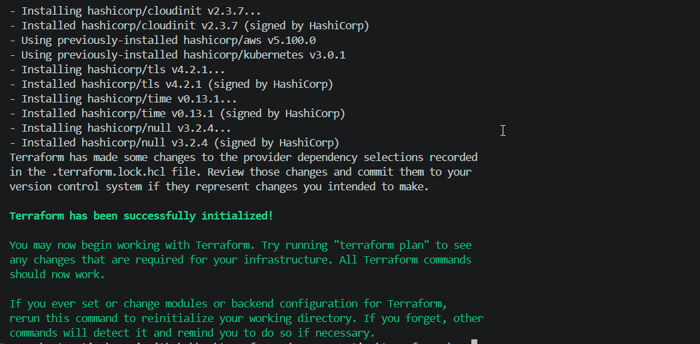


Review the plan carefully before applying. You should see: EKS cluster, IAM roles, node group, security groups, and more.

---

### Task 4: Apply and Connect kubectl
1. Apply the config:
```bash
terraform apply
```
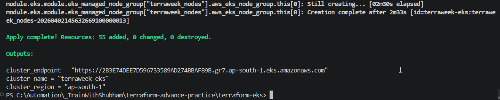

This will take 10-15 minutes. EKS cluster creation is slow -- be patient.

2. Add outputs in `outputs.tf`:
```hcl
output "cluster_name" {
  value = module.eks.cluster_name
}

output "cluster_endpoint" {
  value = module.eks.cluster_endpoint
}

output "cluster_region" {
  value = var.region
}
```

```bash
output:
cluster_endpoint = "https://2B3E74DEE7D596733589AD274BBAF89B.gr7.ap-south-1.eks.amazonaws.com"
cluster_name = "terraweek-eks"
cluster_region = "ap-south-1"
```
3. Update your kubeconfig:
```bash
aws eks update-kubeconfig --name terraweek-eks --region <your-region>

aws eks update-kubeconfig --name terraweek-eks --region ap-south-1
```
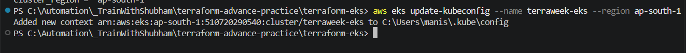

4. Verify:
```bash
kubectl get nodes
kubectl get pods -A
kubectl cluster-info
```
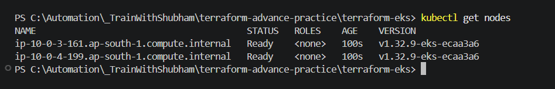

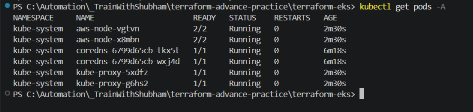

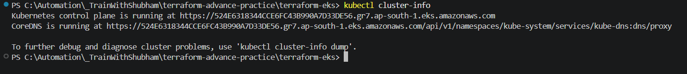

**Verify:** Do you see 2 nodes in `Ready` state? Can you see the kube-system pods running?

---

### Task 5: Deploy a Workload on the Cluster
Your Terraform-provisioned cluster is live. Deploy something on it.

1. Create a file `k8s/nginx-deployment.yaml`:
```yaml
apiVersion: apps/v1
kind: Deployment
metadata:
  name: nginx-terraweek
  labels:
    app: nginx
spec:
  replicas: 3
  selector:
    matchLabels:
      app: nginx
  template:
    metadata:
      labels:
        app: nginx
    spec:
      containers:
      - name: nginx
        image: nginx:latest
        ports:
        - containerPort: 80
---
apiVersion: v1
kind: Service
metadata:
  name: nginx-service
spec:
  type: LoadBalancer
  selector:
    app: nginx
  ports:
  - port: 80
    targetPort: 80
```
[nginx-deployment.yml](./terraform-files/task-5/nginx-deployment.yaml)

2. Apply:
```bash
kubectl apply -f k8s/nginx-deployment.yaml
```
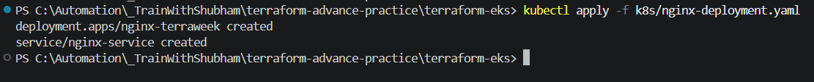

3. Wait for the LoadBalancer to get an external IP:
```bash
kubectl get svc nginx-service -w
```
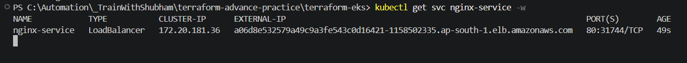

4. Access the Nginx page via the LoadBalancer URL

EXTERNAL-IP : http://a06d8e532579a49c9a3fe543c0d16421-1158502335.ap-south-1.elb.amazonaws.com/

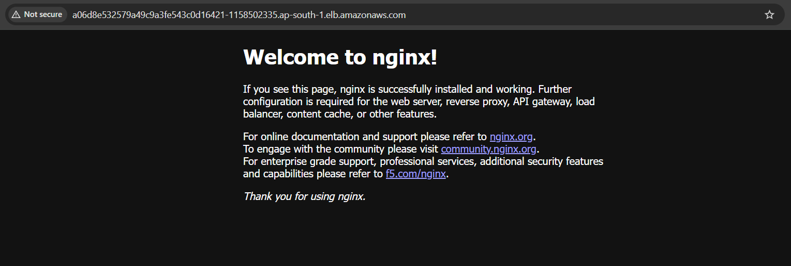

5. Verify the full picture:
```bash
kubectl get nodes
kubectl get deployments
kubectl get pods
kubectl get svc
```
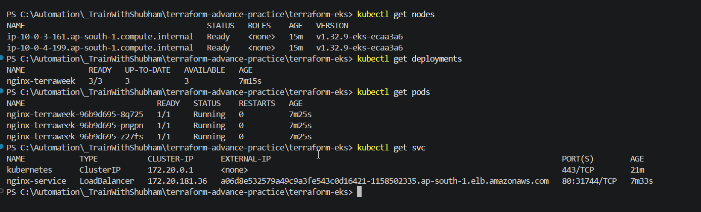

**Verify:** Can you access the Nginx welcome page through the LoadBalancer URL?

---

### Task 6: Destroy Everything
This is the most important step. EKS clusters cost money. Clean up completely.

1. First, remove the Kubernetes resources (so the AWS LoadBalancer gets deleted):
```bash
kubectl delete -f k8s/nginx-deployment.yaml
```
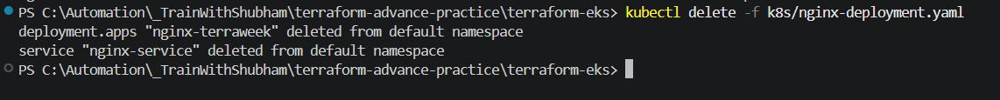

2. Wait for the LoadBalancer to be fully removed (check EC2 > Load Balancers in AWS console)

3. Destroy all Terraform resources:
```bash
terraform destroy
```
This will take 10-15 minutes.

4. Verify in the AWS console:
   - EKS clusters: empty
   - EC2 instances: no node group instances
   - VPC: the terraweek VPC should be gone
   - NAT Gateways: deleted
   - Elastic IPs: released

**Verify:** Is your AWS account completely clean? No leftover resources?

---

## Hints
- EKS creation takes 10-15 minutes, destruction takes about the same -- plan your time
- Always delete Kubernetes LoadBalancer services before `terraform destroy`, otherwise the ELB will block VPC deletion
- If `terraform destroy` gets stuck, check for leftover ENIs or security groups in the VPC
- `t3.medium` is the minimum recommended instance type for EKS nodes
- The EKS module creates IAM roles automatically -- you don't need to create them manually
- If you see `Unauthorized` with kubectl, re-run the `aws eks update-kubeconfig` command
- Use `kubectl get events --sort-by=.metadata.creationTimestamp` to debug pod issues
- Cost warning: NAT Gateway charges ~$0.045/hour. Destroy when done.

---

## Documentation
Create `day-66-eks-terraform.md` with:
- Your complete file structure and key config files
- Screenshot of `terraform apply` completing
- Screenshot of `kubectl get nodes` showing the managed node group
- Screenshot of Nginx running on the cluster
- How many resources Terraform created in total (check the apply output)
- The destroy process and verification
- Reflection: compare this to manually setting up a cluster with kind/minikube (Day 50)

---