# Day 73 -- Introduction to Observability and Prometheus

### Task 1: Understand Observability
Research and write short notes on:

1. What is observability? How is it different from traditional monitoring?
   - **Monitoring** tells you _when_ something is wrong (alerts, thresholds)
     - Monitoring is the practice of collecting predefined signals from a system and alerting when those signals cross known thresholds. Classic example: "CPU > 80% for 5 minutes → page the on-call." You set up a dashboard, you set up alerts, and you wait.
   - **Observability** tells you _why_ something is wrong (explore, query, correlate)
     - Observability is the property of a system that lets you ask new questions of it — questions you didn't anticipate when you built the instrumentation. It's about being able to explore, slice, correlate, and drill down into a system's behavior from the outside, using the telemetry it emits.

2. The three pillars of observability:
   - **Metrics** -- numerical measurements over time (CPU usage, request count, error rate). Tools: Prometheus, Datadog, CloudWatch
   - **Logs** -- timestamped text records of events (application output, error messages). Tools: Loki, ELK Stack, Fluentd
   - **Traces** -- the journey of a single request across multiple services. Tools: OpenTelemetry, Jaeger, Zipkin

3. Why do DevOps engineers need all three?
   - Metrics tell you _what_ is broken (high error rate on `/api/users`)
   - Logs tell you _why_ it broke (stack trace showing a database timeout)
   - Traces tell you _where_ it broke (the payment service call took 12 seconds)

4. Draw or describe this architecture -- this is what you will build over the next 5 days:
   ```
   [Your App] --> metrics --> [Prometheus] --> [Grafana Dashboards]
   [Your App] --> logs    --> [Promtail]   --> [Loki] --> [Grafana]
   [Your App] --> traces  --> [OTEL Collector] --> [Grafana/Debug]
   [Host]     --> metrics --> [Node Exporter] --> [Prometheus]
   [Docker]   --> metrics --> [cAdvisor] --> [Prometheus]
   ```
   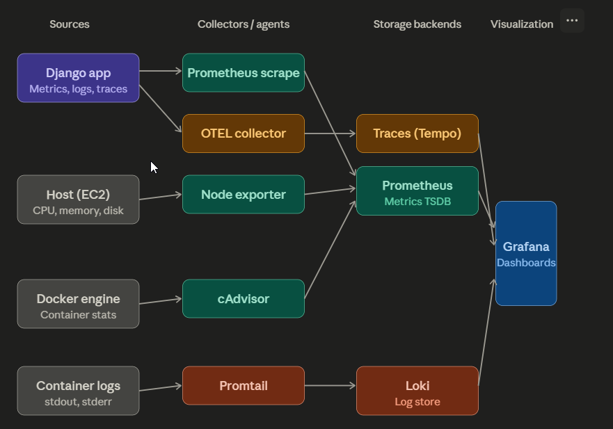

   **How to read the diagram**
   The stack has four vertical lanes — sources → collectors → storage → visualization — and three signal types flow across them:
   - Metrics path (teal): Your Django app exposes a /metrics endpoint. Prometheus scrapes it on a schedule. Node Exporter and cAdvisor do the same for host-level and container-level metrics respectively. All three feed the Prometheus time-series database.
   - Logs path (coral): Containers write to stdout/stderr, which Docker captures. Promtail discovers these log streams via docker_sd_configs (exactly what you configured in your stack) and ships them to Loki, which indexes by labels rather than full-text.
   - Traces path (amber): The app's OpenTelemetry SDK emits spans to the OTEL Collector, which forwards them to a trace backend like Tempo (or Jaeger). This is also the path that caused your ALLOWED_HOSTS issue earlier — OTEL auto-instrumentation hooks request paths at a low level.
   - Grafana queries all three backends through configured datasources (which you've been provisioning via YAML) and gives you a single UI to correlate across them.
---

### Task 2: Set Up Prometheus with Docker
Create a project directory for this entire observability block -- you will keep adding to it over the next 5 days.

```bash
mkdir observability-stack && cd observability-stack
```

Create a `prometheus.yml` configuration file:
```yaml
global:
  scrape_interval: 15s
  evaluation_interval: 15s

scrape_configs:
  - job_name: "prometheus"
    static_configs:
      - targets: ["localhost:9090"]
```
**[prometheus.yml](./Task-2/prometheus.yml)**

This tells Prometheus to scrape its own metrics every 15 seconds.

Create a `docker-compose.yml` to run Prometheus:
```yaml
services:
  prometheus:
    image: prom/prometheus:latest
    container_name: prometheus
    ports:
      - "9090:9090"
    volumes:
      - ./prometheus.yml:/etc/prometheus/prometheus.yml
      - prometheus_data:/prometheus
    command:
      - '--config.file=/etc/prometheus/prometheus.yml'
    restart: unless-stopped

volumes:
  prometheus_data:
```
**[docker-compose.yml](./Task-2/prometheus.yml)**

Start Prometheus:
```bash
docker compose up -d
```
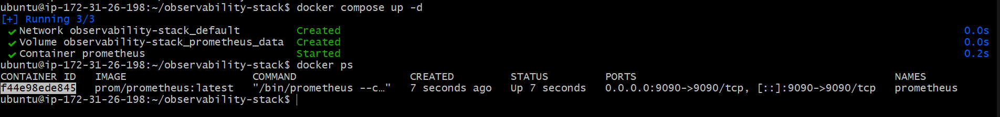

Open `http://localhost:9090` in your browser. You should see the Prometheus web UI.

**Verify:** Go to Status > Targets. You should see one target (`prometheus`) with state `UP`.

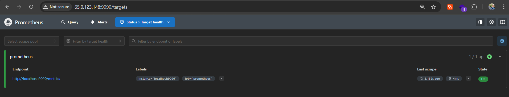

---

### Task 3: Understand Prometheus Concepts
Explore the Prometheus UI and understand these concepts:

1. **Scrape targets** -- endpoints that Prometheus pulls metrics from at regular intervals (pull-based model)
2. **Metrics types:**
   - `Counter` -- only goes up (total requests served, total errors)
   - `Gauge` -- goes up and down (current CPU usage, memory in use, active connections)
   - `Histogram` -- distribution of values in buckets (request duration: how many took <100ms, <500ms, <1s)
   - `Summary` -- similar to histogram but calculates percentiles on the client side
3. **Labels** -- key-value pairs that add dimensions to metrics (e.g., `http_requests_total{method="GET", status="200"}`)
4. **Time series** -- a unique combination of metric name + labels

Go to the Prometheus UI graph page (`http://localhost:9090/graph`) and run these queries:

```
# How many metrics is Prometheus collecting about itself?
count({__name__=~".+"})

# How much memory is Prometheus using?
process_resident_memory_bytes

# Total HTTP requests to the Prometheus server
prometheus_http_requests_total

# Break it down by handler
prometheus_http_requests_total{handler="/api/v1/query"}
```

**Document:** What is the difference between a counter and a gauge? Give one real-world example of each.
- Both are Prometheus metric types, but they model fundamentally different kinds of measurement. Getting this distinction right matters because it directly affects which PromQL functions you can use on them.
- Counter — Real-World Example
  - http_requests_total — total number of HTTP requests the app has served since it started.
- Gauge — Real-World Example
  - node_memory_MemAvailable_bytes — bytes of memory currently available on the host.

---

### Task 4: Learn PromQL Basics
PromQL (Prometheus Query Language) is how you ask questions about your metrics. Run these queries in the Prometheus UI:

1. **Instant vector** -- current value of a metric:
```promql
up
```
This returns 1 (up) or 0 (down) for each scrape target.

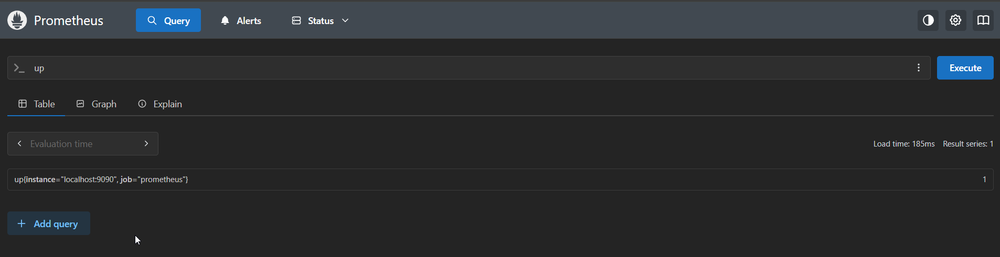

2. **Range vector** -- values over a time window:
```promql
prometheus_http_requests_total[5m]
```
Returns all values from the last 5 minutes.

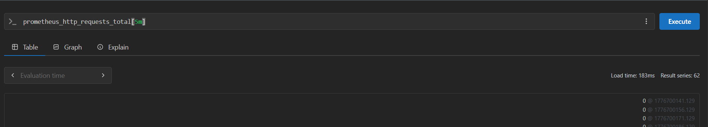

3. **Rate** -- per-second rate of a counter over a time window:
```promql
rate(prometheus_http_requests_total[5m])
```
This is the most common function you will use. Counters always go up -- `rate()` converts them to a useful per-second speed.

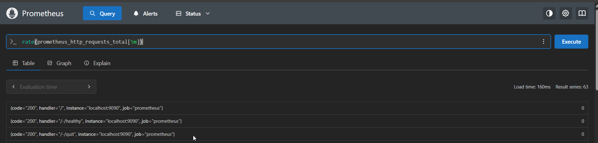

4. **Aggregation** -- sum across all label combinations:
```promql
sum(rate(prometheus_http_requests_total[5m]))
```
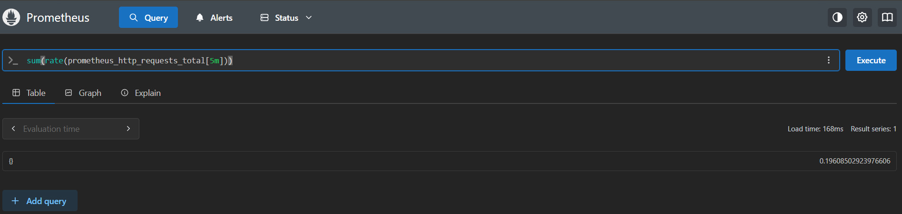

5. **Filter by label:**
```promql
prometheus_http_requests_total{code="200"}
prometheus_http_requests_total{code!="200"}
```
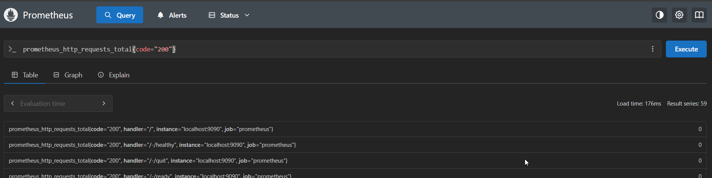

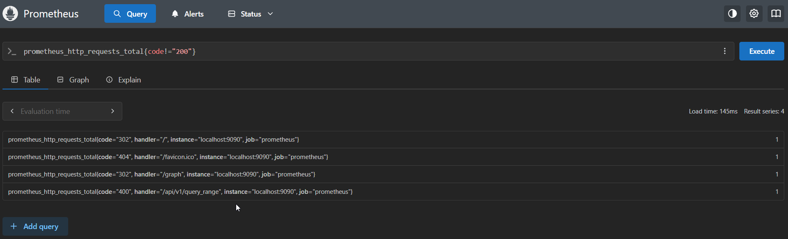

6. **Arithmetic:**
```promql
process_resident_memory_bytes / 1024 / 1024
```
This converts bytes to megabytes.

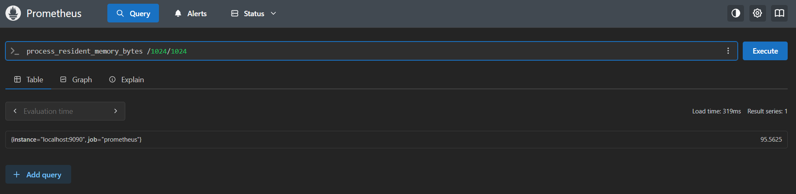

7. **Top-K:**
```promql
topk(5, prometheus_http_requests_total)
```
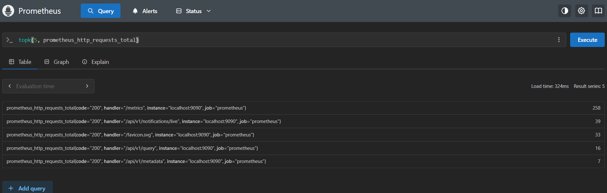

**Try this exercise:** Write a PromQL query that shows the per-second rate of non-200 HTTP requests to Prometheus over the last 5 minutes. (Hint: use `rate()` with a label filter on `code!="200"`)

```bash
rate(prometheus_http_requests_total{code!="200"}[5m])
```
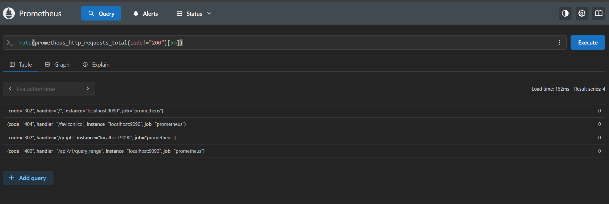

---

### Task 5: Add a Sample Application as a Scrape Target
Prometheus needs something to monitor. Add a simple metrics-generating service.

Update your `docker-compose.yml` to include a sample app that exposes Prometheus metrics:
```yaml
services:
  prometheus:
    image: prom/prometheus:latest
    container_name: prometheus
    ports:
      - "9090:9090"
    volumes:
      - ./prometheus.yml:/etc/prometheus/prometheus.yml
      - prometheus_data:/prometheus
    command:
      - '--config.file=/etc/prometheus/prometheus.yml'
    restart: unless-stopped
    networks:
      - monitoring

  my-notes-app:
    image: manish12588/my-notes-app:latest
    container_name: my-notes-app
    ports:
      - "5000:5000"
    restart: unless-stopped
    networks:
      - monitoring

volumes:
  prometheus_data:

networks:
  monitoring:

```
**[docker-compose.yml](./Task-5/docker-compose.yml)**

Update `prometheus.yml` to scrape the app:
```yaml
global:
  scrape_interval: 15s
  evaluation_interval: 15s

scrape_configs:
  - job_name: "prometheus"
    static_configs:
      - targets: ["localhost:9090"]

  - job_name: "my-notes-app"
    static_configs:
      - targets: ["my-notes-app:5000"]
```
**[prometheus.yml](./Task-5/prometheus.yml)**

Restart the stack:
```bash
docker compose up -d
```
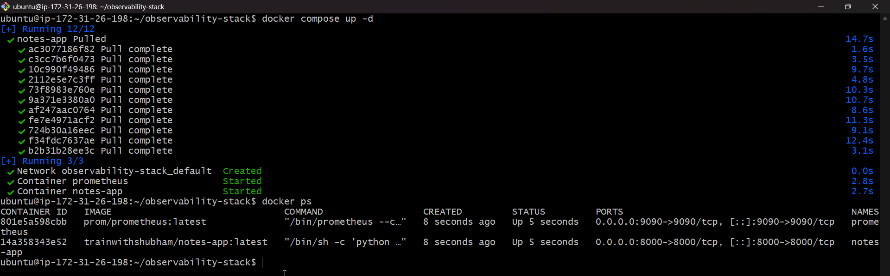

Go back to Status > Targets. You should now see two targets. Generate some traffic to the app:
```bash
curl http://localhost:5000
curl http://localhost:5000
curl http://localhost:5000
```
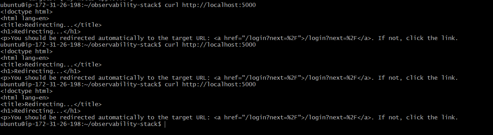

**Note:** Not all applications expose Prometheus metrics natively. In later days you will learn how Node Exporter, cAdvisor, and OTEL Collector act as metric exporters for systems that do not have built-in Prometheus support.

---

### Task 6: Explore Data Retention and Storage
Understand how Prometheus stores data:

1. Check how much disk space Prometheus is using:
```bash
docker exec prometheus du -sh /prometheus
```
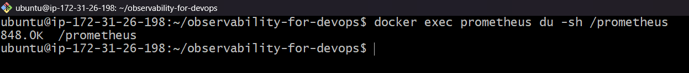

2. Prometheus stores data in a local time-series database (TSDB). Default retention is 15 days. You can change it:
```yaml
command:
  - '--config.file=/etc/prometheus/prometheus.yml'
  - '--storage.tsdb.retention.time=30d'
  - '--storage.tsdb.retention.size=1GB'
```
**[docker-compose.yml](./Task-5/docker-compose.yml)**

3. Check the TSDB status in the UI: Status > TSDB Status

**Document:** What happens when retention is exceeded? Why is a volume mount important for Prometheus data?
- Prometheus is a time-series database — it stores samples (value + timestamp) for every metric. Left unchecked, that database grows forever: every 15 seconds, every scrape target contributes new samples, compounding indefinitely. Retention is the policy that caps this growth by deleting old data on a schedule.

**What Actually Happens When Retention Is Exceeded**
- Prometheus organizes data on disk into blocks — immutable chunks covering a time window (2 hours by default, compacted into larger blocks over time: 2h → 2h → 2h, then into a single 6h block, then 1-day blocks, eventually 31-day blocks). Each block is a directory under /prometheus/ with a random ULID name.

---

## Hints
- Prometheus uses a **pull model** -- it scrapes targets at regular intervals, unlike push-based systems
- The `up` metric is automatically created for every scrape target -- 1 means healthy, 0 means the target is unreachable
- `rate()` only works on counters, not gauges -- applying rate to a gauge gives meaningless results
- Always use `rate()` before `sum()` when aggregating counters: `sum(rate(...))` not `rate(sum(...))`
- If a target shows as DOWN in Status > Targets, check: is the container running? Is the port correct? Are they on the same Docker network?
- `prometheus.yml` changes require a restart or a POST to `/-/reload` (if `--web.enable-lifecycle` flag is set)
- Reference repo for the full stack: https://github.com/LondheShubham153/observability-for-devops

---
