# Day 77 -- Observability Project: Full Stack with Docker Compose

## Task
Four days of building -- Prometheus, Node Exporter, cAdvisor, Grafana, Loki, Promtail, OpenTelemetry Collector, and alerting. Today you put it all together using a production-ready reference architecture.

You will clone the observability-for-devops reference repo, spin up the complete 8-service stack in one command, validate every data flow end to end, build a unified dashboard, and document the entire setup as if you were handing it off to a teammate.


### Task 1: Clone and Launch the Reference Stack
Clone the reference repository that contains the complete observability setup:

```bash
git clone https://github.com/LondheShubham153/observability-for-devops.git
cd observability-for-devops
```
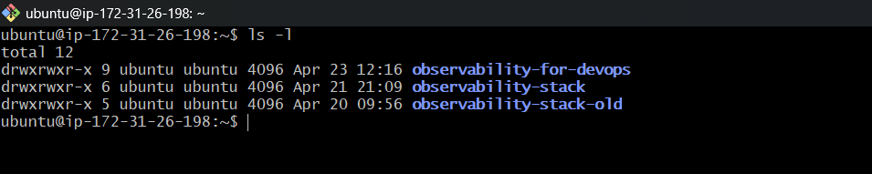

Examine the project structure:
```bash
tree -I 'node_modules|build|staticfiles|__pycache__'
```

```
observability-for-devops/
  docker-compose.yml                    # 8 services orchestrated together
  prometheus.yml                        # Prometheus scrape configuration
  alert-rules.yml                       # (you will add this)
  grafana/
    provisioning/
      datasources/datasources.yml       # Auto-provisioned: Prometheus + Loki
      dashboards/dashboards.yml         # Dashboard provisioning config
  loki/
    loki-config.yml                     # Loki storage and schema config
  promtail/
    promtail-config.yml                 # Docker log collection config
  otel-collector/
    otel-collector-config.yml           # OTLP receivers, processors, exporters
  notes-app/                            # Sample Django + React application
```

Launch the entire stack:
```bash
docker compose up -d
```
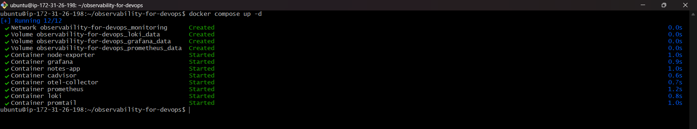

Wait for all containers to start:
```bash
docker compose ps
```
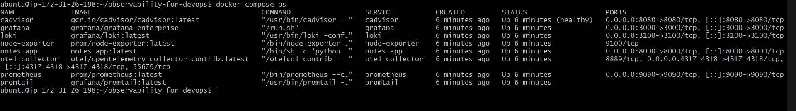

All 8 services should show as running:

| Service        | Port      | Check                                           |
| -------------- | --------- | ----------------------------------------------- |
| Prometheus     | 9090      | `http://localhost:9090`                         |
| Node Exporter  | 9100      | `curl http://localhost:9100/metrics \| head -5` |
| cAdvisor       | 8080      | `http://localhost:8080`                         |
| Grafana        | 3000      | `http://localhost:3000` (admin/admin)           |
| Loki           | 3100      | `curl http://localhost:3100/ready`              |
| Promtail       | 9080      | Internal only                                   |
| OTEL Collector | 4317/4318 | `docker logs otel-collector`                    |
| Notes App      | 8000      | `http://localhost:8000`                         |

---

### Task 2: Validate the Metrics Pipeline
Confirm Prometheus is scraping all targets:

1. Open `http://localhost:9090/targets`
2. Verify all 4 scrape jobs are UP:
   - `prometheus` (self-monitoring)
   - `node-exporter` (host metrics)
   - `docker` / `cadvisor` (container metrics)
   - `otel-collector` (OTLP metrics)

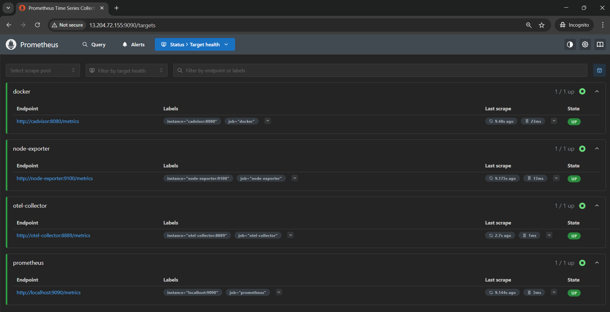

Run these validation queries:
```promql
# All targets are healthy
up
```
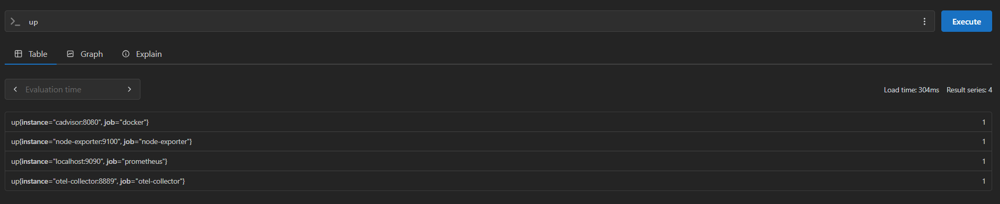

```promql
# Host CPU usage
100 - (avg(rate(node_cpu_seconds_total{mode="idle"}[5m])) * 100)
```
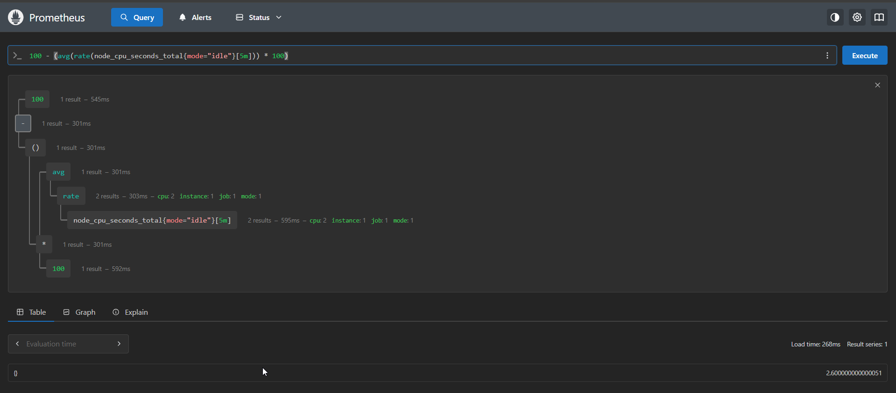

```promql
# Memory usage
(1 - node_memory_MemAvailable_bytes / node_memory_MemTotal_bytes) * 100
```
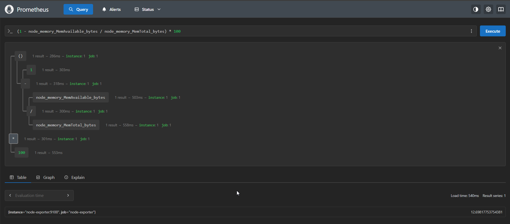

```promql
# Container CPU per container
rate(container_cpu_usage_seconds_total{name!=""}[5m]) * 100
```
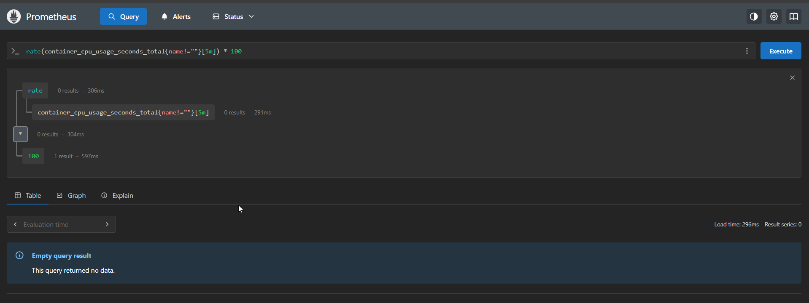

```promql
# Top 3 memory-hungry containers
topk(3, container_memory_usage_bytes{name!=""})
```
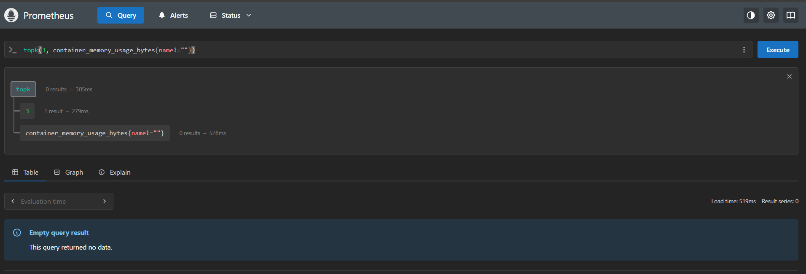

Compare the `prometheus.yml` from the reference repo with the one you built over days 73-76. Note the scrape jobs and intervals.

---

### Task 3: Validate the Logs Pipeline
Generate traffic so there are logs to see:

```bash
for i in $(seq 1 50); do
  echo "Request $i: hitting http://localhost:8000"
  curl -s http://localhost:8000 > /dev/null

  echo "Request $i: hitting http://localhost:8000/api/"
  curl -s http://localhost:8000/api/ > /dev/null
done
```
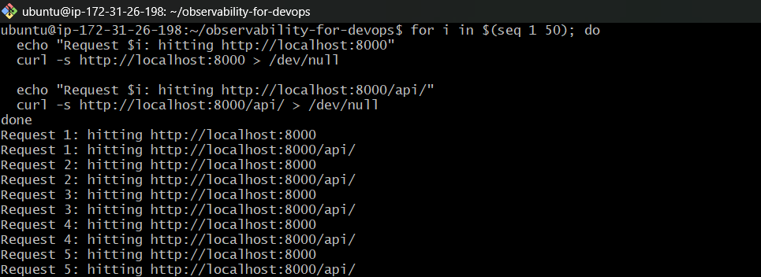

Open Grafana (`http://localhost:3000`) and go to Explore:

1. Select Loki as the datasource
2. Run these LogQL queries:

```logql
# All container logs
{job="docker"}
```
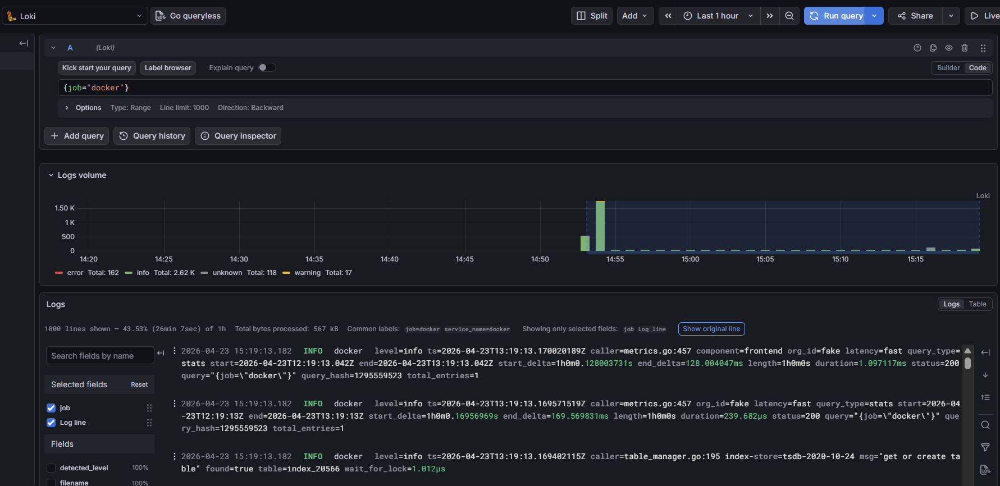

```logql
# Only notes-app logs
{container_name="notes-app"}
```
**Note: After putting the query in explore there is no logs visible at first, then made some changes in "" file to update the label.**
- **What we have currently:** Promtail reads Docker log files directly from disk via glob path. Labels are hardcoded manually.
  - Problems:
    - No container_name label automatically
    - Can't filter by container in Loki
    - All containers dumped into one unlabeled stream

- **What we are changing:** ***docker_sd_configs*** — Promtail talks to Docker socket directly, auto-discovers containers and their metadata.
  - Benifits:
    - container_name label added automatically
    - New containers discovered without config changes
    - Can query per container in Loki

### Before Changes ###
```yaml
server:
  http_listen_port: 9080

positions:
  filename: /tmp/positions.yaml

clients:
  - url: http://loki:3100/loki/api/v1/push

scrape_configs:
  - job_name: docker
    static_configs:
      - targets:
          - localhost
        labels:
          job: docker
          __path__: /var/lib/docker/containers/*/*-json.log
    pipeline_stages:
      - docker: {}

```
### After Changes ###
```yaml
server:
  http_listen_port: 9080

positions:
  filename: /tmp/positions.yaml

clients:
  - url: http://loki:3100/loki/api/v1/push

scrape_configs:
  - job_name: docker
    docker_sd_configs:
      - host: unix:///var/run/docker.sock
        refresh_interval: 5s

    relabel_configs:
      - source_labels: ['__meta_docker_container_name']
        regex: '/(.*)'
        target_label: container_name

      - source_labels: ['__meta_docker_container_log_stream']
        target_label: stream

      - action: replace
        replacement: docker
        target_label: job

    pipeline_stages:
      - docker: {}
```
- Then update "- /var/run/docker.sock:/var/run/docker.sock" volume in docker-compose.yml under promtail service.
  
  ```yaml
  promtail:
  volumes:
    - /var/run/docker.sock:/var/run/docker.sock   # ← required
    - /var/lib/docker/containers:/var/lib/docker/containers:ro
    - ./promtail-config.yaml:/etc/promtail/config.yml
  ```
- docker compose down
- docker compose up -d
  
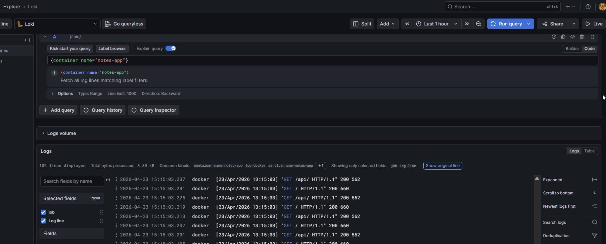  

```logql
# Errors across all containers
{job="docker"} |= "error"
```
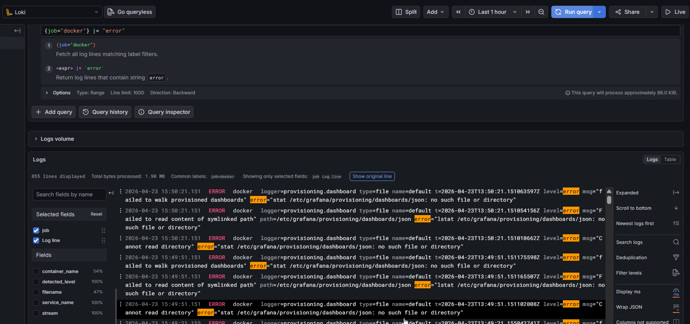

```logql
# HTTP request logs from the app
{container_name="notes-app"} |= "GET"
```
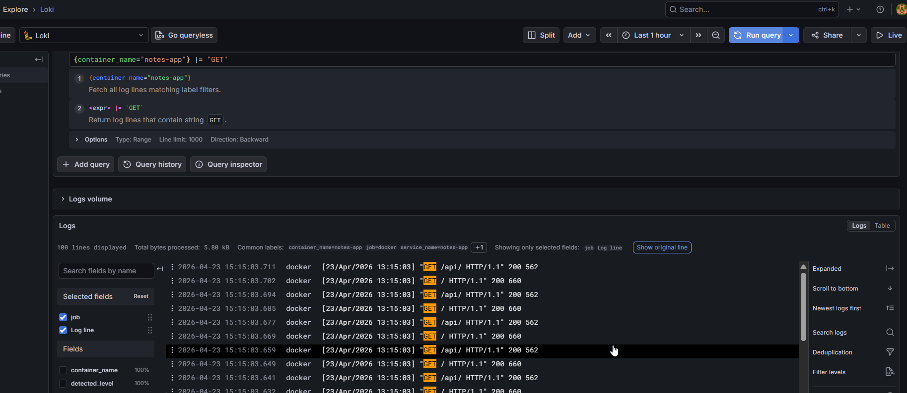

```logql
# Rate of log lines per container
sum by (container_name) (rate({job="docker"}[5m]))
```
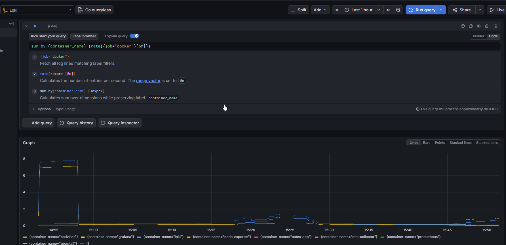

Check Promtail's targets to see which log files it is watching:
```bash
curl -s http://localhost:9080/targets | head -30
```
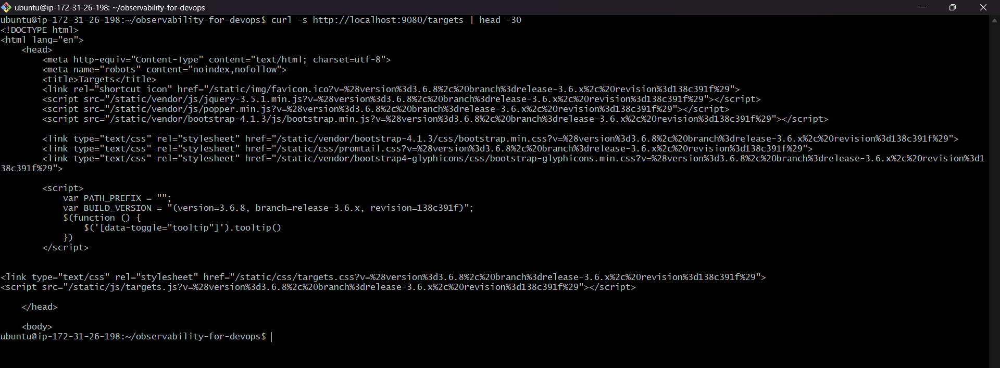

Compare `promtail/promtail-config.yml` from the reference repo with yours from Day 75.

---

### Task 4: Validate the Traces Pipeline
Send OTLP traces to the collector:

```bash
curl -X POST http://localhost:4318/v1/traces \
  -H "Content-Type: application/json" \
  -d '{
    "resourceSpans": [{
      "resource": {
        "attributes": [{
          "key": "service.name",
          "value": { "stringValue": "notes-app" }
        }]
      },
      "scopeSpans": [{
        "spans": [{
          "traceId": "aaaabbbbccccdddd1111222233334444",
          "spanId": "1111222233334444",
          "name": "GET /api/notes",
          "kind": 2,
          "startTimeUnixNano": "1700000000000000000",
          "endTimeUnixNano": "1700000000150000000",
          "attributes": [{
            "key": "http.method",
            "value": { "stringValue": "GET" }
          },
          {
            "key": "http.route",
            "value": { "stringValue": "/api/notes" }
          },
          {
            "key": "http.status_code",
            "value": { "intValue": "200" }
          }],
          "status": { "code": 1 }
        },
        {
          "traceId": "aaaabbbbccccdddd1111222233334444",
          "spanId": "5555666677778888",
          "parentSpanId": "1111222233334444",
          "name": "SELECT notes FROM database",
          "kind": 3,
          "startTimeUnixNano": "1700000000020000000",
          "endTimeUnixNano": "1700000000120000000",
          "attributes": [{
            "key": "db.system",
            "value": { "stringValue": "sqlite" }
          },
          {
            "key": "db.statement",
            "value": { "stringValue": "SELECT * FROM notes" }
          }]
        }]
      }]
    }]
  }'
```

This simulates a two-span trace: an HTTP request that calls a database query.

Check the debug output:
```bash
docker logs otel-collector 2>&1 | grep -A 20 "GET /api/notes"
```
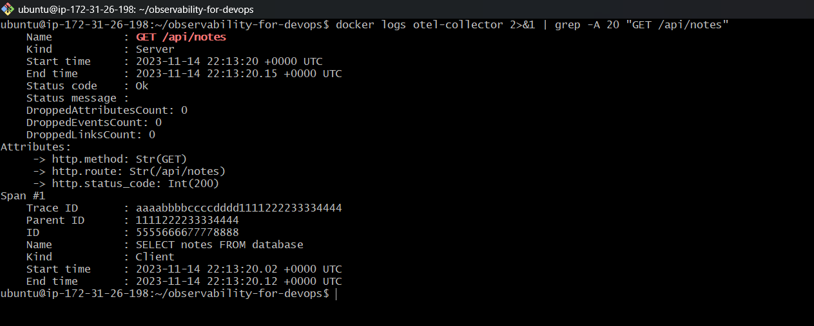

You should see both spans with their attributes, the parent-child relationship, and timing data.

Compare `otel-collector/otel-collector-config.yml` from the reference repo with yours from Day 76.
### Before Changes ###
```yaml
exporters:
  prometheus:
    endpoint: 0.0.0.0:8889
  debug:
    verbosity: basic  

```
### After Changes ###
```yaml
exporters:
  prometheus:
    endpoint: 0.0.0.0:8889
  debug:
    verbosity: detailed   # ← changed

```
---

### Task 5: Build a Unified "Production Overview" Dashboard
Create a single Grafana dashboard that gives a complete picture of your system.

Go to Dashboards > New Dashboard. Add these panels:

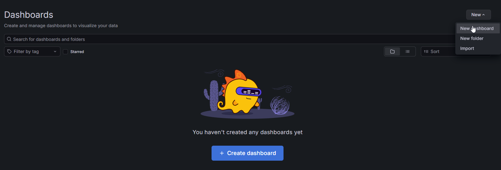

**Row 1 -- System Health (Node Exporter + Prometheus):**

| Panel        | Type  | Query                                                                                                  |
| ------------ | ----- | ------------------------------------------------------------------------------------------------------ |
| CPU Usage    | Gauge | `100 - (avg(rate(node_cpu_seconds_total{mode="idle"}[5m])) * 100)`                                     |
| Memory Usage | Gauge | `(1 - node_memory_MemAvailable_bytes / node_memory_MemTotal_bytes) * 100`                              |
| Disk Usage   | Gauge | `(1 - node_filesystem_avail_bytes{mountpoint="/"} / node_filesystem_size_bytes{mountpoint="/"}) * 100` |
| Targets Up   | Stat  | `sum(up)` / `count(up)`                                                                                |

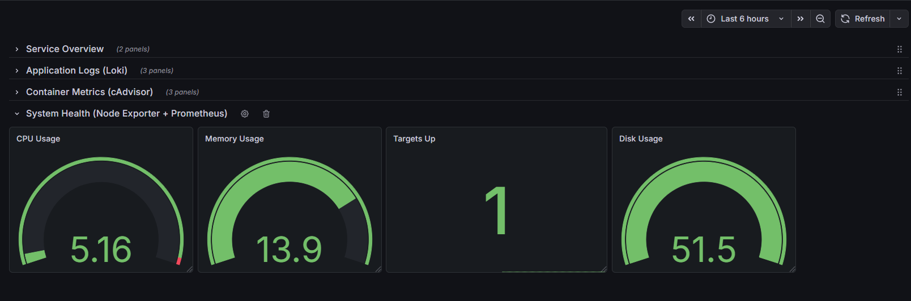

**Row 2 -- Container Metrics (cAdvisor):**

| Panel            | Type        | Query                                                                              |
| ---------------- | ----------- | ---------------------------------------------------------------------------------- |
| Container CPU    | Time series | `rate(container_cpu_usage_seconds_total{name!=""}[5m]) * 100` (legend: `{{name}}`) |
| Container Memory | Bar chart   | `container_memory_usage_bytes{name!=""} / 1024 / 1024` (legend: `{{name}}`)        |
| Container Count  | Stat        | `count(container_last_seen{name!=""})`                                             |

**Note: Currently cAdvisor is storing the label as 'id' not 'name'. So to make the above legend execuatble we have to change the prometheus.yml file.**
- Update prometheus.yml
- Update docker-compose.yml -> cAdvisor service

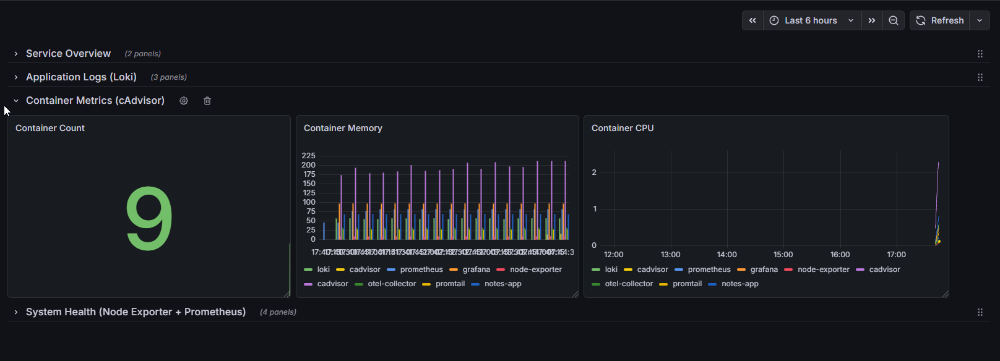

**Row 3 -- Application Logs (Loki):**

| Panel      | Type        | Query (Loki datasource)                              |
| ---------- | ----------- | ---------------------------------------------------- |
| App Logs   | Logs        | `{container_name="notes-app"}`                       |
| Error Rate | Time series | `sum(rate({job="docker"} \|= "error" [5m]))`         |
| Log Volume | Time series | `sum by (container_name) (rate({job="docker"}[5m]))` |

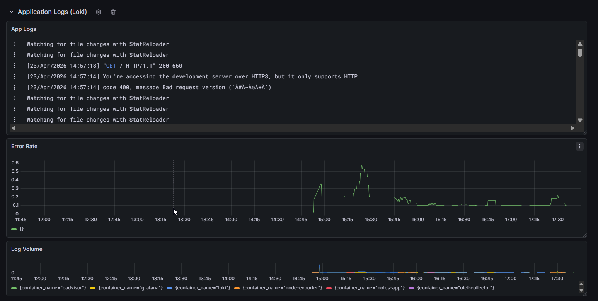

**Row 4 -- Service Overview:**

| Panel                      | Type        | Query                                                        |
| -------------------------- | ----------- | ------------------------------------------------------------ |
| Prometheus Scrape Duration | Time series | `prometheus_target_interval_length_seconds{quantile="0.99"}` |
| OTEL Metrics Received      | Stat        | `otelcol_receiver_accepted_metric_points` (if available)     |

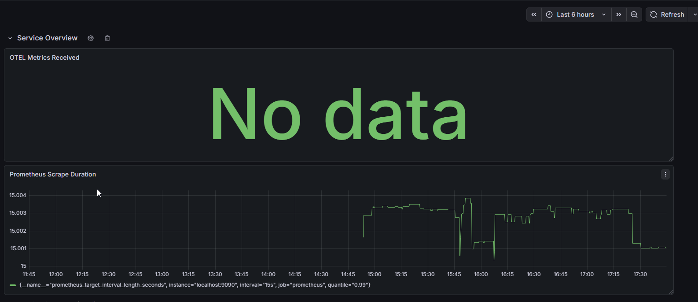

Save the dashboard as "Production Overview -- Observability Stack".

Set the dashboard time range to "Last 30 minutes" and enable auto-refresh (every 10s).

---

### Task 6: Compare Your Stack with the Reference and Document
Now compare what you built over days 73-76 with the reference repository.

| Component                   | Your Version | Reference Repo              | Differences                 |
| --------------------------- | ------------ | --------------------------- | --------------------------- |
| `prometheus.yml`            | Day 73-74    | Root directory              | Compare scrape jobs         |
| `loki-config.yml`           | Day 75       | `loki/` directory           | Compare storage config      |
| `promtail-config.yml`       | Day 75       | `promtail/` directory       | Compare scrape configs      |
| `otel-collector-config.yml` | Day 76       | `otel-collector/` directory | Compare pipelines           |
| `datasources.yml`           | Day 74       | `grafana/provisioning/`     | Compare provisioned sources |
| `docker-compose.yml`        | Days 73-76   | Root directory              | Compare all 8 services      |

**Reflect and document:**

1. Map each observability concept to the day you learned it:

| Day | What You Built                                |
| --- | --------------------------------------------- |
| 73  | Prometheus, PromQL, metrics fundamentals      |
| 74  | Node Exporter, cAdvisor, Grafana dashboards   |
| 75  | Loki, Promtail, LogQL, log-metric correlation |
| 76  | OTEL Collector, traces, alerting rules        |
| 77  | Full stack integration, unified dashboard     |

2. What would you add for production?
   - Alertmanager for routing alerts to Slack/PagerDuty
   - Grafana Tempo for trace storage (replacing debug exporter)
   - HTTPS/TLS for all endpoints
   - Authentication on Grafana and Prometheus
   - Log retention policies and storage limits
   - High availability (multiple Prometheus/Loki replicas)

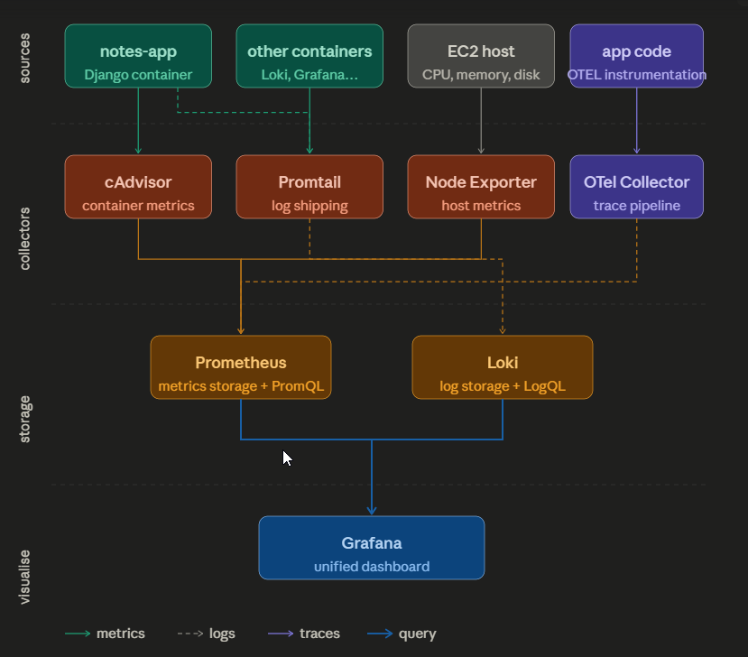

3. How does this stack compare to managed solutions like Datadog, New Relic, or AWS CloudWatch?

**Clean up when done:**
```bash
docker compose down -v
```
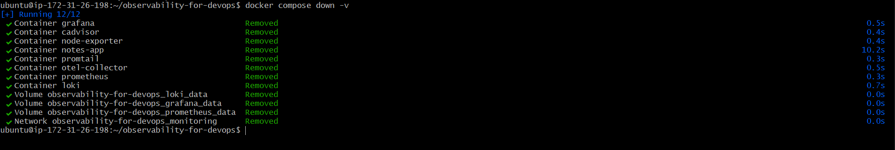

The `-v` flag removes named volumes (Prometheus data, Grafana data, Loki data). Only use this if you are done exploring.

---

## Hints
- If a service fails to start, check logs: `docker compose logs <service-name>`
- The reference repo uses a shared `monitoring` network -- all services can communicate by container name
- `restart: unless-stopped` ensures containers come back after a Docker daemon restart
- Grafana dashboard JSON can be exported (Share > Export) and saved as code for dashboard-as-code workflows
- If Grafana shows "No data" for Loki panels, make sure you generated traffic first (`curl` the notes app) and check the time range
- The notes-app is a Django REST API -- browse `http://localhost:8000/api/` for the API endpoints
- Reference repo: https://github.com/LondheShubham153/observability-for-devops

---

## Documentation
Create `day-77-observability-project.md` with:
- Architecture diagram showing all 8 services and their data flows (metrics, logs, traces)
- Screenshot of Prometheus Targets with all jobs UP
- Screenshot of Grafana Explore showing logs from Loki
- Screenshot of your "Production Overview" dashboard
- Screenshot of OTEL trace in collector debug output
- Comparison table: your configs vs reference repo configs
- What you would add for production readiness
- Key takeaways from the 5-day observability block
- All config files: `docker-compose.yml`, `prometheus.yml`, `loki-config.yml`, `promtail-config.yml`, `otel-collector-config.yml`

---

## Submission
1. Add `day-77-observability-project.md` to `2026/day-77/`
2. Commit and push to your fork

---

## Learn in Public
Share on LinkedIn: "Completed the observability block -- 5 days from zero to a full production-style monitoring stack. Prometheus for metrics, Grafana for visualization, Loki and Promtail for logs, OpenTelemetry Collector for traces, Node Exporter and cAdvisor for infrastructure monitoring, plus alerting rules that fire when things go wrong. All running in Docker Compose, all wired into a single unified dashboard. This is what production observability looks like."

`#90DaysOfDevOps` `#DevOpsKaJosh` `#TrainWithShubham`

Happy Learning!
**TrainWithShubham**
